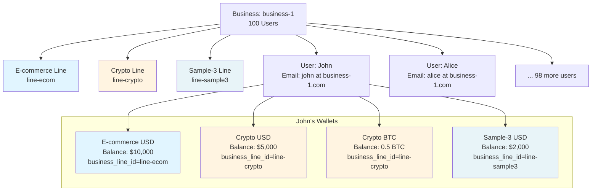

# Business Line Wallet Segregation - Feature Design

## ✅ **Question Answered: YES with Enhancement!**

**User Scenario**:
- **1 Business**: "business-1" with 100 users
- **3 Business Lines**: E-commerce, Crypto, Sample-3
- **Requirement**: Each user can have separate wallets per business line with independent operations (balance, deposit, withdraw)

**Answer**: **YES, this is VALID and SUPPORTED** with the enhanced Business Line Wallet design!

---

## 🎯 Problem Statement

**Current Design Limitation**:
The existing multi-business wallet design supports:
- ✅ One user with wallets across **multiple different businesses** (e.g., Alice works for Acme Corp AND TechStart)
- ❌ One user with multiple wallets within **same business but different departments/lines**

**Your Requirement**:
- Users belong to **one business** (business-1)
- Each user needs **separate wallets per business line** (e-commerce, crypto, sample-3)
- Complete segregation of balances and operations per business line

---

## 🔧 Solution: Business Line/Department Support

### Enhanced Database Schema

#### Option 1: Add `business_line_id` Column (Recommended)

```sql
-- =====================================================
-- BUSINESS_LINES TABLE (NEW)
-- =====================================================
CREATE TABLE business_lines (
    id RAW(16) DEFAULT SYS_GUID() PRIMARY KEY,
    business_id RAW(16) NOT NULL, -- Parent business
    name VARCHAR2(100) NOT NULL, -- e.g., "E-commerce", "Crypto", "Sample-3"
    code VARCHAR2(50) NOT NULL, -- e.g., "ECOMMERCE", "CRYPTO", "SAMPLE3"
    description VARCHAR2(500),
    is_active NUMBER(1) DEFAULT 1 NOT NULL,
    created_at TIMESTAMP DEFAULT SYSTIMESTAMP NOT NULL,
    updated_at TIMESTAMP DEFAULT SYSTIMESTAMP NOT NULL,
    CONSTRAINT fk_business_line_business FOREIGN KEY (business_id) REFERENCES businesses(id),
    CONSTRAINT uk_business_line_code UNIQUE (business_id, code)
);

CREATE INDEX idx_business_line_business ON business_lines(business_id);
CREATE INDEX idx_business_line_active ON business_lines(is_active) WHERE is_active = 1;

COMMENT ON TABLE business_lines IS 'Business lines/departments within a business (e.g., E-commerce, Crypto divisions)';

-- =====================================================
-- WALLETS TABLE (ENHANCED WITH BUSINESS LINE SUPPORT)
-- =====================================================
CREATE TABLE wallets (
    id RAW(16) DEFAULT SYS_GUID() PRIMARY KEY,
    user_id RAW(16) NOT NULL,
    business_id RAW(16), -- NULL for personal B2C wallets
    business_line_id RAW(16), -- NEW: Business line/department (NULL for business-level wallets)
    currency CHAR(3) NOT NULL, -- ISO 4217
    wallet_type VARCHAR2(20) DEFAULT 'STANDARD' CHECK (wallet_type IN ('STANDARD', 'SAVINGS', 'BUSINESS', 'ESCROW', 'PERSONAL')),
    reserved_amount NUMBER(19,0) DEFAULT 0 NOT NULL,
    wallet_name VARCHAR2(255), -- User-friendly name
    is_active NUMBER(1) DEFAULT 1 NOT NULL CHECK (is_active IN (0, 1)),
    created_at TIMESTAMP DEFAULT SYSTIMESTAMP NOT NULL,
    updated_at TIMESTAMP DEFAULT SYSTIMESTAMP NOT NULL,
    status VARCHAR2(20) DEFAULT 'ACTIVE' CHECK (status IN ('ACTIVE', 'FROZEN', 'CLOSED', 'SUSPENDED')),
    version NUMBER DEFAULT 1 NOT NULL,
    CONSTRAINT fk_wallet_user FOREIGN KEY (user_id) REFERENCES users(id),
    CONSTRAINT fk_wallet_business FOREIGN KEY (business_id) REFERENCES businesses(id),
    CONSTRAINT fk_wallet_business_line FOREIGN KEY (business_line_id) REFERENCES business_lines(id),
    CONSTRAINT check_reserved_positive CHECK (reserved_amount >= 0),
    CONSTRAINT check_business_line_requires_business CHECK (
        business_line_id IS NULL OR business_id IS NOT NULL
    )
);

-- ENHANCED UNIQUE CONSTRAINT: Allows multiple wallets per user/currency across business lines
CREATE UNIQUE INDEX idx_wallet_user_business_line_currency ON wallets(
    user_id,
    COALESCE(business_id, RAW '00000000000000000000000000000000'),
    COALESCE(business_line_id, RAW '00000000000000000000000000000000'),
    currency,
    wallet_type
);

CREATE INDEX idx_wallet_user ON wallets(user_id);
CREATE INDEX idx_wallet_business ON wallets(business_id);
CREATE INDEX idx_wallet_business_line ON wallets(business_line_id);
CREATE INDEX idx_wallet_status ON wallets(status);
CREATE INDEX idx_wallet_currency ON wallets(currency);

COMMENT ON TABLE wallets IS 'User wallets with business and business line segregation';
COMMENT ON COLUMN wallets.business_line_id IS 'Business line/department context (e.g., E-commerce, Crypto division)';
```

---

## 📊 Your Scenario: business-1 with 3 Lines

### Example: User John in business-1

```sql
-- Business-1 setup
INSERT INTO businesses (id, name, business_type)
VALUES ('biz-001', 'business-1', 'ENTERPRISE');

-- 3 Business Lines
INSERT INTO business_lines (id, business_id, name, code) VALUES
  ('line-ecom', 'biz-001', 'E-commerce', 'ECOMMERCE'),
  ('line-crypto', 'biz-001', 'Crypto', 'CRYPTO'),
  ('line-sample3', 'biz-001', 'Sample-3', 'SAMPLE3');

-- User John (one of 100 users in business-1)
INSERT INTO users (id, email, business_id)
VALUES ('user-john', 'john.user@business1.com', 'biz-001');

-- John's wallets: 1 USD wallet per business line
INSERT INTO wallets (id, user_id, business_id, business_line_id, currency, wallet_type, wallet_name) VALUES
  ('wallet-john-ecom-usd', 'user-john', 'biz-001', 'line-ecom', 'USD', 'BUSINESS', 'E-commerce USD'),
  ('wallet-john-crypto-usd', 'user-john', 'biz-001', 'line-crypto', 'USD', 'BUSINESS', 'Crypto USD'),
  ('wallet-john-sample3-usd', 'user-john', 'biz-001', 'line-sample3', 'USD', 'BUSINESS', 'Sample-3 USD');

-- John can also have multiple currencies per business line
INSERT INTO wallets (id, user_id, business_id, business_line_id, currency, wallet_type, wallet_name) VALUES
  ('wallet-john-crypto-btc', 'user-john', 'biz-001', 'line-crypto', 'BTC', 'BUSINESS', 'Crypto BTC'),
  ('wallet-john-crypto-eth', 'user-john', 'biz-001', 'line-crypto', 'ETH', 'BUSINESS', 'Crypto ETH');

-- Result: John has 5 separate wallets with independent balances
```

---

## 🌳 Visual Hierarchy

### business-1 with 100 Users and 3 Business Lines



---

## 🔄 Operations with Complete Segregation

### 1. Deposit to E-commerce Wallet

```sql
-- John receives $1,000 payment to E-commerce wallet
INSERT INTO transactions (id, user_id, business_id, destination_wallet_id, amount, currency, payment_type, status, final_amount)
VALUES ('tx-001', 'user-john', 'biz-001', 'wallet-john-ecom-usd', 100000, 'USD', 'PREPAYMENT', 'CONFIRMED', 100000);

INSERT INTO ledger_entries (transaction_id, wallet_id, entry_type, amount, currency, status)
VALUES ('tx-001', 'wallet-john-ecom-usd', 'CREDIT', 100000, 'USD', 'CONFIRMED');

-- Result:
-- E-commerce USD: $11,000 ✅ (increased)
-- Crypto USD:      $5,000 (unchanged)
-- Sample-3 USD:    $2,000 (unchanged)
```

### 2. Withdraw from Crypto Wallet

```sql
-- John withdraws $500 from Crypto wallet
INSERT INTO transactions (id, user_id, business_id, source_wallet_id, amount, currency, payment_type, status, final_amount)
VALUES ('tx-002', 'user-john', 'biz-001', 'wallet-john-crypto-usd', 50000, 'USD', 'PREPAYMENT', 'CONFIRMED', 50000);

INSERT INTO ledger_entries (transaction_id, wallet_id, entry_type, amount, currency, status)
VALUES ('tx-002', 'wallet-john-crypto-usd', 'DEBIT', 50000, 'USD', 'CONFIRMED');

-- Result:
-- E-commerce USD: $11,000 (unchanged)
-- Crypto USD:      $4,500 ✅ (decreased)
-- Sample-3 USD:    $2,000 (unchanged)
```

### 3. Transfer Within Same Business Line (Allowed)

```sql
-- John transfers $1,000 from Crypto USD to Crypto BTC wallet
-- Same business_id AND same business_line_id = ALLOWED

INSERT INTO transactions (id, user_id, business_id, source_wallet_id, destination_wallet_id, amount, currency, payment_type)
VALUES ('tx-003', 'user-john', 'biz-001', 'wallet-john-crypto-usd', 'wallet-john-crypto-btc', 100000, 'USD', 'TRANSFER');

-- Both wallets have business_line_id = 'line-crypto' ✅
```

### 4. Cross-Business-Line Transfer (Restricted)

```sql
-- John tries to transfer from E-commerce USD to Crypto USD
-- Same business_id BUT different business_line_id = BLOCKED

INSERT INTO transactions (id, user_id, business_id, source_wallet_id, destination_wallet_id, amount, currency)
VALUES ('tx-004', 'user-john', 'biz-001', 'wallet-john-ecom-usd', 'wallet-john-crypto-usd', 100000, 'USD');

-- Validation Error:
-- "Cannot transfer funds between different business lines.
--  Source wallet business_line: E-commerce
--  Destination wallet business_line: Crypto
--  Cross-business-line transfers require approval."
```

---

## 🔌 API Endpoints

### 1. List User's Wallets (Grouped by Business Line)

```http
GET /v1/users/user-john/wallets?group_by=business_line
Authorization: Bearer {token}

Response: 200 OK
{
  "user_id": "user-john",
  "business_id": "biz-001",
  "business_name": "business-1",
  "total_wallets": 5,
  "wallet_groups": [
    {
      "business_line_id": "line-ecom",
      "business_line_name": "E-commerce",
      "wallets": [
        {
          "id": "wallet-john-ecom-usd",
          "currency": "USD",
          "wallet_name": "E-commerce USD",
          "balance": 1100000,
          "available_balance": 1100000
        }
      ],
      "total_balance_usd_equivalent": 11000.00
    },
    {
      "business_line_id": "line-crypto",
      "business_line_name": "Crypto",
      "wallets": [
        {
          "id": "wallet-john-crypto-usd",
          "currency": "USD",
          "wallet_name": "Crypto USD",
          "balance": 450000,
          "available_balance": 450000
        },
        {
          "id": "wallet-john-crypto-btc",
          "currency": "BTC",
          "wallet_name": "Crypto BTC",
          "balance": 50000000,
          "available_balance": 50000000
        },
        {
          "id": "wallet-john-crypto-eth",
          "currency": "ETH",
          "wallet_name": "Crypto ETH",
          "balance": 5000000000000000000,
          "available_balance": 5000000000000000000
        }
      ],
      "total_balance_usd_equivalent": 9500.00
    },
    {
      "business_line_id": "line-sample3",
      "business_line_name": "Sample-3",
      "wallets": [
        {
          "id": "wallet-john-sample3-usd",
          "currency": "USD",
          "wallet_name": "Sample-3 USD",
          "balance": 200000,
          "available_balance": 200000
        }
      ],
      "total_balance_usd_equivalent": 2000.00
    }
  ],
  "grand_total_usd_equivalent": 22500.00
}
```

### 2. Create Wallet for Specific Business Line

```http
POST /v1/wallets
Content-Type: application/json
Authorization: Bearer {token}

{
  "user_id": "user-john",
  "business_id": "biz-001",
  "business_line_id": "line-ecom",  // Required for business line wallet
  "currency": "EUR",
  "wallet_type": "BUSINESS",
  "wallet_name": "E-commerce EUR Account"
}

Response: 201 Created
{
  "id": "wallet-john-ecom-eur",
  "user_id": "user-john",
  "business_id": "biz-001",
  "business_name": "business-1",
  "business_line_id": "line-ecom",
  "business_line_name": "E-commerce",
  "currency": "EUR",
  "wallet_name": "E-commerce EUR Account",
  "balance": 0,
  "status": "ACTIVE"
}
```

### 3. Deposit to Business Line Wallet

```http
POST /v1/transactions/deposit
Content-Type: application/json
Authorization: Bearer {token}

{
  "destination_wallet_id": "wallet-john-crypto-usd",
  "amount": 100000,  // $1,000.00
  "currency": "USD",
  "description": "Crypto division payment"
}

Response: 200 OK
{
  "transaction_id": "tx-005",
  "amount": 100000,
  "currency": "USD",
  "status": "CONFIRMED",
  "wallet": {
    "id": "wallet-john-crypto-usd",
    "business_line_name": "Crypto",
    "new_balance": 550000  // $5,500.00
  }
}
```

### 4. Business Line-Specific Discount Codes

```http
POST /v1/payments
Content-Type: application/json
Authorization: Bearer {token}

{
  "source_wallet_id": "wallet-john-ecom-usd",
  "amount": 50000,  // $500.00
  "currency": "USD",
  "discount_code": "ECOM20"  // 20% off for E-commerce business line
}

Response: 200 OK
{
  "transaction_id": "tx-006",
  "amount": 50000,
  "discount_amount": 10000,  // $100.00 discount
  "final_amount": 40000,     // $400.00 charged
  "wallet": {
    "id": "wallet-john-ecom-usd",
    "business_line_name": "E-commerce",
    "new_balance": 1060000  // $10,600.00
  }
}
```

### 5. Get Transaction History per Business Line

```http
GET /v1/users/user-john/transactions?business_line_id=line-crypto&limit=20
Authorization: Bearer {token}

Response: 200 OK
{
  "user_id": "user-john",
  "business_id": "biz-001",
  "business_line_id": "line-crypto",
  "business_line_name": "Crypto",
  "total_count": 45,
  "transactions": [
    {
      "id": "tx-002",
      "amount": 50000,
      "currency": "USD",
      "type": "WITHDRAW",
      "status": "CONFIRMED",
      "wallet": {
        "id": "wallet-john-crypto-usd",
        "wallet_name": "Crypto USD"
      },
      "created_at": "2025-01-20T10:30:00Z"
    }
  ]
}
```

---

## 🎯 Business Rules

### Wallet Creation Rules
- ✅ User must belong to the business (`user.business_id == wallet.business_id`)
- ✅ Business line must belong to the business (`business_line.business_id == wallet.business_id`)
- ✅ Each user can have ONE wallet per `(business_id, business_line_id, currency, wallet_type)` combination
- ✅ User can have multiple wallets for same currency across different business lines

### Transaction Rules
- ✅ **Within Business Line**: Transfers between wallets of same business_line_id are ALLOWED
- ❌ **Cross Business Line**: Transfers between different business_line_id are BLOCKED by default
- ✅ **Cross Business Line with Approval**: Admin can approve with audit trail
- ✅ Deposits and withdrawals only affect the specific business line wallet

### Discount Code Rules
- ✅ `SPECIFIC_BUSINESS_LINE` discounts validate wallet's business_line_id
- ✅ `SPECIFIC_BUSINESS` discounts work for all business lines within the business
- ✅ `ALL_USERS` discounts work for any wallet

---

## 🔐 Enhanced Discount Code Support

### New Discount Eligibility Table

```sql
-- =====================================================
-- DISCOUNT CODE ELIGIBILITY (ENHANCED)
-- =====================================================
CREATE TABLE discount_code_eligibility (
    id RAW(16) DEFAULT SYS_GUID() PRIMARY KEY,
    discount_code_id RAW(16) NOT NULL,
    eligibility_type VARCHAR2(30) NOT NULL CHECK (eligibility_type IN (
        'ALL_USERS',
        'SPECIFIC_USER',
        'SPECIFIC_BUSINESS',
        'SPECIFIC_BUSINESS_LINE',  -- NEW
        'EMAIL_DOMAIN',
        'USER_ROLE'
    )),
    user_id RAW(16), -- For SPECIFIC_USER
    business_id RAW(16), -- For SPECIFIC_BUSINESS
    business_line_id RAW(16), -- NEW: For SPECIFIC_BUSINESS_LINE
    user_email VARCHAR2(255), -- For EMAIL_DOMAIN or USER_ROLE
    created_at TIMESTAMP DEFAULT SYSTIMESTAMP NOT NULL,
    CONSTRAINT fk_discount_eligibility_code FOREIGN KEY (discount_code_id) REFERENCES discount_codes(id),
    CONSTRAINT fk_discount_eligibility_user FOREIGN KEY (user_id) REFERENCES users(id),
    CONSTRAINT fk_discount_eligibility_business FOREIGN KEY (business_id) REFERENCES businesses(id),
    CONSTRAINT fk_discount_eligibility_business_line FOREIGN KEY (business_line_id) REFERENCES business_lines(id)
);

-- Example: "ECOM20" discount only for E-commerce business line
INSERT INTO discount_codes (id, code, discount_type, discount_value, is_active, status)
VALUES ('disc-001', 'ECOM20', 'PERCENTAGE', 20, 1, 'ACTIVE');

INSERT INTO discount_code_eligibility (discount_code_id, eligibility_type, business_line_id)
VALUES ('disc-001', 'SPECIFIC_BUSINESS_LINE', 'line-ecom');
```

### Validation Logic (Java)

```java
@Service
public class BusinessLineDiscountValidator {

    public DiscountValidationResult validate(String discountCode, UUID walletId, User user, BigDecimal amount) {
        DiscountCode discount = discountCodeRepository.findByCode(discountCode)
            .orElseThrow(() -> new DiscountNotFoundException(discountCode));

        // Basic validation
        validateBasicRules(discount, user, amount);

        // Load wallet to get business line context
        Wallet wallet = walletRepository.findById(walletId)
            .orElseThrow(() -> new WalletNotFoundException(walletId));

        // Load eligibility rules
        List<DiscountCodeEligibility> eligibilities =
            eligibilityRepository.findByDiscountCodeId(discount.getId());

        boolean eligible = eligibilities.stream().anyMatch(rule -> {
            switch (rule.getEligibilityType()) {
                case SPECIFIC_BUSINESS_LINE:
                    // Wallet must belong to the eligible business line
                    return wallet.getBusinessLineId() != null &&
                           wallet.getBusinessLineId().equals(rule.getBusinessLineId());

                case SPECIFIC_BUSINESS:
                    // Wallet must belong to the eligible business (any business line)
                    return wallet.getBusinessId() != null &&
                           wallet.getBusinessId().equals(rule.getBusinessId());

                case SPECIFIC_USER:
                    return user.getId().equals(rule.getUserId());

                case EMAIL_DOMAIN:
                    return user.getEmail().endsWith(rule.getUserEmail());

                case USER_ROLE:
                    return user.getRole().equals(rule.getUserEmail());

                case ALL_USERS:
                    return true;

                default:
                    return false;
            }
        });

        if (!eligible) {
            if (wallet.getBusinessLineId() == null) {
                throw new DiscountNotEligibleException(
                    "Discount code '" + discountCode + "' is only valid for specific business line wallets"
                );
            } else {
                BusinessLine businessLine = businessLineRepository.findById(wallet.getBusinessLineId()).orElse(null);
                throw new DiscountNotEligibleException(
                    "Discount code '" + discountCode + "' is not valid for " +
                    (businessLine != null ? businessLine.getName() : "this") + " business line wallet"
                );
            }
        }

        BigDecimal discountAmount = calculateDiscount(discount, amount);
        return DiscountValidationResult.success(discountAmount);
    }
}
```

---

## 📋 Use Cases

### Use Case 1: E-commerce Division
```
John (E-commerce Manager) manages product sales:
- E-commerce USD wallet for customer payments
- E-commerce EUR wallet for European customers
- Separate from company's Crypto and Sample-3 divisions
- Uses "ECOM20" discount code for promotional sales
```

### Use Case 2: Crypto Division
```
Alice (Crypto Trader) manages cryptocurrency operations:
- Crypto USD wallet for fiat reserves
- Crypto BTC wallet for Bitcoin holdings
- Crypto ETH wallet for Ethereum holdings
- Separate from E-commerce and Sample-3 divisions
- Uses "CRYPTO10" discount code for trading fees
```

### Use Case 3: Sample-3 Division
```
Bob (Sample-3 Lead) manages R&D projects:
- Sample-3 USD wallet for project expenses
- Separate from E-commerce and Crypto divisions
- Uses "SAMPLE5" discount code for vendor purchases
```

---

## 🎉 Benefits

### For business-1 (Your Scenario)

✅ **Complete Segregation**: 100 users × 3 business lines × N currencies = Independent wallet management
✅ **Operational Independence**: Each business line operates autonomously
✅ **Financial Clarity**: Clear balance reporting per business line
✅ **Compliance**: Separate audit trails per business line
✅ **Flexibility**: Users can work across multiple business lines with separate wallets
✅ **Scalability**: Add new business lines without affecting existing wallets
✅ **Discount Management**: Business line-specific promotional campaigns

---

## 🚀 Implementation Checklist

### Database Changes
- [ ] Create `business_lines` table
- [ ] Add `business_line_id` column to `wallets` table
- [ ] Update unique constraint to include `business_line_id`
- [ ] Add `business_line_id` column to `discount_code_eligibility` table
- [ ] Create indexes for query performance
- [ ] Add constraint: `business_line_id` requires `business_id`

### API Changes
- [ ] Update wallet creation API to accept `business_line_id`
- [ ] Enhance wallet listing API with business line grouping
- [ ] Add business line filtering to transaction history
- [ ] Update discount validation to check wallet business line context
- [ ] Add cross-business-line transfer approval workflow

### Business Logic
- [ ] Implement business line wallet creation
- [ ] Update balance calculation to respect business line context
- [ ] Enhance discount eligibility validation for `SPECIFIC_BUSINESS_LINE`
- [ ] Implement cross-business-line transfer restrictions
- [ ] Add access control for business line wallets

### Testing
- [ ] Unit tests for business line wallet operations
- [ ] Integration tests for business line-specific discounts
- [ ] Access control tests
- [ ] Cross-business-line transfer restriction tests
- [ ] Performance tests with multiple wallets per user per business line

---

## 📊 Your Scenario Summary

**business-1 Structure:**
```
business-1 (biz-001)
├── E-commerce Line (line-ecom)
│   ├── User John: E-commerce USD, E-commerce EUR
│   ├── User Alice: E-commerce USD
│   └── ... 98 more users
│
├── Crypto Line (line-crypto)
│   ├── User John: Crypto USD, Crypto BTC, Crypto ETH
│   ├── User Alice: Crypto USD, Crypto BTC
│   └── ... 98 more users
│
└── Sample-3 Line (line-sample3)
    ├── User John: Sample-3 USD
    ├── User Alice: Sample-3 USD, Sample-3 EUR
    └── ... 98 more users

Total Potential Wallets: 100 users × 3 lines × N currencies = Scalable
```

**Operations Supported:**
- ✅ John deposits $1,000 to E-commerce USD → Only E-commerce wallet affected
- ✅ Alice withdraws $500 from Crypto BTC → Only Crypto wallet affected
- ✅ John transfers between Crypto USD and Crypto BTC → Allowed (same business line)
- ❌ Alice transfers from E-commerce USD to Crypto USD → Blocked (different business lines)
- ✅ Business-specific discount "ECOM20" only works with E-commerce wallets
- ✅ Complete transaction history per business line

---

## ✅ Conclusion

**Your scenario is FULLY VALID and SUPPORTED with this enhanced design!**

The Business Line Wallet Segregation feature provides:
- Complete independence between E-commerce, Crypto, and Sample-3 divisions
- Each of your 100 users can have separate wallets per business line
- Independent balances, deposits, withdrawals per business line
- Business line-specific discount codes
- Clear audit trails and reporting per business line

**Status**: Ready for implementation
**Complexity**: Medium (requires database schema changes + API updates)
**Impact**: High value for multi-division businesses like business-1

---

**Next Steps**:
1. Review this design with your team
2. Confirm business line naming and structure
3. Implement database changes
4. Update API endpoints
5. Test with sample data from business-1

**Documentation**: This feature extends the Multi-Business Wallet Support with intra-business segregation capabilities.
