# Wallet Service - Complete Entity Relationship Diagram (ERD)

**Version**: 2.0 (with Business Line Support)
**Last Updated**: October 2025
**Database**: Oracle 19c Enterprise Edition

---

## ERD Diagram

```mermaid
erDiagram
    BUSINESS ||--o{ USER : "employs"
    BUSINESS ||--o{ BUSINESS_LINE : "has_divisions"
    BUSINESS_LINE ||--o{ WALLET : "segregates"
    USER ||--o{ WALLET : "owns"
    WALLET ||--o{ LEDGER_ENTRY : "records"
    TRANSACTION ||--o{ LEDGER_ENTRY : "contains"
    USER ||--o{ TRANSACTION : "initiates"
    BUSINESS ||--o{ TRANSACTION : "processes"
    DISCOUNT_CODE ||--o{ TRANSACTION : "applies_to"
    DISCOUNT_CODE ||--o{ DISCOUNT_CODE_ELIGIBILITY : "has_eligibility"
    DISCOUNT_CODE_ELIGIBILITY }o--o| USER : "specific_user"
    DISCOUNT_CODE_ELIGIBILITY }o--o| BUSINESS : "specific_business"
    DISCOUNT_CODE_ELIGIBILITY }o--o| BUSINESS_LINE : "specific_business_line"
    TRANSACTION ||--o| TRANSACTION : "rollback_of"
    TRANSACTION ||--o{ PAYMENT_METADATA : "has"
    USER ||--o{ CREDIT_ACCOUNT : "holds"
    TRANSACTION ||--o{ INSTALLMENT_SCHEDULE : "has"
    IDEMPOTENCY_KEY ||--|| TRANSACTION : "ensures_uniqueness"

    BUSINESS {
        uuid id PK
        string name
        string business_type
        string tax_id
        string country
        string email
        string phone
        string address_line1
        string city
        string state
        string postal_code
        timestamp created_at
        timestamp updated_at
        string status
    }

    BUSINESS_LINE {
        uuid id PK
        uuid business_id FK
        string name
        string code
        string description
        boolean is_active
        timestamp created_at
        timestamp updated_at
    }

    USER {
        uuid id PK
        uuid business_id FK
        string email
        string encrypted_phone
        string full_name
        string role
        string kyc_status
        timestamp kyc_verified_at
        timestamp created_at
        timestamp updated_at
        string status
    }

    WALLET {
        uuid id PK
        uuid user_id FK
        uuid business_id FK
        uuid business_line_id FK
        string currency
        string wallet_type
        string wallet_name
        bigint reserved_amount
        boolean is_active
        timestamp created_at
        timestamp updated_at
        string status
        int version
    }

    TRANSACTION {
        uuid id PK
        uuid user_id FK
        uuid business_id FK
        uuid source_wallet_id FK
        uuid destination_wallet_id FK
        bigint amount
        string currency
        string payment_type
        string status
        string idempotency_key
        uuid discount_code_id FK
        bigint discount_amount
        bigint final_amount
        uuid ref_transaction_id FK
        string gateway_transaction_id
        string correlation_id
        timestamp created_at
        timestamp updated_at
        int version
    }

    LEDGER_ENTRY {
        uuid id PK
        uuid transaction_id FK
        uuid wallet_id FK
        string entry_type
        bigint amount
        string currency
        timestamp created_at
        string status
    }

    DISCOUNT_CODE {
        uuid id PK
        string code
        string discount_type
        decimal discount_value
        bigint min_amount
        bigint max_discount
        timestamp start_date
        timestamp expiry_date
        int max_usage
        int usage_count
        int max_per_user
        string eligibility_type
        string description
        timestamp created_at
        timestamp updated_at
        string status
        int version
    }

    DISCOUNT_CODE_ELIGIBILITY {
        uuid id PK
        uuid discount_code_id FK
        string eligibility_type
        uuid user_id FK
        uuid business_id FK
        uuid business_line_id FK
        string user_email
        timestamp created_at
    }

    PAYMENT_METADATA {
        uuid id PK
        uuid transaction_id FK
        string key
        string value
        timestamp created_at
    }

    CREDIT_ACCOUNT {
        uuid id PK
        uuid user_id FK
        bigint credit_limit
        bigint outstanding_balance
        decimal interest_rate
        int grace_period_days
        timestamp created_at
        timestamp updated_at
        string status
    }

    INSTALLMENT_SCHEDULE {
        uuid id PK
        uuid transaction_id FK
        int installment_number
        bigint installment_amount
        timestamp due_date
        timestamp paid_at
        string status
        timestamp created_at
    }

    IDEMPOTENCY_KEY {
        string key PK
        uuid transaction_id FK
        timestamp created_at
        timestamp expires_at
    }
```



---

## Entity Descriptions

### Core Entities

#### 1. BUSINESS
**Purpose**: Represents business entities for B2B operations

**Key Attributes**:
- `id`: Unique identifier (UUID)
- `name`: Business legal name
- `business_type`: CORPORATION, LLC, PARTNERSHIP, SOLE_PROPRIETOR
- `tax_id`: Encrypted tax identification number
- `country`: ISO 3166-1 alpha-2 country code
- `status`: ACTIVE, SUSPENDED, CLOSED

**Relationships**:
- Has many USERS (employees)
- Has many BUSINESS_LINES (divisions/departments)
- Processes many TRANSACTIONS

---

#### 2. BUSINESS_LINE (NEW)
**Purpose**: Represents divisions/departments within a business for wallet segregation

**Key Attributes**:
- `id`: Unique identifier (UUID)
- `business_id`: Parent business (FK)
- `name`: Business line name (e.g., "E-commerce", "Crypto", "Marketing")
- `code`: Unique code per business (e.g., "ECOMMERCE", "CRYPTO")
- `description`: Business line description
- `is_active`: Active status flag

**Relationships**:
- Belongs to one BUSINESS
- Has many WALLETS (segregated per business line)
- Referenced by DISCOUNT_CODE_ELIGIBILITY for business line-specific discounts

**Example**:
```sql
-- business-1 with 3 business lines
INSERT INTO business_lines (id, business_id, name, code) VALUES
  ('line-ecom', 'biz-001', 'E-commerce', 'ECOMMERCE'),
  ('line-crypto', 'biz-001', 'Crypto', 'CRYPTO'),
  ('line-sample3', 'biz-001', 'Sample-3', 'SAMPLE3');
```

---

#### 3. USER
**Purpose**: User accounts for both B2C consumers and B2B employees

**Key Attributes**:
- `id`: Unique identifier (UUID)
- `business_id`: NULL for B2C users, populated for B2B employees
- `email`: Unique email address
- `encrypted_phone`: Encrypted phone number
- `full_name`: User's full name
- `role`: USER, BUSINESS_ADMIN, FINANCE_ADMIN, SYSTEM_ADMIN
- `kyc_status`: NOT_STARTED, PENDING, APPROVED, REJECTED
- `status`: ACTIVE, SUSPENDED, CLOSED

**Relationships**:
- Optionally belongs to one BUSINESS
- Owns many WALLETS
- Initiates many TRANSACTIONS
- May have one CREDIT_ACCOUNT

---

#### 4. WALLET (ENHANCED)
**Purpose**: Container for user funds in specific currency with business and business line segregation

**Key Attributes**:
- `id`: Unique identifier (UUID)
- `user_id`: Wallet owner (FK)
- `business_id`: NULL for personal wallets, populated for business wallets
- `business_line_id`: NULL for business-level wallets, populated for business line-specific wallets (NEW)
- `currency`: ISO 4217 currency code (USD, EUR, BTC, etc.)
- `wallet_type`: STANDARD, SAVINGS, BUSINESS, ESCROW, PERSONAL
- `wallet_name`: User-friendly name (e.g., "E-commerce USD", "Crypto BTC")
- `reserved_amount`: Funds reserved for pending transactions
- `is_active`: Active status flag
- `version`: Optimistic locking version

**Unique Constraint**:
```sql
CREATE UNIQUE INDEX idx_wallet_user_business_line_currency ON wallets(
    user_id,
    COALESCE(business_id, RAW '00000000000000000000000000000000'),
    COALESCE(business_line_id, RAW '00000000000000000000000000000000'),
    currency,
    wallet_type
);
```

**Relationships**:
- Belongs to one USER
- Optionally belongs to one BUSINESS
- Optionally belongs to one BUSINESS_LINE (NEW)
- Has many LEDGER_ENTRIES

**Example Scenarios**:

**Scenario 1: Multi-Business User (Alice)**
```
Alice works for Acme Corp and TechStart:
- Personal USD: (user=alice, business=NULL, business_line=NULL, currency=USD)
- Acme USD:     (user=alice, business=acme, business_line=NULL, currency=USD)
- TechStart USD:(user=alice, business=tech, business_line=NULL, currency=USD)
```

**Scenario 2: Business Line Segregation (John in business-1)**
```
John works in business-1 with 3 divisions:
- E-commerce USD: (user=john, business=biz-001, business_line=line-ecom, currency=USD)
- Crypto USD:     (user=john, business=biz-001, business_line=line-crypto, currency=USD)
- Crypto BTC:     (user=john, business=biz-001, business_line=line-crypto, currency=BTC)
- Sample-3 USD:   (user=john, business=biz-001, business_line=line-sample3, currency=USD)
```

---

#### 5. TRANSACTION
**Purpose**: Immutable record of a financial operation

**Key Attributes**:
- `id`: Unique identifier (UUID)
- `user_id`: Transaction initiator (FK)
- `business_id`: Business context (FK, nullable)
- `source_wallet_id`: Source wallet for debits (FK, nullable)
- `destination_wallet_id`: Destination wallet for credits (FK, nullable)
- `amount`: Transaction amount in minor units
- `currency`: ISO 4217 currency code
- `payment_type`: PREPAYMENT, POSTPAYMENT, VALUABLE, CREDIT
- `status`: PENDING, CONFIRMED, COMPLETED, FAILED, ROLLED_BACK
- `idempotency_key`: Client-provided unique key for idempotency
- `discount_code_id`: Applied discount code (FK, nullable)
- `discount_amount`: Discount amount in minor units
- `final_amount`: Final amount after discount
- `ref_transaction_id`: Reference to original transaction (for rollbacks)
- `gateway_transaction_id`: External payment gateway transaction ID
- `correlation_id`: Distributed tracing ID
- `version`: Optimistic locking version

**State Machine**:
```
PENDING → CONFIRMED → COMPLETED
   ↓
FAILED → ROLLED_BACK
```

**Relationships**:
- Belongs to one USER
- Optionally belongs to one BUSINESS
- References source and destination WALLETS
- Has many LEDGER_ENTRIES (minimum 2 for double-entry)
- May reference another TRANSACTION (for rollbacks)
- May use one DISCOUNT_CODE
- Has many PAYMENT_METADATA records
- May have many INSTALLMENT_SCHEDULE records

---

#### 6. LEDGER_ENTRY
**Purpose**: Double-entry bookkeeping records for immutable audit trail

**Key Attributes**:
- `id`: Unique identifier (UUID)
- `transaction_id`: Parent transaction (FK)
- `wallet_id`: Affected wallet (FK)
- `entry_type`: CREDIT or DEBIT
- `amount`: Entry amount in minor units
- `currency`: ISO 4217 currency code
- `status`: PENDING, CONFIRMED, ROLLED_BACK

**Business Rules**:
- Every transaction must have at least 2 ledger entries (debit and credit)
- For transfers: Source wallet gets DEBIT, destination wallet gets CREDIT
- For deposits: Wallet gets CREDIT
- For withdrawals: Wallet gets DEBIT
- Balance = SUM(CREDIT) - SUM(DEBIT)

**Relationships**:
- Belongs to one TRANSACTION
- Belongs to one WALLET

---

#### 7. DISCOUNT_CODE
**Purpose**: Promotional discount codes with eligibility rules

**Key Attributes**:
- `id`: Unique identifier (UUID)
- `code`: Unique discount code (e.g., "SAVE20", "ECOM25")
- `discount_type`: PERCENTAGE or FIXED_AMOUNT
- `discount_value`: Percentage (1-100) or fixed amount
- `min_amount`: Minimum transaction amount to use discount
- `max_discount`: Maximum discount amount (for percentage type)
- `start_date`: Discount start date
- `expiry_date`: Discount expiry date
- `max_usage`: Global usage limit
- `usage_count`: Current usage count
- `max_per_user`: Per-user usage limit
- `eligibility_type`: PUBLIC or RESTRICTED
- `status`: ACTIVE, EXPIRED, DISABLED

**Relationships**:
- Has many DISCOUNT_CODE_ELIGIBILITY rules (for RESTRICTED type)
- Applied to many TRANSACTIONS

---

#### 8. DISCOUNT_CODE_ELIGIBILITY (ENHANCED)
**Purpose**: Eligibility rules for restricted discount codes

**Key Attributes**:
- `id`: Unique identifier (UUID)
- `discount_code_id`: Parent discount code (FK)
- `eligibility_type`: ALL_USERS, SPECIFIC_USER, SPECIFIC_BUSINESS, SPECIFIC_BUSINESS_LINE, EMAIL_DOMAIN, USER_ROLE
- `user_id`: For SPECIFIC_USER eligibility (FK, nullable)
- `business_id`: For SPECIFIC_BUSINESS eligibility (FK, nullable)
- `business_line_id`: For SPECIFIC_BUSINESS_LINE eligibility (FK, nullable) (NEW)
- `user_email`: For EMAIL_DOMAIN or USER_ROLE eligibility

**Relationships**:
- Belongs to one DISCOUNT_CODE
- Optionally references one USER
- Optionally references one BUSINESS
- Optionally references one BUSINESS_LINE (NEW)

**Examples**:
```sql
-- Public discount (no eligibility rules needed)
INSERT INTO discount_codes (code, eligibility_type) VALUES ('PUBLIC20', 'PUBLIC');

-- Business-specific discount
INSERT INTO discount_code_eligibility (discount_code_id, eligibility_type, business_id)
VALUES ('disc-001', 'SPECIFIC_BUSINESS', 'biz-acme');

-- Business line-specific discount (NEW)
INSERT INTO discount_code_eligibility (discount_code_id, eligibility_type, business_line_id)
VALUES ('disc-002', 'SPECIFIC_BUSINESS_LINE', 'line-ecom');

-- Email domain discount
INSERT INTO discount_code_eligibility (discount_code_id, eligibility_type, user_email)
VALUES ('disc-003', 'EMAIL_DOMAIN', 'acme.com');
```

---

### Supporting Entities

#### 9. PAYMENT_METADATA
**Purpose**: Key-value metadata for transactions

**Attributes**:
- `id`: UUID
- `transaction_id`: Parent transaction (FK)
- `key`: Metadata key
- `value`: Metadata value (JSON string)
- `created_at`: Timestamp

---

#### 10. CREDIT_ACCOUNT
**Purpose**: Credit line accounts for installment payments

**Attributes**:
- `id`: UUID
- `user_id`: Account holder (FK)
- `credit_limit`: Maximum credit limit
- `outstanding_balance`: Current outstanding balance
- `interest_rate`: Annual interest rate (decimal)
- `grace_period_days`: Payment grace period
- `status`: ACTIVE, SUSPENDED, CLOSED

---

#### 11. INSTALLMENT_SCHEDULE
**Purpose**: Installment payment schedules

**Attributes**:
- `id`: UUID
- `transaction_id`: Original transaction (FK)
- `installment_number`: Installment number (1, 2, 3, ...)
- `installment_amount`: Installment amount
- `due_date`: Payment due date
- `paid_at`: Payment timestamp (nullable)
- `status`: PENDING, PAID, OVERDUE, CANCELLED

---

#### 12. IDEMPOTENCY_KEY
**Purpose**: Ensures idempotent transaction processing

**Attributes**:
- `key`: Client-provided unique key (PK)
- `transaction_id`: Created transaction (FK)
- `created_at`: Key creation timestamp
- `expires_at`: Key expiration timestamp (TTL)

**Business Rule**:
- Keys expire after 24 hours
- Duplicate requests with same key return existing transaction

---

## Key Relationships Summary

### Business Hierarchy
```
BUSINESS (1) ──── has many ───> (N) BUSINESS_LINE
BUSINESS (1) ──── employs ───> (N) USER
BUSINESS_LINE (1) ── segregates ─> (N) WALLET
```

### Wallet Ownership
```
USER (1) ──── owns ───> (N) WALLET
WALLET (N) ── optionally belongs to ─> (1) BUSINESS
WALLET (N) ── optionally belongs to ─> (1) BUSINESS_LINE
```

### Transaction Flow
```
USER (1) ──── initiates ───> (N) TRANSACTION
TRANSACTION (1) ──── contains ───> (N) LEDGER_ENTRY
LEDGER_ENTRY (N) ──── affects ───> (1) WALLET
```

### Discount Application
```
DISCOUNT_CODE (1) ──── has ───> (N) DISCOUNT_CODE_ELIGIBILITY
DISCOUNT_CODE_ELIGIBILITY (N) ── references ─> (1) BUSINESS_LINE (optional)
DISCOUNT_CODE (1) ──── applies to ───> (N) TRANSACTION
```

---

## Database Constraints

### Primary Keys
All entities use UUID (RAW(16)) as primary key with `SYS_GUID()` default.

### Foreign Keys
All foreign key relationships enforce referential integrity with `ON DELETE RESTRICT` (default).

### Unique Constraints
- `businesses.tax_id + country` (unique per country)
- `users.email` (globally unique)
- `wallets.(user_id, business_id, business_line_id, currency, wallet_type)` (unique with COALESCE for NULLs)
- `discount_codes.code` (globally unique)
- `business_lines.(business_id, code)` (unique per business)

### Check Constraints
- `wallet.reserved_amount >= 0`
- `transaction.amount > 0`
- `ledger_entry.amount > 0`
- `business_line.is_active IN (0, 1)`
- `wallet.is_active IN (0, 1)`

### Indexes
```sql
-- Performance indexes
CREATE INDEX idx_wallet_user ON wallets(user_id);
CREATE INDEX idx_wallet_business ON wallets(business_id);
CREATE INDEX idx_wallet_business_line ON wallets(business_line_id);
CREATE INDEX idx_transaction_user ON transactions(user_id);
CREATE INDEX idx_transaction_created ON transactions(created_at DESC);
CREATE INDEX idx_ledger_wallet ON ledger_entries(wallet_id);
CREATE INDEX idx_ledger_status ON ledger_entries(status);
CREATE INDEX idx_business_line_business ON business_lines(business_id);
```

---

## Partitioning Strategy

### TRANSACTIONS Table
```sql
-- Monthly range partitioning
CREATE TABLE transactions (...)
PARTITION BY RANGE (created_at) INTERVAL (NUMTOYMINTERVAL(1, 'MONTH'))
(
  PARTITION p_2025_01 VALUES LESS THAN (TO_DATE('2025-02-01', 'YYYY-MM-DD'))
);
```

### LEDGER_ENTRIES Table
```sql
-- Monthly range partitioning
CREATE TABLE ledger_entries (...)
PARTITION BY RANGE (created_at) INTERVAL (NUMTOYMINTERVAL(1, 'MONTH'))
(
  PARTITION p_2025_01 VALUES LESS THAN (TO_DATE('2025-02-01', 'YYYY-MM-DD'))
);
```

---

## New Features Summary

### Business Line Wallet Segregation (Version 2.0)

**What's New**:
1. **BUSINESS_LINE table** - Represents divisions/departments within a business
2. **WALLET.business_line_id** - Links wallets to specific business lines
3. **Enhanced unique constraint** - Allows multiple wallets per currency across business lines
4. **DISCOUNT_CODE_ELIGIBILITY.business_line_id** - Business line-specific discounts

**Use Case**:
```
business-1 (100 users) has 3 business lines:
- E-commerce Line
- Crypto Line
- Sample-3 Line

Each user can have separate wallets per business line:
- John's E-commerce USD wallet
- John's Crypto USD wallet
- John's Crypto BTC wallet
- John's Sample-3 USD wallet

All wallets have independent balances and operations.
```

---

## Related Documentation

- **[database-schema.md](./docs/02-domain-model/database-schema.md)** - Complete DDL scripts
- **[entity-relationships.md](./docs/02-domain-model/entity-relationships.md)** - Detailed entity descriptions
- **[BUSINESS_LINE_WALLET_SUPPORT.md](./BUSINESS_LINE_WALLET_SUPPORT.md)** - Business line feature guide
- **[PRODUCT_DESIGN.md](./docs/PRODUCT_DESIGN.md)** - Visual product design with diagrams

---

**Version**: 2.0 (Enhanced with Business Line Support)
**Last Updated**: October 2025
**Status**: Production-Ready Design
