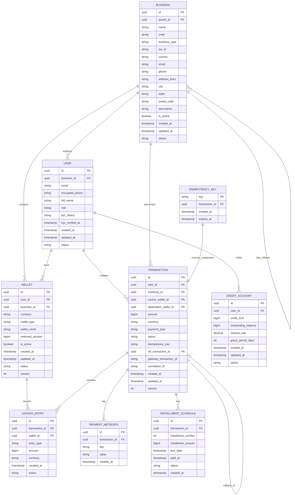

# Wallet Service - Complete Entity Relationship Diagram (ERD)

**Version**: 3.0 (Simplified with Hierarchical Business Structure)
**Last Updated**: October 2025
**Database**: Oracle Database 26ai Enterprise Edition

---

## ERD Diagram



---

## Entity Descriptions

### Core Entities

#### 1. BUSINESS (HIERARCHICAL)
**Purpose**: Represents business entities for B2B operations with support for business lines in a parent-child structure

**Key Attributes**:
- `id`: Unique identifier (UUID)
- `parent_id`: NULL for parent business, populated for business lines/divisions
- `name`: Business legal name or business line name
- `code`: Business line code (e.g., "ECOMMERCE", "CRYPTO") - NULL for parent businesses
- `business_type`: CORPORATION, LLC, PARTNERSHIP, SOLE_PROPRIETOR (only for parent businesses)
- `tax_id`: Encrypted tax identification number (only for parent businesses)
- `country`: ISO 3166-1 alpha-2 country code (only for parent businesses)
- `description`: Optional description (primarily for business lines)
- `is_active`: Active status flag
- `status`: ACTIVE, SUSPENDED, CLOSED

**Hierarchical Structure**:
- Parent records: `parent_id IS NULL` - Represents top-level businesses
- Child records: `parent_id IS NOT NULL` - Represents business lines/divisions

**Relationships**:
- Has many child BUSINESSES (business lines)
- Has many USERS (employees) - only parent businesses
- Has many WALLETS (can reference parent or child business)
- Processes many TRANSACTIONS

**Example**:
```sql
-- Create parent business
INSERT INTO businesses (id, parent_id, name, business_type, country, email)
VALUES ('f47ac10b-58cc-4372-a567-0e02b2c3d479', NULL, 'Acme Corp', 'CORPORATION', 'US', 'contact@acme.com');

-- Create business lines as children
INSERT INTO businesses (id, parent_id, name, code) VALUES
  ('3d2f8a9e-12ab-4c8d-9f6e-7a8b9c0d1e2f', 'f47ac10b-58cc-4372-a567-0e02b2c3d479', 'E-commerce', 'ECOMMERCE'),
  ('8b4e1c2a-45de-4f7a-89ab-0c1d2e3f4a5b', 'f47ac10b-58cc-4372-a567-0e02b2c3d479', 'Crypto', 'CRYPTO'),
  ('6f3d9b1c-89cd-4e5f-a1b2-c3d4e5f6a7b8', 'f47ac10b-58cc-4372-a567-0e02b2c3d479', 'Operations', 'OPERATIONS');
```

---

#### 2. USER
**Purpose**: User accounts for both B2C consumers and B2B employees

**Key Attributes**:
- `id`: Unique identifier (UUID)
- `business_id`: NULL for B2C users, populated for B2B employees
- `email`: Unique email address
- `encrypted_phone`: Encrypted phone number
- `full_name`: User's full name
- `role`: USER, BUSINESS_ADMIN, FINANCE_ADMIN, SYSTEM_ADMIN
- `kyc_status`: NOT_STARTED, PENDING, APPROVED, REJECTED
- `status`: ACTIVE, SUSPENDED, CLOSED

**Relationships**:
- Optionally belongs to one BUSINESS
- Owns many WALLETS
- Initiates many TRANSACTIONS
- May have one CREDIT_ACCOUNT

---

#### 3. WALLET
**Purpose**: Container for user funds in specific currency with hierarchical business support

**Key Attributes**:
- `id`: Unique identifier (UUID)
- `user_id`: Wallet owner (FK)
- `business_id`: NULL for personal B2C wallets, references parent business OR business line (child)
- `currency`: ISO 4217 currency code (USD, EUR, BTC, etc.)
- `wallet_type`: STANDARD, SAVINGS, BUSINESS, ESCROW, PERSONAL
- `wallet_name`: User-friendly name (e.g., "E-commerce USD", "Crypto BTC")
- `reserved_amount`: Funds reserved for pending transactions
- `is_active`: Active status flag
- `version`: Optimistic locking version

**Unique Constraint**:
```sql
CREATE UNIQUE INDEX idx_wallet_user_business_currency ON wallets(
    user_id,
    COALESCE(business_id, RAW '00000000000000000000000000000000'),
    currency,
    wallet_type
);
```

**Relationships**:
- Belongs to one USER
- Optionally references one BUSINESS (can be parent or child business line)
- Has many LEDGER_ENTRIES

**Example Scenarios**:

**Scenario 1: Multi-Business User (Alice)**
```
Alice works for Acme Corp and TechStart:
- Personal USD: (user=alice, business_id=NULL, currency=USD)
- Acme USD:     (user=alice, business_id=f47ac10b-58cc-4372-a567-0e02b2c3d479, currency=USD)  -- parent business
- TechStart USD:(user=alice, business_id=biz-002, currency=USD)  -- different parent
```

**Scenario 2: Business Line Segregation (John in business-1)**
```
John works in business-1 with business lines:
- Personal:       (user=john, business_id=NULL, currency=USD)
- E-commerce USD: (user=john, business_id=3d2f8a9e-12ab-4c8d-9f6e-7a8b9c0d1e2f, currency=USD)   -- business line
- Crypto USD:     (user=john, business_id=8b4e1c2a-45de-4f7a-89ab-0c1d2e3f4a5b, currency=USD)  -- business line
- Crypto BTC:     (user=john, business_id=8b4e1c2a-45de-4f7a-89ab-0c1d2e3f4a5b, currency=BTC)  -- same line, diff currency
```

---

#### 4. TRANSACTION
**Purpose**: Immutable record of a financial operation

**Key Attributes**:
- `id`: Unique identifier (UUID)
- `user_id`: Transaction initiator (FK)
- `business_id`: Business context (FK, nullable)
- `source_wallet_id`: Source wallet for debits (FK, nullable)
- `destination_wallet_id`: Destination wallet for credits (FK, nullable)
- `amount`: Transaction amount in minor units
- `currency`: ISO 4217 currency code
- `payment_type`: PREPAYMENT, POSTPAYMENT, VALUABLE, CREDIT
- `status`: PENDING, CONFIRMED, COMPLETED, FAILED, ROLLED_BACK
- `idempotency_key`: Client-provided unique key for idempotency
- `ref_transaction_id`: Reference to original transaction (for rollbacks)
- `gateway_transaction_id`: External payment gateway transaction ID
- `correlation_id`: Distributed tracing ID
- `version`: Optimistic locking version

**State Machine**:
```
PENDING → CONFIRMED → COMPLETED
   ↓
FAILED → ROLLED_BACK
```

**Relationships**:
- Belongs to one USER
- Optionally belongs to one BUSINESS
- References source and destination WALLETS
- Has many LEDGER_ENTRIES (minimum 2 for double-entry)
- May reference another TRANSACTION (for rollbacks)
- Has many PAYMENT_METADATA records
- May have many INSTALLMENT_SCHEDULE records

---

#### 5. LEDGER_ENTRY
**Purpose**: Double-entry bookkeeping records for immutable audit trail

**Key Attributes**:
- `id`: Unique identifier (UUID)
- `transaction_id`: Parent transaction (FK)
- `wallet_id`: Affected wallet (FK)
- `entry_type`: CREDIT or DEBIT
- `amount`: Entry amount in minor units
- `currency`: ISO 4217 currency code
- `status`: PENDING, CONFIRMED, ROLLED_BACK

**Business Rules**:
- Every transaction must have at least 2 ledger entries (debit and credit)
- For transfers: Source wallet gets DEBIT, destination wallet gets CREDIT
- For deposits: Wallet gets CREDIT
- For withdrawals: Wallet gets DEBIT
- Balance = SUM(CREDIT) - SUM(DEBIT)

**Relationships**:
- Belongs to one TRANSACTION
- Belongs to one WALLET

---

### Supporting Entities

#### 6. PAYMENT_METADATA
**Purpose**: Key-value metadata for transactions

**Attributes**:
- `id`: UUID
- `transaction_id`: Parent transaction (FK)
- `key`: Metadata key
- `value`: Metadata value (JSON string)
- `created_at`: Timestamp

---

#### 7. CREDIT_ACCOUNT
**Purpose**: Credit line accounts for installment payments

**Attributes**:
- `id`: UUID
- `user_id`: Account holder (FK)
- `credit_limit`: Maximum credit limit
- `outstanding_balance`: Current outstanding balance
- `interest_rate`: Annual interest rate (decimal)
- `grace_period_days`: Payment grace period
- `status`: ACTIVE, SUSPENDED, CLOSED

---

#### 8. INSTALLMENT_SCHEDULE
**Purpose**: Installment payment schedules

**Attributes**:
- `id`: UUID
- `transaction_id`: Original transaction (FK)
- `installment_number`: Installment number (1, 2, 3, ...)
- `installment_amount`: Installment amount
- `due_date`: Payment due date
- `paid_at`: Payment timestamp (nullable)
- `status`: PENDING, PAID, OVERDUE, CANCELLED

---

#### 9. IDEMPOTENCY_KEY
**Purpose**: Ensures idempotent transaction processing

**Attributes**:
- `key`: Client-provided unique key (PK)
- `transaction_id`: Created transaction (FK)
- `created_at`: Key creation timestamp
- `expires_at`: Key expiration timestamp (TTL)

**Business Rule**:
- Keys expire after 24 hours
- Duplicate requests with same key return existing transaction

---

## Key Relationships Summary

### Business Hierarchy (Self-Referencing)
```
BUSINESS (parent) ──── has many children ───> (N) BUSINESS (child/business lines)
BUSINESS (parent) ──── employs ───> (N) USER
```

### Wallet Ownership
```
USER (1) ──── owns ───> (N) WALLET
WALLET (N) ── optionally references ─> (1) BUSINESS (parent or child business line)
```

### Transaction Flow
```
USER (1) ──── initiates ───> (N) TRANSACTION
TRANSACTION (1) ──── contains ───> (N) LEDGER_ENTRY
LEDGER_ENTRY (N) ──── affects ───> (1) WALLET
```

---

## Database Constraints

### Primary Keys
All entities use **UUID v7** (RAW(16)) as primary key for optimal performance.

**Why UUID v7?**
- ✅ **Time-ordered**: Natural chronological sorting improves query performance
- ✅ **Index efficiency**: Better B-tree locality reduces index fragmentation
- ✅ **Insert performance**: Sequential-like inserts minimize page splits
- ✅ **Range queries**: Time-based queries benefit from clustering
- ✅ **Globally unique**: Maintains uniqueness across distributed systems

**Implementation**:
- **Oracle 26ai Native**: Uses built-in `SYS_GUID_V7()` function if available
- **Fallback**: Custom PL/SQL `generate_uuid_v7_custom()` for compatibility
- **Wrapper**: `generate_uuid_v7()` automatically selects the best implementation

### Foreign Keys
All foreign key relationships enforce referential integrity with `ON DELETE RESTRICT` (default).

### Unique Constraints
- `businesses.tax_id + country` (unique per country) WHERE parent_id IS NULL
- `businesses.(parent_id, code)` (unique business line code per parent)
- `users.email` (globally unique)
- `wallets.(user_id, business_id, currency, wallet_type)` (unique with COALESCE for NULLs)

### Check Constraints
- `wallet.reserved_amount >= 0`
- `transaction.amount > 0`
- `ledger_entry.amount > 0`
- `business.is_active IN (0, 1)`
- `wallet.is_active IN (0, 1)`
- `(parent_id IS NULL AND business_type IS NOT NULL) OR (parent_id IS NOT NULL AND code IS NOT NULL)`

### Indexes
```sql
-- Performance indexes
CREATE INDEX idx_business_parent ON businesses(parent_id);
CREATE INDEX idx_wallet_user ON wallets(user_id);
CREATE INDEX idx_wallet_business ON wallets(business_id);
CREATE INDEX idx_transaction_user ON transactions(user_id);
CREATE INDEX idx_transaction_created ON transactions(created_at DESC);
CREATE INDEX idx_ledger_wallet ON ledger_entries(wallet_id);
CREATE INDEX idx_ledger_status ON ledger_entries(status);
```

---

## Partitioning Strategy

### TRANSACTIONS Table
```sql
-- Monthly range partitioning
CREATE TABLE transactions (...)
PARTITION BY RANGE (created_at) INTERVAL (NUMTOYMINTERVAL(1, 'MONTH'))
(
  PARTITION p_2025_01 VALUES LESS THAN (TO_DATE('2025-02-01', 'YYYY-MM-DD'))
);
```

### LEDGER_ENTRIES Table
```sql
-- Monthly range partitioning
CREATE TABLE ledger_entries (...)
PARTITION BY RANGE (created_at) INTERVAL (NUMTOYMINTERVAL(1, 'MONTH'))
(
  PARTITION p_2025_01 VALUES LESS THAN (TO_DATE('2025-02-01', 'YYYY-MM-DD'))
);
```

---

## New Features Summary

### Hierarchical Business Structure (Version 3.0)

**What's New**:
1. **Self-referencing BUSINESS table** - Parent-child structure eliminates separate business_line table
2. **Simplified schema** - Businesses and business lines in one table with parent_id
3. **WALLET.business_id** - Can reference either parent business or child business line
4. **Removed discount code complexity** - Simplified transaction model

**Use Case**:
```
Acme Corp (parent business):
├── E-commerce Division (child)
├── Crypto Division (child)
└── Marketing Division (child)

Each user can have separate wallets per division:
- John's E-commerce USD wallet (references child business)
- John's Crypto USD wallet (references child business)
- John's Crypto BTC wallet (references child business)
- John's Marketing USD wallet (references child business)

All wallets have independent balances and operations.
```

---

## Related Documentation

- **[database-schema.md](./docs/02-domain-model/database-schema.md)** - Complete DDL scripts
- **[entity-relationships.md](./docs/02-domain-model/entity-relationships.md)** - Detailed entity descriptions
- **[PRODUCT_DESIGN.md](./docs/PRODUCT_DESIGN.md)** - Visual product design with diagrams

---

**Version**: 3.0 (Simplified Hierarchical Business Structure)
**Last Updated**: October 2025
**Status**: Production-Ready Design
