# Wallet Service - Mermaid Diagrams Collection

This file contains all Mermaid diagrams extracted from the documentation for easy copy-paste into [Mermaid Live Editor](https://mermaid.live)

---

## Table of Contents

1. [Architecture Diagrams](#architecture-diagrams)
2. [Entity Relationships](#entity-relationships)
3. [User Journeys](#user-journeys)
4. [Workflows](#workflows)
5. [Sequence Diagrams](#sequence-diagrams)
6. [State Machines](#state-machines)

---

## Architecture Diagrams

### 1. High-Level System Architecture

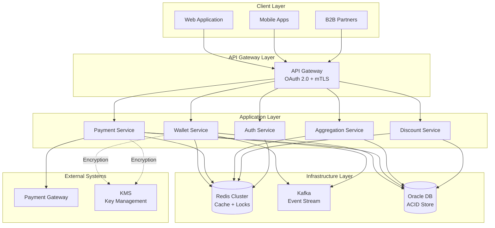

### 2. Multi-Business Wallet Hierarchy

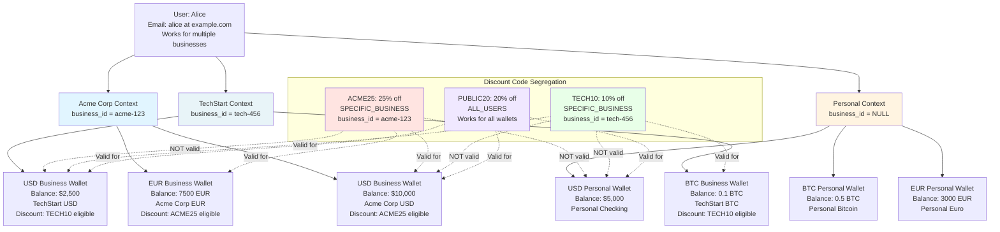

### 3. Kubernetes Deployment Architecture

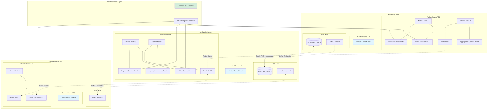

---

## Entity Relationships

### Complete ER Diagram (Updated with Business Line Support)

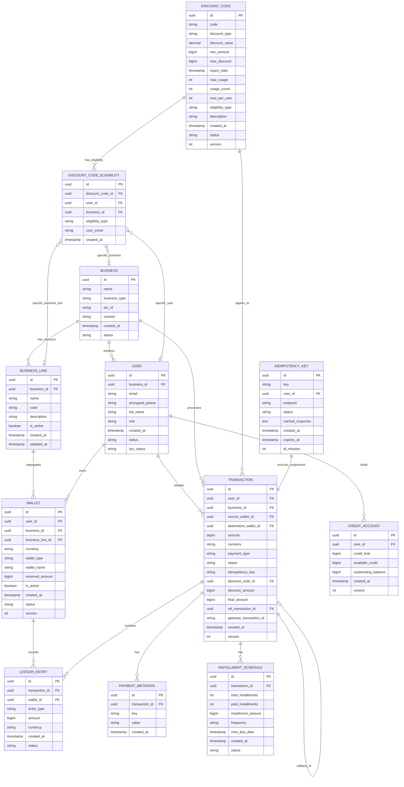

---

## User Journeys

### Consumer Payment Journey with Discount

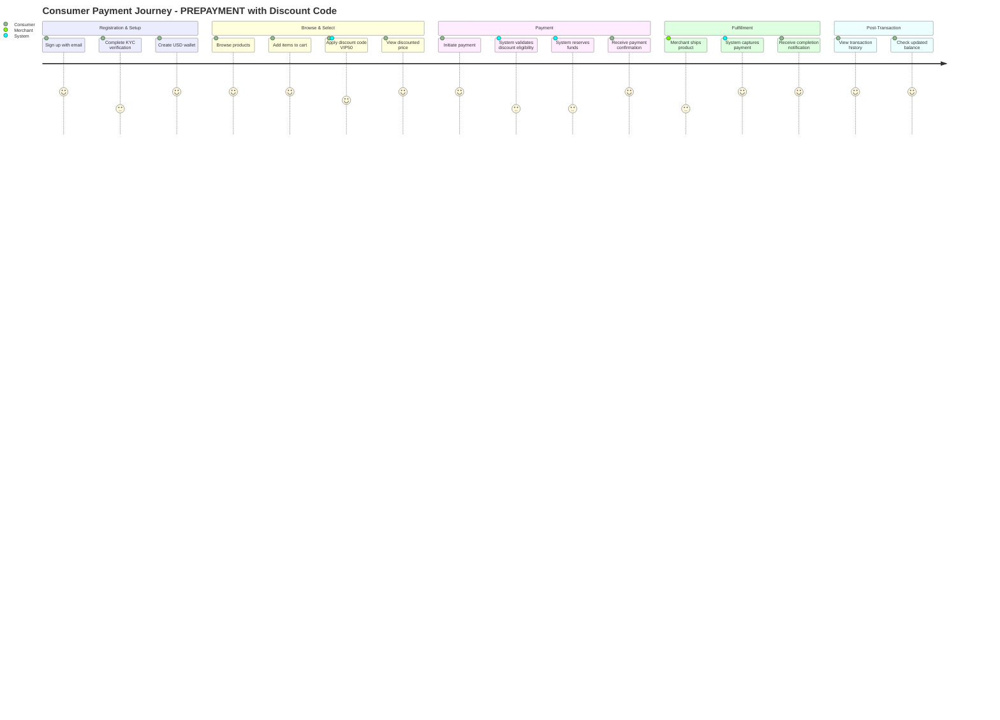

---

## Workflows

### Payment Type Decision Tree

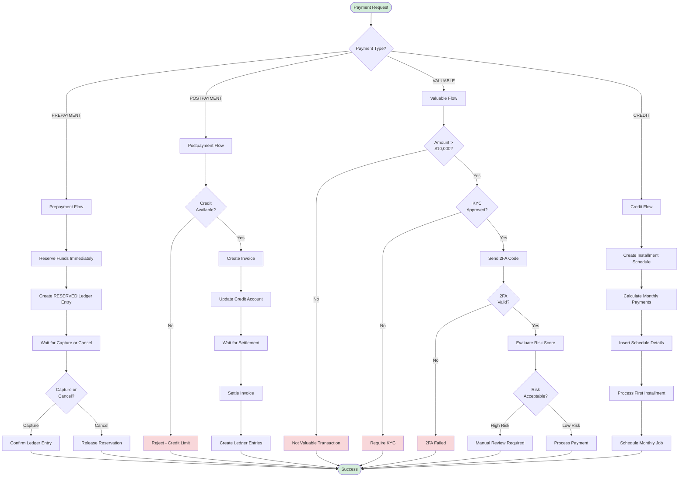

### Discount Code Eligibility Validation

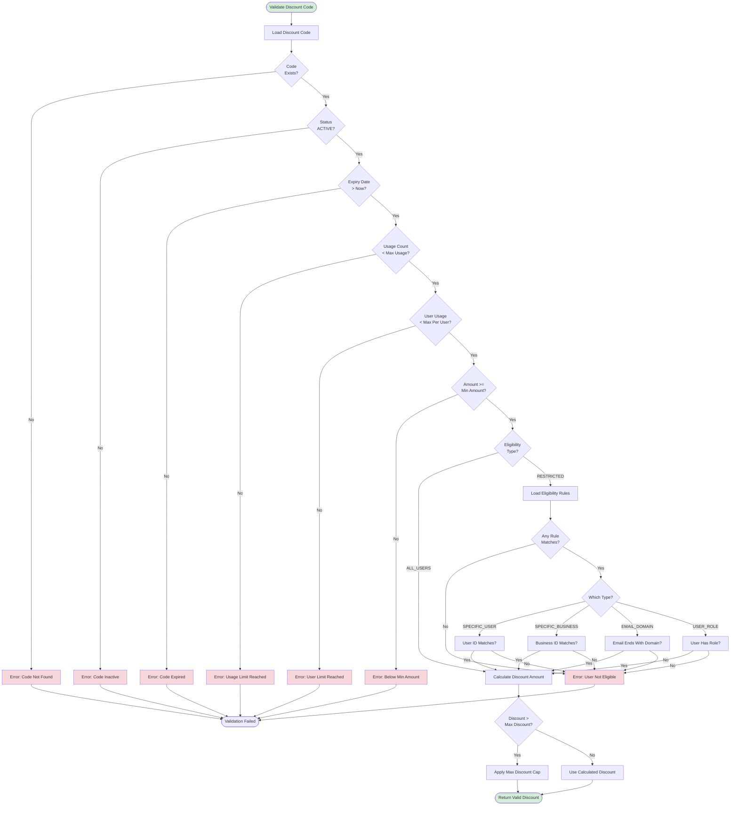

---

## Sequence Diagrams

### Business-Specific Discount Validation

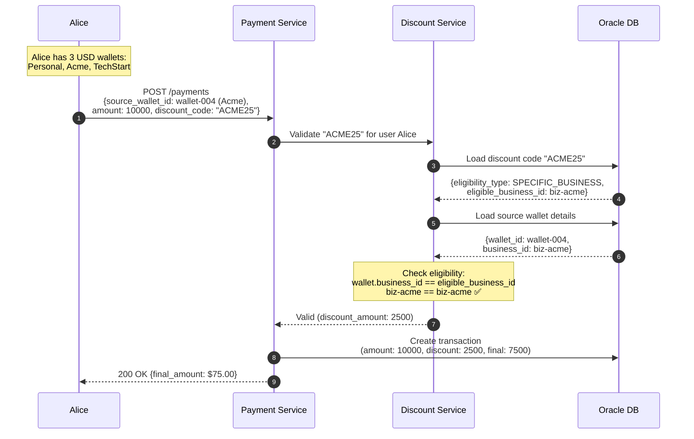

---

## State Machines

### Transaction Lifecycle

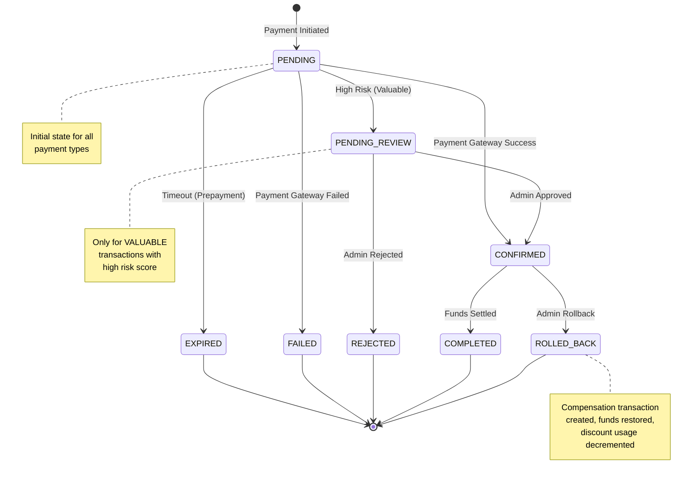

### Discount Code Lifecycle

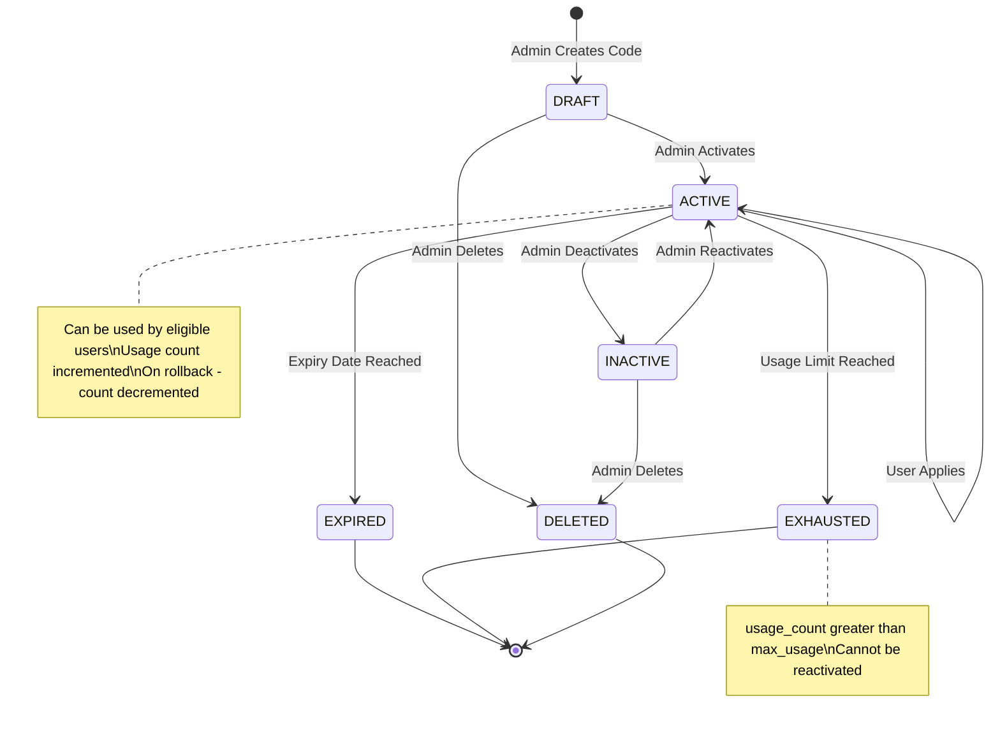

### Wallet Status State Machine

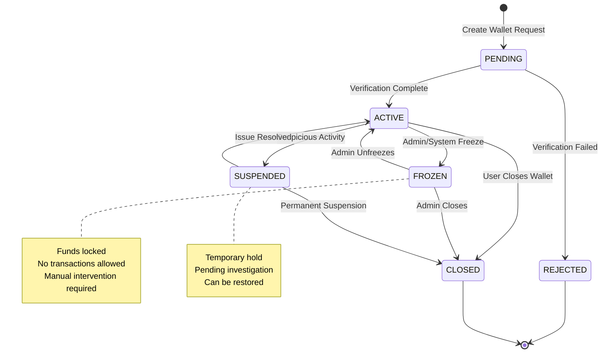

---

## CQRS Pattern

### Read/Write Segregation

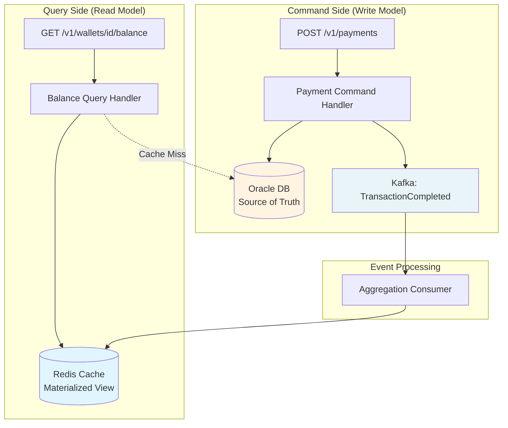

---

## How to Use These Diagrams

### On Mermaid Live Editor

1. **Go to**: <https://mermaid.live>
2. **Copy** any diagram code from above (including the ` ```mermaid ` and ` ``` ` markers)
3. **Paste** into the left editor panel
4. The diagram will render on the right
5. **Export** as PNG, SVG, or share via URL

### Example

Copy this entire block:

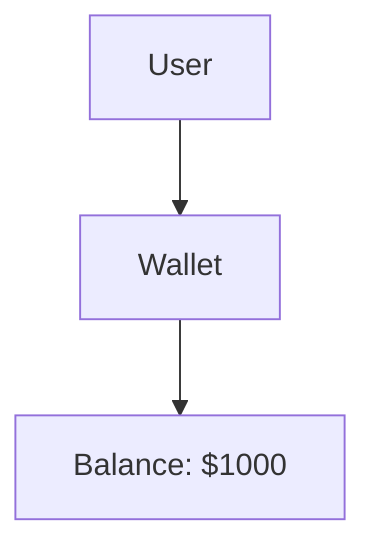

Paste into <https://mermaid.live> and it will render!

---

## File Locations

All these diagrams are embedded in:

- `docs/PRODUCT_DESIGN.md` - Main design document
- `docs/01-architecture/data-flows.md` - Sequence diagrams
- `docs/02-domain-model/multi-business-wallets.md` - Multi-business diagrams
- `docs/02-domain-model/entity-relationships.md` - ER diagram

---

**Total Diagrams**: 15+ ready-to-use Mermaid diagrams
**Status**: ✅ Ready for visualization
**Tools**: Compatible with Mermaid Live Editor, GitHub, GitLab, Confluence, etc.
