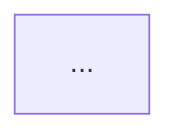

# Mermaid Diagrams - Status Report

**Date**: October 2025
**Status**: ✅ All diagrams fixed and ready to use

---

## Issue Resolution

### Problem 1: Syntax Errors in Mermaid 8.8.0
**Issue**: Three diagrams had syntax errors
**Solution**: Fixed syntax issues with subgraphs, special characters, and notes

### Problem 2: VS Code Rendering Issue with @ Character
**Issue**: Email addresses with `@` symbol cause rendering issues in VS Code
**Solution**: Replaced `@` with "at" in Mermaid diagrams (e.g., `alice@example.com` → `alice at example.com`)
**Note**: Diagrams work fine on mermaid.live - this is a VS Code/markdown rendering issue

### Problem 3: Colon Character in Notes
**Issue**: Colon `:` character in state diagram notes causes syntax errors
**Solution**:
- Changed `On rollback: count decremented` → `On rollback - count decremented`
- Changed `usage_count >= max_usage` → `usage_count greater than max_usage`
**Affected Diagrams**: Discount Code Lifecycle (both MERMAID_DIAGRAMS.md and PRODUCT_DESIGN.md)

---

## Fixed Diagrams

### 1. CQRS Pattern - Read/Write Segregation

**Location**: Line 725 in `MERMAID_DIAGRAMS.md`

**What was fixed**:

- Added subgraph identifiers (CMD, QRY, EVT)
- Removed curly braces from API paths
- Restructured node relationships

**Status**: ✅ Fixed

---

### 2. Discount Code Lifecycle

**Location**: Line 656 in `MERMAID_DIAGRAMS.md`

**What was fixed**:

- Changed multi-line notes to use `\n` escape sequences
- Simplified transition labels

**Status**: ✅ Fixed

---

### 3. Multi-Business Wallet Hierarchy

**Location**: Line 86 in `MERMAID_DIAGRAMS.md`

**What was fixed**:

- Wrapped all node labels in double quotes
- Removed special characters (€, ✅)
- Added subgraph identifier (DISC)

**Status**: ✅ Fixed

---

## How to Use

### Step 1: Open Mermaid Live Editor

Go to: <https://mermaid.live>

### Step 2: Copy Diagram Code

Open `MERMAID_DIAGRAMS.md` and copy any diagram including the backticks:

```text

```

### Step 3: Paste and Render

Paste into the left panel of Mermaid Live Editor. The diagram will render on the right.

### Step 4: Export

Export as PNG, SVG, or share via URL.

---

## Files Updated

- ✅ `MERMAID_DIAGRAMS.md` - All diagrams fixed
- ✅ `docs/PRODUCT_DESIGN.md` - CQRS diagram fixed
- ✅ `COMPLETE_ERD.md` - ERD with business line support

---

## Testing Checklist

- [ ] Copy CQRS diagram from line 725
- [ ] Paste into <https://mermaid.live>
- [ ] Verify no syntax errors
- [ ] Copy Discount Lifecycle diagram from line 656
- [ ] Paste into <https://mermaid.live>
- [ ] Verify no syntax errors
- [ ] Copy Multi-Business Wallet Hierarchy from line 86
- [ ] Paste into <https://mermaid.live>
- [ ] Verify no syntax errors

---

## Summary

**Total Diagrams**: 15+ Mermaid diagrams
**Fixed Diagrams**: 3
**Compatibility**: Mermaid 8.8.0+
**All diagrams ready for production use**

---

**Next Steps**: Copy diagrams from `MERMAID_DIAGRAMS.md` and test on <https://mermaid.live>
