# Data Flows

## Overview

This document details the complete data flows for all critical operations in the Wallet Service, including payment processing, rollback handling, balance aggregation, and discount application.

---

## 1. Payment Processing Flow

### 1.1 Standard Payment (Happy Path)

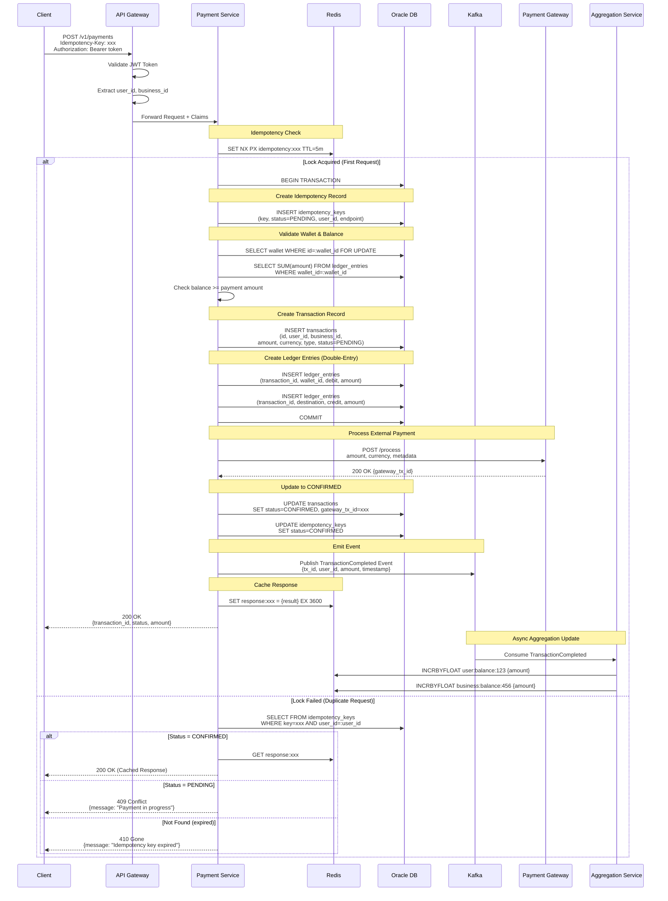
```mermaid
sequenceDiagram
    participant Client
    participant API Gateway
    participant Payment Service
    participant Redis
    participant Oracle DB
    participant Kafka
    participant Payment Gateway
    participant Aggregation Service

    Client->>API Gateway: POST /v1/payments<br/>Idempotency-Key: xxx<br/>Authorization: Bearer token

    API Gateway->>API Gateway: Validate JWT Token
    API Gateway->>API Gateway: Extract user_id, business_id

    API Gateway->>Payment Service: Forward Request + Claims

    Note over Payment Service,Redis: Idempotency Check
    Payment Service->>Redis: SET NX PX idempotency:xxx TTL=5m

    alt Lock Acquired (First Request)
        Payment Service->>Oracle DB: BEGIN TRANSACTION

        Note over Payment Service,Oracle DB: Create Idempotency Record
        Payment Service->>Oracle DB: INSERT idempotency_keys<br/>(key, status=PENDING, user_id, endpoint)

        Note over Payment Service,Oracle DB: Validate Wallet & Balance
        Payment Service->>Oracle DB: SELECT wallet WHERE id=:wallet_id FOR UPDATE
        Payment Service->>Oracle DB: SELECT SUM(amount) FROM ledger_entries<br/>WHERE wallet_id=:wallet_id
        Payment Service->>Payment Service: Check balance >= payment amount

        Note over Payment Service,Oracle DB: Create Transaction Record
        Payment Service->>Oracle DB: INSERT transactions<br/>(id, user_id, business_id,<br/>amount, currency, type, status=PENDING)

        Note over Payment Service,Oracle DB: Create Ledger Entries (Double-Entry)
        Payment Service->>Oracle DB: INSERT ledger_entries<br/>(transaction_id, wallet_id, debit, amount)
        Payment Service->>Oracle DB: INSERT ledger_entries<br/>(transaction_id, destination, credit, amount)

        Payment Service->>Oracle DB: COMMIT

        Note over Payment Service,Payment Gateway: Process External Payment
        Payment Service->>Payment Gateway: POST /process<br/>amount, currency, metadata
        Payment Gateway-->>Payment Service: 200 OK {gateway_tx_id}

        Note over Payment Service,Oracle DB: Update to CONFIRMED
        Payment Service->>Oracle DB: UPDATE transactions<br/>SET status=CONFIRMED, gateway_tx_id=xxx
        Payment Service->>Oracle DB: UPDATE idempotency_keys<br/>SET status=CONFIRMED

        Note over Payment Service,Kafka: Emit Event
        Payment Service->>Kafka: Publish TransactionCompleted Event<br/>{tx_id, user_id, amount, timestamp}

        Note over Payment Service,Redis: Cache Response
        Payment Service->>Redis: SET response:xxx = {result} EX 3600

        Payment Service-->>Client: 200 OK<br/>{transaction_id, status, amount}

        Note over Kafka,Aggregation Service: Async Aggregation Update
        Kafka->>Aggregation Service: Consume TransactionCompleted
        Aggregation Service->>Redis: INCRBYFLOAT user:balance:123 {amount}
        Aggregation Service->>Redis: INCRBYFLOAT business:balance:456 {amount}

    else Lock Failed (Duplicate Request)
        Payment Service->>Oracle DB: SELECT FROM idempotency_keys<br/>WHERE key=xxx AND user_id=:user_id

        alt Status = CONFIRMED
            Payment Service->>Redis: GET response:xxx
            Payment Service-->>Client: 200 OK (Cached Response)
        else Status = PENDING
            Payment Service-->>Client: 409 Conflict<br/>{message: "Payment in progress"}
        else Not Found (expired)
            Payment Service-->>Client: 410 Gone<br/>{message: "Idempotency key expired"}
        end
    end
```

### 1.2 Payment Type-Specific Flows

#### PREPAYMENT Flow
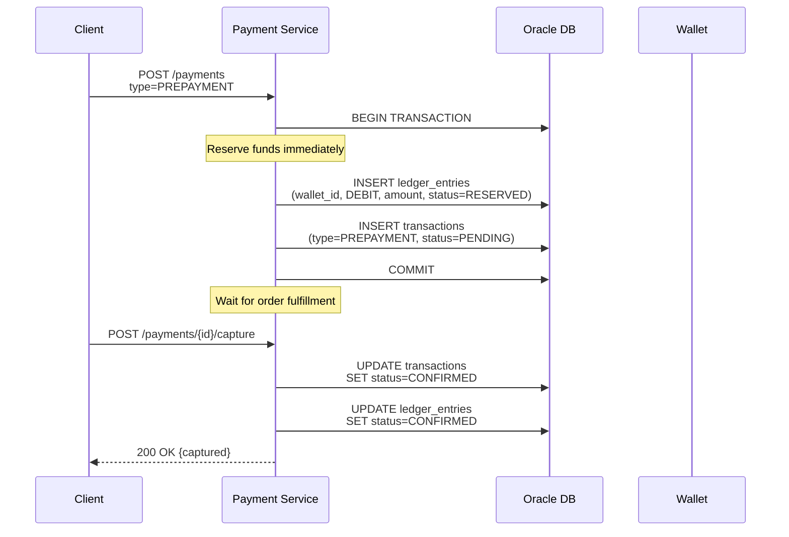
```mermaid
sequenceDiagram
    participant Client
    participant Payment Service
    participant Oracle DB
    participant Wallet

    Client->>Payment Service: POST /payments<br/>type=PREPAYMENT
    Payment Service->>Oracle DB: BEGIN TRANSACTION

    Note over Payment Service: Reserve funds immediately
    Payment Service->>Oracle DB: INSERT ledger_entries<br/>(wallet_id, DEBIT, amount, status=RESERVED)
    Payment Service->>Oracle DB: INSERT transactions<br/>(type=PREPAYMENT, status=PENDING)
    Payment Service->>Oracle DB: COMMIT

    Note over Payment Service: Wait for order fulfillment
    Client->>Payment Service: POST /payments/{id}/capture

    Payment Service->>Oracle DB: UPDATE transactions<br/>SET status=CONFIRMED
    Payment Service->>Oracle DB: UPDATE ledger_entries<br/>SET status=CONFIRMED
    Payment Service-->>Client: 200 OK {captured}
```

#### POSTPAYMENT Flow
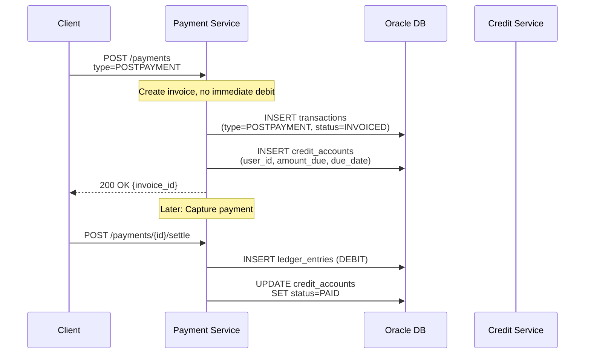
```mermaid
sequenceDiagram
    participant Client
    participant Payment Service
    participant Oracle DB
    participant Credit Service

    Client->>Payment Service: POST /payments<br/>type=POSTPAYMENT

    Note over Payment Service: Create invoice, no immediate debit
    Payment Service->>Oracle DB: INSERT transactions<br/>(type=POSTPAYMENT, status=INVOICED)
    Payment Service->>Oracle DB: INSERT credit_accounts<br/>(user_id, amount_due, due_date)
    Payment Service-->>Client: 200 OK {invoice_id}

    Note over Payment Service: Later: Capture payment
    Client->>Payment Service: POST /payments/{id}/settle
    Payment Service->>Oracle DB: INSERT ledger_entries (DEBIT)
    Payment Service->>Oracle DB: UPDATE credit_accounts<br/>SET status=PAID
```

#### VALUABLE (High-Value) Flow
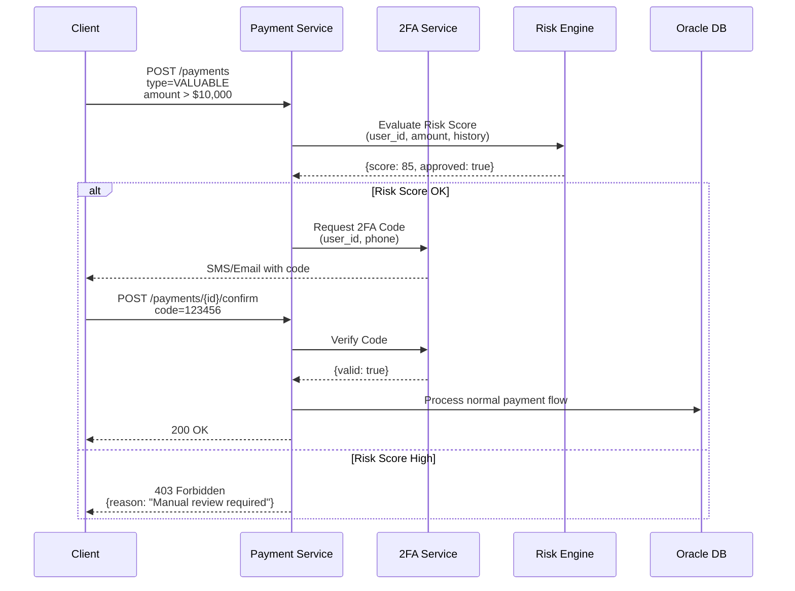
```mermaid
sequenceDiagram
    participant Client
    participant Payment Service
    participant 2FA Service
    participant Risk Engine
    participant Oracle DB

    Client->>Payment Service: POST /payments<br/>type=VALUABLE<br/>amount > $10,000

    Payment Service->>Risk Engine: Evaluate Risk Score<br/>(user_id, amount, history)
    Risk Engine-->>Payment Service: {score: 85, approved: true}

    alt Risk Score OK
        Payment Service->>2FA Service: Request 2FA Code<br/>(user_id, phone)
        2FA Service-->>Client: SMS/Email with code

        Client->>Payment Service: POST /payments/{id}/confirm<br/>code=123456
        Payment Service->>2FA Service: Verify Code
        2FA Service-->>Payment Service: {valid: true}

        Payment Service->>Oracle DB: Process normal payment flow
        Payment Service-->>Client: 200 OK
    else Risk Score High
        Payment Service-->>Client: 403 Forbidden<br/>{reason: "Manual review required"}
    end
```

#### CREDIT (Installment) Flow
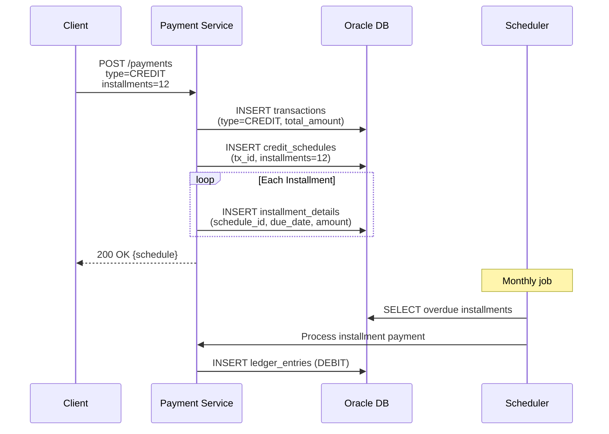
```mermaid
sequenceDiagram
    participant Client
    participant Payment Service
    participant Oracle DB
    participant Scheduler

    Client->>Payment Service: POST /payments<br/>type=CREDIT<br/>installments=12

    Payment Service->>Oracle DB: INSERT transactions<br/>(type=CREDIT, total_amount)
    Payment Service->>Oracle DB: INSERT credit_schedules<br/>(tx_id, installments=12)

    loop Each Installment
        Payment Service->>Oracle DB: INSERT installment_details<br/>(schedule_id, due_date, amount)
    end

    Payment Service-->>Client: 200 OK {schedule}

    Note over Scheduler: Monthly job
    Scheduler->>Oracle DB: SELECT overdue installments
    Scheduler->>Payment Service: Process installment payment
    Payment Service->>Oracle DB: INSERT ledger_entries (DEBIT)
```

---

## 2. Payment Rollback Flow

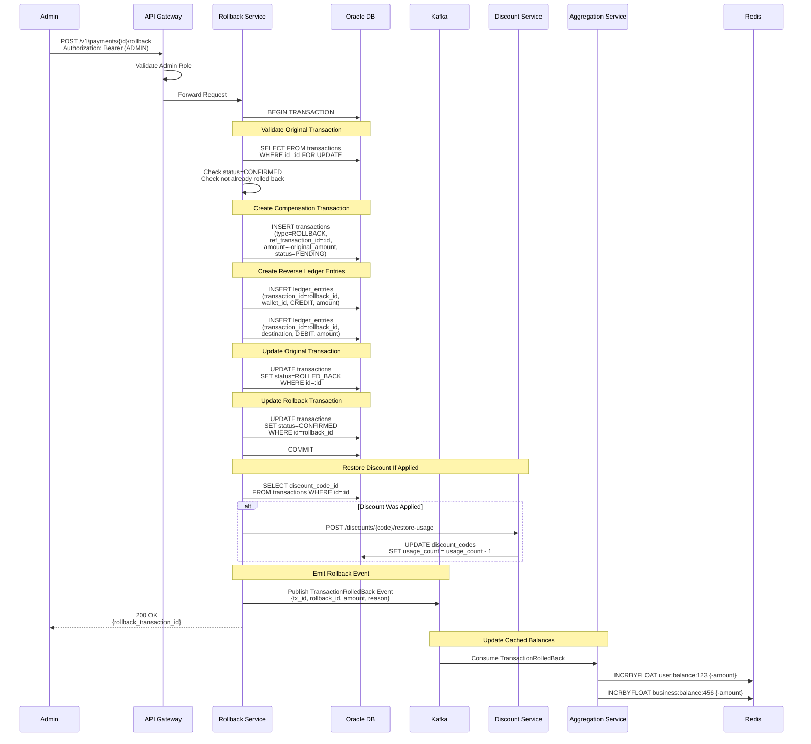
```mermaid
sequenceDiagram
    participant Admin
    participant API Gateway
    participant Rollback Service
    participant Oracle DB
    participant Kafka
    participant Discount Service
    participant Aggregation Service

    Admin->>API Gateway: POST /v1/payments/{id}/rollback<br/>Authorization: Bearer (ADMIN)
    API Gateway->>API Gateway: Validate Admin Role
    API Gateway->>Rollback Service: Forward Request

    Rollback Service->>Oracle DB: BEGIN TRANSACTION

    Note over Rollback Service,Oracle DB: Validate Original Transaction
    Rollback Service->>Oracle DB: SELECT FROM transactions<br/>WHERE id=:id FOR UPDATE
    Rollback Service->>Rollback Service: Check status=CONFIRMED<br/>Check not already rolled back

    Note over Rollback Service,Oracle DB: Create Compensation Transaction
    Rollback Service->>Oracle DB: INSERT transactions<br/>(type=ROLLBACK,<br/>ref_transaction_id=:id,<br/>amount=-original_amount,<br/>status=PENDING)

    Note over Rollback Service,Oracle DB: Create Reverse Ledger Entries
    Rollback Service->>Oracle DB: INSERT ledger_entries<br/>(transaction_id=rollback_id,<br/>wallet_id, CREDIT, amount)
    Rollback Service->>Oracle DB: INSERT ledger_entries<br/>(transaction_id=rollback_id,<br/>destination, DEBIT, amount)

    Note over Rollback Service,Oracle DB: Update Original Transaction
    Rollback Service->>Oracle DB: UPDATE transactions<br/>SET status=ROLLED_BACK<br/>WHERE id=:id

    Note over Rollback Service,Oracle DB: Update Rollback Transaction
    Rollback Service->>Oracle DB: UPDATE transactions<br/>SET status=CONFIRMED<br/>WHERE id=rollback_id

    Rollback Service->>Oracle DB: COMMIT

    Note over Rollback Service,Discount Service: Restore Discount If Applied
    Rollback Service->>Oracle DB: SELECT discount_code_id<br/>FROM transactions WHERE id=:id
    alt Discount Was Applied
        Rollback Service->>Discount Service: POST /discounts/{code}/restore-usage
        Discount Service->>Oracle DB: UPDATE discount_codes<br/>SET usage_count = usage_count - 1
    end

    Note over Rollback Service,Kafka: Emit Rollback Event
    Rollback Service->>Kafka: Publish TransactionRolledBack Event<br/>{tx_id, rollback_id, amount, reason}

    Rollback Service-->>Admin: 200 OK<br/>{rollback_transaction_id}

    Note over Kafka,Aggregation Service: Update Cached Balances
    Kafka->>Aggregation Service: Consume TransactionRolledBack
    Aggregation Service->>Redis: INCRBYFLOAT user:balance:123 {-amount}
    Aggregation Service->>Redis: INCRBYFLOAT business:balance:456 {-amount}
```

---

## 3. Balance Aggregation Flow

### 3.1 Cached Balance Query (Fast Path)

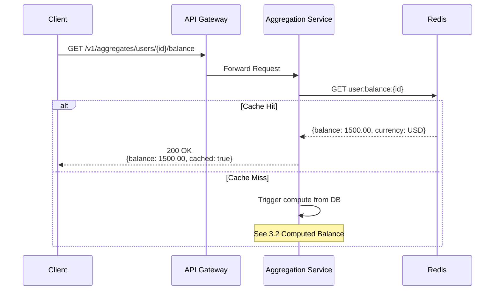
```mermaid
sequenceDiagram
    participant Client
    participant API Gateway
    participant Aggregation Service
    participant Redis

    Client->>API Gateway: GET /v1/aggregates/users/{id}/balance
    API Gateway->>Aggregation Service: Forward Request

    Aggregation Service->>Redis: GET user:balance:{id}

    alt Cache Hit
        Redis-->>Aggregation Service: {balance: 1500.00, currency: USD}
        Aggregation Service-->>Client: 200 OK<br/>{balance: 1500.00, cached: true}
    else Cache Miss
        Aggregation Service->>Aggregation Service: Trigger compute from DB
        Note over Aggregation Service: See 3.2 Computed Balance
    end
```

### 3.2 Computed Balance Query (Slow Path)

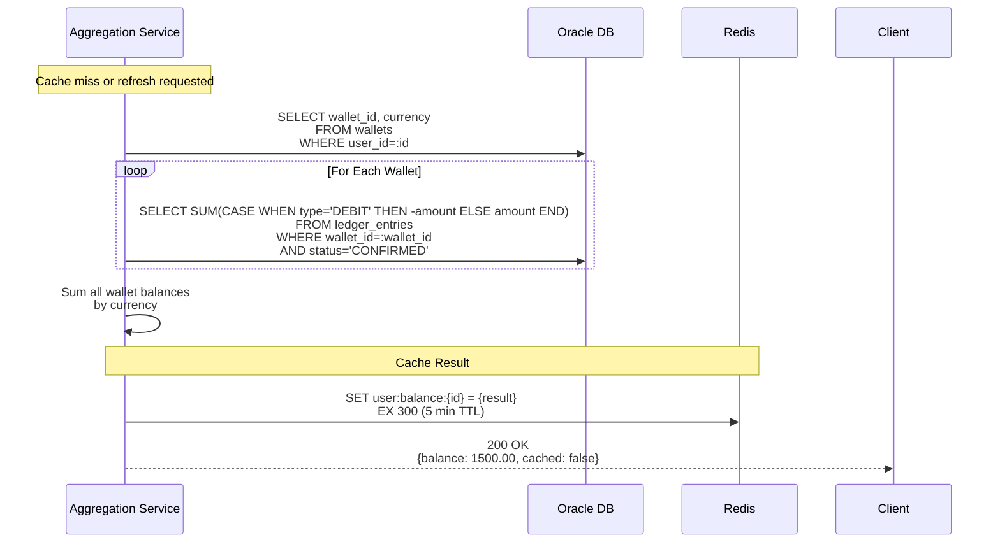
```mermaid
sequenceDiagram
    participant Aggregation Service
    participant Oracle DB
    participant Redis
    participant Client

    Note over Aggregation Service: Cache miss or refresh requested

    Aggregation Service->>Oracle DB: SELECT wallet_id, currency<br/>FROM wallets<br/>WHERE user_id=:id

    loop For Each Wallet
        Aggregation Service->>Oracle DB: SELECT SUM(CASE WHEN type='DEBIT' THEN -amount ELSE amount END)<br/>FROM ledger_entries<br/>WHERE wallet_id=:wallet_id<br/>AND status='CONFIRMED'
    end

    Aggregation Service->>Aggregation Service: Sum all wallet balances<br/>by currency

    Note over Aggregation Service,Redis: Cache Result
    Aggregation Service->>Redis: SET user:balance:{id} = {result}<br/>EX 300 (5 min TTL)

    Aggregation Service-->>Client: 200 OK<br/>{balance: 1500.00, cached: false}
```

### 3.3 Event-Driven Aggregation Update

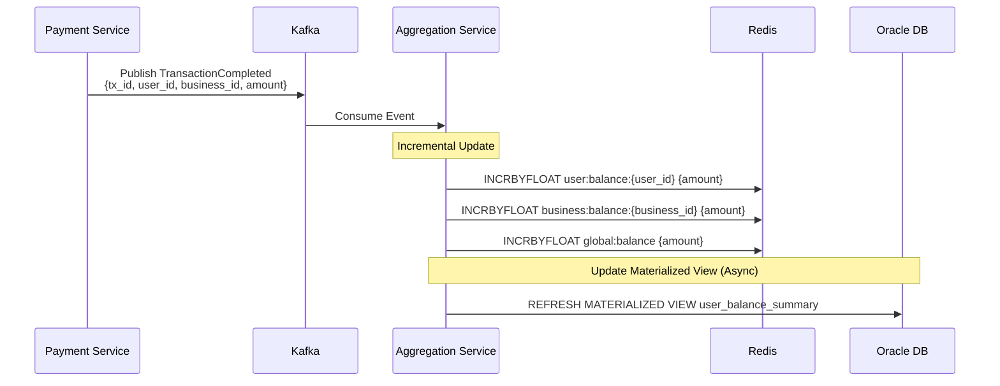
```mermaid
sequenceDiagram
    participant Payment Service
    participant Kafka
    participant Aggregation Service
    participant Redis
    participant Oracle DB

    Payment Service->>Kafka: Publish TransactionCompleted<br/>{tx_id, user_id, business_id, amount}

    Kafka->>Aggregation Service: Consume Event

    Note over Aggregation Service: Incremental Update
    Aggregation Service->>Redis: INCRBYFLOAT user:balance:{user_id} {amount}
    Aggregation Service->>Redis: INCRBYFLOAT business:balance:{business_id} {amount}
    Aggregation Service->>Redis: INCRBYFLOAT global:balance {amount}

    Note over Aggregation Service,Oracle DB: Update Materialized View (Async)
    Aggregation Service->>Oracle DB: REFRESH MATERIALIZED VIEW user_balance_summary
```

---

## 4. Discount Code Application Flow

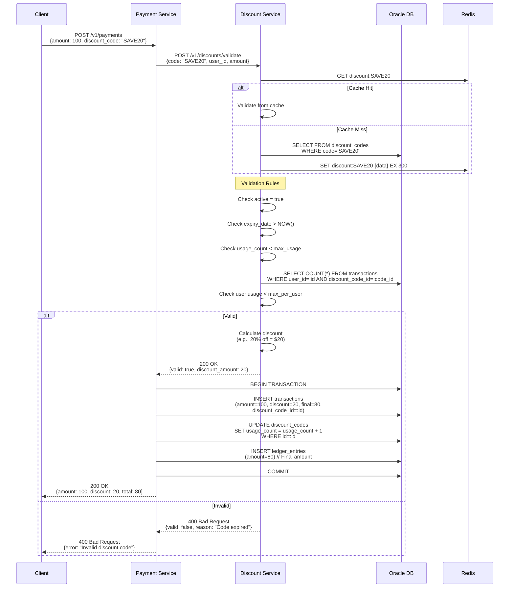
```mermaid
sequenceDiagram
    participant Client
    participant Payment Service
    participant Discount Service
    participant Oracle DB
    participant Redis

    Client->>Payment Service: POST /v1/payments<br/>{amount: 100, discount_code: "SAVE20"}

    Payment Service->>Discount Service: POST /v1/discounts/validate<br/>{code: "SAVE20", user_id, amount}

    Discount Service->>Redis: GET discount:SAVE20

    alt Cache Hit
        Discount Service->>Discount Service: Validate from cache
    else Cache Miss
        Discount Service->>Oracle DB: SELECT FROM discount_codes<br/>WHERE code='SAVE20'
        Discount Service->>Redis: SET discount:SAVE20 {data} EX 300
    end

    Note over Discount Service: Validation Rules
    Discount Service->>Discount Service: Check active = true
    Discount Service->>Discount Service: Check expiry_date > NOW()
    Discount Service->>Discount Service: Check usage_count < max_usage
    Discount Service->>Oracle DB: SELECT COUNT(*) FROM transactions<br/>WHERE user_id=:id AND discount_code_id=:code_id
    Discount Service->>Discount Service: Check user usage < max_per_user

    alt Valid
        Discount Service->>Discount Service: Calculate discount<br/>(e.g., 20% off = $20)
        Discount Service-->>Payment Service: 200 OK<br/>{valid: true, discount_amount: 20}

        Payment Service->>Oracle DB: BEGIN TRANSACTION
        Payment Service->>Oracle DB: INSERT transactions<br/>(amount=100, discount=20, final=80,<br/>discount_code_id=:id)
        Payment Service->>Oracle DB: UPDATE discount_codes<br/>SET usage_count = usage_count + 1<br/>WHERE id=:id
        Payment Service->>Oracle DB: INSERT ledger_entries<br/>(amount=80)  // Final amount
        Payment Service->>Oracle DB: COMMIT

        Payment Service-->>Client: 200 OK<br/>{amount: 100, discount: 20, total: 80}
    else Invalid
        Discount Service-->>Payment Service: 400 Bad Request<br/>{valid: false, reason: "Code expired"}
        Payment Service-->>Client: 400 Bad Request<br/>{error: "Invalid discount code"}
    end
```

---

## 5. Wallet Creation Flow

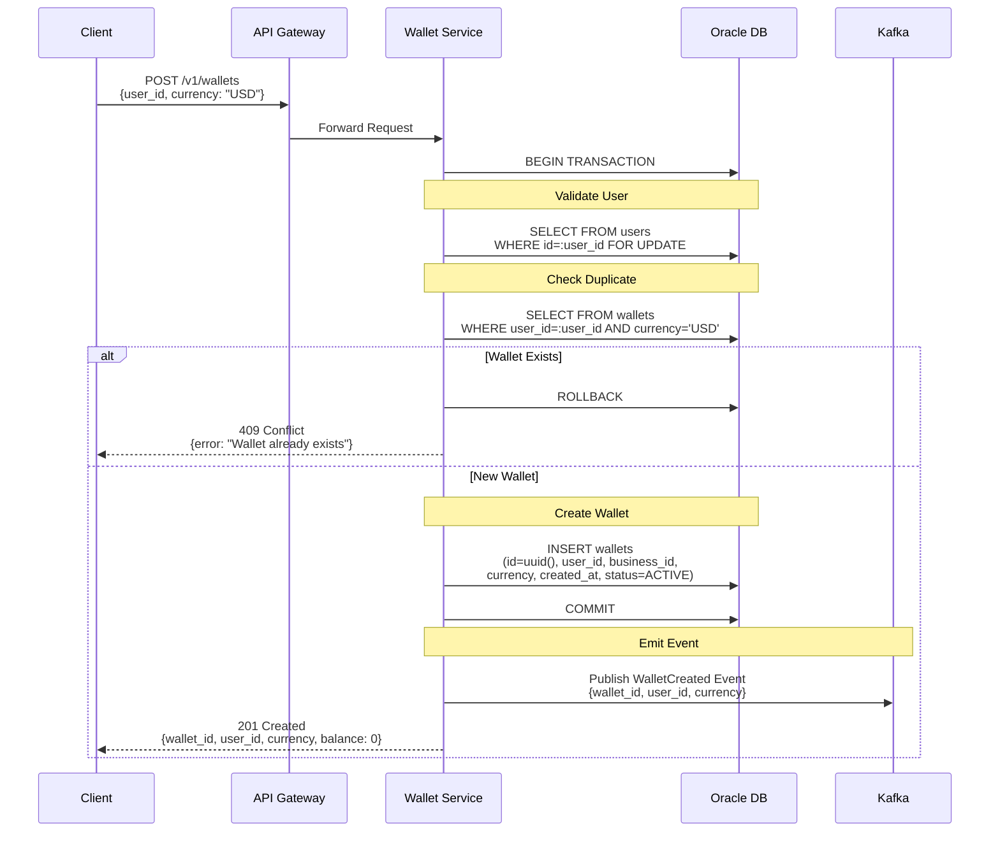
```mermaid
sequenceDiagram
    participant Client
    participant API Gateway
    participant Wallet Service
    participant Oracle DB
    participant Kafka

    Client->>API Gateway: POST /v1/wallets<br/>{user_id, currency: "USD"}
    API Gateway->>Wallet Service: Forward Request

    Wallet Service->>Oracle DB: BEGIN TRANSACTION

    Note over Wallet Service,Oracle DB: Validate User
    Wallet Service->>Oracle DB: SELECT FROM users<br/>WHERE id=:user_id FOR UPDATE

    Note over Wallet Service,Oracle DB: Check Duplicate
    Wallet Service->>Oracle DB: SELECT FROM wallets<br/>WHERE user_id=:user_id AND currency='USD'

    alt Wallet Exists
        Wallet Service->>Oracle DB: ROLLBACK
        Wallet Service-->>Client: 409 Conflict<br/>{error: "Wallet already exists"}
    else New Wallet
        Note over Wallet Service,Oracle DB: Create Wallet
        Wallet Service->>Oracle DB: INSERT wallets<br/>(id=uuid(), user_id, business_id,<br/>currency, created_at, status=ACTIVE)

        Wallet Service->>Oracle DB: COMMIT

        Note over Wallet Service,Kafka: Emit Event
        Wallet Service->>Kafka: Publish WalletCreated Event<br/>{wallet_id, user_id, currency}

        Wallet Service-->>Client: 201 Created<br/>{wallet_id, user_id, currency, balance: 0}
    end
```

---

## 6. Multi-Currency Balance Query Flow

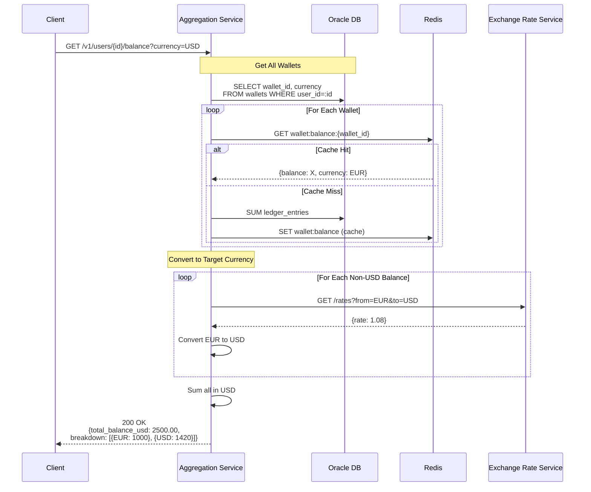
```mermaid
sequenceDiagram
    participant Client
    participant Aggregation Service
    participant Oracle DB
    participant Redis
    participant Exchange Rate Service

    Client->>Aggregation Service: GET /v1/users/{id}/balance?currency=USD

    Note over Aggregation Service,Oracle DB: Get All Wallets
    Aggregation Service->>Oracle DB: SELECT wallet_id, currency<br/>FROM wallets WHERE user_id=:id

    loop For Each Wallet
        Aggregation Service->>Redis: GET wallet:balance:{wallet_id}

        alt Cache Hit
            Redis-->>Aggregation Service: {balance: X, currency: EUR}
        else Cache Miss
            Aggregation Service->>Oracle DB: SUM ledger_entries
            Aggregation Service->>Redis: SET wallet:balance (cache)
        end
    end

    Note over Aggregation Service: Convert to Target Currency

    loop For Each Non-USD Balance
        Aggregation Service->>Exchange Rate Service: GET /rates?from=EUR&to=USD
        Exchange Rate Service-->>Aggregation Service: {rate: 1.08}
        Aggregation Service->>Aggregation Service: Convert EUR to USD
    end

    Aggregation Service->>Aggregation Service: Sum all in USD
    Aggregation Service-->>Client: 200 OK<br/>{total_balance_usd: 2500.00,<br/>breakdown: [{EUR: 1000}, {USD: 1420}]}
```

---

## 7. Idempotency Key Expiration & Cleanup

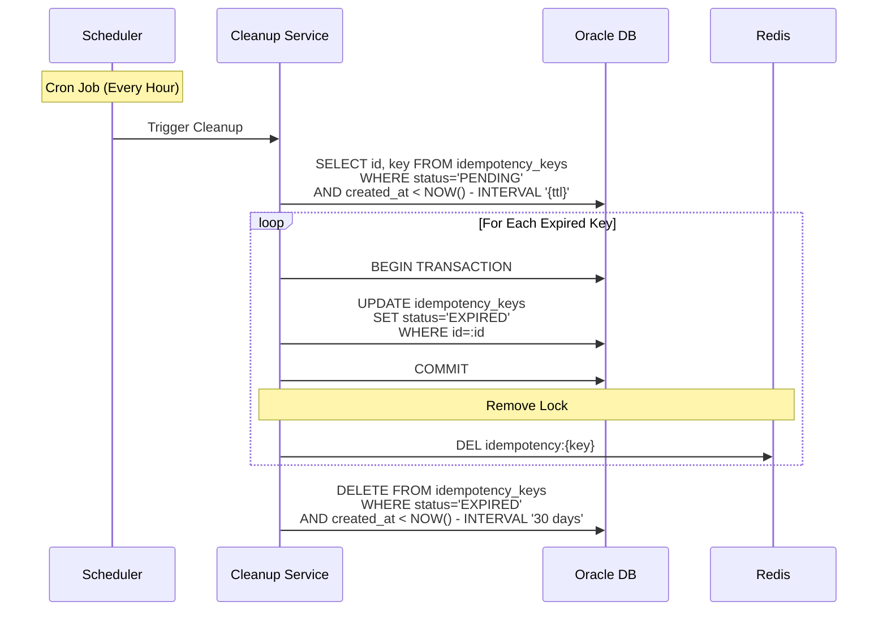
```mermaid
sequenceDiagram
    participant Scheduler
    participant Cleanup Service
    participant Oracle DB
    participant Redis

    Note over Scheduler: Cron Job (Every Hour)
    Scheduler->>Cleanup Service: Trigger Cleanup

    Cleanup Service->>Oracle DB: SELECT id, key FROM idempotency_keys<br/>WHERE status='PENDING'<br/>AND created_at < NOW() - INTERVAL '{ttl}'

    loop For Each Expired Key
        Cleanup Service->>Oracle DB: BEGIN TRANSACTION
        Cleanup Service->>Oracle DB: UPDATE idempotency_keys<br/>SET status='EXPIRED'<br/>WHERE id=:id
        Cleanup Service->>Oracle DB: COMMIT

        Note over Cleanup Service,Redis: Remove Lock
        Cleanup Service->>Redis: DEL idempotency:{key}
    end

    Cleanup Service->>Oracle DB: DELETE FROM idempotency_keys<br/>WHERE status='EXPIRED'<br/>AND created_at < NOW() - INTERVAL '30 days'
```

---

## 8. Discount Code Validation with Eligibility Check

### 8.1 Public Discount Code Flow (ALL_USERS)

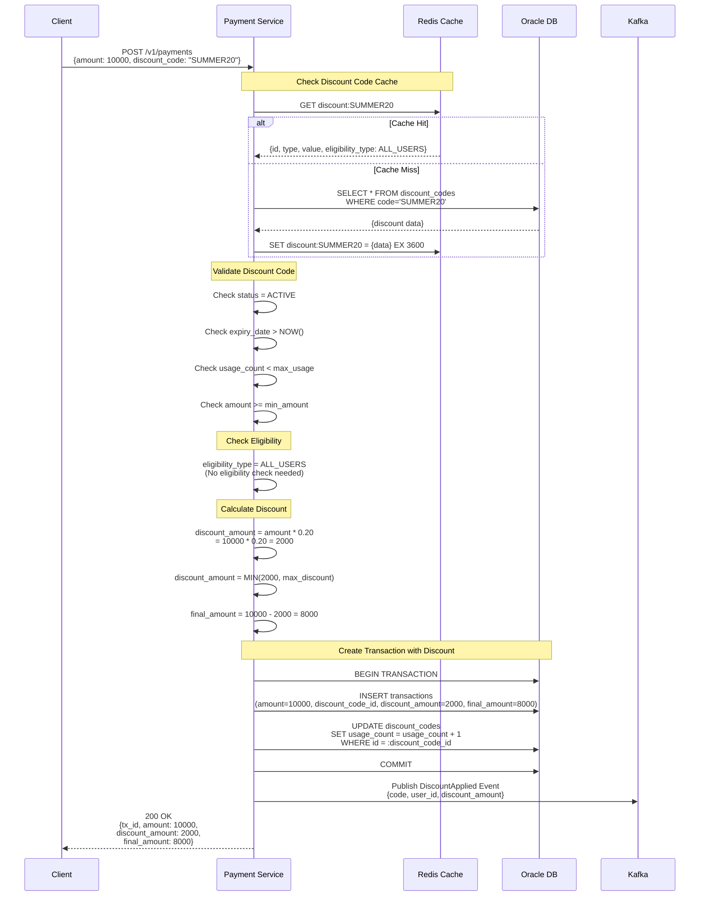
```mermaid
sequenceDiagram
    participant Client
    participant Payment Service
    participant Redis Cache
    participant Oracle DB
    participant Kafka

    Client->>Payment Service: POST /v1/payments<br/>{amount: 10000, discount_code: "SUMMER20"}

    Note over Payment Service,Redis Cache: Check Discount Code Cache
    Payment Service->>Redis Cache: GET discount:SUMMER20

    alt Cache Hit
        Redis Cache-->>Payment Service: {id, type, value, eligibility_type: ALL_USERS}
    else Cache Miss
        Payment Service->>Oracle DB: SELECT * FROM discount_codes<br/>WHERE code='SUMMER20'
        Oracle DB-->>Payment Service: {discount data}
        Payment Service->>Redis Cache: SET discount:SUMMER20 = {data} EX 3600
    end

    Note over Payment Service: Validate Discount Code
    Payment Service->>Payment Service: Check status = ACTIVE
    Payment Service->>Payment Service: Check expiry_date > NOW()
    Payment Service->>Payment Service: Check usage_count < max_usage
    Payment Service->>Payment Service: Check amount >= min_amount

    Note over Payment Service: Check Eligibility
    Payment Service->>Payment Service: eligibility_type = ALL_USERS<br/>(No eligibility check needed)

    Note over Payment Service: Calculate Discount
    Payment Service->>Payment Service: discount_amount = amount * 0.20<br/>= 10000 * 0.20 = 2000
    Payment Service->>Payment Service: discount_amount = MIN(2000, max_discount)
    Payment Service->>Payment Service: final_amount = 10000 - 2000 = 8000

    Note over Payment Service,Oracle DB: Create Transaction with Discount
    Payment Service->>Oracle DB: BEGIN TRANSACTION
    Payment Service->>Oracle DB: INSERT transactions<br/>(amount=10000, discount_code_id, discount_amount=2000, final_amount=8000)
    Payment Service->>Oracle DB: UPDATE discount_codes<br/>SET usage_count = usage_count + 1<br/>WHERE id = :discount_code_id
    Payment Service->>Oracle DB: COMMIT

    Payment Service->>Kafka: Publish DiscountApplied Event<br/>{code, user_id, discount_amount}

    Payment Service-->>Client: 200 OK<br/>{tx_id, amount: 10000,<br/>discount_amount: 2000,<br/>final_amount: 8000}
```

### 8.2 User-Specific Discount Code Flow (RESTRICTED)

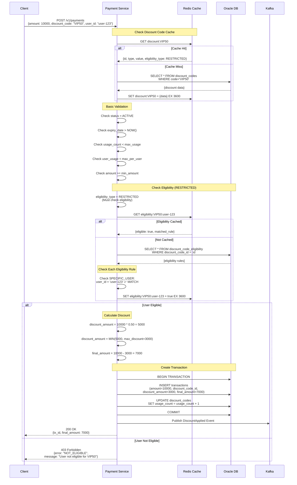
```mermaid
sequenceDiagram
    participant Client
    participant Payment Service
    participant Redis Cache
    participant Oracle DB
    participant Kafka

    Client->>Payment Service: POST /v1/payments<br/>{amount: 10000, discount_code: "VIP50", user_id: "user-123"}

    Note over Payment Service,Redis Cache: Check Discount Code Cache
    Payment Service->>Redis Cache: GET discount:VIP50

    alt Cache Hit
        Redis Cache-->>Payment Service: {id, type, value, eligibility_type: RESTRICTED}
    else Cache Miss
        Payment Service->>Oracle DB: SELECT * FROM discount_codes<br/>WHERE code='VIP50'
        Oracle DB-->>Payment Service: {discount data}
        Payment Service->>Redis Cache: SET discount:VIP50 = {data} EX 3600
    end

    Note over Payment Service: Basic Validation
    Payment Service->>Payment Service: Check status = ACTIVE
    Payment Service->>Payment Service: Check expiry_date > NOW()
    Payment Service->>Payment Service: Check usage_count < max_usage
    Payment Service->>Payment Service: Check user_usage < max_per_user
    Payment Service->>Payment Service: Check amount >= min_amount

    Note over Payment Service,Oracle DB: Check Eligibility (RESTRICTED)
    Payment Service->>Payment Service: eligibility_type = RESTRICTED<br/>(Must check eligibility)

    Payment Service->>Redis Cache: GET eligibility:VIP50:user-123

    alt Eligibility Cached
        Redis Cache-->>Payment Service: {eligible: true, matched_rule}
    else Not Cached
        Payment Service->>Oracle DB: SELECT * FROM discount_code_eligibility<br/>WHERE discount_code_id = :id
        Oracle DB-->>Payment Service: [eligibility rules]

        Note over Payment Service: Check Each Eligibility Rule
        Payment Service->>Payment Service: Check SPECIFIC_USER:<br/>user_id = 'user-123' ✅ MATCH

        Payment Service->>Redis Cache: SET eligibility:VIP50:user-123 = true EX 3600
    end

    alt User Eligible
        Note over Payment Service: Calculate Discount
        Payment Service->>Payment Service: discount_amount = 10000 * 0.50 = 5000
        Payment Service->>Payment Service: discount_amount = MIN(5000, max_discount=3000)
        Payment Service->>Payment Service: final_amount = 10000 - 3000 = 7000

        Note over Payment Service,Oracle DB: Create Transaction
        Payment Service->>Oracle DB: BEGIN TRANSACTION
        Payment Service->>Oracle DB: INSERT transactions<br/>(amount=10000, discount_code_id,<br/>discount_amount=3000, final_amount=7000)
        Payment Service->>Oracle DB: UPDATE discount_codes<br/>SET usage_count = usage_count + 1
        Payment Service->>Oracle DB: COMMIT

        Payment Service->>Kafka: Publish DiscountApplied Event

        Payment Service-->>Client: 200 OK<br/>{tx_id, final_amount: 7000}
    else User Not Eligible
        Payment Service-->>Client: 403 Forbidden<br/>{error: "NOT_ELIGIBLE",<br/>message: "User not eligible for VIP50"}
    end
```

### 8.3 Business-Specific Discount Code Flow

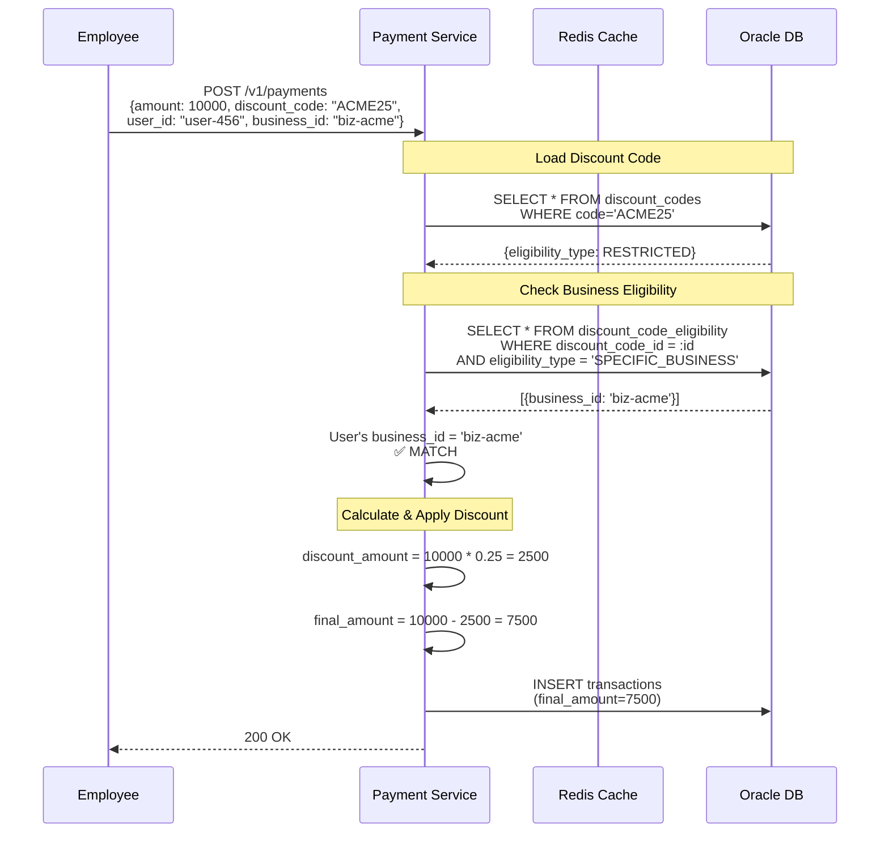
```mermaid
sequenceDiagram
    participant Employee
    participant Payment Service
    participant Redis Cache
    participant Oracle DB

    Employee->>Payment Service: POST /v1/payments<br/>{amount: 10000, discount_code: "ACME25",<br/>user_id: "user-456", business_id: "biz-acme"}

    Note over Payment Service,Oracle DB: Load Discount Code
    Payment Service->>Oracle DB: SELECT * FROM discount_codes<br/>WHERE code='ACME25'
    Oracle DB-->>Payment Service: {eligibility_type: RESTRICTED}

    Note over Payment Service,Oracle DB: Check Business Eligibility
    Payment Service->>Oracle DB: SELECT * FROM discount_code_eligibility<br/>WHERE discount_code_id = :id<br/>AND eligibility_type = 'SPECIFIC_BUSINESS'
    Oracle DB-->>Payment Service: [{business_id: 'biz-acme'}]

    Payment Service->>Payment Service: User's business_id = 'biz-acme'<br/>✅ MATCH

    Note over Payment Service: Calculate & Apply Discount
    Payment Service->>Payment Service: discount_amount = 10000 * 0.25 = 2500
    Payment Service->>Payment Service: final_amount = 10000 - 2500 = 7500

    Payment Service->>Oracle DB: INSERT transactions<br/>(final_amount=7500)
    Payment Service-->>Employee: 200 OK
```

### 8.4 Email Domain Discount Code Flow

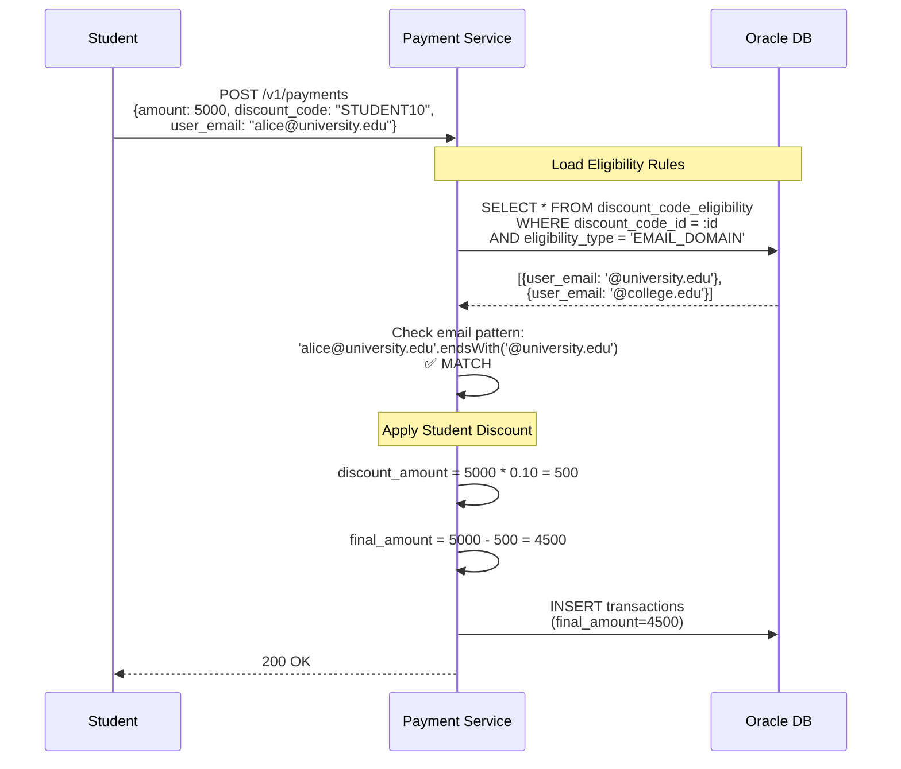
```mermaid
sequenceDiagram
    participant Student
    participant Payment Service
    participant Oracle DB

    Student->>Payment Service: POST /v1/payments<br/>{amount: 5000, discount_code: "STUDENT10",<br/>user_email: "alice@university.edu"}

    Note over Payment Service,Oracle DB: Load Eligibility Rules
    Payment Service->>Oracle DB: SELECT * FROM discount_code_eligibility<br/>WHERE discount_code_id = :id<br/>AND eligibility_type = 'EMAIL_DOMAIN'
    Oracle DB-->>Payment Service: [{user_email: '@university.edu'},<br/>{user_email: '@college.edu'}]

    Payment Service->>Payment Service: Check email pattern:<br/>'alice@university.edu'.endsWith('@university.edu')<br/>✅ MATCH

    Note over Payment Service: Apply Student Discount
    Payment Service->>Payment Service: discount_amount = 5000 * 0.10 = 500
    Payment Service->>Payment Service: final_amount = 5000 - 500 = 4500

    Payment Service->>Oracle DB: INSERT transactions<br/>(final_amount=4500)
    Payment Service-->>Student: 200 OK
```

### 8.5 Discount Code Usage Limit Enforcement

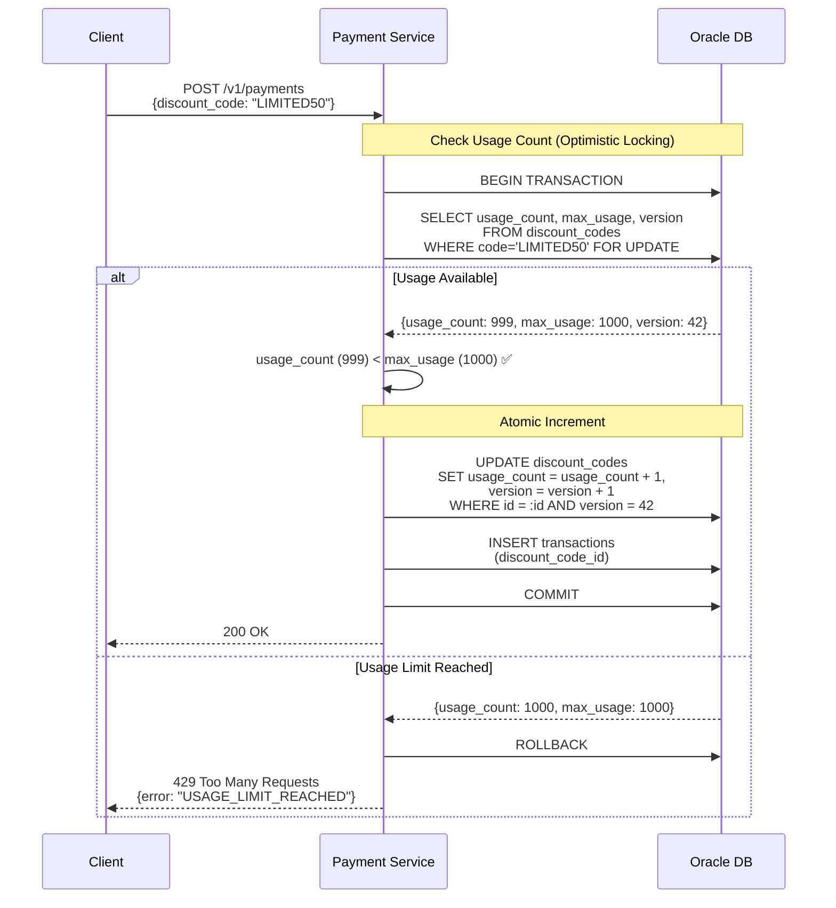
```mermaid
sequenceDiagram
    participant Client
    participant Payment Service
    participant Oracle DB

    Client->>Payment Service: POST /v1/payments<br/>{discount_code: "LIMITED50"}

    Note over Payment Service,Oracle DB: Check Usage Count (Optimistic Locking)
    Payment Service->>Oracle DB: BEGIN TRANSACTION
    Payment Service->>Oracle DB: SELECT usage_count, max_usage, version<br/>FROM discount_codes<br/>WHERE code='LIMITED50' FOR UPDATE

    alt Usage Available
        Oracle DB-->>Payment Service: {usage_count: 999, max_usage: 1000, version: 42}

        Payment Service->>Payment Service: usage_count (999) < max_usage (1000) ✅

        Note over Payment Service,Oracle DB: Atomic Increment
        Payment Service->>Oracle DB: UPDATE discount_codes<br/>SET usage_count = usage_count + 1,<br/>version = version + 1<br/>WHERE id = :id AND version = 42

        Payment Service->>Oracle DB: INSERT transactions<br/>(discount_code_id)
        Payment Service->>Oracle DB: COMMIT

        Payment Service-->>Client: 200 OK
    else Usage Limit Reached
        Oracle DB-->>Payment Service: {usage_count: 1000, max_usage: 1000}

        Payment Service->>Oracle DB: ROLLBACK
        Payment Service-->>Client: 429 Too Many Requests<br/>{error: "USAGE_LIMIT_REACHED"}
    end
```

### 8.6 Rollback with Discount Code Usage Restoration

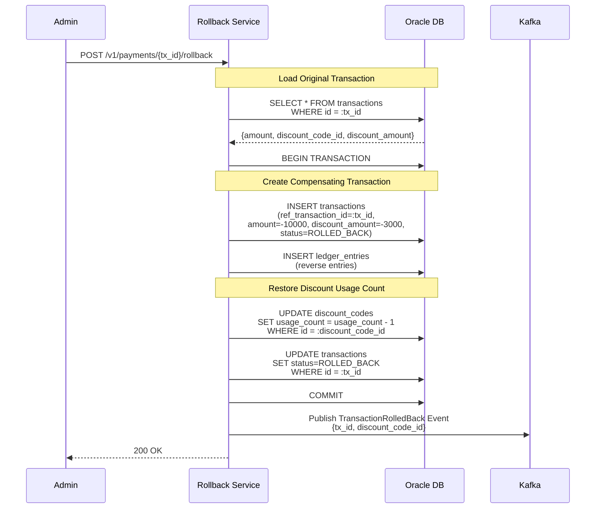
```mermaid
sequenceDiagram
    participant Admin
    participant Rollback Service
    participant Oracle DB
    participant Kafka

    Admin->>Rollback Service: POST /v1/payments/{tx_id}/rollback

    Note over Rollback Service,Oracle DB: Load Original Transaction
    Rollback Service->>Oracle DB: SELECT * FROM transactions<br/>WHERE id = :tx_id
    Oracle DB-->>Rollback Service: {amount, discount_code_id, discount_amount}

    Rollback Service->>Oracle DB: BEGIN TRANSACTION

    Note over Rollback Service,Oracle DB: Create Compensating Transaction
    Rollback Service->>Oracle DB: INSERT transactions<br/>(ref_transaction_id=:tx_id,<br/>amount=-10000, discount_amount=-3000,<br/>status=ROLLED_BACK)

    Rollback Service->>Oracle DB: INSERT ledger_entries<br/>(reverse entries)

    Note over Rollback Service,Oracle DB: Restore Discount Usage Count
    Rollback Service->>Oracle DB: UPDATE discount_codes<br/>SET usage_count = usage_count - 1<br/>WHERE id = :discount_code_id

    Rollback Service->>Oracle DB: UPDATE transactions<br/>SET status=ROLLED_BACK<br/>WHERE id = :tx_id

    Rollback Service->>Oracle DB: COMMIT

    Rollback Service->>Kafka: Publish TransactionRolledBack Event<br/>{tx_id, discount_code_id}

    Rollback Service-->>Admin: 200 OK
```

---

## Performance Characteristics

| Flow | Latency (p95) | Throughput | Bottleneck |
|------|---------------|------------|------------|
| **Payment Processing** | < 100ms | 10,000 TPS | Database writes |
| **Cached Balance Query** | < 10ms | 100,000 TPS | Redis throughput |
| **Computed Balance** | < 50ms | 5,000 TPS | Database aggregation |
| **Rollback** | < 200ms | 1,000 TPS | Multi-table updates |
| **Discount Validation** | < 20ms | 50,000 TPS | Redis cache |
| **Wallet Creation** | < 30ms | 10,000 TPS | Database inserts |

---

## Next Steps

- Review [Domain Model](../02-domain-model/entity-relationships.md) for database schema
- See [API Specification](../03-api-specification/payment-apis.md) for endpoint details
- Explore [Idempotency Pattern](../06-design-patterns/idempotency-deduplication.md) for implementation details
