# Data Flows

## Overview

This document details the complete data flows for all critical operations in the Wallet Service, including payment processing, rollback handling, balance aggregation, and idempotency management.

---

## 1. Payment Processing Flow

### 1.1 Standard Payment (Happy Path)

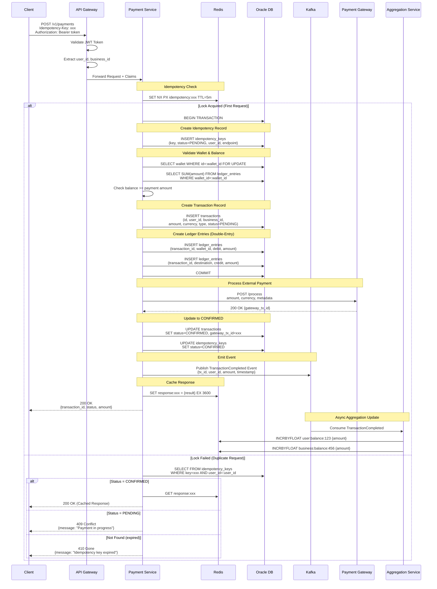

### 1.2 Payment Type-Specific Flows

#### PREPAYMENT Flow
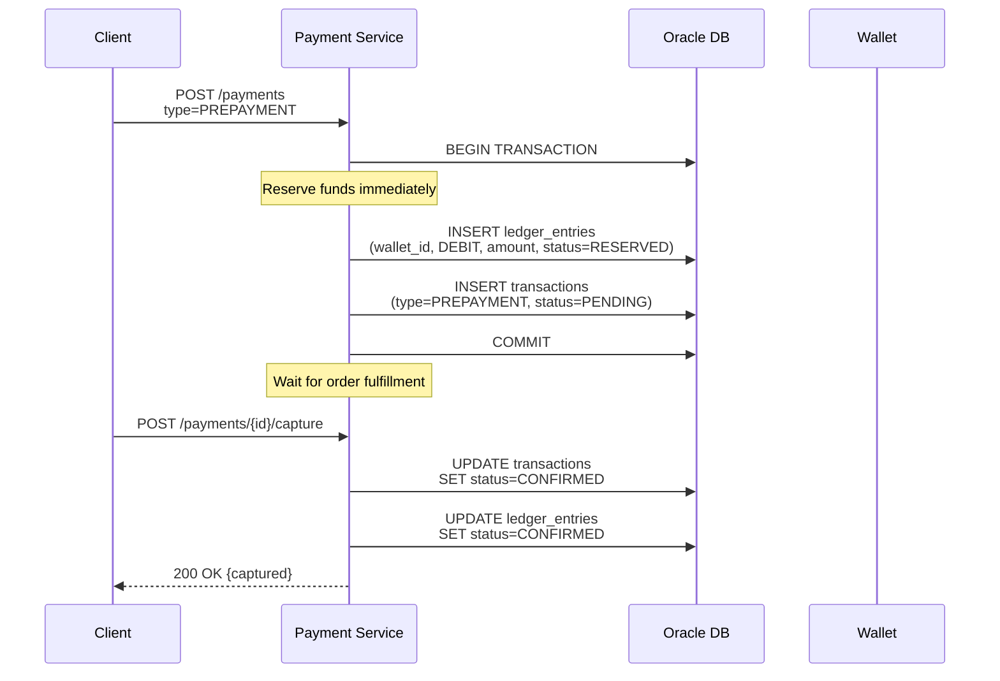

#### POSTPAYMENT Flow
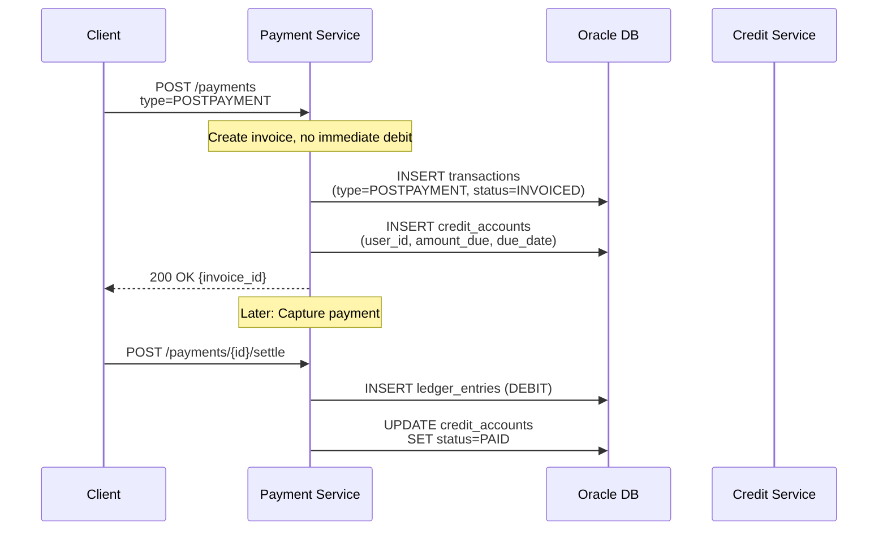

#### VALUABLE (High-Value) Flow
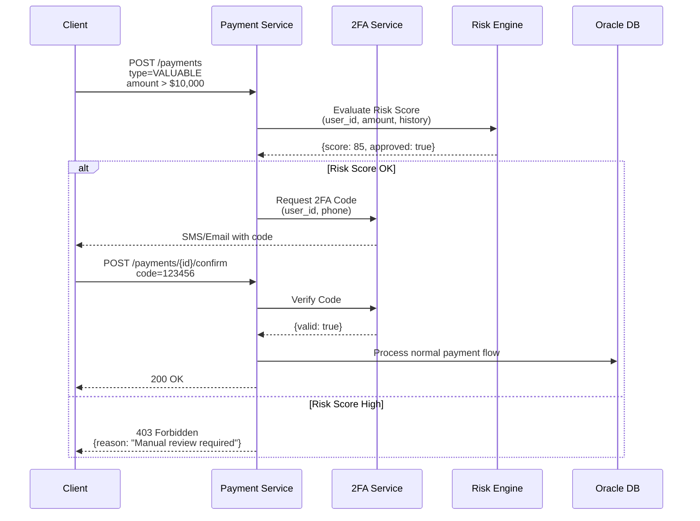

#### CREDIT (Installment) Flow
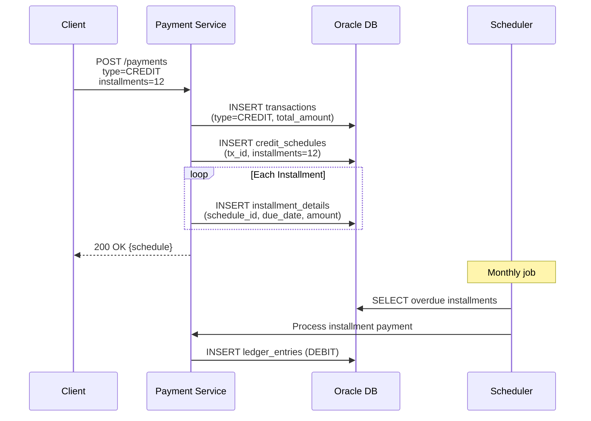

---

## 2. Payment Rollback Flow

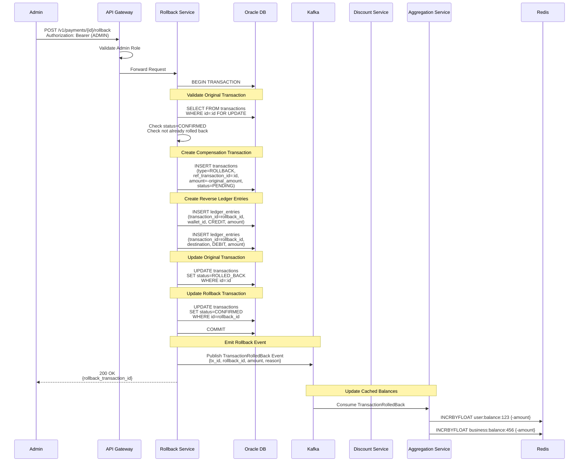

---

## 3. Balance Aggregation Flow

### 3.1 Cached Balance Query (Fast Path)

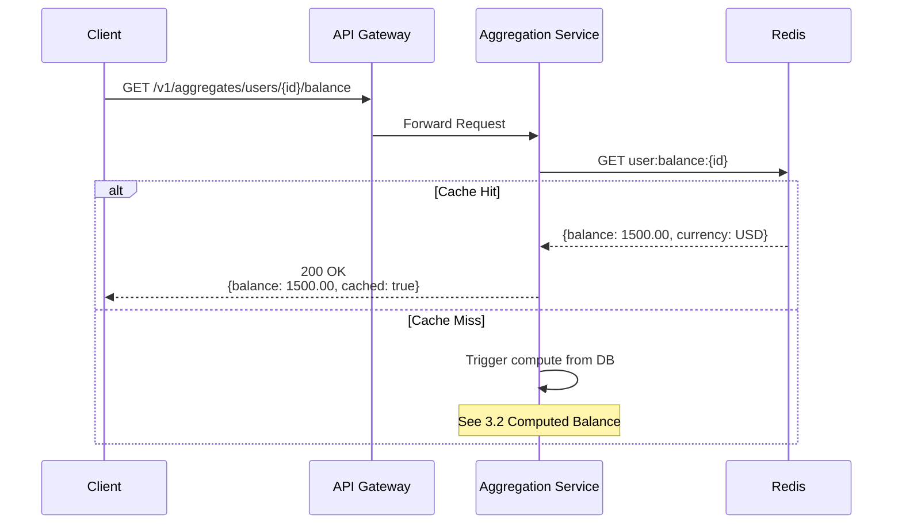

### 3.2 Computed Balance Query (Slow Path)

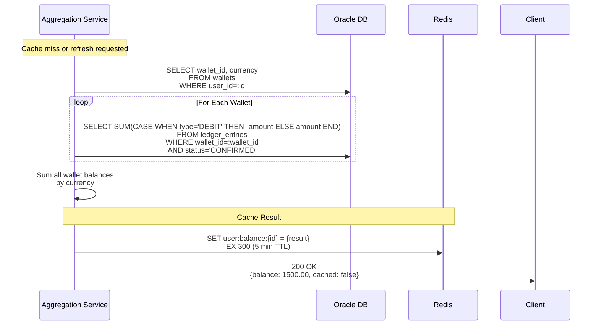

### 3.3 Event-Driven Aggregation Update

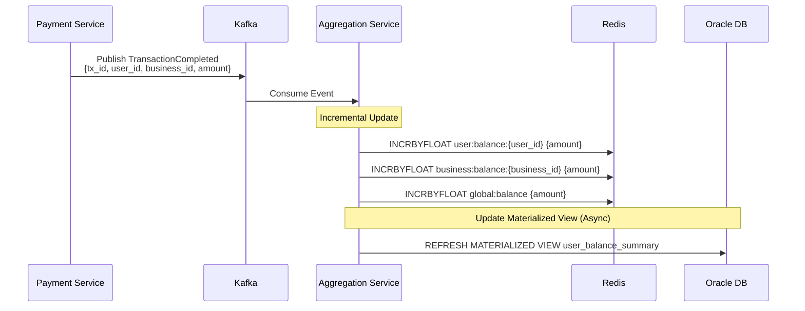

---

## 4. Wallet Creation Flow

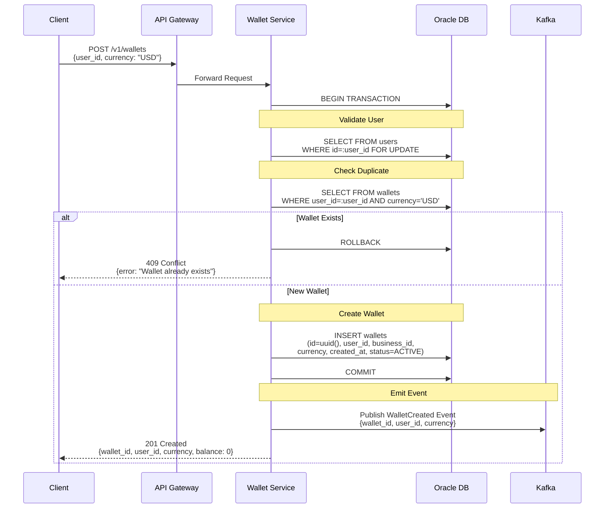

---

## 5. Multi-Currency Balance Query Flow

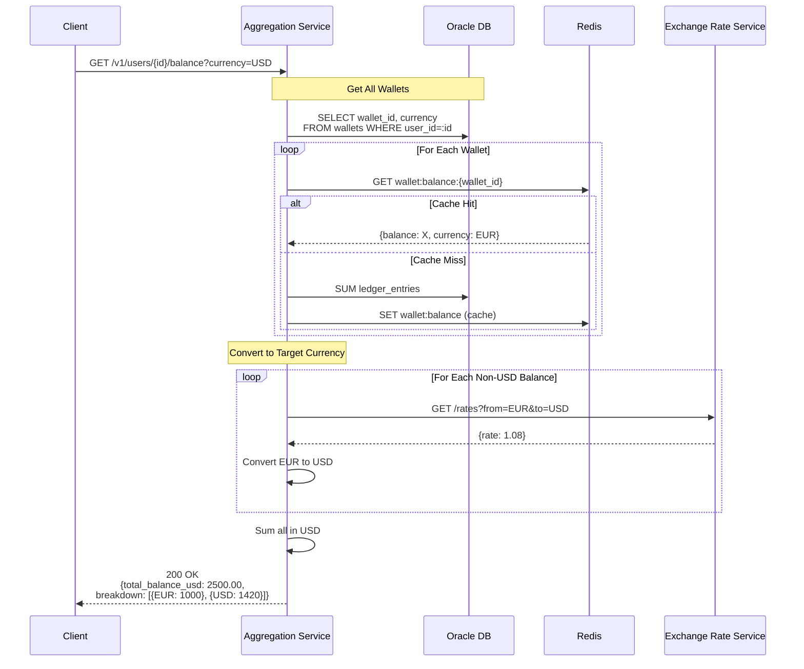

---

## 6. Idempotency Key Expiration & Cleanup

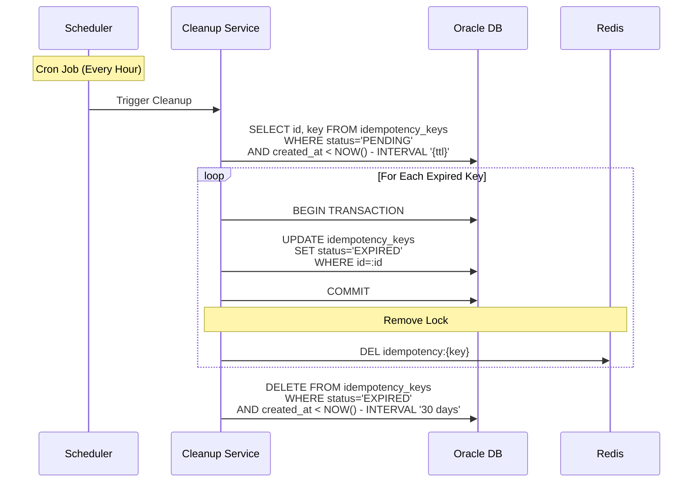

---

## Performance Characteristics

| Flow | Latency (p95) | Throughput | Bottleneck |
|------|---------------|------------|------------|
| **Payment Processing** | < 100ms | 10,000 TPS | Database writes |
| **Cached Balance Query** | < 10ms | 100,000 TPS | Redis throughput |
| **Computed Balance** | < 50ms | 5,000 TPS | Database aggregation |
| **Rollback** | < 200ms | 1,000 TPS | Multi-table updates |
| **Discount Validation** | < 20ms | 50,000 TPS | Redis cache |
| **Wallet Creation** | < 30ms | 10,000 TPS | Database inserts |

---

## Next Steps

- Review [Domain Model](../02-domain-model/entity-relationships.md) for database schema
- See [API Specification](../03-api-specification/payment-apis.md) for endpoint details
- Explore [Idempotency Pattern](../06-design-patterns/idempotency-deduplication.md) for implementation details
