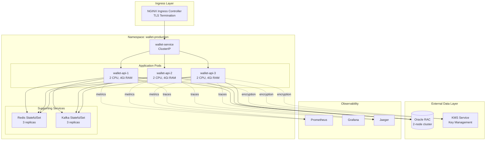
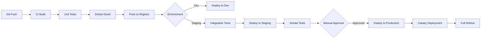

# Deployment Architecture

## Overview

The Wallet Service is deployed on Kubernetes to provide high availability, horizontal scalability, and operational excellence. The deployment follows cloud-native best practices with multi-zone redundancy, automated scaling, and comprehensive observability.

---

## Kubernetes Topology



---

## Infrastructure Components

### 1. Kubernetes Cluster

**Configuration**:
- **Provider**: AWS EKS / GCP GKE / Azure AKS
- **Version**: 1.28+
- **Node Type**: Compute-optimized instances (c5.2xlarge or equivalent)
- **Cluster Size**: 6-12 nodes (auto-scaling)
- **Availability Zones**: 3 AZs for high availability

**Node Pool Configuration**:
```yaml
apiVersion: v1
kind: NodePool
metadata:
  name: wallet-service-pool
spec:
  minSize: 6
  maxSize: 12
  instanceType: c5.2xlarge
  diskSize: 100Gi
  labels:
    workload: wallet-service
  taints:
    - key: dedicated
      value: wallet-service
      effect: NoSchedule
```

---

### 2. Application Deployment

**Deployment Manifest**:
```yaml
apiVersion: apps/v1
kind: Deployment
metadata:
  name: wallet-service
  namespace: wallet-production
  labels:
    app: wallet-service
    version: v1
spec:
  replicas: 3
  strategy:
    type: RollingUpdate
    rollingUpdate:
      maxSurge: 1
      maxUnavailable: 0
  selector:
    matchLabels:
      app: wallet-service
  template:
    metadata:
      labels:
        app: wallet-service
        version: v1
      annotations:
        prometheus.io/scrape: "true"
        prometheus.io/port: "8080"
        prometheus.io/path: "/actuator/prometheus"
    spec:
      serviceAccountName: wallet-service
      affinity:
        podAntiAffinity:
          requiredDuringSchedulingIgnoredDuringExecution:
            - labelSelector:
                matchExpressions:
                  - key: app
                    operator: In
                    values:
                      - wallet-service
              topologyKey: topology.kubernetes.io/zone
      containers:
        - name: wallet-service
          image: wallet-service:1.0.0
          imagePullPolicy: IfNotPresent
          ports:
            - name: http
              containerPort: 8080
              protocol: TCP
            - name: actuator
              containerPort: 8081
              protocol: TCP
          env:
            - name: SPRING_PROFILES_ACTIVE
              value: production
            - name: JAVA_OPTS
              value: "-Xms4g -Xmx4g -XX:+UseG1GC -XX:MaxGCPauseMillis=200"
            - name: ORACLE_URL
              valueFrom:
                secretKeyRef:
                  name: wallet-db-secret
                  key: url
            - name: ORACLE_USERNAME
              valueFrom:
                secretKeyRef:
                  name: wallet-db-secret
                  key: username
            - name: ORACLE_PASSWORD
              valueFrom:
                secretKeyRef:
                  name: wallet-db-secret
                  key: password
            - name: REDIS_CLUSTER_NODES
              valueFrom:
                configMapKeyRef:
                  name: wallet-config
                  key: redis-nodes
            - name: KAFKA_BOOTSTRAP_SERVERS
              valueFrom:
                configMapKeyRef:
                  name: wallet-config
                  key: kafka-servers
          resources:
            requests:
              cpu: "1000m"
              memory: "2Gi"
            limits:
              cpu: "2000m"
              memory: "4Gi"
          livenessProbe:
            httpGet:
              path: /actuator/health/liveness
              port: actuator
            initialDelaySeconds: 60
            periodSeconds: 10
            timeoutSeconds: 5
            failureThreshold: 3
          readinessProbe:
            httpGet:
              path: /actuator/health/readiness
              port: actuator
            initialDelaySeconds: 30
            periodSeconds: 5
            timeoutSeconds: 3
            failureThreshold: 3
          volumeMounts:
            - name: config
              mountPath: /config
              readOnly: true
            - name: secrets
              mountPath: /secrets
              readOnly: true
      volumes:
        - name: config
          configMap:
            name: wallet-config
        - name: secrets
          secret:
            secretName: wallet-secrets
```

---

### 3. Service Configuration

**ClusterIP Service** (Internal):
```yaml
apiVersion: v1
kind: Service
metadata:
  name: wallet-service
  namespace: wallet-production
  labels:
    app: wallet-service
spec:
  type: ClusterIP
  selector:
    app: wallet-service
  ports:
    - name: http
      port: 80
      targetPort: 8080
      protocol: TCP
    - name: actuator
      port: 8081
      targetPort: 8081
      protocol: TCP
  sessionAffinity: None
```

**Ingress Configuration**:
```yaml
apiVersion: networking.k8s.io/v1
kind: Ingress
metadata:
  name: wallet-ingress
  namespace: wallet-production
  annotations:
    cert-manager.io/cluster-issuer: letsencrypt-prod
    nginx.ingress.kubernetes.io/ssl-redirect: "true"
    nginx.ingress.kubernetes.io/force-ssl-redirect: "true"
    nginx.ingress.kubernetes.io/backend-protocol: "HTTP"
    nginx.ingress.kubernetes.io/rate-limit: "100"
    nginx.ingress.kubernetes.io/configuration-snippet: |
      more_set_headers "X-Content-Type-Options: nosniff";
      more_set_headers "X-Frame-Options: DENY";
      more_set_headers "X-XSS-Protection: 1; mode=block";
spec:
  ingressClassName: nginx
  tls:
    - hosts:
        - api.wallet-service.com
      secretName: wallet-tls-cert
  rules:
    - host: api.wallet-service.com
      http:
        paths:
          - path: /
            pathType: Prefix
            backend:
              service:
                name: wallet-service
                port:
                  number: 80
```

---

### 4. Horizontal Pod Autoscaler (HPA)

```yaml
apiVersion: autoscaling/v2
kind: HorizontalPodAutoscaler
metadata:
  name: wallet-service-hpa
  namespace: wallet-production
spec:
  scaleTargetRef:
    apiVersion: apps/v1
    kind: Deployment
    name: wallet-service
  minReplicas: 3
  maxReplicas: 20
  metrics:
    - type: Resource
      resource:
        name: cpu
        target:
          type: Utilization
          averageUtilization: 70
    - type: Resource
      resource:
        name: memory
        target:
          type: Utilization
          averageUtilization: 80
    - type: Pods
      pods:
        metric:
          name: http_requests_per_second
        target:
          type: AverageValue
          averageValue: "1000"
  behavior:
    scaleDown:
      stabilizationWindowSeconds: 300
      policies:
        - type: Percent
          value: 10
          periodSeconds: 60
    scaleUp:
      stabilizationWindowSeconds: 0
      policies:
        - type: Percent
          value: 50
          periodSeconds: 30
        - type: Pods
          value: 2
          periodSeconds: 30
      selectPolicy: Max
```

---

### 5. Redis StatefulSet

```yaml
apiVersion: apps/v1
kind: StatefulSet
metadata:
  name: redis
  namespace: wallet-production
spec:
  serviceName: redis
  replicas: 3
  selector:
    matchLabels:
      app: redis
  template:
    metadata:
      labels:
        app: redis
    spec:
      containers:
        - name: redis
          image: redis:7-alpine
          ports:
            - containerPort: 6379
              name: redis
          volumeMounts:
            - name: redis-data
              mountPath: /data
          resources:
            requests:
              cpu: "500m"
              memory: "1Gi"
            limits:
              cpu: "1000m"
              memory: "2Gi"
  volumeClaimTemplates:
    - metadata:
        name: redis-data
      spec:
        accessModes: ["ReadWriteOnce"]
        storageClassName: fast-ssd
        resources:
          requests:
            storage: 50Gi
```

---

### 6. Kafka StatefulSet

```yaml
apiVersion: apps/v1
kind: StatefulSet
metadata:
  name: kafka
  namespace: wallet-production
spec:
  serviceName: kafka
  replicas: 3
  selector:
    matchLabels:
      app: kafka
  template:
    metadata:
      labels:
        app: kafka
    spec:
      containers:
        - name: kafka
          image: confluentinc/cp-kafka:7.5.0
          ports:
            - containerPort: 9092
              name: kafka
          env:
            - name: KAFKA_BROKER_ID
              valueFrom:
                fieldRef:
                  fieldPath: metadata.name
            - name: KAFKA_ZOOKEEPER_CONNECT
              value: "zookeeper:2181"
            - name: KAFKA_ADVERTISED_LISTENERS
              value: "PLAINTEXT://$(POD_NAME).kafka:9092"
            - name: KAFKA_OFFSETS_TOPIC_REPLICATION_FACTOR
              value: "3"
            - name: KAFKA_TRANSACTION_STATE_LOG_REPLICATION_FACTOR
              value: "3"
            - name: KAFKA_TRANSACTION_STATE_LOG_MIN_ISR
              value: "2"
          volumeMounts:
            - name: kafka-data
              mountPath: /var/lib/kafka/data
          resources:
            requests:
              cpu: "1000m"
              memory: "2Gi"
            limits:
              cpu: "2000m"
              memory: "4Gi"
  volumeClaimTemplates:
    - metadata:
        name: kafka-data
      spec:
        accessModes: ["ReadWriteOnce"]
        storageClassName: fast-ssd
        resources:
          requests:
            storage: 100Gi
```

---

## Configuration Management

### ConfigMap

```yaml
apiVersion: v1
kind: ConfigMap
metadata:
  name: wallet-config
  namespace: wallet-production
data:
  application.yaml: |
    server:
      port: 8080
      shutdown: graceful
    spring:
      application:
        name: wallet-service
      jpa:
        show-sql: false
        hibernate:
          ddl-auto: validate
      redis:
        cluster:
          nodes: redis-0.redis:6379,redis-1.redis:6379,redis-2.redis:6379
      kafka:
        bootstrap-servers: kafka-0.kafka:9092,kafka-1.kafka:9092,kafka-2.kafka:9092
    wallet:
      idempotency:
        ttl:
          prepayment: 5m
          postpayment: 30m
          valuable: 24h
          credit: 24h
      payment:
        gateway:
          url: https://gateway.payment-provider.com
          timeout: 5s
          retry:
            max-attempts: 3
            backoff: 1s
```

### Secrets

```yaml
apiVersion: v1
kind: Secret
metadata:
  name: wallet-db-secret
  namespace: wallet-production
type: Opaque
data:
  url: <base64-encoded-oracle-jdbc-url>
  username: <base64-encoded-username>
  password: <base64-encoded-password>
---
apiVersion: v1
kind: Secret
metadata:
  name: wallet-secrets
  namespace: wallet-production
type: Opaque
data:
  oauth-client-secret: <base64-encoded-secret>
  kms-key-id: <base64-encoded-key-id>
  payment-gateway-api-key: <base64-encoded-api-key>
```

---

## Network Policies

```yaml
apiVersion: networking.k8s.io/v1
kind: NetworkPolicy
metadata:
  name: wallet-service-network-policy
  namespace: wallet-production
spec:
  podSelector:
    matchLabels:
      app: wallet-service
  policyTypes:
    - Ingress
    - Egress
  ingress:
    - from:
        - namespaceSelector:
            matchLabels:
              name: ingress-nginx
      ports:
        - protocol: TCP
          port: 8080
    - from:
        - namespaceSelector:
            matchLabels:
              name: monitoring
      ports:
        - protocol: TCP
          port: 8081
  egress:
    - to:
        - podSelector:
            matchLabels:
              app: redis
      ports:
        - protocol: TCP
          port: 6379
    - to:
        - podSelector:
            matchLabels:
              app: kafka
      ports:
        - protocol: TCP
          port: 9092
    - to:
        - namespaceSelector: {}
      ports:
        - protocol: TCP
          port: 1521  # Oracle
    - to:
        - namespaceSelector: {}
      ports:
        - protocol: TCP
          port: 443  # External HTTPS
```

---

## Resource Quotas

```yaml
apiVersion: v1
kind: ResourceQuota
metadata:
  name: wallet-production-quota
  namespace: wallet-production
spec:
  hard:
    requests.cpu: "50"
    requests.memory: "100Gi"
    limits.cpu: "100"
    limits.memory: "200Gi"
    persistentvolumeclaims: "20"
    services.loadbalancers: "2"
```

---

## Pod Disruption Budget

```yaml
apiVersion: policy/v1
kind: PodDisruptionBudget
metadata:
  name: wallet-service-pdb
  namespace: wallet-production
spec:
  minAvailable: 2
  selector:
    matchLabels:
      app: wallet-service
```

---

## Monitoring & Observability

### ServiceMonitor (Prometheus Operator)

```yaml
apiVersion: monitoring.coreos.com/v1
kind: ServiceMonitor
metadata:
  name: wallet-service
  namespace: wallet-production
  labels:
    app: wallet-service
spec:
  selector:
    matchLabels:
      app: wallet-service
  endpoints:
    - port: actuator
      path: /actuator/prometheus
      interval: 15s
```

### Grafana Dashboard ConfigMap

```yaml
apiVersion: v1
kind: ConfigMap
metadata:
  name: wallet-dashboard
  namespace: monitoring
data:
  wallet-dashboard.json: |
    {
      "dashboard": {
        "title": "Wallet Service Metrics",
        "panels": [
          {
            "title": "Request Rate",
            "targets": [
              {
                "expr": "rate(http_server_requests_seconds_count{app=\"wallet-service\"}[5m])"
              }
            ]
          },
          {
            "title": "Payment Processing Latency (p95)",
            "targets": [
              {
                "expr": "histogram_quantile(0.95, rate(wallet_payments_duration_seconds_bucket[5m]))"
              }
            ]
          }
        ]
      }
    }
```

---

## Multi-Environment Strategy

### Environment Isolation

| Environment | Namespace | Replicas | Resources | Purpose |
|------------|-----------|----------|-----------|---------|
| **Development** | `wallet-dev` | 1 | 0.5 CPU, 1Gi RAM | Local testing |
| **Staging** | `wallet-staging` | 2 | 1 CPU, 2Gi RAM | Pre-production testing |
| **Production** | `wallet-production` | 3-20 (HPA) | 2 CPU, 4Gi RAM | Live traffic |

### GitOps with ArgoCD

```yaml
apiVersion: argoproj.io/v1alpha1
kind: Application
metadata:
  name: wallet-service-production
  namespace: argocd
spec:
  project: wallet
  source:
    repoURL: https://github.com/company/wallet-service-k8s
    targetRevision: main
    path: overlays/production
  destination:
    server: https://kubernetes.default.svc
    namespace: wallet-production
  syncPolicy:
    automated:
      prune: true
      selfHeal: true
    syncOptions:
      - CreateNamespace=true
```

---

## Disaster Recovery

### Backup Strategy

**Velero Backup Schedule**:
```yaml
apiVersion: velero.io/v1
kind: Schedule
metadata:
  name: wallet-daily-backup
  namespace: velero
spec:
  schedule: "0 2 * * *"  # 2 AM daily
  template:
    includedNamespaces:
      - wallet-production
    ttl: 720h0m0s  # 30 days
    storageLocation: aws-s3-backup
```

### Failover Procedure

1. **Automated Failover**: Oracle Data Guard automatic failover (< 5 minutes)
2. **Application Recovery**: Kubernetes redeploys pods in healthy AZs
3. **Data Validation**: Verify database integrity and replication lag
4. **Traffic Resumption**: DNS failover to standby region (if multi-region)

---

## Deployment Pipeline



### Canary Deployment

```yaml
apiVersion: flagger.app/v1beta1
kind: Canary
metadata:
  name: wallet-service
  namespace: wallet-production
spec:
  targetRef:
    apiVersion: apps/v1
    kind: Deployment
    name: wallet-service
  service:
    port: 80
  analysis:
    interval: 1m
    threshold: 5
    maxWeight: 50
    stepWeight: 10
    metrics:
      - name: request-success-rate
        thresholdRange:
          min: 99
        interval: 1m
      - name: request-duration
        thresholdRange:
          max: 500
        interval: 1m
```

---

## Cost Optimization

| Strategy | Implementation | Savings |
|----------|----------------|---------|
| **Spot Instances** | Use spot instances for non-critical workloads | 60-70% |
| **Right-Sizing** | Monitor actual usage and adjust requests/limits | 20-30% |
| **Cluster Autoscaler** | Scale down during off-peak hours | 15-25% |
| **Reserved Instances** | 1-year commitment for baseline capacity | 30-40% |

---

## Next Steps

- Review [Data Flows](./data-flows.md) for request/response patterns
- See [Monitoring & Alerting](../05-operations/monitoring-alerting.md) for observability setup
- Explore [Disaster Recovery](../05-operations/disaster-recovery.md) for detailed failover procedures
