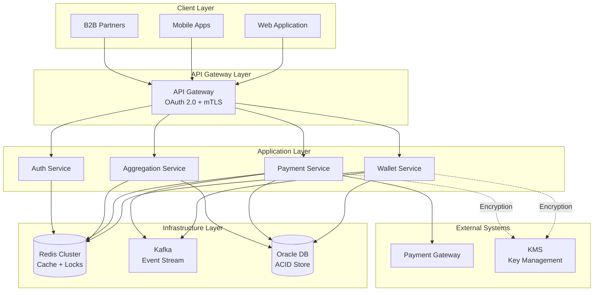
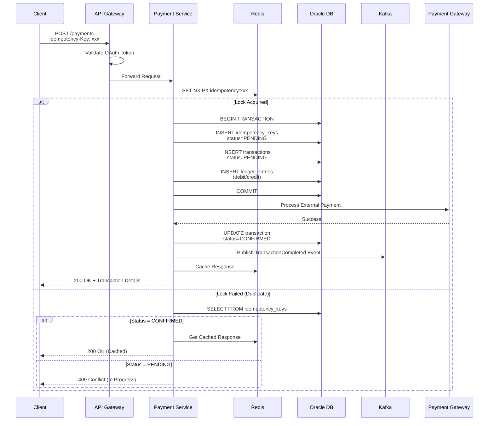
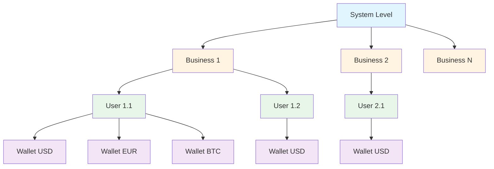

# System Overview

## Introduction

The Wallet Service is an enterprise-grade financial platform designed to support complex multi-tenant environments with both B2B (Business-to-Business) and B2C (Business-to-Consumer) transaction models. The system provides secure, scalable, and compliant wallet management with real-time payment processing, comprehensive audit trails, and hierarchical account structures.

## High-Level Architecture

## Core Principles

### 1. Immutability
- All financial transactions are immutable once committed
- Double-entry ledger system ensures data integrity
- No updates to transaction records; only new entries for corrections/rollbacks

### 2. Idempotency
- Every payment request requires a unique idempotency key
- Duplicate requests return cached responses without side effects
- Configurable TTL per payment type (5 minutes to 24 hours)

### 3. Event-Driven Architecture
- All state changes emit domain events to Kafka
- Enables real-time aggregation and audit trails
- Supports eventual consistency for read models

### 4. ACID Compliance
- Oracle database provides strict ACID guarantees
- Distributed transactions use Saga pattern for multi-service flows
- Optimistic locking prevents concurrent modification conflicts

### 5. Security-First Design
- OAuth 2.0 for B2C authentication
- mTLS for B2B machine-to-machine communication
- Encryption at rest (AES-256) and in transit (TLS 1.3)
- PCI-DSS and GDPR compliance by design

## Component Overview

### Wallet Service
**Responsibility**: Wallet lifecycle management and balance queries

**Key Functions**:
- Create wallets for users and businesses
- Query wallet balances (cached and computed)
- Manage wallet metadata and configurations
- Enforce wallet limits and restrictions

**Dependencies**: Oracle DB, Redis Cache, Kafka

---

### Payment Service
**Responsibility**: Payment processing orchestration and transaction management

**Key Functions**:
- Process payments (PREPAYMENT, POSTPAYMENT, VALUABLE, CREDIT)
- Execute ledger entries (debit/credit)
- Rollback and compensation transactions
- Integration with external payment gateways
- Idempotency enforcement

**Dependencies**: Oracle DB, Redis, Kafka, Payment Gateway, KMS

---

### Aggregation Service
**Responsibility**: Real-time balance aggregation and reporting

**Key Functions**:
- Calculate per-user wallet totals
- Calculate per-business wallet aggregates
- Compute global system balances
- Maintain CQRS read models in Redis
- Handle event-driven incremental updates

**Dependencies**: Oracle DB, Redis Cache, Kafka

---

### Auth Service
**Responsibility**: Authentication, authorization, and token management

**Key Functions**:
- OAuth 2.0 token issuance and validation
- mTLS certificate validation for B2B
- RBAC policy enforcement
- Session management

**Dependencies**: Redis (session store)

---

## Data Flow - Payment Processing

## Hierarchical Structure

**Aggregation Example**:
- **User 1.1 Total**: SUM(Wallet USD, Wallet EUR, Wallet BTC)
- **Business 1 Total**: SUM(User 1.1 Total, User 1.2 Total)
- **System Total**: SUM(Business 1 Total, Business 2 Total, ..., Business N Total)

## Scalability Strategy

### Horizontal Scaling
- **Stateless Services**: All application services are stateless and can scale horizontally
- **Kubernetes HPA**: Horizontal Pod Autoscaler based on CPU/memory and custom metrics (requests/sec)
- **Database Partitioning**: Transaction tables partitioned by time (monthly/yearly)
- **Redis Cluster**: Distributed cache with sharding for high throughput

### Vertical Optimization
- **Connection Pooling**: HikariCP with optimized pool sizes
- **Read Replicas**: Oracle read replicas for aggregation queries
- **Materialized Views**: Precomputed aggregates for reporting
- **Caching Layers**: Multi-level cache (Redis + application-level)

## Resilience Patterns

### Circuit Breaker
- Protect against cascading failures from payment gateway
- Fail fast when external dependencies are down
- Automatic recovery with exponential backoff

### Retry Strategy
- Idempotent retries for transient failures
- Exponential backoff with jitter
- Maximum retry limits to prevent infinite loops

### Timeout Management
- Service-level timeouts (e.g., 5s for payment processing)
- Database query timeouts
- HTTP client timeouts for external calls

### Bulkhead Pattern
- Isolated thread pools for different operations
- Prevent resource exhaustion from one component affecting others

## Consistency Models

### Strong Consistency
- **Financial Transactions**: ACID guarantees via Oracle transactions
- **Wallet Balances**: Computed from immutable ledger entries
- **Idempotency**: Unique constraints enforce single processing

### Eventual Consistency
- **Aggregation Totals**: Updated via Kafka events with eventual consistency
- **Cached Balances**: Redis cache with TTL and event-driven invalidation
- **Read Models**: CQRS read models updated asynchronously

## Performance Characteristics

| Metric | Target | Notes |
|--------|--------|-------|
| **Payment Processing** | < 100ms (p95) | End-to-end including DB commit |
| **Balance Query (cached)** | < 10ms (p95) | Redis cache hit |
| **Balance Query (computed)** | < 50ms (p95) | Oracle aggregation query |
| **Throughput** | 10,000+ TPS | Per instance; horizontally scalable |
| **Availability** | 99.99% | ~52 minutes downtime/year |
| **RPO** | 0 seconds | Synchronous replication |
| **RTO** | < 5 minutes | Automated failover |

## Integration Points

### Inbound
- REST APIs (B2C web/mobile applications)
- REST APIs with mTLS (B2B partners)
- Webhooks from payment gateways

### Outbound
- Payment gateway APIs (external payment processing)
- KMS APIs (key management and encryption)
- Notification services (email/SMS for confirmations)
- Analytics platforms (business intelligence)

## Monitoring & Observability

### Metrics (Prometheus)
- Request rate, latency, error rate per endpoint
- Payment processing success/failure rates
- Cache hit/miss ratios
- Database connection pool utilization
- Kafka consumer lag

### Logging (ELK Stack)
- Structured JSON logs with correlation IDs
- PII masking in logs
- Audit trail for all financial operations
- Error tracking and stack traces

### Tracing (OpenTelemetry)
- Distributed traces for payment flows
- Trace sampling for high-volume operations
- Integration with Jaeger/Zipkin

### Alerting
- Payment failure rate > 1%
- API latency > 200ms (p95)
- Database connection pool exhaustion
- Kafka consumer lag > 1000 messages
- Idempotency key collision rate spike

## Disaster Recovery

### Backup Strategy
- **Database**: Automated daily full backups + continuous WAL archiving
- **Configuration**: Version-controlled in Git
- **Secrets**: KMS-backed with rotation

### Failover
- **Database**: Oracle Data Guard with automatic failover
- **Application**: Multi-AZ Kubernetes deployment
- **Cache**: Redis Sentinel for automatic failover

### Recovery Procedures
- RTO: < 5 minutes for automated failover
- RPO: 0 seconds (synchronous replication)
- Tested quarterly with disaster recovery drills

---

## Next Steps

- Review [Technology Stack](./technology-stack.md) for detailed component choices
- See [Deployment Architecture](./deployment-architecture.md) for Kubernetes topology
- Explore [Data Flows](./data-flows.md) for detailed sequence diagrams
