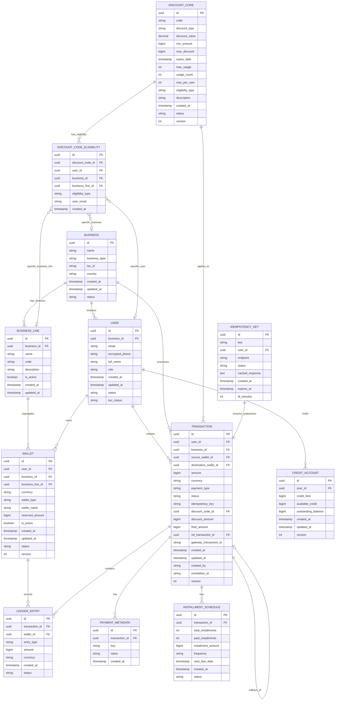

# Entity Relationships

## Overview

The Wallet Service domain model is built around a hierarchical structure supporting multi-tenant B2B and B2C operations. The model uses double-entry ledger accounting principles with immutable transaction records.

---

## Entity Relationship Diagram



---

## Core Entities

### 1. Business

**Purpose**: Represents a business entity in B2B context

**Key Attributes**:
- `id`: Unique identifier
- `name`: Business legal name
- `business_type`: CORPORATION, LLC, PARTNERSHIP, SOLE_PROPRIETOR
- `tax_id`: Tax identification number (encrypted)
- `country`: ISO country code
- `status`: ACTIVE, SUSPENDED, CLOSED

**Relationships**:
- One business has many users
- One business has many business lines
- One business has many transactions
- One business can have wallets (business-level wallets)

**Business Rules**:
- Business must have at least one admin user
- Tax ID must be unique per country
- Business wallets aggregate all user transactions

---

### 2. Business Line (NEW)

**Purpose**: Represents divisions/departments within a business for wallet segregation

**Key Attributes**:
- `id`: Unique identifier
- `business_id`: Parent business (FK)
- `name`: Business line name (e.g., "E-commerce", "Crypto", "Marketing")
- `code`: Unique code per business (e.g., "ECOMMERCE", "CRYPTO", "MARKETING")
- `description`: Business line description
- `is_active`: Active status flag

**Relationships**:
- Business line belongs to one business
- Business line has many wallets (segregated per business line)
- Business line referenced by discount code eligibility

**Business Rules**:
- Code must be unique within a business
- Business line name must be descriptive
- Inactive business lines cannot create new wallets
- Users can have multiple wallets across different business lines

**Example**:

```sql
-- business-1 with 3 business lines
INSERT INTO business_lines (id, business_id, name, code) VALUES
  ('line-ecom', 'biz-001', 'E-commerce', 'ECOMMERCE'),
  ('line-crypto', 'biz-001', 'Crypto', 'CRYPTO'),
  ('line-marketing', 'biz-001', 'Marketing', 'MARKETING');
```

---

### 3. User

**Purpose**: Represents an individual user (B2C or employee in B2B)

**Key Attributes**:
- `id`: Unique identifier
- `business_id`: Optional (null for B2C users)
- `email`: Unique email address
- `encrypted_phone`: Phone number (AES-256 encrypted)
- `role`: USER, BUSINESS_ADMIN, FINANCE_ADMIN, SYSTEM_ADMIN
- `kyc_status`: NOT_STARTED, PENDING, APPROVED, REJECTED

**Relationships**:
- User belongs to zero or one business
- User has many wallets
- User initiates many transactions
- User has zero or one credit account

**Business Rules**:
- Email must be unique across system
- B2B users must have `business_id`
- B2C users have `business_id = NULL`
- Users must complete KYC before high-value transactions

---

### 4. Wallet (ENHANCED)

**Purpose**: Container for user funds in specific currency with business and business line segregation

**Key Attributes**:
- `id`: Unique identifier
- `user_id`: Owner of wallet
- `business_id`: Business context (NULL for B2C personal wallets)
- `business_line_id`: Business line/department context (NULL for business-level or personal wallets) **NEW**
- `currency`: ISO currency code (USD, EUR, BTC, etc.)
- `wallet_type`: STANDARD, SAVINGS, BUSINESS, ESCROW, PERSONAL
- `reserved_amount`: Funds reserved for pending transactions
- `wallet_name`: Optional user-friendly name (e.g., "E-commerce USD", "Crypto BTC") **ENHANCED**
- `is_active`: Boolean flag for active/inactive status **NEW**
- `version`: Optimistic locking version

**Relationships**:
- Wallet belongs to one user
- Wallet optionally belongs to one business (NULL for personal wallets)
- Wallet optionally belongs to one business line (NULL for business-level or personal wallets) **NEW**
- Wallet has many ledger entries
- Wallet referenced by many transactions

**Business Rules (ENHANCED)**:
- **Multi-Business + Business Line Support**: One user can have multiple wallets per currency across different businesses and business lines
- **Unique Constraint**: `(user_id, business_id, business_line_id, currency, wallet_type)` must be unique
- **Personal Wallets**: When `business_id = NULL` and `business_line_id = NULL`, it's a personal B2C wallet
- **Business-Level Wallets**: When `business_id != NULL` and `business_line_id = NULL`, it's a business-level wallet
- **Business Line Wallets**: When `business_id != NULL` and `business_line_id != NULL`, it's a business line-specific wallet **NEW**
- **Business Line Constraint**: If `business_line_id` is set, `business_id` must also be set
- **Complete Segregation**: Balances, deposits, withdrawals are completely separate per business line
- **Business Line-Specific Discounts**: Discount codes can be restricted to specific business line wallets **NEW**
- Balance computed from ledger entries: `SUM(credits) - SUM(debits)`
- Actual spendable balance: `computed_balance - reserved_amount`
- Concurrent updates protected by optimistic locking

**Example Scenarios**:

**Scenario 1: User works for multiple businesses**
```
User: Alice

Personal Wallets (business_id = NULL, business_line_id = NULL):
  - USD Personal Wallet (id: wallet-001, business_id: NULL, business_line_id: NULL, currency: USD)
  - EUR Personal Wallet (id: wallet-002, business_id: NULL, business_line_id: NULL, currency: EUR)

Acme Corp Wallets (business_id = acme-123, business_line_id = NULL):
  - USD Business Wallet (id: wallet-003, business_id: acme-123, business_line_id: NULL, currency: USD)
  - EUR Business Wallet (id: wallet-004, business_id: acme-123, business_line_id: NULL, currency: EUR)

TechStart Wallets (business_id = tech-456, business_line_id = NULL):
  - USD Business Wallet (id: wallet-005, business_id: tech-456, business_line_id: NULL, currency: USD)
  - BTC Business Wallet (id: wallet-006, business_id: tech-456, business_line_id: NULL, currency: BTC)

Total: 6 separate wallets with independent balances
```

**Scenario 2: User with business line segregation (NEW)**
```
User: John works in business-1 with 3 business lines

Personal Wallets (business_id = NULL, business_line_id = NULL):
  - USD Personal Wallet (id: wallet-010, business_id: NULL, business_line_id: NULL, currency: USD)

E-commerce Line Wallets (business_id = biz-001, business_line_id = line-ecom):
  - USD E-commerce Wallet (id: wallet-011, business_id: biz-001, business_line_id: line-ecom, currency: USD)
  - EUR E-commerce Wallet (id: wallet-012, business_id: biz-001, business_line_id: line-ecom, currency: EUR)

Crypto Line Wallets (business_id = biz-001, business_line_id = line-crypto):
  - USD Crypto Wallet (id: wallet-013, business_id: biz-001, business_line_id: line-crypto, currency: USD)
  - BTC Crypto Wallet (id: wallet-014, business_id: biz-001, business_line_id: line-crypto, currency: BTC)

Sample-3 Line Wallets (business_id = biz-001, business_line_id = line-sample3):
  - USD Sample-3 Wallet (id: wallet-015, business_id: biz-001, business_line_id: line-sample3, currency: USD)

Total: 6 wallets (1 personal + 5 business line wallets) with complete segregation
```

**Scenario 3: Business-specific discount codes**
```
Discount Code: "ACME25" (25% off for Acme Corp employees)
Eligibility: SPECIFIC_BUSINESS (business_id = acme-123)

When Alice uses "ACME25":
  ✅ Valid for transactions from wallet-003 or wallet-004 (Acme wallets)
  ❌ Invalid for transactions from wallet-001, wallet-002 (Personal wallets)
  ❌ Invalid for transactions from wallet-005, wallet-006 (TechStart wallets)
```

**Scenario 4: Business line-specific discount codes (NEW)**
```
Discount Code: "ECOM20" (20% off for E-commerce division)
Eligibility: SPECIFIC_BUSINESS_LINE (business_line_id = line-ecom)

When John uses "ECOM20":
  ✅ Valid for transactions from wallet-011, wallet-012 (E-commerce line wallets)
  ❌ Invalid for wallet-010 (Personal wallet)
  ❌ Invalid for wallet-013, wallet-014 (Crypto line wallets)
  ❌ Invalid for wallet-015 (Sample-3 line wallet)
```

**Balance Calculation**:
```sql
SELECT
    SUM(CASE WHEN entry_type = 'CREDIT' THEN amount ELSE -amount END) as balance
FROM ledger_entries
WHERE wallet_id = :wallet_id
  AND status = 'CONFIRMED'
```

---

### 4. Transaction

**Purpose**: Immutable record of a financial operation

**Key Attributes**:
- `id`: Unique identifier
- `payment_type`: PREPAYMENT, POSTPAYMENT, VALUABLE, CREDIT
- `status`: PENDING, CONFIRMED, COMPLETED, FAILED, ROLLED_BACK
- `amount`: Transaction amount in minor units (e.g., cents)
- `final_amount`: After discount applied
- `idempotency_key`: Client-provided unique key
- `ref_transaction_id`: Reference to original transaction (for rollbacks)
- `correlation_id`: Distributed tracing ID
- `version`: Optimistic locking

**Relationships**:
- Transaction belongs to one user
- Transaction optionally belongs to one business
- Transaction has many ledger entries (minimum 2 for double-entry)
- Transaction may reference another transaction (rollback)
- Transaction may use one discount code
- Transaction has many metadata records

**State Machine**:
```
PENDING → CONFIRMED → COMPLETED
    ↓         ↓
  FAILED  ROLLED_BACK
```

**Business Rules**:
- Transactions are immutable (INSERT-only)
- Each transaction must have at least 2 ledger entries (debit + credit)
- Status transitions are strictly enforced
- Rollback creates a new compensating transaction

---

### 5. Ledger Entry

**Purpose**: Individual debit or credit entry in double-entry system

**Key Attributes**:
- `id`: Unique identifier
- `transaction_id`: Parent transaction
- `wallet_id`: Affected wallet
- `entry_type`: DEBIT, CREDIT
- `amount`: Always positive (direction from entry_type)
- `status`: RESERVED, CONFIRMED, CANCELLED

**Relationships**:
- Ledger entry belongs to one transaction
- Ledger entry belongs to one wallet

**Business Rules**:
- Ledger entries are immutable
- Each transaction must have balanced debits and credits
- Amount is always stored in minor units (e.g., cents)
- `SUM(debits) = SUM(credits)` for each transaction

**Double-Entry Example**:
```
Transaction: User A pays User B $100

Ledger Entry 1 (Debit):
  wallet_id: User A's USD Wallet
  entry_type: DEBIT
  amount: 10000  // $100.00 in cents

Ledger Entry 2 (Credit):
  wallet_id: User B's USD Wallet
  entry_type: CREDIT
  amount: 10000
```

---

### 6. Discount Code

**Purpose**: Promotional codes for discounts with support for public and user-specific codes

**Key Attributes**:
- `code`: Human-readable code (e.g., "SAVE20", "VIP50")
- `discount_type`: PERCENTAGE, FIXED_AMOUNT
- `discount_value`: Percentage (0-100) or fixed amount
- `min_amount`: Minimum transaction amount to apply
- `max_discount`: Maximum discount cap
- `max_usage`: Total usage limit across all users
- `max_per_user`: Per-user usage limit
- `eligibility_type`: ALL_USERS (public), RESTRICTED (user-specific)
- `description`: Human-readable description of the discount
- `version`: Optimistic locking

**Relationships**:
- Discount code applies to many transactions
- Discount code has many eligibility rules (if RESTRICTED)

**Business Rules**:
- Code must be unique
- Cannot be used after expiry
- Usage counters incremented atomically
- Rolled-back transactions restore usage count
- **RESTRICTED codes**: Only eligible users can apply
- **ALL_USERS codes**: Anyone can use (public)

**Validation Logic**:
```
1. Check status = ACTIVE
2. Check expiry_date > NOW()
3. Check usage_count < max_usage
4. Check user_usage_count < max_per_user
5. Check transaction_amount >= min_amount
6. **NEW: Check eligibility (if RESTRICTED)**
   - Verify user in eligibility list
   - Check business eligibility
   - Check email domain match
   - Check user role match
7. Calculate discount (capped by max_discount)
```

---

### 7. Discount Code Eligibility (ENHANCED)

**Purpose**: Define who can use specific discount codes (user-specific, business-specific, business line-specific, role-based)

**Key Attributes**:
- `discount_code_id`: Reference to discount code
- `eligibility_type`: SPECIFIC_USER, SPECIFIC_BUSINESS, SPECIFIC_BUSINESS_LINE, EMAIL_DOMAIN, USER_ROLE **ENHANCED**
- `user_id`: Specific user allowed to use code (NULL for other types)
- `business_id`: Specific business allowed to use code (NULL for other types)
- `business_line_id`: Specific business line allowed to use code (NULL for other types) **NEW**
- `user_email`: Email domain pattern (e.g., "university.edu") or role name
- `created_at`: When eligibility was granted

**Relationships**:
- Eligibility belongs to one discount code
- Eligibility optionally references one user
- Eligibility optionally references one business
- Eligibility optionally references one business line **NEW**

**Business Rules**:
- Only applies when discount.eligibility_type = RESTRICTED
- Multiple eligibility records per discount code allowed
- User matches if ANY eligibility rule matches
- Business line eligibility validates against wallet's business_line_id **NEW**

**Eligibility Types**:
- **SPECIFIC_USER**: Only this user can use the code
- **SPECIFIC_BUSINESS**: All users of this business can use (across all business lines)
- **SPECIFIC_BUSINESS_LINE**: Only users with wallets in this specific business line can use **NEW**
- **EMAIL_DOMAIN**: Users with matching email domain (e.g., company.com)
- **USER_ROLE**: Users with specific role (e.g., PREMIUM, VIP)

**Example**:
```sql
-- VIP50 code only for users: john, jane, bob
INSERT INTO discount_code_eligibility (discount_code_id, eligibility_type, user_id)
VALUES
  ('disc-001', 'SPECIFIC_USER', 'user-john-123'),
  ('disc-001', 'SPECIFIC_USER', 'user-jane-456'),
  ('disc-001', 'SPECIFIC_USER', 'user-bob-789');

-- CORPORATE25 for all Acme Corp employees (all business lines)
INSERT INTO discount_code_eligibility (discount_code_id, eligibility_type, business_id)
VALUES ('disc-002', 'SPECIFIC_BUSINESS', 'business-acme-corp');

-- ECOM20 for E-commerce business line only (NEW)
INSERT INTO discount_code_eligibility (discount_code_id, eligibility_type, business_line_id)
VALUES ('disc-003', 'SPECIFIC_BUSINESS_LINE', 'line-ecom');

-- STUDENT10 for all .edu emails
INSERT INTO discount_code_eligibility (discount_code_id, eligibility_type, user_email)
VALUES ('disc-004', 'EMAIL_DOMAIN', 'university.edu');
```

---

### 8. Idempotency Key

**Purpose**: Ensure duplicate requests produce identical results

**Key Attributes**:
- `key`: Client-provided unique key (UUID or hash)
- `user_id`: Owner (prevents cross-user replay)
- `endpoint`: API endpoint (prevents cross-endpoint replay)
- `status`: PENDING, CONFIRMED, EXPIRED
- `cached_response`: Serialized response for replay
- `ttl_minutes`: Time-to-live (5-1440 minutes)
- `expires_at`: Absolute expiration timestamp

**Relationships**:
- One idempotency key maps to one transaction

**Business Rules**:
- Unique constraint on `(key, user_id, endpoint)`
- TTL varies by payment type (configurable)
- PENDING keys prevent concurrent execution
- CONFIRMED keys allow safe replay
- Cleanup job expires old PENDING keys

---

### 8. Payment Metadata

**Purpose**: Flexible key-value storage for transaction context

**Key Attributes**:
- `transaction_id`: Parent transaction
- `key`: Metadata key (e.g., "order_id", "customer_note")
- `value`: Metadata value (TEXT)

**Relationships**:
- Metadata belongs to one transaction

**Business Rules**:
- Used for order IDs, customer notes, gateway references
- Not used for sensitive data (use encryption if needed)
- Indexed for search and reporting

---

### 9. Credit Account

**Purpose**: Manage credit limits and outstanding balances

**Key Attributes**:
- `user_id`: Account owner
- `credit_limit`: Maximum credit allowed
- `available_credit`: Remaining credit
- `outstanding_balance`: Current debt
- `version`: Optimistic locking

**Relationships**:
- One user has one credit account

**Business Rules**:
- `available_credit = credit_limit - outstanding_balance`
- Used for POSTPAYMENT and CREDIT payment types
- Credit checks before approval
- Interest and fees tracked separately

---

### 10. Installment Schedule

**Purpose**: Manage installment payments for CREDIT type

**Key Attributes**:
- `transaction_id`: Parent transaction
- `total_installments`: Number of installments (e.g., 12)
- `paid_installments`: Completed payments
- `installment_amount`: Amount per installment
- `frequency`: MONTHLY, WEEKLY, BIWEEKLY
- `next_due_date`: Next payment due date

**Relationships**:
- Schedule belongs to one transaction

**Business Rules**:
- Created automatically for CREDIT payment type
- Background job processes due installments
- Overdue installments trigger notifications/fees

---

## Aggregate Roots

### User Aggregate
- **Root**: User
- **Entities**: Wallet, Credit Account
- **Invariants**: Total wallet balances respect credit limits

### Transaction Aggregate
- **Root**: Transaction
- **Entities**: Ledger Entry, Payment Metadata, Installment Schedule
- **Invariants**: Ledger entries balance, metadata is valid

---

## Indexes & Performance

### Critical Indexes

```sql
-- Transaction lookups
CREATE INDEX idx_transactions_user_created ON transactions(user_id, created_at DESC);
CREATE INDEX idx_transactions_business_created ON transactions(business_id, created_at DESC);
CREATE INDEX idx_transactions_status ON transactions(status);
CREATE UNIQUE INDEX idx_transactions_idempotency ON transactions(idempotency_key) WHERE idempotency_key IS NOT NULL;

-- Ledger queries (balance computation)
CREATE INDEX idx_ledger_wallet_status ON ledger_entries(wallet_id, status);
CREATE INDEX idx_ledger_transaction ON ledger_entries(transaction_id);

-- Wallet lookups
CREATE UNIQUE INDEX idx_wallet_user_currency ON wallets(user_id, currency);

-- Idempotency enforcement
CREATE UNIQUE INDEX idx_idempotency_unique ON idempotency_keys(key, user_id, endpoint);
CREATE INDEX idx_idempotency_expires ON idempotency_keys(expires_at) WHERE status = 'PENDING';

-- Discount code validation
CREATE UNIQUE INDEX idx_discount_code ON discount_codes(code);
CREATE INDEX idx_discount_expiry ON discount_codes(expiry_date) WHERE status = 'ACTIVE';
```

---

## Partitioning Strategy

### Transaction Table Partitioning (Range by Month)

```sql
CREATE TABLE transactions (
    ...
) PARTITION BY RANGE (created_at) (
    PARTITION tx_2025_01 VALUES LESS THAN (TO_DATE('2025-02-01', 'YYYY-MM-DD')),
    PARTITION tx_2025_02 VALUES LESS THAN (TO_DATE('2025-03-01', 'YYYY-MM-DD')),
    ...
    PARTITION tx_future VALUES LESS THAN (MAXVALUE)
);
```

**Benefits**:
- Fast queries within date ranges
- Efficient archival of old partitions
- Improved maintenance operations

---

## Data Retention

| Entity | Retention Policy | Archive Strategy |
|--------|------------------|------------------|
| **Transaction** | 7 years (regulatory) | Partition archival to cold storage |
| **Ledger Entry** | 7 years (regulatory) | Same as transactions |
| **Idempotency Key** | 30 days | Hard delete after expiry |
| **Payment Metadata** | 7 years | Archive with transactions |
| **Discount Code** | Indefinite (audit) | Soft delete (status=ARCHIVED) |

---

## Next Steps

- Review [Database Schema](./database-schema.md) for complete DDL
- See [Ledger Model](./ledger-model.md) for accounting principles
- Explore [Payment Types](./payment-types.md) for type-specific rules
