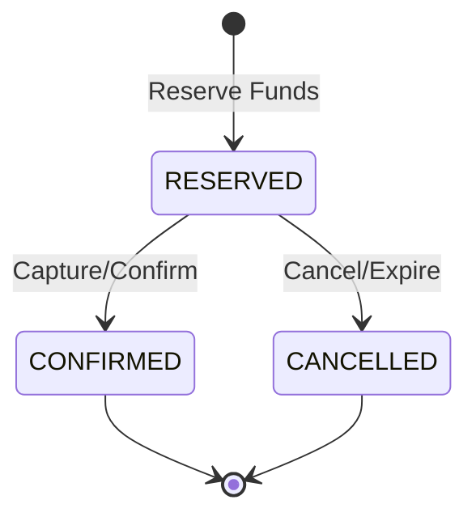

# Ledger Model

## Overview

The Wallet Service uses a **double-entry bookkeeping** system to ensure financial accuracy and auditability. All transactions are immutable, and wallet balances are computed from ledger entries rather than stored as mutable values.

---

## Double-Entry Bookkeeping Principles

### Core Rule
**For every transaction, total debits must equal total credits.**

```
SUM(DEBIT entries) = SUM(CREDIT entries)
```

### Entry Types

| Entry Type | Effect on Balance | Accounting Meaning |
|------------|-------------------|-------------------|
| **DEBIT** | Decreases balance | Money out / Asset decrease |
| **CREDIT** | Increases balance | Money in / Asset increase |

---

## Transaction Examples

### Example 1: Simple Payment (User A → User B)

**Scenario**: User A pays User B $100.00

**Transaction Record**:
```json
{
  "id": "tx-001",
  "user_id": "user-a",
  "amount": 10000,  // $100.00 in cents
  "currency": "USD",
  "payment_type": "PREPAYMENT",
  "status": "CONFIRMED"
}
```

**Ledger Entries**:
```sql
-- Entry 1: Debit User A's wallet
INSERT INTO ledger_entries (transaction_id, wallet_id, entry_type, amount, currency)
VALUES ('tx-001', 'wallet-a-usd', 'DEBIT', 10000, 'USD');

-- Entry 2: Credit User B's wallet
INSERT INTO ledger_entries (transaction_id, wallet_id, entry_type, amount, currency)
VALUES ('tx-001', 'wallet-b-usd', 'CREDIT', 10000, 'USD');
```

**Balance Calculation**:
- **User A**: Previous balance - 10000 = New balance
- **User B**: Previous balance + 10000 = New balance

**Verification**: `DEBIT (10000) = CREDIT (10000)` ✅

---

### Example 2: Rollback/Refund

**Scenario**: Rollback transaction tx-001 (User A paid User B $100)

**Original Transaction**: tx-001 (see Example 1)

**Rollback Transaction Record**:
```json
{
  "id": "tx-003",
  "user_id": "user-a",
  "amount": 10000,
  "currency": "USD",
  "payment_type": "ROLLBACK",
  "ref_transaction_id": "tx-001",
  "status": "CONFIRMED"
}
```

**Compensation Ledger Entries** (reverse of original):
```sql
-- Credit User A's wallet (refund)
INSERT INTO ledger_entries (transaction_id, wallet_id, entry_type, amount)
VALUES ('tx-003', 'wallet-a-usd', 'CREDIT', 10000);

-- Debit User B's wallet (reversal)
INSERT INTO ledger_entries (transaction_id, wallet_id, entry_type, amount)
VALUES ('tx-003', 'wallet-b-usd', 'DEBIT', 10000);
```

**Original Transaction Update**:
```sql
UPDATE transactions
SET status = 'ROLLED_BACK'
WHERE id = 'tx-001';
```

**Key Principle**: Never delete ledger entries; create compensating entries.

---

### Example 3: Prepayment with Reservation

**Scenario**: User A places order for $50, funds reserved until order confirmed

**Phase 1: Reserve Funds**
```sql
-- Reserve funds (status = RESERVED)
INSERT INTO ledger_entries (transaction_id, wallet_id, entry_type, amount, status)
VALUES ('tx-004', 'wallet-a-usd', 'DEBIT', 5000, 'RESERVED');

-- Update wallet reserved amount
UPDATE wallets
SET reserved_amount = reserved_amount + 5000
WHERE id = 'wallet-a-usd';
```

**Phase 2: Confirm Order (Capture)**
```sql
-- Confirm the reserved entry
UPDATE ledger_entries
SET status = 'CONFIRMED'
WHERE transaction_id = 'tx-004';

-- Release from reserved
UPDATE wallets
SET reserved_amount = reserved_amount - 5000
WHERE id = 'wallet-a-usd';

-- Credit merchant
INSERT INTO ledger_entries (transaction_id, wallet_id, entry_type, amount, status)
VALUES ('tx-004', 'wallet-merchant', 'CREDIT', 5000, 'CONFIRMED');
```

**Phase 3: Cancel Order (Alternative)**
```sql
-- Cancel the reserved entry
UPDATE ledger_entries
SET status = 'CANCELLED'
WHERE transaction_id = 'tx-004';

-- Release from reserved (refund)
UPDATE wallets
SET reserved_amount = reserved_amount - 5000
WHERE id = 'wallet-a-usd';
```

---

## Balance Computation

### Formula
```sql
computed_balance = SUM(CREDIT entries) - SUM(DEBIT entries)
```

### Available Balance
```sql
available_balance = computed_balance - reserved_amount
```

### SQL Query (Single Wallet)
```sql
SELECT
    w.id as wallet_id,
    w.currency,
    COALESCE(SUM(CASE
        WHEN le.entry_type = 'CREDIT' THEN le.amount
        WHEN le.entry_type = 'DEBIT' THEN -le.amount
    END), 0) as computed_balance,
    w.reserved_amount,
    COALESCE(SUM(CASE
        WHEN le.entry_type = 'CREDIT' THEN le.amount
        WHEN le.entry_type = 'DEBIT' THEN -le.amount
    END), 0) - w.reserved_amount as available_balance
FROM wallets w
LEFT JOIN ledger_entries le ON w.id = le.wallet_id
WHERE w.id = :wallet_id
  AND le.status = 'CONFIRMED'
GROUP BY w.id, w.currency, w.reserved_amount;
```

### Aggregate Balance (All User Wallets)
```sql
SELECT
    w.user_id,
    w.currency,
    SUM(COALESCE(
        (SELECT SUM(CASE WHEN entry_type = 'CREDIT' THEN amount ELSE -amount END)
         FROM ledger_entries
         WHERE wallet_id = w.id AND status = 'CONFIRMED'),
        0
    )) as total_balance
FROM wallets w
WHERE w.user_id = :user_id
GROUP BY w.user_id, w.currency;
```

---

## Immutability & Audit Trail

### Key Principles

1. **No Updates to Amounts**
   - Ledger entries are INSERT-only
   - Corrections create new compensating entries

2. **No Deletions**
   - All entries preserved for audit
   - Cancelled entries marked with status

3. **Complete History**
   - Every balance change has ledger trail
   - Reconstruction possible from ledger

4. **Correlation IDs**
   - Link related operations across services
   - Enable distributed tracing

---

## Financial Reconciliation

### Daily Reconciliation Query
```sql
-- Verify all transactions are balanced
SELECT
    t.id,
    t.amount,
    SUM(CASE WHEN le.entry_type = 'DEBIT' THEN le.amount ELSE 0 END) as total_debits,
    SUM(CASE WHEN le.entry_type = 'CREDIT' THEN le.amount ELSE 0 END) as total_credits
FROM transactions t
JOIN ledger_entries le ON t.id = le.transaction_id
WHERE t.created_at >= TRUNC(SYSDATE)
  AND t.status IN ('CONFIRMED', 'COMPLETED')
GROUP BY t.id, t.amount
HAVING SUM(CASE WHEN le.entry_type = 'DEBIT' THEN le.amount ELSE 0 END) !=
       SUM(CASE WHEN le.entry_type = 'CREDIT' THEN le.amount ELSE 0 END);
```

**Expected Result**: 0 rows (all transactions balanced)

### Global Balance Check
```sql
-- System-wide balance should sum to zero (closed system)
SELECT
    SUM(CASE WHEN entry_type = 'CREDIT' THEN amount ELSE -amount END) as net_balance
FROM ledger_entries
WHERE status = 'CONFIRMED';
```

**Expected Result**: 0 (in a closed system) or known external balance

---

## Money Representation

### Storage Format
- **Type**: `NUMBER(19,0)` (64-bit integer)
- **Unit**: Minor units (e.g., cents for USD, satoshis for BTC)
- **Range**: -9,223,372,036,854,775,808 to 9,223,372,036,854,775,807

### Currency Examples

| Currency | Minor Unit | Example Storage |
|----------|-----------|-----------------|
| **USD** | Cents | $100.50 → 10050 |
| **EUR** | Cents | €50.99 → 5099 |
| **JPY** | Yen (no decimals) | ¥1000 → 1000 |
| **BTC** | Satoshis | 0.001 BTC → 100000 |

### Java Money Class (Example)
```java
public class Money {
    private final long amount;  // Minor units
    private final Currency currency;

    public Money(long amount, Currency currency) {
        this.amount = amount;
        this.currency = currency;
    }

    public static Money fromMajorUnits(BigDecimal majorUnits, Currency currency) {
        int scale = currency.getDefaultFractionDigits();
        long minorUnits = majorUnits.movePointRight(scale).longValueExact();
        return new Money(minorUnits, currency);
    }

    public BigDecimal toMajorUnits() {
        int scale = currency.getDefaultFractionDigits();
        return BigDecimal.valueOf(amount).movePointLeft(scale);
    }
}
```

---

## Ledger Entry States



| Status | Meaning | Counted in Balance? |
|--------|---------|---------------------|
| **RESERVED** | Funds held for pending transaction | No (tracked in `reserved_amount`) |
| **CONFIRMED** | Entry is final and settled | Yes |
| **CANCELLED** | Entry was reversed/voided | No |

---

## Performance Optimizations

### 1. Materialized Views
```sql
CREATE MATERIALIZED VIEW mv_wallet_balances
REFRESH FAST ON COMMIT
AS
SELECT
    wallet_id,
    currency,
    SUM(CASE WHEN entry_type = 'CREDIT' THEN amount ELSE -amount END) as balance,
    MAX(created_at) as last_updated
FROM ledger_entries
WHERE status = 'CONFIRMED'
GROUP BY wallet_id, currency;
```

### 2. Redis Cache
```java
// Cache wallet balance with 5-minute TTL
public BigDecimal getCachedBalance(UUID walletId) {
    String key = "wallet:balance:" + walletId;
    String cached = redisTemplate.opsForValue().get(key);
    if (cached != null) {
        return new BigDecimal(cached);
    }

    BigDecimal balance = computeBalanceFromLedger(walletId);
    redisTemplate.opsForValue().set(key, balance.toString(), 5, TimeUnit.MINUTES);
    return balance;
}
```

### 3. Read Replicas
- Balance queries routed to Oracle read replicas
- Write operations on primary node only

---

## Compliance & Audit

### Regulatory Requirements
- **Immutable Records**: Required for audit (SOX, PCI-DSS)
- **Retention**: 7 years minimum for financial records
- **Reconstruction**: Ability to rebuild balances from ledger
- **Audit Trail**: Every transaction traceable to actor and timestamp

### Audit Query (User Transaction History)
```sql
SELECT
    t.id,
    t.created_at,
    t.amount / 100.0 as amount_dollars,
    t.currency,
    t.payment_type,
    t.status,
    le.entry_type,
    le.wallet_id,
    t.created_by,
    t.correlation_id
FROM transactions t
JOIN ledger_entries le ON t.id = le.transaction_id
WHERE t.user_id = :user_id
ORDER BY t.created_at DESC;
```

---

## Best Practices

1. **Never modify ledger_entries.amount**
2. **Always create compensating entries for corrections**
3. **Use optimistic locking for concurrent updates**
4. **Verify balances with reconciliation jobs**
5. **Store amounts in minor units (avoid decimals)**
6. **Maintain correlation_id for distributed tracing**
7. **Index on (wallet_id, status, created_at) for performance**

---

## Next Steps

- Review [Payment Types](./payment-types.md) for type-specific flows
- See [Concurrency Control](../06-design-patterns/concurrency-control.md) for locking strategies
- Explore [Money Handling](../06-design-patterns/money-handling.md) for currency best practices
