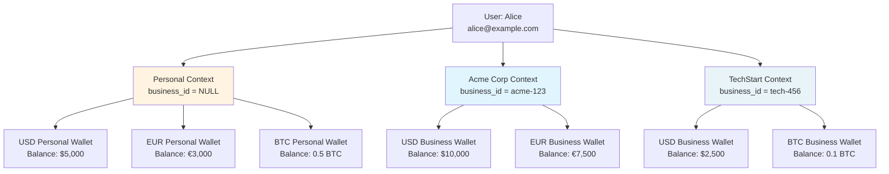
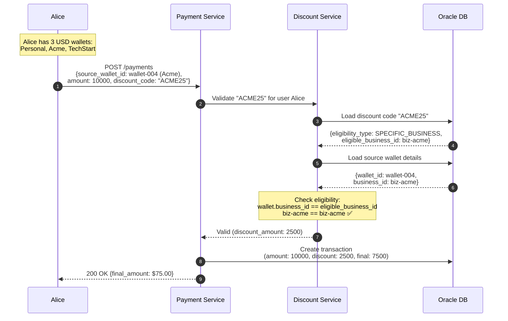

# Multi-Business Wallet Support

## Overview

The Wallet Service supports **complete wallet segregation** for users who work with multiple businesses. Each user can have independent wallets per business, with separate balances, transactions, and business-specific discount codes.

---

## Use Cases

### 1. Freelancer/Contractor Working for Multiple Companies

```
Alice is a freelance developer working for 3 companies:
- Acme Corp (full-time contract)
- TechStart Inc (part-time)
- Her own personal finances

Alice needs:
✅ Separate USD wallet for Acme Corp expenses
✅ Separate USD wallet for TechStart Inc expenses
✅ Personal USD wallet for personal transactions
✅ Each wallet with independent balance
✅ Business-specific discount codes only work for that business's wallet
```

### 2. Employee with Side Business

```
Bob works as a Finance Manager at GlobalCorp:
- Has corporate USD/EUR wallets for business expenses
- Also runs a side consulting business
- Has personal wallets for family expenses

Bob needs:
✅ GlobalCorp wallets (business_id = globalcorp)
✅ Personal consulting business wallets (business_id = bob-consulting)
✅ Personal wallets (business_id = NULL)
✅ Complete segregation between all three contexts
```

### 3. Multi-Business Support Staff

```
Carol is a virtual assistant supporting 5 different businesses:
- Each business provides her with expense accounts
- She processes transactions on behalf of each business
- She needs clear separation to avoid mixing funds

Carol needs:
✅ 5 separate USD wallets (one per business)
✅ Independent balances for each business
✅ Business-specific discount codes
✅ Separate transaction histories per business
```

---

## Wallet Structure

### Hierarchical Model



### Database Model

```sql
-- Example: Alice's wallets in the database

-- Personal wallets (business_id = NULL)
INSERT INTO wallets (id, user_id, business_id, currency, wallet_type, wallet_name)
VALUES
  ('wallet-001', 'user-alice', NULL, 'USD', 'PERSONAL', 'Personal Checking'),
  ('wallet-002', 'user-alice', NULL, 'EUR', 'PERSONAL', 'Personal Euro Account'),
  ('wallet-003', 'user-alice', NULL, 'BTC', 'PERSONAL', 'Personal Bitcoin');

-- Acme Corp wallets
INSERT INTO wallets (id, user_id, business_id, currency, wallet_type, wallet_name)
VALUES
  ('wallet-004', 'user-alice', 'biz-acme', 'USD', 'BUSINESS', 'Acme Corp USD'),
  ('wallet-005', 'user-alice', 'biz-acme', 'EUR', 'BUSINESS', 'Acme Corp EUR');

-- TechStart wallets
INSERT INTO wallets (id, user_id, business_id, currency, wallet_type, wallet_name)
VALUES
  ('wallet-006', 'user-alice', 'biz-tech', 'USD', 'BUSINESS', 'TechStart USD'),
  ('wallet-007', 'user-alice', 'biz-tech', 'BTC', 'BUSINESS', 'TechStart BTC');

-- Query: Get all wallets for Alice
SELECT
    w.id,
    w.currency,
    w.wallet_name,
    COALESCE(b.name, 'Personal') as context,
    (SELECT SUM(CASE WHEN entry_type = 'CREDIT' THEN amount ELSE -amount END)
     FROM ledger_entries
     WHERE wallet_id = w.id AND status = 'CONFIRMED') as balance
FROM wallets w
LEFT JOIN businesses b ON w.business_id = b.id
WHERE w.user_id = 'user-alice'
ORDER BY b.name NULLS FIRST, w.currency;

-- Result:
-- wallet-001 | USD | Personal Checking    | Personal   | 500000 (= $5,000.00)
-- wallet-002 | EUR | Personal Euro Account| Personal   | 300000 (= €3,000.00)
-- wallet-003 | BTC | Personal Bitcoin     | Personal   | 50000000 (= 0.5 BTC)
-- wallet-004 | USD | Acme Corp USD        | Acme Corp  | 1000000 (= $10,000.00)
-- wallet-005 | EUR | Acme Corp EUR        | Acme Corp  | 750000 (= €7,500.00)
-- wallet-006 | USD | TechStart USD        | TechStart  | 250000 (= $2,500.00)
-- wallet-007 | BTC | TechStart BTC        | TechStart  | 10000000 (= 0.1 BTC)
```

---

## Operations

### 1. Deposit (Credit)

**Scenario**: Alice receives payment from Acme Corp into her Acme Corp USD wallet

```sql
-- Create transaction
INSERT INTO transactions (id, user_id, business_id, destination_wallet_id, amount, currency, payment_type, status, final_amount)
VALUES ('tx-001', 'user-alice', 'biz-acme', 'wallet-004', 500000, 'USD', 'PREPAYMENT', 'CONFIRMED', 500000);

-- Create ledger entry (CREDIT = deposit)
INSERT INTO ledger_entries (transaction_id, wallet_id, entry_type, amount, currency, status)
VALUES ('tx-001', 'wallet-004', 'CREDIT', 500000, 'USD', 'CONFIRMED');

-- Result: Acme Corp USD wallet balance increases by $5,000
-- Personal wallets and TechStart wallets remain unchanged
```

### 2. Withdraw (Debit)

**Scenario**: Alice withdraws from her Personal USD wallet

```sql
-- Create transaction
INSERT INTO transactions (id, user_id, business_id, source_wallet_id, amount, currency, payment_type, status, final_amount)
VALUES ('tx-002', 'user-alice', NULL, 'wallet-001', 200000, 'USD', 'PREPAYMENT', 'CONFIRMED', 200000);

-- Create ledger entry (DEBIT = withdrawal)
INSERT INTO ledger_entries (transaction_id, wallet_id, entry_type, amount, currency, status)
VALUES ('tx-002', 'wallet-001', 'DEBIT', 200000, 'USD', 'CONFIRMED');

-- Result: Personal USD wallet balance decreases by $2,000
-- Business wallets remain unchanged
```

### 3. Transfer Between Own Wallets (Same Business Context)

**Scenario**: Alice transfers between her Acme Corp wallets (USD → EUR)

```sql
-- Create transaction
INSERT INTO transactions (id, user_id, business_id, source_wallet_id, destination_wallet_id, amount, currency, payment_type, status, final_amount)
VALUES ('tx-003', 'user-alice', 'biz-acme', 'wallet-004', 'wallet-005', 100000, 'USD', 'TRANSFER', 'CONFIRMED', 100000);

-- Debit from USD wallet
INSERT INTO ledger_entries (transaction_id, wallet_id, entry_type, amount, currency, status)
VALUES ('tx-003', 'wallet-004', 'DEBIT', 100000, 'USD', 'CONFIRMED');

-- Credit to EUR wallet (after conversion)
INSERT INTO ledger_entries (transaction_id, wallet_id, entry_type, amount, currency, status)
VALUES ('tx-003', 'wallet-005', 'CREDIT', 92000, 'EUR', 'CONFIRMED');

-- Result: Acme USD -$1,000, Acme EUR +€920 (assuming 1 USD = 0.92 EUR)
```

### 4. Cross-Business Transfer (NOT ALLOWED by default)

**Important Business Rule**: Transfers between wallets of different businesses are **restricted** by default to prevent fund mixing.

```sql
-- REJECTED: Attempt to transfer from Acme wallet to TechStart wallet
INSERT INTO transactions (id, user_id, source_wallet_id, destination_wallet_id, amount, currency)
VALUES ('tx-004', 'user-alice', 'wallet-004', 'wallet-006', 50000, 'USD');

-- Validation Error:
-- "Cannot transfer funds between different business contexts.
--  Source wallet business_id: biz-acme
--  Destination wallet business_id: biz-tech
--  Cross-business transfers require admin approval."
```

**Workaround** (if needed):
1. Withdraw from Acme wallet to external account
2. Deposit to TechStart wallet from external account
3. Or use admin-approved cross-business transfer with audit trail

---

## Business-Specific Discount Codes

### Scenario: Business-Specific Discount Applied to Correct Wallet



### Discount Code Validation Logic

```java
@Service
public class BusinessWalletDiscountValidator {

    public DiscountValidationResult validate(String discountCode, UUID walletId, User user, BigDecimal amount) {
        // Load discount code
        DiscountCode discount = discountCodeRepository.findByCode(discountCode)
            .orElseThrow(() -> new DiscountNotFoundException(discountCode));

        // Basic validation (status, expiry, usage limits)
        validateBasicRules(discount, user, amount);

        // Check eligibility type
        if (discount.getEligibilityType() == EligibilityType.RESTRICTED) {
            // Load wallet to get business context
            Wallet wallet = walletRepository.findById(walletId)
                .orElseThrow(() -> new WalletNotFoundException(walletId));

            // Load eligibility rules
            List<DiscountCodeEligibility> eligibilities =
                eligibilityRepository.findByDiscountCodeId(discount.getId());

            // Check if wallet's business matches any eligibility rule
            boolean eligible = eligibilities.stream().anyMatch(rule -> {
                switch (rule.getEligibilityType()) {
                    case SPECIFIC_BUSINESS:
                        // Wallet must belong to the eligible business
                        return wallet.getBusinessId() != null &&
                               wallet.getBusinessId().equals(rule.getBusinessId());

                    case SPECIFIC_USER:
                        // User must be in eligible list
                        return user.getId().equals(rule.getUserId());

                    case EMAIL_DOMAIN:
                        // User email must match domain
                        return user.getEmail().endsWith(rule.getUserEmail());

                    case USER_ROLE:
                        // User must have the role
                        return user.getRole().equals(rule.getUserEmail());

                    default:
                        return false;
                }
            });

            if (!eligible) {
                // Check if wallet is personal (business_id = NULL)
                if (wallet.getBusinessId() == null) {
                    throw new DiscountNotEligibleException(
                        "Discount code '" + discountCode + "' is only valid for business wallets"
                    );
                } else {
                    throw new DiscountNotEligibleException(
                        "Discount code '" + discountCode + "' is not valid for this business wallet. " +
                        "This code is only available for specific businesses."
                    );
                }
            }
        }

        // Calculate discount
        BigDecimal discountAmount = calculateDiscount(discount, amount);

        return DiscountValidationResult.success(discountAmount);
    }
}
```

### Examples

#### Example 1: Valid Business Discount

```http
POST /v1/payments
Content-Type: application/json
Authorization: Bearer {alice_token}

{
  "source_wallet_id": "wallet-004",  // Acme Corp USD wallet
  "amount": 10000,                    // $100.00
  "currency": "USD",
  "discount_code": "ACME25"           // 25% off for Acme Corp
}

Response: 200 OK
{
  "transaction_id": "tx-005",
  "amount": 10000,
  "discount_amount": 2500,            // $25.00 discount
  "final_amount": 7500,               // $75.00 charged
  "wallet": {
    "id": "wallet-004",
    "business_name": "Acme Corp",
    "currency": "USD"
  }
}
```

#### Example 2: Invalid Business Discount (Wrong Wallet)

```http
POST /v1/payments
Content-Type: application/json
Authorization: Bearer {alice_token}

{
  "source_wallet_id": "wallet-006",  // TechStart USD wallet (WRONG!)
  "amount": 10000,
  "currency": "USD",
  "discount_code": "ACME25"           // Only valid for Acme Corp
}

Response: 403 Forbidden
{
  "error": "DISCOUNT_NOT_ELIGIBLE",
  "message": "Discount code 'ACME25' is not valid for this business wallet. This code is only available for Acme Corp.",
  "details": {
    "discount_code": "ACME25",
    "eligible_business": "Acme Corp",
    "wallet_business": "TechStart Inc",
    "suggestion": "Use a TechStart-specific discount code or a public discount code"
  }
}
```

#### Example 3: Personal Wallet Cannot Use Business Discount

```http
POST /v1/payments
Content-Type: application/json
Authorization: Bearer {alice_token}

{
  "source_wallet_id": "wallet-001",  // Personal USD wallet
  "amount": 10000,
  "currency": "USD",
  "discount_code": "ACME25"
}

Response: 403 Forbidden
{
  "error": "DISCOUNT_NOT_ELIGIBLE",
  "message": "Discount code 'ACME25' is only valid for business wallets",
  "details": {
    "discount_code": "ACME25",
    "wallet_type": "PERSONAL",
    "suggestion": "Use a public discount code or apply from a business wallet"
  }
}
```

---

## API Endpoints

### 1. List User's Wallets (Grouped by Business)

```http
GET /v1/users/{user_id}/wallets?group_by=business
Authorization: Bearer {token}

Response: 200 OK
{
  "user_id": "user-alice",
  "total_wallets": 7,
  "wallet_groups": [
    {
      "business_id": null,
      "business_name": "Personal",
      "wallets": [
        {
          "id": "wallet-001",
          "currency": "USD",
          "wallet_name": "Personal Checking",
          "balance": 500000,
          "reserved_amount": 0,
          "available_balance": 500000
        },
        {
          "id": "wallet-002",
          "currency": "EUR",
          "wallet_name": "Personal Euro Account",
          "balance": 300000,
          "reserved_amount": 0,
          "available_balance": 300000
        },
        {
          "id": "wallet-003",
          "currency": "BTC",
          "wallet_name": "Personal Bitcoin",
          "balance": 50000000,
          "reserved_amount": 0,
          "available_balance": 50000000
        }
      ],
      "total_balance_usd_equivalent": 8750.00
    },
    {
      "business_id": "biz-acme",
      "business_name": "Acme Corp",
      "wallets": [
        {
          "id": "wallet-004",
          "currency": "USD",
          "wallet_name": "Acme Corp USD",
          "balance": 1000000,
          "reserved_amount": 50000,
          "available_balance": 950000
        },
        {
          "id": "wallet-005",
          "currency": "EUR",
          "wallet_name": "Acme Corp EUR",
          "balance": 750000,
          "reserved_amount": 0,
          "available_balance": 750000
        }
      ],
      "total_balance_usd_equivalent": 18150.00
    },
    {
      "business_id": "biz-tech",
      "business_name": "TechStart Inc",
      "wallets": [
        {
          "id": "wallet-006",
          "currency": "USD",
          "wallet_name": "TechStart USD",
          "balance": 250000,
          "reserved_amount": 0,
          "available_balance": 250000
        },
        {
          "id": "wallet-007",
          "currency": "BTC",
          "wallet_name": "TechStart BTC",
          "balance": 10000000,
          "reserved_amount": 0,
          "available_balance": 10000000
        }
      ],
      "total_balance_usd_equivalent": 5500.00
    }
  ],
  "grand_total_usd_equivalent": 32400.00
}
```

### 2. Create Business-Specific Wallet

```http
POST /v1/wallets
Content-Type: application/json
Authorization: Bearer {token}

{
  "user_id": "user-alice",
  "business_id": "biz-acme",      // Required for business wallet
  "currency": "GBP",
  "wallet_type": "BUSINESS",
  "wallet_name": "Acme Corp GBP Account"
}

Response: 201 Created
{
  "id": "wallet-008",
  "user_id": "user-alice",
  "business_id": "biz-acme",
  "business_name": "Acme Corp",
  "currency": "GBP",
  "wallet_type": "BUSINESS",
  "wallet_name": "Acme Corp GBP Account",
  "balance": 0,
  "status": "ACTIVE",
  "created_at": "2025-01-20T10:30:00Z"
}
```

### 3. Get Wallet Details with Business Context

```http
GET /v1/wallets/{wallet_id}
Authorization: Bearer {token}

Response: 200 OK
{
  "id": "wallet-004",
  "user_id": "user-alice",
  "user_email": "alice@example.com",
  "business_id": "biz-acme",
  "business_context": {
    "id": "biz-acme",
    "name": "Acme Corp",
    "business_type": "CORPORATION",
    "country": "US"
  },
  "currency": "USD",
  "wallet_type": "BUSINESS",
  "wallet_name": "Acme Corp USD",
  "balance": 1000000,
  "reserved_amount": 50000,
  "available_balance": 950000,
  "status": "ACTIVE",
  "is_active": true,
  "created_at": "2025-01-10T08:00:00Z"
}
```

### 4. Get Transaction History (Filtered by Business)

```http
GET /v1/users/{user_id}/transactions?business_id=biz-acme&limit=10
Authorization: Bearer {token}

Response: 200 OK
{
  "user_id": "user-alice",
  "business_id": "biz-acme",
  "business_name": "Acme Corp",
  "total_count": 150,
  "transactions": [
    {
      "id": "tx-001",
      "amount": 500000,
      "currency": "USD",
      "payment_type": "PREPAYMENT",
      "status": "CONFIRMED",
      "wallet": {
        "id": "wallet-004",
        "wallet_name": "Acme Corp USD"
      },
      "created_at": "2025-01-20T09:00:00Z"
    }
  ]
}
```

---

## Security & Access Control

### Wallet Access Rules

```java
@Service
public class WalletAccessControl {

    public void verifyWalletAccess(User user, Wallet wallet, AccessType accessType) {
        // Rule 1: User must own the wallet
        if (!wallet.getUserId().equals(user.getId())) {
            throw new UnauthorizedException("User does not own this wallet");
        }

        // Rule 2: If wallet belongs to a business, user must be associated with that business
        if (wallet.getBusinessId() != null) {
            if (!user.getBusinessId().equals(wallet.getBusinessId())) {
                throw new UnauthorizedException(
                    "User is not associated with the business that owns this wallet"
                );
            }

            // Rule 3: Check business-specific permissions
            if (accessType == AccessType.WITHDRAW && !user.hasPermission("wallet:withdraw")) {
                throw new UnauthorizedException(
                    "User does not have withdrawal permissions for business wallets"
                );
            }
        }

        // Rule 4: Wallet must be active
        if (!wallet.isActive()) {
            throw new WalletInactiveException("Wallet is inactive");
        }

        // Rule 5: Wallet must not be frozen
        if (wallet.getStatus() == WalletStatus.FROZEN) {
            throw new WalletFrozenException("Wallet is frozen");
        }
    }
}
```

---

## Best Practices

### 1. Wallet Naming Convention

```
Personal wallets:
  - "{Currency} Personal Account"
  - "Personal Checking"
  - "Personal Savings"

Business wallets:
  - "{Business Name} {Currency} {Purpose}"
  - "Acme Corp USD Operating"
  - "TechStart EUR Expenses"
  - "GlobalCorp BTC Investment"
```

### 2. Balance Segregation

- ✅ Always query balances with business context filter
- ✅ Use wallet_id in all transactions (not just user_id + currency)
- ✅ Validate business_id matches between wallet and transaction
- ✅ Prevent cross-business transfers without approval

### 3. Reporting

```sql
-- Total balance across all contexts for a user
SELECT
    u.id,
    u.email,
    COALESCE(b.name, 'Personal') as context,
    w.currency,
    SUM(balance) as total_balance
FROM users u
LEFT JOIN wallets w ON u.id = w.user_id
LEFT JOIN businesses b ON w.business_id = b.id
LEFT JOIN LATERAL (
    SELECT SUM(CASE WHEN entry_type = 'CREDIT' THEN amount ELSE -amount END) as balance
    FROM ledger_entries
    WHERE wallet_id = w.id AND status = 'CONFIRMED'
) le ON true
WHERE u.id = 'user-alice'
GROUP BY u.id, u.email, b.name, w.currency
ORDER BY b.name NULLS FIRST, w.currency;
```

### 4. Audit Trail

- ✅ Log all cross-business operations
- ✅ Record which business context was used for each transaction
- ✅ Track wallet creation with business association
- ✅ Alert on suspicious cross-business activity

---

## Migration Guide (Existing Systems)

If you have an existing system with the old constraint `(user_id, currency)`, follow this migration:

### Step 1: Add New Columns

```sql
ALTER TABLE wallets ADD wallet_name VARCHAR2(255);
ALTER TABLE wallets ADD is_active NUMBER(1) DEFAULT 1;
```

### Step 2: Populate Business Context

```sql
-- For users with business_id, set wallet business_id to match
UPDATE wallets w
SET w.business_id = (
    SELECT u.business_id
    FROM users u
    WHERE u.id = w.user_id
)
WHERE EXISTS (
    SELECT 1 FROM users u
    WHERE u.id = w.user_id AND u.business_id IS NOT NULL
);
```

### Step 3: Drop Old Constraint, Add New

```sql
DROP INDEX idx_wallet_user_currency;

CREATE UNIQUE INDEX idx_wallet_user_business_currency_type
ON wallets(user_id, COALESCE(business_id, RAW '00000000000000000000000000000000'), currency, wallet_type);
```

### Step 4: Update Application Code

- Update wallet creation to include `business_id`
- Update balance queries to filter by `business_id`
- Update discount validation to check wallet business context

---

## Summary

✅ **Multi-Business Support**: Users can have separate wallets for each business
✅ **Complete Segregation**: Independent balances, transactions, and discount eligibility
✅ **Business-Specific Discounts**: Discount codes validate against wallet business context
✅ **Flexible Structure**: Supports B2C personal, B2B single business, and multi-business scenarios
✅ **Security**: Access control ensures users can only access their wallets in appropriate business contexts
✅ **Scalability**: Unique constraint allows unlimited wallets per user across different contexts

---

**Next Steps**: Review [Payment Types](./payment-types.md) for transaction flows with business wallets
