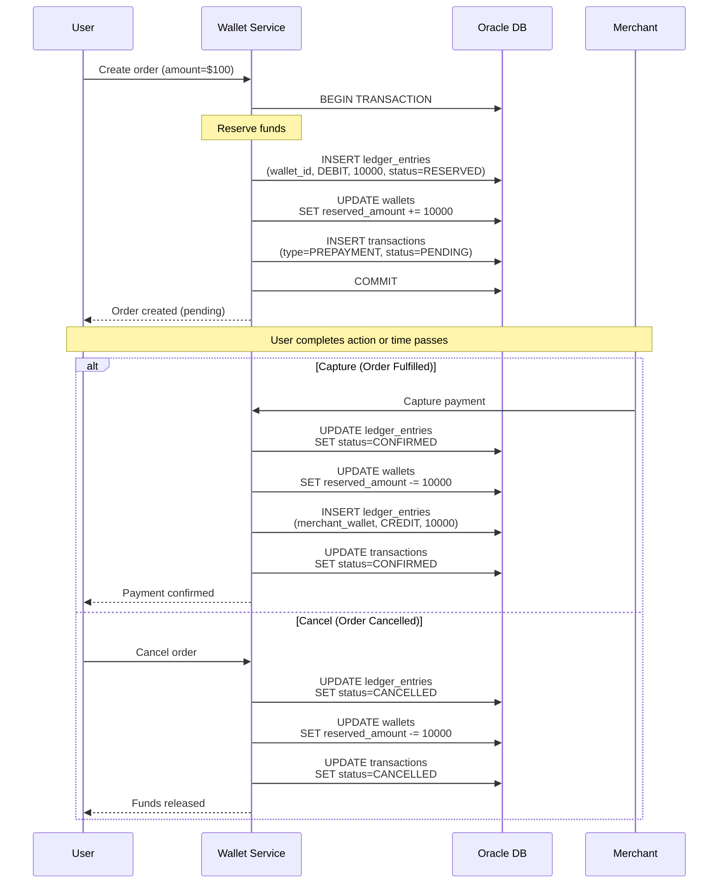
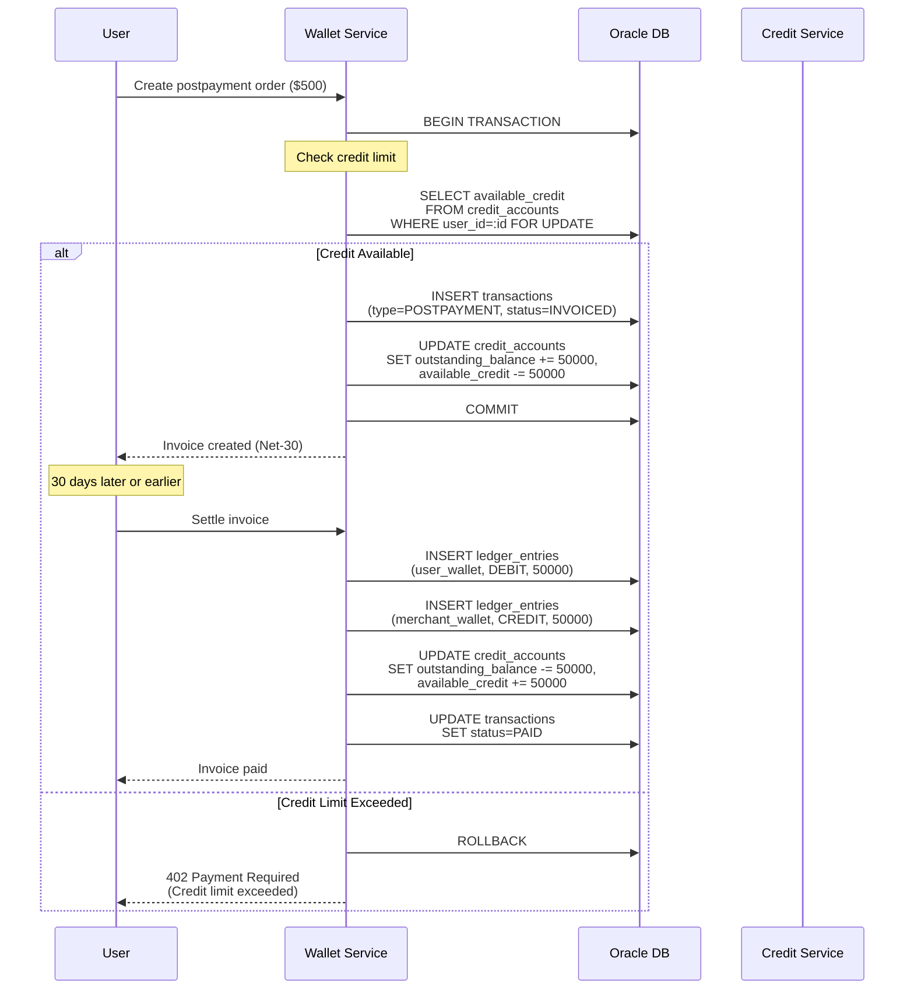
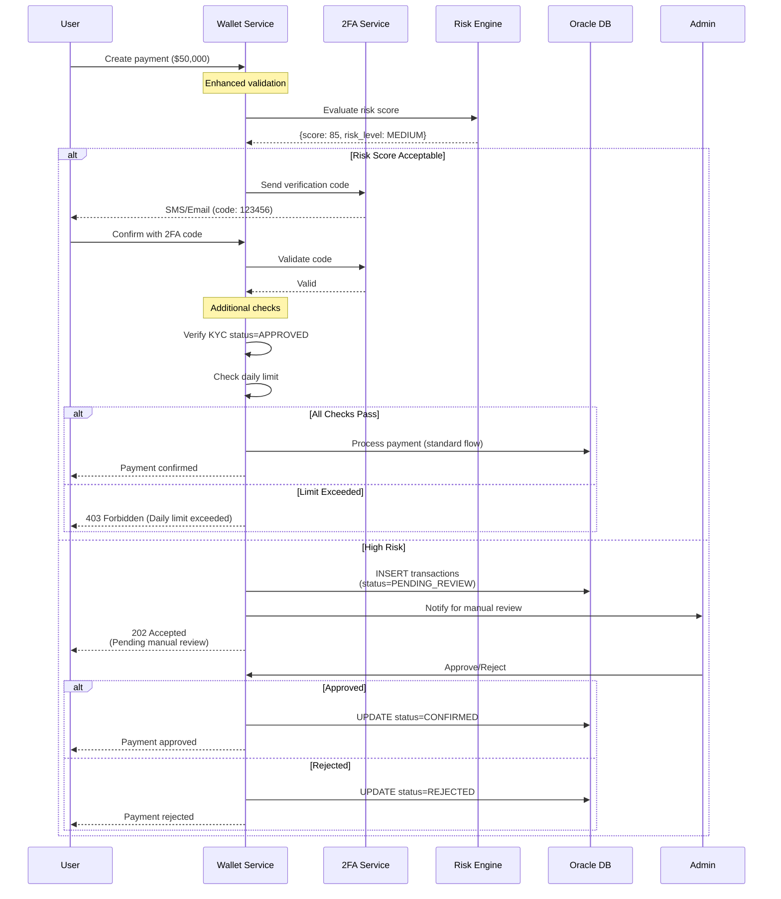
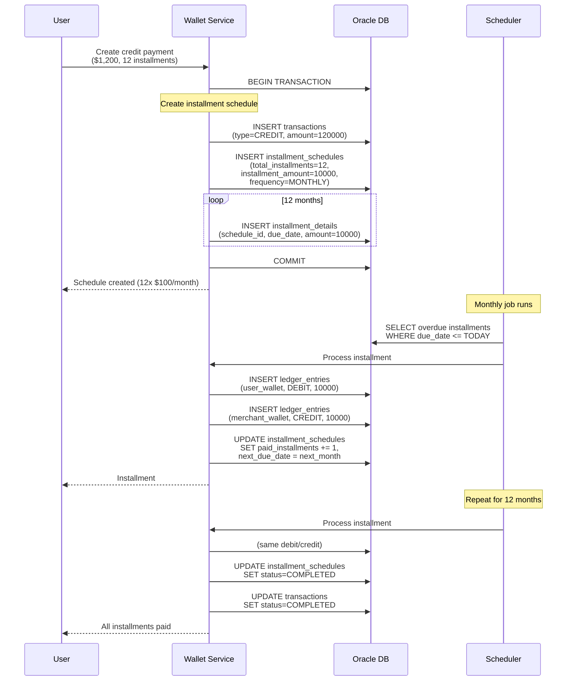

# Payment Types

## Overview

The Wallet Service supports four distinct payment types, each with specific business rules, validation requirements, and processing flows. This document details the implementation requirements for each type.

---

## Payment Type Enum

```java
public enum PaymentType {
    PREPAYMENT,     // Pay before service/product delivery
    POSTPAYMENT,    // Pay after service/invoice received
    VALUABLE,       // High-value transactions with enhanced security
    CREDIT          // Installment/deferred payments
}
```

---

## 1. PREPAYMENT

### Definition
Funds are **reserved** or **charged** before goods/services are delivered.

### Use Cases
- E-commerce purchases
- Hotel reservations
- Event tickets
- Digital goods

### Flow



### Business Rules

| Rule | Description |
|------|-------------|
| **Sufficient Funds** | `available_balance >= amount` |
| **Reservation Window** | Reserved funds released after TTL (e.g., 30 minutes) |
| **Capture Deadline** | Must capture within 7 days |
| **Partial Capture** | Not supported (capture full amount only) |

### Database Records

**Transaction**:
```sql
INSERT INTO transactions (
    id, user_id, amount, currency, payment_type, status,
    source_wallet_id, destination_wallet_id
) VALUES (
    'tx-001', 'user-123', 10000, 'USD', 'PREPAYMENT', 'PENDING',
    'wallet-user', 'wallet-merchant'
);
```

**Ledger (Reserve)**:
```sql
INSERT INTO ledger_entries (transaction_id, wallet_id, entry_type, amount, status)
VALUES ('tx-001', 'wallet-user', 'DEBIT', 10000, 'RESERVED');
```

**Ledger (Capture)**:
```sql
-- Update reserved entry
UPDATE ledger_entries
SET status = 'CONFIRMED'
WHERE transaction_id = 'tx-001' AND status = 'RESERVED';

-- Credit merchant
INSERT INTO ledger_entries (transaction_id, wallet_id, entry_type, amount, status)
VALUES ('tx-001', 'wallet-merchant', 'CREDIT', 10000, 'CONFIRMED');
```

### Idempotency TTL
**5 minutes** (short window for synchronous operations)

---

## 2. POSTPAYMENT

### Definition
Goods/services are delivered first; payment is invoiced and settled later.

### Use Cases
- B2B invoicing
- Subscription billing
- Net-30/60 payment terms
- Corporate accounts

### Flow



### Business Rules

| Rule | Description |
|------|-------------|
| **Credit Check** | `available_credit >= amount` |
| **Credit Limit** | Per-user credit limit configured |
| **Payment Terms** | Net-30, Net-60 (configurable) |
| **Late Fees** | Applied if overdue |
| **No Immediate Debit** | Funds not deducted until settlement |

### Database Records

**Transaction (Invoice Creation)**:
```sql
INSERT INTO transactions (
    id, user_id, amount, currency, payment_type, status
) VALUES (
    'tx-002', 'user-456', 50000, 'USD', 'POSTPAYMENT', 'INVOICED'
);
```

**Credit Account Update**:
```sql
UPDATE credit_accounts
SET outstanding_balance = outstanding_balance + 50000,
    available_credit = credit_limit - (outstanding_balance + 50000)
WHERE user_id = 'user-456';
```

**Ledger (Settlement)**:
```sql
-- Debit user wallet
INSERT INTO ledger_entries (transaction_id, wallet_id, entry_type, amount)
VALUES ('tx-002', 'wallet-user', 'DEBIT', 50000);

-- Credit merchant
INSERT INTO ledger_entries (transaction_id, wallet_id, entry_type, amount)
VALUES ('tx-002', 'wallet-merchant', 'CREDIT', 50000);

-- Update transaction status
UPDATE transactions SET status = 'PAID' WHERE id = 'tx-002';
```

### Idempotency TTL
**30 minutes** (handles retries during invoice generation)

---

## 3. VALUABLE (High-Value Transactions)

### Definition
Transactions exceeding a threshold (e.g., $10,000) requiring enhanced security measures.

### Use Cases
- Large wire transfers
- High-value purchases
- Cryptocurrency exchanges
- Investment transactions

### Flow



### Business Rules

| Rule | Description |
|------|-------------|
| **Threshold** | Amount > $10,000 (configurable) |
| **2FA Required** | Multi-factor authentication mandatory |
| **KYC Required** | User must have `kyc_status = 'APPROVED'` |
| **Risk Scoring** | ML-based fraud detection |
| **Daily Limit** | Maximum valuable transactions per day |
| **Manual Review** | High-risk transactions require admin approval |
| **Cooling Period** | 24-hour delay option for extra security |

### Enhanced Validation

```java
@Service
public class ValuablePaymentValidator {

    public ValidationResult validate(PaymentRequest request, User user) {
        // Check amount threshold
        if (request.getAmount() < VALUABLE_THRESHOLD) {
            return ValidationResult.error("Not a valuable transaction");
        }

        // Check KYC
        if (!user.getKycStatus().equals(KycStatus.APPROVED)) {
            return ValidationResult.error("KYC verification required");
        }

        // Risk scoring
        RiskScore score = riskEngine.evaluate(user, request);
        if (score.getLevel() == RiskLevel.HIGH) {
            return ValidationResult.requiresManualReview();
        }

        // Daily limit check
        BigDecimal dailyTotal = getDailyValuableTotal(user.getId());
        if (dailyTotal.add(request.getAmount()).compareTo(DAILY_LIMIT) > 0) {
            return ValidationResult.error("Daily limit exceeded");
        }

        return ValidationResult.success();
    }
}
```

### Database Records

**Transaction (Pending Review)**:
```sql
INSERT INTO transactions (
    id, user_id, amount, currency, payment_type, status, metadata
) VALUES (
    'tx-003', 'user-789', 5000000, 'USD', 'VALUABLE', 'PENDING_REVIEW',
    '{"risk_score": 85, "2fa_verified": true, "reviewer": null}'
);
```

### Idempotency TTL
**24 hours** (allows for review period and retries)

---

## 4. CREDIT (Installment Payments)

### Definition
Payment split into multiple installments over time (e.g., 12 monthly payments).

### Use Cases
- Buy-now-pay-later (BNPL)
- Loan repayments
- Subscription financing
- Equipment leasing

### Flow



### Business Rules

| Rule | Description |
|------|-------------|
| **Installment Count** | 3, 6, 12, 24 months (configurable) |
| **Frequency** | WEEKLY, BIWEEKLY, MONTHLY, QUARTERLY |
| **Installment Amount** | `total_amount / installments` (rounded) |
| **Interest Rate** | Optional APR (e.g., 0%, 5%, 15%) |
| **Late Fee** | Applied if installment overdue > 7 days |
| **Early Payment** | Allowed (pay remaining balance) |
| **Default Handling** | After 3 missed payments, account suspended |

### Database Records

**Transaction**:
```sql
INSERT INTO transactions (
    id, user_id, amount, currency, payment_type, status
) VALUES (
    'tx-004', 'user-999', 120000, 'USD', 'CREDIT', 'ACTIVE'
);
```

**Installment Schedule**:
```sql
INSERT INTO installment_schedules (
    id, transaction_id, total_installments, installment_amount,
    frequency, next_due_date, status
) VALUES (
    'sched-001', 'tx-004', 12, 10000,
    'MONTHLY', '2025-02-01', 'ACTIVE'
);
```

**Processing Installment (Monthly)**:
```sql
-- Debit user
INSERT INTO ledger_entries (transaction_id, wallet_id, entry_type, amount)
VALUES ('tx-004', 'wallet-user', 'DEBIT', 10000);

-- Credit merchant
INSERT INTO ledger_entries (transaction_id, wallet_id, entry_type, amount)
VALUES ('tx-004', 'wallet-merchant', 'CREDIT', 10000);

-- Update schedule
UPDATE installment_schedules
SET paid_installments = paid_installments + 1,
    next_due_date = ADD_MONTHS(next_due_date, 1)
WHERE id = 'sched-001';
```

### Amortization Schedule Example

| Month | Due Date | Amount | Principal | Interest | Balance |
|-------|----------|--------|-----------|----------|---------|
| 1 | 2025-02-01 | $100.00 | $95.00 | $5.00 | $1,105.00 |
| 2 | 2025-03-01 | $100.00 | $95.40 | $4.60 | $1,009.60 |
| ... | ... | ... | ... | ... | ... |
| 12 | 2026-01-01 | $100.00 | $99.58 | $0.42 | $0.00 |

### Idempotency TTL
**24 hours** (allows for retry during schedule creation)

---

## Payment Type Configuration

### Application Properties
```yaml
wallet:
  payment:
    types:
      prepayment:
        enabled: true
        reservation-ttl: 30m
        capture-deadline: 7d
        idempotency-ttl: 5m
      postpayment:
        enabled: true
        default-terms: NET_30
        late-fee-rate: 0.05
        idempotency-ttl: 30m
      valuable:
        enabled: true
        threshold: 10000.00
        require-2fa: true
        require-kyc: true
        daily-limit: 100000.00
        idempotency-ttl: 24h
      credit:
        enabled: true
        allowed-installments: [3, 6, 12, 24]
        default-frequency: MONTHLY
        interest-rate: 0.0
        late-fee: 25.00
        idempotency-ttl: 24h
```

---

## Discount Code Validation (All Payment Types)

All payment types support discount codes with enhanced eligibility validation. Discounts are applied **before** final amount calculation.

### Discount Validation Flow

```java
@Service
public class DiscountCodeValidator {

    public DiscountValidationResult validate(String code, User user, BigDecimal amount) {
        // 1. Check discount code exists and is active
        DiscountCode discount = discountCodeRepository.findByCode(code)
            .orElseThrow(() -> new InvalidDiscountException("Code not found"));

        if (!discount.getStatus().equals(Status.ACTIVE)) {
            return DiscountValidationResult.error("Code is not active");
        }

        // 2. Check expiry date
        if (discount.getExpiryDate().isBefore(LocalDateTime.now())) {
            return DiscountValidationResult.error("Code has expired");
        }

        // 3. Check usage limits
        if (discount.getUsageCount() >= discount.getMaxUsage()) {
            return DiscountValidationResult.error("Code usage limit reached");
        }

        // 4. Check per-user usage limit
        int userUsageCount = getUserUsageCount(user.getId(), discount.getId());
        if (userUsageCount >= discount.getMaxPerUser()) {
            return DiscountValidationResult.error("User usage limit reached");
        }

        // 5. Check minimum amount requirement
        if (amount.compareTo(discount.getMinAmount()) < 0) {
            return DiscountValidationResult.error("Amount below minimum");
        }

        // 6. **NEW: Check eligibility (if RESTRICTED)**
        if (discount.getEligibilityType().equals(EligibilityType.RESTRICTED)) {
            boolean eligible = checkEligibility(discount.getId(), user);
            if (!eligible) {
                return DiscountValidationResult.error("User not eligible for this code");
            }
        }

        // 7. Calculate discount amount
        BigDecimal discountAmount = calculateDiscount(discount, amount);

        return DiscountValidationResult.success(discountAmount);
    }

    private boolean checkEligibility(UUID discountCodeId, User user) {
        List<DiscountCodeEligibility> eligibilities =
            eligibilityRepository.findByDiscountCodeId(discountCodeId);

        // If no eligibilities defined, no one is eligible
        if (eligibilities.isEmpty()) {
            return false;
        }

        // User matches if ANY eligibility rule matches
        return eligibilities.stream().anyMatch(eligibility -> {
            switch (eligibility.getEligibilityType()) {
                case SPECIFIC_USER:
                    return user.getId().equals(eligibility.getUserId());

                case SPECIFIC_BUSINESS:
                    return user.getBusinessId() != null &&
                           user.getBusinessId().equals(eligibility.getBusinessId());

                case EMAIL_DOMAIN:
                    return user.getEmail().endsWith(eligibility.getUserEmail());

                case USER_ROLE:
                    return user.getRole().equals(eligibility.getUserEmail()); // role stored in user_email

                default:
                    return false;
            }
        });
    }
}
```

### Eligibility Types

| Eligibility Type | Description | Example |
|------------------|-------------|---------|
| **ALL_USERS** | Public code anyone can use | "SUMMER20" - 20% off for all users |
| **SPECIFIC_USER** | Only specific users can use | "VIP50" - Only for users: john, jane, bob |
| **SPECIFIC_BUSINESS** | All employees of a business | "ACME25" - All Acme Corp employees |
| **EMAIL_DOMAIN** | Users with matching email domain | "STUDENT10" - All @university.edu emails |
| **USER_ROLE** | Users with specific role | "PREMIUM15" - Only PREMIUM role users |

### Discount Application Example

```java
// Original amount: $100.00
BigDecimal amount = new BigDecimal("100.00");

// User applies discount code "VIP50" (50% off, max $30)
DiscountCode discount = discountCodeRepository.findByCode("VIP50");

// Check eligibility (user must be in eligibility list)
if (discount.getEligibilityType().equals(EligibilityType.RESTRICTED)) {
    boolean eligible = checkEligibility(discount.getId(), user);
    if (!eligible) {
        throw new DiscountNotEligibleException("User not eligible for VIP50");
    }
}

// Calculate discount
BigDecimal discountAmount;
if (discount.getDiscountType().equals(DiscountType.PERCENTAGE)) {
    discountAmount = amount.multiply(discount.getDiscountValue())
                          .divide(new BigDecimal("100"), RoundingMode.HALF_UP);
} else {
    discountAmount = discount.getDiscountValue();
}

// Cap at max_discount
if (discountAmount.compareTo(discount.getMaxDiscount()) > 0) {
    discountAmount = discount.getMaxDiscount();
}

// Final amount: $100.00 - $30.00 = $70.00
BigDecimal finalAmount = amount.subtract(discountAmount);
```

### Database Records with Discount

**Transaction with Discount**:
```sql
INSERT INTO transactions (
    id, user_id, amount, currency, payment_type, status,
    discount_code_id, discount_amount, final_amount
) VALUES (
    'tx-005', 'user-123', 10000, 'USD', 'PREPAYMENT', 'PENDING',
    'disc-vip50', 3000, 7000  -- $100.00 - $30.00 = $70.00
);
```

**Update Usage Count**:
```sql
UPDATE discount_codes
SET usage_count = usage_count + 1
WHERE id = 'disc-vip50';
```

---

## Validation Matrix

| Check | PREPAYMENT | POSTPAYMENT | VALUABLE | CREDIT |
|-------|------------|-------------|----------|--------|
| **Sufficient Balance** | ✅ | ❌ | ✅ | ✅ (1st) |
| **Credit Limit** | ❌ | ✅ | ❌ | ✅ |
| **KYC Verified** | ❌ | ❌ | ✅ | ✅ |
| **2FA** | ❌ | ❌ | ✅ | ❌ |
| **Risk Scoring** | ❌ | ❌ | ✅ | ✅ |
| **Daily Limit** | ❌ | ❌ | ✅ | ❌ |
| **Discount Eligibility** | ✅ | ✅ | ✅ | ✅ |

---

## State Transitions

### PREPAYMENT States
```
PENDING → CONFIRMED (captured)
PENDING → CANCELLED (cancelled)
PENDING → EXPIRED (timeout)
```

### POSTPAYMENT States
```
INVOICED → PAID (settled)
INVOICED → OVERDUE (past due date)
OVERDUE → DEFAULTED (>90 days)
```

### VALUABLE States
```
PENDING → PENDING_REVIEW (high risk)
PENDING_REVIEW → CONFIRMED (approved)
PENDING_REVIEW → REJECTED (denied)
PENDING → CONFIRMED (low risk, auto-approved)
```

### CREDIT States
```
ACTIVE → COMPLETED (all paid)
ACTIVE → DEFAULTED (3+ missed)
ACTIVE → EARLY_PAID (paid off early)
```

---

## Next Steps

- Review [Data Flows](../01-architecture/data-flows.md) for sequence diagrams
- See [API Specification](../03-api-specification/payment-apis.md) for endpoint details
- Explore [Idempotency Pattern](../06-design-patterns/idempotency-deduplication.md) for TTL configuration
