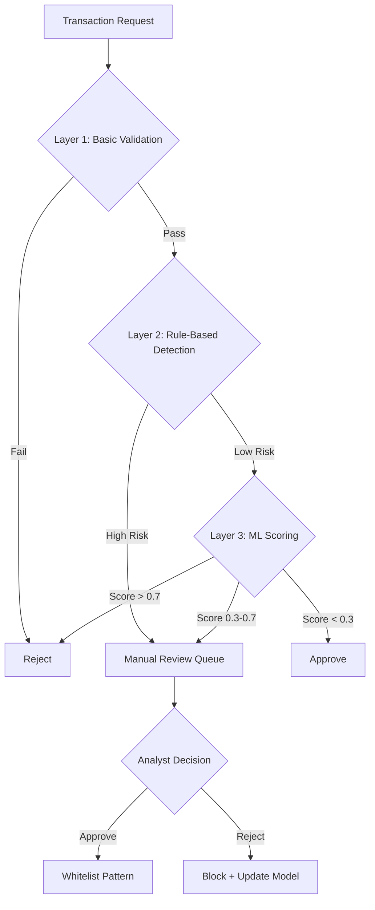
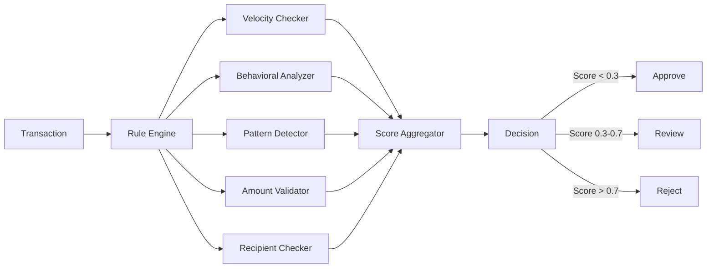
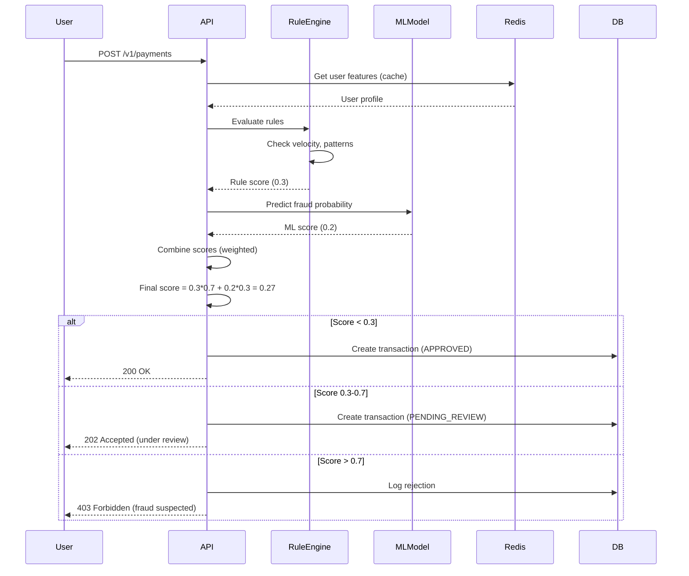
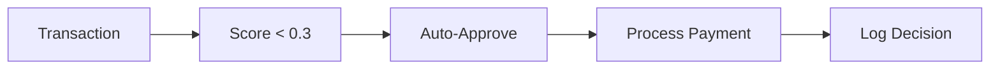
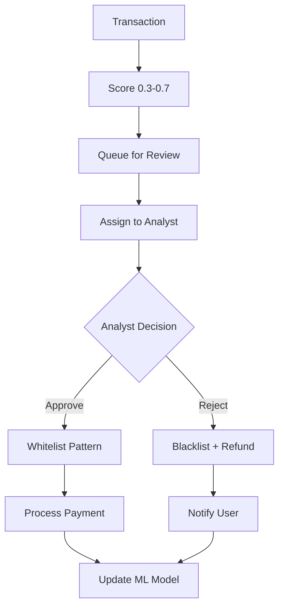
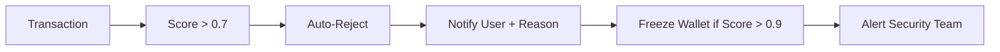

# Fraud Detection System Specification

**Version**: 1.0
**Last Updated**: October 2025
**Owner**: Security Team
**Status**: Approved for Implementation

---

## Table of Contents

1. [Overview](#overview)
2. [Fraud Detection Strategy](#fraud-detection-strategy)
3. [Rule-Based Detection Engine](#rule-based-detection-engine)
4. [Machine Learning Model](#machine-learning-model)
5. [Real-Time Scoring System](#real-time-scoring-system)
6. [Alert Workflows](#alert-workflows)
7. [False Positive Handling](#false-positive-handling)
8. [Performance Requirements](#performance-requirements)
9. [Integration Points](#integration-points)
10. [Monitoring & Metrics](#monitoring--metrics)

---

## Overview

### Purpose
Implement a hybrid fraud detection system combining rule-based and machine learning approaches to identify and prevent fraudulent transactions in real-time while minimizing false positives.

### Scope
- **In Scope**: Transaction fraud, account takeover, identity theft, payment fraud
- **Out of Scope**: Internal fraud (employee), physical card fraud (no cards)

### Design Principles
- **Real-time**: Decisions within 100ms for standard transactions
- **Adaptive**: ML model updates weekly based on new fraud patterns
- **Transparent**: Clear explanations for fraud flags
- **Auditable**: All decisions logged immutably

---

## Fraud Detection Strategy

### Multi-Layer Approach



### Risk Tiers

| Tier | Score Range | Action | SLA |
|------|-------------|--------|-----|
| **Low** | 0.0 - 0.3 | Auto-approve | <100ms |
| **Medium** | 0.3 - 0.7 | Manual review | <30 min |
| **High** | 0.7 - 1.0 | Auto-reject + notify | <100ms |

---

## Rule-Based Detection Engine

### Rule Categories

#### 1. Velocity Rules

**Rule FR-01: Transaction Velocity Check**
```yaml
name: high_transaction_velocity
description: Detect unusually high transaction rate
conditions:
  - count: >5 transactions
    window: 10 minutes
    per: user_id
actions:
  - flag: VELOCITY_ANOMALY
  - score_increase: 0.3
  - require: additional_verification
threshold: MEDIUM
```

**Rule FR-02: Amount Velocity Check**
```yaml
name: high_amount_velocity
description: Detect large transaction volume in short time
conditions:
  - sum: >$10,000
    window: 1 hour
    per: user_id
actions:
  - flag: AMOUNT_VELOCITY
  - score_increase: 0.4
  - require: 2fa_verification
threshold: HIGH
```

**Rule FR-03: First Transaction Velocity**
```yaml
name: first_transaction_high_value
description: New account with immediate high-value transaction
conditions:
  - account_age: <24 hours
  - transaction_amount: >$5,000
actions:
  - flag: NEW_ACCOUNT_HIGH_VALUE
  - score_increase: 0.5
  - action: manual_review
threshold: HIGH
```

---

#### 2. Behavioral Rules

**Rule FR-10: Unusual Transaction Hour**
```yaml
name: unusual_hour_transaction
description: Transaction outside user's normal active hours
algorithm:
  - calculate: user_active_hours (7-day rolling average)
  - current_hour: transaction timestamp hour
  - if: current_hour NOT IN user_active_hours
conditions:
  - amount: >$1,000
  - time_deviation: >6 hours from norm
actions:
  - flag: UNUSUAL_HOUR
  - score_increase: 0.2
  - send: email_notification
threshold: LOW
```

**Rule FR-11: Device Fingerprint Change**
```yaml
name: new_device_high_value
description: High-value transaction from new device
conditions:
  - device_fingerprint: NOT IN user_known_devices
  - amount: >$2,000
  - last_device_change: >7 days ago
actions:
  - flag: NEW_DEVICE
  - score_increase: 0.3
  - require: email_confirmation
threshold: MEDIUM
```

**Rule FR-12: Location Impossible Travel**
```yaml
name: impossible_travel
description: Geolocation change impossible in given time
algorithm:
  - last_location: (lat1, lon1, time1)
  - current_location: (lat2, lon2, time2)
  - distance_km: haversine(lat1, lon1, lat2, lon2)
  - time_diff_hours: (time2 - time1) / 3600
  - speed_kmh: distance_km / time_diff_hours
conditions:
  - speed_kmh: >500 (max commercial flight speed)
actions:
  - flag: IMPOSSIBLE_TRAVEL
  - score_increase: 0.6
  - action: manual_review
threshold: HIGH
```

---

#### 3. Pattern Rules

**Rule FR-20: Round Amount Pattern**
```yaml
name: suspicious_round_amounts
description: Multiple round-number transactions (money laundering indicator)
conditions:
  - count: >3 transactions
  - window: 24 hours
  - amounts: [1000, 2000, 5000, 10000] (round multiples)
  - same: destination_wallet
actions:
  - flag: STRUCTURING_PATTERN
  - score_increase: 0.5
  - alert: aml_team
threshold: HIGH
```

**Rule FR-21: Rapid Wallet Drain**
```yaml
name: rapid_wallet_drain
description: Multiple small withdrawals draining wallet
conditions:
  - count: >10 transactions
  - window: 30 minutes
  - type: withdrawal
  - total_amount: >80% of wallet_balance
actions:
  - flag: ACCOUNT_TAKEOVER
  - score_increase: 0.7
  - action: freeze_wallet
threshold: CRITICAL
```

**Rule FR-22: Splitting Pattern**
```yaml
name: transaction_splitting
description: Single large amount split into multiple to avoid limits
algorithm:
  - detect: multiple transactions
  - window: 10 minutes
  - total_sum: just_below_threshold ($9,900 vs $10,000 limit)
conditions:
  - count: >3
  - sum: between 0.9x and 0.99x of limit
actions:
  - flag: STRUCTURING
  - score_increase: 0.6
  - report: regulatory_team
threshold: HIGH
```

---

#### 4. Amount-Based Rules

**Rule FR-30: Sudden Amount Increase**
```yaml
name: amount_spike
description: Transaction significantly above user's normal pattern
algorithm:
  - user_avg_30d: average transaction amount (30 days)
  - user_max_30d: maximum transaction amount (30 days)
  - current_amount: transaction amount
conditions:
  - current_amount: >5x user_avg_30d
  - OR current_amount: >2x user_max_30d
actions:
  - flag: AMOUNT_ANOMALY
  - score_increase: 0.3
  - require: additional_verification
threshold: MEDIUM
```

**Rule FR-31: High-Value Transaction**
```yaml
name: high_value_threshold
description: Absolute high-value transaction check
conditions:
  - amount: >$50,000
actions:
  - flag: HIGH_VALUE
  - score_increase: 0.2
  - require: compliance_review
  - require: 2fa
threshold: LOW
```

---

#### 5. Recipient Rules

**Rule FR-40: New Recipient High Value**
```yaml
name: new_recipient_large_amount
description: First-time transaction to recipient with high amount
conditions:
  - recipient: NOT IN user_previous_recipients
  - amount: >$5,000
actions:
  - flag: NEW_RECIPIENT_HIGH_VALUE
  - score_increase: 0.4
  - delay: 24_hours_hold
  - notify: user_via_email
threshold: MEDIUM
```

**Rule FR-41: Blacklisted Recipient**
```yaml
name: known_fraudster_recipient
description: Recipient on fraud blacklist
data_source: fraud_blacklist_table
conditions:
  - destination_wallet_id: IN fraud_blacklist
actions:
  - flag: BLACKLISTED_RECIPIENT
  - score_increase: 1.0
  - action: reject_transaction
  - alert: security_team
threshold: CRITICAL
```

---

### Rule Engine Architecture



### Rule Execution Order
1. **Blacklist Check** (immediate reject if hit)
2. **Velocity Rules** (fast, in-memory checks)
3. **Amount Rules** (simple comparisons)
4. **Behavioral Rules** (require historical data)
5. **Pattern Rules** (complex analysis)

---

## Machine Learning Model

### Phase 1: Gradient Boosting Classifier (Launch)

**Model**: XGBoost Binary Classifier

**Target Variable**: `is_fraud` (0 = legitimate, 1 = fraud)

#### Feature Engineering

**User Features**:
```python
features_user = [
    'account_age_days',
    'kyc_level',  # 0=none, 1=basic, 2=standard, 3=enhanced
    'total_transactions_count',
    'total_transaction_volume_usd',
    'avg_transaction_amount_30d',
    'max_transaction_amount_30d',
    'unique_recipients_count_30d',
    'days_since_last_transaction',
    'fraud_reports_count',  # times user reported fraud
    'chargebacks_count'
]
```

**Transaction Features**:
```python
features_transaction = [
    'amount_usd',
    'amount_to_avg_ratio',  # current / user_avg_30d
    'amount_to_max_ratio',  # current / user_max_30d
    'is_round_amount',  # boolean
    'hour_of_day',
    'day_of_week',
    'is_weekend',
    'is_unusual_hour',  # outside user's normal hours
    'transaction_count_last_10min',
    'transaction_count_last_1hour',
    'transaction_volume_last_24hour'
]
```

**Recipient Features**:
```python
features_recipient = [
    'is_new_recipient',  # boolean
    'recipient_transaction_count',  # how many times paid before
    'recipient_fraud_rate',  # % of transactions to this recipient that were fraud
    'recipient_chargeback_rate',
    'recipient_account_age_days'
]
```

**Device & Location Features**:
```python
features_device_location = [
    'is_new_device',
    'device_change_count_30d',
    'distance_from_last_transaction_km',
    'is_impossible_travel',
    'country_risk_score',  # based on fraud statistics per country
    'ip_risk_score'  # VPN, proxy, datacenter IP scores
]
```

**Total Features**: 35 features

#### Model Training

**Training Data**:
```yaml
dataset:
  size: 10M transactions
  fraud_rate: 0.5% (50K fraud samples)
  class_imbalance: handled via SMOTE (Synthetic Minority Oversampling)
  time_period: last 12 months
  split:
    train: 70% (7M)
    validation: 15% (1.5M)
    test: 15% (1.5M)
```

**Hyperparameters**:
```python
xgb_params = {
    'max_depth': 6,
    'learning_rate': 0.1,
    'n_estimators': 100,
    'subsample': 0.8,
    'colsample_bytree': 0.8,
    'scale_pos_weight': 100,  # handle class imbalance
    'objective': 'binary:logistic',
    'eval_metric': ['auc', 'logloss']
}
```

**Training Process**:
1. Load historical transaction data
2. Apply SMOTE to balance classes
3. Train XGBoost model
4. Validate on holdout set
5. Calibrate probability thresholds
6. Save model artifact (ONNX format)

#### Model Performance Targets

| Metric | Target | Rationale |
|--------|--------|-----------|
| **Precision** | >90% | Minimize false positives (user friction) |
| **Recall** | >70% | Catch 70%+ of fraud |
| **F1 Score** | >0.78 | Balance precision and recall |
| **AUC-ROC** | >0.95 | Overall discrimination ability |
| **Inference Time** | <20ms | Real-time scoring requirement |

#### Model Explainability

**SHAP Values**: For each fraud prediction, generate SHAP explanations
```python
import shap
explainer = shap.TreeExplainer(model)
shap_values = explainer.shap_values(transaction_features)

# Top 3 contributing features
top_features = sorted(zip(features, shap_values), key=lambda x: abs(x[1]), reverse=True)[:3]
```

**Example Output**:
```
Transaction flagged as fraud (score: 0.82)
Top reasons:
1. is_impossible_travel = True (+0.35)
2. amount_to_avg_ratio = 15.2 (+0.28)
3. is_new_recipient = True (+0.19)
```

---

### Phase 2: Deep Learning Model (Future)

**Model**: LSTM + Attention Mechanism

**Architecture**:
```
Input: Sequence of last 50 transactions
↓
LSTM Layer (128 units)
↓
Attention Layer (learn which transactions are important)
↓
Dense Layer (64 units, ReLU)
↓
Dropout (0.3)
↓
Output Layer (1 unit, Sigmoid)
```

**Advantages**:
- Captures temporal patterns
- Learns long-term dependencies
- Better at detecting evolving fraud schemes

**Timeline**: Q2 2026 (after 6 months of XGBoost baseline)

---

## Real-Time Scoring System

### Scoring Pipeline



### Score Combination

**Weighted Average**:
```
final_score = (rule_score * 0.7) + (ml_score * 0.3)
```

**Rationale**:
- Rules are more interpretable and auditable (70% weight)
- ML catches novel patterns (30% weight)
- Can adjust weights based on performance

---

## Alert Workflows

### Auto-Approve (Score < 0.3)


**SLA**: <100ms
**Actions**: None required

---

### Manual Review (Score 0.3 - 0.7)


**SLA**: <30 minutes during business hours, <2 hours off-hours
**Escalation**: If no decision in SLA, auto-approve for amounts <$1K

---

### Auto-Reject (Score > 0.7)


**SLA**: <100ms
**User Communication**: Email + in-app notification with reason

---

## False Positive Handling

### Challenges
- Legitimate high-value transactions flagged
- Users traveling trigger location alerts
- New device/recipient patterns

### Mitigation Strategies

#### 1. User Whitelisting
```sql
CREATE TABLE user_whitelist (
  id RAW(16) PRIMARY KEY,
  user_id RAW(16) REFERENCES users(id),
  whitelist_type VARCHAR2(50),  -- RECIPIENT, DEVICE, LOCATION, AMOUNT
  whitelist_value VARCHAR2(500), -- recipient_id, device_fingerprint, country_code, etc.
  created_at TIMESTAMP,
  expires_at TIMESTAMP
);
```

**Example**:
```
User frequently sends $10K to recipient-X → Add to whitelist
Next $10K transaction to recipient-X → Bypass recipient rule
```

#### 2. Pre-Authorization Flow
```
User wants to send $50K (high value)
↓
System detects potential flag
↓
Show confirmation: "This is a high-value transaction. We'll send a code to your email."
↓
User enters code
↓
Transaction approved with reduced fraud score
```

#### 3. Gradual Trust Building
```yaml
trust_levels:
  new_account:
    limit: $1,000/day
    fraud_score_multiplier: 1.5

  verified_account:
    limit: $10,000/day
    fraud_score_multiplier: 1.0

  trusted_account:  # 6+ months, 0 fraud
    limit: $50,000/day
    fraud_score_multiplier: 0.7
```

#### 4. Feedback Loop
```
User reports "This was legitimate" on flagged transaction
↓
Analyst reviews
↓
If confirmed legitimate → Update whitelist + retrain model
```

---

## Performance Requirements

### Latency

| Component | Target | P99 |
|-----------|--------|-----|
| Rule Engine | <50ms | <80ms |
| ML Model Inference | <20ms | <30ms |
| Total Fraud Check | <100ms | <150ms |

### Throughput

| Load | Target | Capacity |
|------|--------|----------|
| Peak TPS | 15,000 TPS | 20,000 TPS (buffer) |
| Concurrent Checks | 15,000 | Horizontal scaling |

### Availability

| Metric | Target |
|--------|--------|
| Uptime | 99.99% |
| Degradation Mode | If ML unavailable, rule-only (slower but functional) |

---

## Integration Points

### 1. Payment API
```
POST /v1/payments → Fraud check before processing
```

### 2. User Service
```
GET /v1/users/{id}/profile → Fetch user features for scoring
```

### 3. ML Model Service
```
POST /internal/ml/fraud-predict
{
  "features": {...}
}

Response:
{
  "fraud_probability": 0.23,
  "model_version": "1.2.0",
  "inference_time_ms": 18
}
```

### 4. Alert Service
```
POST /internal/alerts/fraud
{
  "transaction_id": "tx-001",
  "score": 0.65,
  "flags": ["VELOCITY_ANOMALY", "NEW_RECIPIENT"],
  "priority": "MEDIUM"
}
```

---

## Monitoring & Metrics

### Business Metrics

```yaml
metrics:
  fraud_detection_rate:
    description: % of fraud caught
    target: >70%
    query: (detected_fraud / total_fraud) * 100

  false_positive_rate:
    description: % of legitimate transactions flagged
    target: <5%
    query: (false_positives / total_legitimate) * 100

  precision:
    description: Of flagged transactions, % actually fraud
    target: >90%
    query: true_positives / (true_positives + false_positives)

  recall:
    description: Of actual fraud, % detected
    target: >70%
    query: true_positives / (true_positives + false_negatives)
```

### Technical Metrics

```yaml
metrics:
  rule_engine_latency:
    description: Time to evaluate all rules
    target: <50ms
    percentiles: [p50, p95, p99]

  ml_inference_latency:
    description: Time for ML prediction
    target: <20ms
    percentiles: [p50, p95, p99]

  model_drift:
    description: Change in prediction distribution
    target: <10% weekly change
    alert_if: >15% change
```

### Alerts

```yaml
alerts:
  - name: high_false_positive_rate
    condition: false_positive_rate > 10%
    severity: WARNING
    action: notify_fraud_team

  - name: model_degradation
    condition: fraud_detection_rate < 60%
    severity: CRITICAL
    action: page_on_call

  - name: high_fraud_rate
    condition: total_fraud_attempts > 1000/hour
    severity: WARNING
    action: increase_scrutiny_level
```

---

## Implementation Checklist

### Phase 1: Rule Engine (Weeks 1-2)
- [ ] Implement velocity rules (FR-01, FR-02, FR-03)
- [ ] Implement behavioral rules (FR-10, FR-11, FR-12)
- [ ] Implement pattern rules (FR-20, FR-21, FR-22)
- [ ] Implement amount rules (FR-30, FR-31)
- [ ] Implement recipient rules (FR-40, FR-41)
- [ ] Build score aggregator
- [ ] Add logging and metrics
- [ ] Integration testing

### Phase 2: ML Model (Weeks 3-5)
- [ ] Data collection pipeline
- [ ] Feature engineering
- [ ] Model training (XGBoost)
- [ ] Model evaluation and tuning
- [ ] Model deployment (ONNX export)
- [ ] API endpoint for predictions
- [ ] Monitoring dashboard
- [ ] A/B testing framework

### Phase 3: Integration (Week 6)
- [ ] Integrate fraud check in payment flow
- [ ] Build manual review queue UI
- [ ] Analyst training
- [ ] User communication templates
- [ ] Feedback loop implementation
- [ ] Performance testing
- [ ] Security audit

### Phase 4: Launch (Week 7)
- [ ] Phased rollout (10% → 50% → 100%)
- [ ] Monitor metrics daily
- [ ] Tune thresholds based on feedback
- [ ] Weekly model retraining
- [ ] Incident response procedures

---

## Related Documentation

- [Security Architecture](./security-architecture.md)
- [Rate Limiting Specifications](./rate-limiting-specs.md)
- [Payment APIs](../03-api-specification/payment-apis.md)
- [Monitoring Dashboards](../05-operations/monitoring-dashboards.md)

---

## Change History

| Version | Date | Changes | Author |
|---------|------|---------|--------|
| 1.0 | 2025-10-21 | Initial specification | Claude |

---

**Status**: Ready for Implementation
**Review Required**: Security Team, Data Science Team
**Approval**: Chief Security Officer
