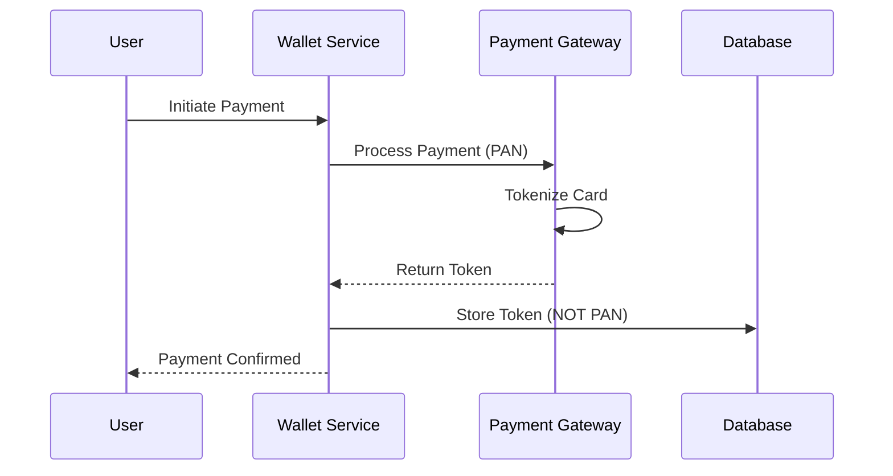

# PCI-DSS Compliance

## Overview

Payment Card Industry Data Security Standard (PCI-DSS) compliance requirements and implementation strategies for the Wallet Service.

---

## Scope Minimization

**Strategy**: The Wallet Service DOES NOT store Primary Account Numbers (PAN). All card data is tokenized by payment gateway.

### Out of Scope
- ✅ No card data storage (PAN, CVV, expiry)
- ✅ No processing of magnetic stripe data
- ✅ No storage of authentication data after authorization

### In Scope
- Transaction metadata (amount, timestamp, status)
- Tokenized payment references
- User identification
- Audit trails

---

## PCI-DSS Requirements Mapping

| Requirement | Implementation | Status |
|-------------|----------------|--------|
| **1. Firewall Configuration** | Kubernetes network policies, AWS Security Groups | ✅ |
| **2. No Default Passwords** | All secrets in KMS, rotation policy | ✅ |
| **3. Protect Stored Data** | AES-256 encryption, no PAN storage | ✅ |
| **4. Encrypt Transmission** | TLS 1.3, mTLS for B2B | ✅ |
| **5. Antivirus** | Container scanning, Snyk vulnerability checks | ✅ |
| **6. Secure Systems** | Patching policy, hardened containers | ✅ |
| **7. Access Control** | RBAC, least privilege, OAuth 2.0 | ✅ |
| **8. Unique IDs** | Individual user accounts, no shared credentials | ✅ |
| **9. Physical Access** | Cloud provider responsibility (AWS/GCP) | ✅ |
| **10. Logging & Monitoring** | Immutable audit logs, SIEM integration | ✅ |
| **11. Security Testing** | Penetration testing quarterly | ✅ |
| **12. Security Policy** | Documented security policies | ✅ |

---

## Tokenization Flow

**Key Point**: Payment gateway handles PAN; we only receive and store tokens.

---

## Audit & Compliance

- **Annual Assessment**: PCI-DSS SAQ (Self-Assessment Questionnaire) Type D
- **Quarterly Scanning**: ASV (Approved Scanning Vendor) scans
- **Penetration Testing**: Annual by PCI-certified tester
- **Attestation of Compliance (AOC)**: Provided to merchants

---

See [Security Architecture](./security-architecture.md) for encryption and access control implementation details.
