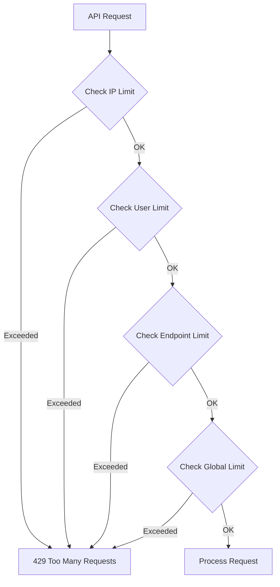

# Rate Limiting Specifications

**Version**: 1.0
**Last Updated**: October 2025
**Owner**: Security Team / API Team
**Status**: Approved for Implementation

---

## Table of Contents

1. [Overview](#overview)
2. [Rate Limiting Strategy](#rate-limiting-strategy)
3. [Per-Endpoint Limits](#per-endpoint-limits)
4. [Per-User Limits](#per-user-limits)
5. [Per-IP Limits](#per-ip-limits)
6. [Implementation Algorithm](#implementation-algorithm)
7. [Response Headers](#response-headers)
8. [Quota Management](#quota-management)
9. [Burst Handling](#burst-handling)
10. [Monitoring & Alerts](#monitoring--alerts)

---

## Overview

### Purpose
Protect the Wallet Service from abuse, denial-of-service attacks, and ensure fair resource allocation across all users.

### Design Principles
- **Fair**: Prevent single user from monopolizing resources
- **Predictable**: Clear limits communicated in headers
- **Graceful**: Smooth handling of burst traffic
- **Flexible**: Different limits per operation criticality

### Rate Limiting Dimensions
1. **Per-Endpoint**: Different limits per API operation
2. **Per-User**: Authenticated user limits
3. **Per-IP**: Unauthenticated or additional protection
4. **Global**: System-wide circuit breaker

---

## Rate Limiting Strategy

### Multi-Tier Approach



### Algorithm: Sliding Window Log

**Why Sliding Window?**
- More accurate than fixed window
- Prevents burst at window boundaries
- Smooth rate limiting

**Implementation**:
```
Redis Key: "ratelimit:user:{user_id}:{endpoint}"
Value: Sorted Set of timestamps

On Request:
1. Current time: now
2. Window start: now - window_size
3. Remove timestamps < window_start
4. Count remaining timestamps
5. If count < limit:
   - Add current timestamp
   - Allow request
6. Else:
   - Reject with 429
```

---

## Per-Endpoint Limits

### Payment Endpoints

#### POST /v1/payments (Standard)
```yaml
endpoint: POST /v1/payments
tier: CRITICAL
limits:
  per_user:
    rate: 100 requests
    window: 1 minute
    burst: 20  # allow 20 extra in burst
  per_ip:
    rate: 1000 requests
    window: 1 minute
  global:
    rate: 15000 requests
    window: 1 second

daily_quota:
  per_user: 10000 payments
  per_business: 1000000 payments

rationale: High volume but need abuse protection
```

#### POST /v1/payments (VALUABLE Type)
```yaml
endpoint: POST /v1/payments (payment_type=VALUABLE)
tier: CRITICAL
limits:
  per_user:
    rate: 5 requests
    window: 1 day
    burst: 0  # no burst allowed
  per_ip:
    rate: 100 requests
    window: 1 hour

daily_quota:
  per_user: 5 payments
  max_amount: $500000

additional_checks:
  - require_2fa: true
  - manual_review_if: amount > $100000

rationale: High-value transactions need strict limits
```

#### POST /v1/payments/{id}/rollback
```yaml
endpoint: POST /v1/payments/{id}/rollback
tier: ADMIN_CRITICAL
limits:
  per_user:
    rate: 10 requests
    window: 1 minute
  role_required: FINANCE_ADMIN

rationale: Admin operation with strict access control
```

---

### Wallet Endpoints

#### POST /v1/wallets
```yaml
endpoint: POST /v1/wallets
tier: STANDARD
limits:
  per_user:
    rate: 10 requests
    window: 1 hour
    burst: 3
  per_business:
    rate: 1000 requests
    window: 1 hour
  per_ip:
    rate: 100 requests
    window: 1 hour

daily_quota:
  per_user: 50 wallets
  per_business: 10000 wallets

rationale: Prevent wallet spam attacks
```

#### GET /v1/wallets/{id}/balance
```yaml
endpoint: GET /v1/wallets/{id}/balance
tier: STANDARD
limits:
  per_user:
    rate: 1000 requests
    window: 1 minute
    burst: 100
  per_ip:
    rate: 5000 requests
    window: 1 minute
  global:
    rate: 50000 requests
    window: 1 second

rationale: Read-heavy, can allow higher limits due to caching
```

#### PATCH /v1/wallets/{id}
```yaml
endpoint: PATCH /v1/wallets/{id}
tier: STANDARD
limits:
  per_user:
    rate: 20 requests
    window: 1 minute
  per_ip:
    rate: 200 requests
    window: 1 minute

rationale: Updates less frequent than reads
```

---

### User Endpoints

#### POST /v1/users/register
```yaml
endpoint: POST /v1/users/register
tier: CRITICAL
limits:
  per_ip:
    rate: 5 requests
    window: 1 hour
    burst: 0
  global:
    rate: 1000 requests
    window: 1 minute

additional_checks:
  - captcha_required: true
  - email_verification: true

rationale: Prevent automated account creation
```

#### POST /v1/auth/login
```yaml
endpoint: POST /v1/auth/login
tier: CRITICAL
limits:
  per_ip:
    rate: 10 requests
    window: 5 minutes
  per_user:
    rate: 5 failed_attempts
    window: 15 minutes
    lockout: 1 hour after 5 failures

additional_checks:
  - captcha_after: 3 failed attempts
  - alert_if: >20 attempts from single IP

rationale: Prevent credential stuffing attacks
```

---

### Admin Endpoints

#### GET /v1/admin/users
```yaml
endpoint: GET /v1/admin/*
tier: ADMIN
limits:
  per_user:
    rate: 100 requests
    window: 1 minute
  role_required: SYSTEM_ADMIN

ip_whitelist:
  - 10.0.0.0/8  # internal network
  - 203.0.113.0/24  # office network

rationale: Admin operations restricted by IP + role
```

---

### Public Endpoints

#### GET /v1/health
```yaml
endpoint: GET /v1/health
tier: PUBLIC
limits:
  per_ip:
    rate: 10000 requests
    window: 1 minute
  no_auth: required

rationale: Monitoring systems need high-frequency checks
```

---

## Per-User Limits

### User Tier System

```yaml
user_tiers:
  basic:
    kyc_level: 0
    limits:
      payments_per_day: 10
      payment_volume_per_day: $1000
      withdrawal_per_day: $500
      wallets_total: 5

  standard:
    kyc_level: 1
    verification: email + phone
    limits:
      payments_per_day: 100
      payment_volume_per_day: $10000
      withdrawal_per_day: $5000
      wallets_total: 20

  verified:
    kyc_level: 2
    verification: ID document
    limits:
      payments_per_day: 1000
      payment_volume_per_day: $50000
      withdrawal_per_day: $25000
      wallets_total: 50

  business:
    kyc_level: 3
    verification: business documents + EDD
    limits:
      payments_per_day: 10000
      payment_volume_per_day: $1000000
      withdrawal_per_day: $500000
      wallets_total: 1000

  vip:
    kyc_level: 3
    special_approval: true
    limits:
      payments_per_day: unlimited
      payment_volume_per_day: $10000000
      custom_limits: negotiated
```

### Dynamic Limit Adjustment

**Trust Score-Based Adjustment**:
```python
trust_score = calculate_trust_score(user)
# Factors: account_age, transaction_history, fraud_score, chargeback_rate

base_limit = user_tier.limit
adjusted_limit = base_limit * trust_multiplier

if trust_score > 0.9:
    trust_multiplier = 1.5  # 50% increase
elif trust_score > 0.7:
    trust_multiplier = 1.0
elif trust_score > 0.5:
    trust_multiplier = 0.7
else:
    trust_multiplier = 0.5  # 50% decrease
```

---

## Per-IP Limits

### Standard IP Limits

```yaml
ip_limits:
  default:
    rate: 10000 requests
    window: 1 minute
    burst: 1000

  suspicious:  # VPN, proxy, datacenter IP
    rate: 100 requests
    window: 1 minute
    burst: 0
    require: captcha

  blacklisted:
    rate: 0
    action: immediate_block
```

### IP Reputation Integration

**Data Sources**:
- MaxMind GeoIP2
- IPQualityScore
- Project Honey Pot
- Internal blacklist

**Risk Scoring**:
```python
ip_risk_score = 0

if ip_is_vpn or ip_is_proxy:
    ip_risk_score += 0.3
if ip_is_datacenter:
    ip_risk_score += 0.2
if ip_in_high_risk_country:
    ip_risk_score += 0.2
if ip_has_fraud_history:
    ip_risk_score += 0.4

if ip_risk_score > 0.5:
    apply_strict_limits()
```

---

## Implementation Algorithm

### Sliding Window Counter (Optimized)

**Redis Data Structure**:
```
Key: "ratelimit:{scope}:{id}:{endpoint}:{window}"
Type: Sorted Set (ZSET)
Member: request_id (UUID)
Score: timestamp (Unix epoch milliseconds)
TTL: window_size + buffer (e.g., 65 seconds for 60-second window)
```

**Pseudocode**:
```python
def check_rate_limit(user_id, endpoint, limit, window_seconds):
    now = current_timestamp_ms()
    window_start = now - (window_seconds * 1000)
    key = f"ratelimit:user:{user_id}:{endpoint}"

    # Use Redis pipeline for atomic operations
    pipe = redis.pipeline()

    # Remove expired entries
    pipe.zremrangebyscore(key, 0, window_start)

    # Count remaining entries
    pipe.zcard(key)

    # Add current request
    pipe.zadd(key, {generate_uuid(): now})

    # Set expiry
    pipe.expire(key, window_seconds + 5)

    results = pipe.execute()
    count = results[1]  # result of zcard

    if count <= limit:
        return {"allowed": True, "remaining": limit - count}
    else:
        # Remove the request we just added (rollback)
        redis.zrem(key, results[2])  # result of zadd
        return {"allowed": False, "remaining": 0, "retry_after": get_retry_after(key)}

def get_retry_after(key):
    # Get oldest timestamp
    oldest = redis.zrange(key, 0, 0, withscores=True)
    if oldest:
        oldest_timestamp = oldest[0][1]
        return (window_seconds * 1000) - (now - oldest_timestamp)
    return 0
```

---

## Response Headers

### Standard Headers

**When Request Allowed**:
```http
HTTP/1.1 200 OK
X-RateLimit-Limit: 100
X-RateLimit-Remaining: 73
X-RateLimit-Reset: 1634567890
X-RateLimit-Policy: user;w=60;r=100
```

**When Rate Limited**:
```http
HTTP/1.1 429 Too Many Requests
X-RateLimit-Limit: 100
X-RateLimit-Remaining: 0
X-RateLimit-Reset: 1634567890
Retry-After: 45
Content-Type: application/json

{
  "error": "RATE_LIMIT_EXCEEDED",
  "message": "Too many requests. Please retry after 45 seconds.",
  "details": {
    "limit": 100,
    "window": "1 minute",
    "retry_after_seconds": 45
  }
}
```

### Header Definitions

| Header | Description | Example |
|--------|-------------|---------|
| `X-RateLimit-Limit` | Maximum requests allowed in window | `100` |
| `X-RateLimit-Remaining` | Requests remaining in current window | `73` |
| `X-RateLimit-Reset` | Unix timestamp when window resets | `1634567890` |
| `X-RateLimit-Policy` | Policy description | `user;w=60;r=100` |
| `Retry-After` | Seconds until retry allowed | `45` |

### Policy Format

```
X-RateLimit-Policy: {scope};w={window};r={rate}

Examples:
- user;w=60;r=100 → User-level, 60-second window, 100 requests
- ip;w=3600;r=1000 → IP-level, 1-hour window, 1000 requests
- endpoint;w=1;r=15000 → Endpoint-level, 1-second window, 15000 requests
```

---

## Quota Management

### Monthly Quotas

```yaml
quotas:
  basic_tier:
    transactions_per_month: 1000
    volume_per_month: $10000
    reset_day: 1  # 1st of each month

  business_tier:
    transactions_per_month: 100000
    volume_per_month: $10000000
    overage_allowed: true
    overage_rate: $0.10 per transaction
```

### Quota Tracking

**Redis Structure**:
```
Key: "quota:{user_id}:{quota_type}:{year}-{month}"
Type: Hash
Fields:
  - count: transaction count
  - volume: total volume
  - last_reset: timestamp
TTL: 90 days (keep 2 months of history)
```

**Quota Check**:
```python
def check_quota(user_id, quota_type, amount):
    current_month = get_current_month()  # "2025-10"
    key = f"quota:{user_id}:{quota_type}:{current_month}"

    quota_limit = get_user_quota_limit(user_id, quota_type)
    current_count = redis.hget(key, "count") or 0
    current_volume = redis.hget(key, "volume") or 0

    if current_count >= quota_limit.count:
        return {"exceeded": True, "type": "count"}

    if current_volume + amount > quota_limit.volume:
        return {"exceeded": True, "type": "volume"}

    # Increment quota
    redis.hincrby(key, "count", 1)
    redis.hincrby(key, "volume", amount)
    redis.expire(key, 90 * 24 * 3600)  # 90 days

    return {"exceeded": False}
```

---

## Burst Handling

### Token Bucket Algorithm (for bursts)

**Concept**: Allow short bursts while maintaining average rate

```python
class TokenBucket:
    def __init__(self, capacity, refill_rate):
        self.capacity = capacity  # max tokens
        self.tokens = capacity
        self.refill_rate = refill_rate  # tokens per second
        self.last_refill = time.now()

    def consume(self, tokens=1):
        self.refill()

        if self.tokens >= tokens:
            self.tokens -= tokens
            return True
        return False

    def refill(self):
        now = time.now()
        elapsed = now - self.last_refill
        new_tokens = elapsed * self.refill_rate
        self.tokens = min(self.capacity, self.tokens + new_tokens)
        self.last_refill = now
```

**Example**:
```yaml
endpoint: POST /v1/payments
rate_limit:
  steady_rate: 100 requests/minute
  burst_capacity: 120  # allow 20 extra in short bursts
  refill_rate: 1.67 tokens/second  # 100 per minute

behavior:
  - User can make 120 requests instantly (burst)
  - Then limited to 1.67 requests/second average
  - Tokens refill at steady rate
```

---

## Monitoring & Alerts

### Metrics to Track

```yaml
metrics:
  rate_limit_hits:
    description: Number of requests rate limited
    dimensions: [endpoint, user_tier, reason]
    alert_if: >1000/minute

  rate_limit_hit_rate:
    description: Percentage of requests rate limited
    calculation: (rate_limited / total_requests) * 100
    target: <2%
    alert_if: >5%

  top_rate_limited_users:
    description: Users hitting limits most frequently
    action: investigate_for_abuse

  top_rate_limited_ips:
    description: IPs hitting limits most frequently
    action: check_for_ddos
```

### Dashboards

**Grafana Dashboard**:
```yaml
panels:
  - title: "Rate Limit Overview"
    queries:
      - rate_limit_hits_per_minute
      - rate_limit_hit_rate
      - rate_limit_by_endpoint

  - title: "Top Offenders"
    queries:
      - top_10_rate_limited_users
      - top_10_rate_limited_ips
      - geographic_distribution_of_rate_limits

  - title: "Quota Usage"
    queries:
      - users_approaching_quota (>80%)
      - users_exceeded_quota
      - quota_utilization_by_tier
```

### Alerts

```yaml
alerts:
  - name: high_rate_limit_hit_rate
    condition: rate_limit_hit_rate > 5% for 5 minutes
    severity: WARNING
    action: notify_engineering_team

  - name: potential_ddos
    condition: rate_limit_hits_from_single_ip > 10000/minute
    severity: CRITICAL
    action: auto_block_ip + page_on_call

  - name: user_quota_exceeded
    condition: user_exceeded_monthly_quota
    severity: INFO
    action: email_user + offer_upgrade
```

---

## Bypass Mechanisms

### Whitelisted IPs
```yaml
whitelist:
  internal_monitoring:
    ips:
      - 10.0.0.0/8
    bypass: all_limits

  partner_integrations:
    ips:
      - 203.0.113.0/24
    bypass: ip_limits_only
    custom_limits:
      rate: 50000 requests/minute
```

### Emergency Override
```yaml
override:
  enabled: false  # manual activation only
  reason_required: true
  max_duration: 1 hour
  approval_required: VP_Engineering

  usage:
    - Black Friday traffic spike
    - Partner integration testing
    - Security incident response
```

---

## Implementation Checklist

### Phase 1: Core Rate Limiting (Week 1)
- [ ] Implement sliding window algorithm in Redis
- [ ] Add rate limit middleware to API gateway
- [ ] Configure per-endpoint limits
- [ ] Add response headers (X-RateLimit-*)
- [ ] Unit tests for algorithm
- [ ] Integration tests for endpoints

### Phase 2: Advanced Features (Week 2)
- [ ] Implement user tier system
- [ ] Add quota tracking
- [ ] Implement burst handling (token bucket)
- [ ] IP reputation integration
- [ ] Whitelist/blacklist management
- [ ] Admin UI for limit configuration

### Phase 3: Monitoring (Week 3)
- [ ] Metrics collection
- [ ] Grafana dashboards
- [ ] Alert rules
- [ ] Log analysis queries
- [ ] Incident response playbook

### Phase 4: Optimization (Week 4)
- [ ] Performance tuning
- [ ] Cache optimization
- [ ] Load testing (verify limits hold)
- [ ] Documentation finalization
- [ ] Production rollout

---

## Related Documentation

- [Security Architecture](./security-architecture.md)
- [Fraud Detection](./fraud-detection.md)
- [API Specification](../03-api-specification/)
- [Monitoring Dashboards](../05-operations/monitoring-dashboards.md)

---

## Change History

| Version | Date | Changes | Author |
|---------|------|---------|--------|
| 1.0 | 2025-10-21 | Initial specification | Claude |

---

**Status**: Ready for Implementation
**Review Required**: Security Team, API Team
**Approval**: Chief Technology Officer
