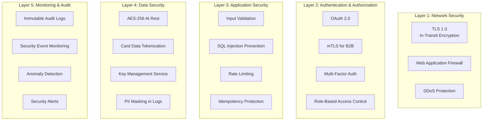

# Security Architecture

## Overview

The Wallet Service implements defense-in-depth security with multiple layers protecting financial data and operations. Security is built into every component from authentication to data storage.

---

## Security Layers



---

## 1. Authentication & Authorization

### OAuth 2.0 (B2C)

**Token Issuance**:
```java
@Configuration
@EnableAuthorizationServer
public class OAuth2Config {

    @Bean
    public SecurityFilterChain authServerSecurityFilterChain(HttpSecurity http) {
        OAuth2AuthorizationServerConfigurer authorizationServerConfigurer =
            new OAuth2AuthorizationServerConfigurer();

        http.apply(authorizationServerConfigurer);

        return http
            .oauth2ResourceServer(OAuth2ResourceServerConfigurer::jwt)
            .build();
    }

    @Bean
    public JwtDecoder jwtDecoder(JWKSource<SecurityContext> jwkSource) {
        return OAuth2AuthorizationServerConfiguration.jwtDecoder(jwkSource);
    }
}
```

**JWT Token Structure**:
```json
{
  "sub": "550e8400-e29b-41d4-a716-446655440000",
  "iss": "https://auth.wallet-service.com",
  "aud": "wallet-api",
  "exp": 1698765432,
  "iat": 1698761832,
  "scope": "wallet:read wallet:write",
  "user_id": "550e8400-e29b-41d4-a716-446655440000",
  "business_id": "business-123",
  "roles": ["USER"],
  "kyc_status": "APPROVED"
}
```

**Validation**:
```java
@Component
public class JwtTokenValidator {

    public Claims validateToken(String token) {
        try {
            return Jwts.parserBuilder()
                .setSigningKey(publicKey)
                .requireIssuer("https://auth.wallet-service.com")
                .requireAudience("wallet-api")
                .build()
                .parseClaimsJws(token)
                .getBody();
        } catch (JwtException e) {
            throw new UnauthorizedException("Invalid token", e);
        }
    }
}
```

---

### mTLS (B2B)

**Server Configuration**:
```java
@Configuration
public class MTlsConfig {

    @Bean
    public TomcatServletWebServerFactory servletContainer() {
        TomcatServletWebServerFactory tomcat = new TomcatServletWebServerFactory() {
            @Override
            protected void postProcessContext(Context context) {
                SecurityConstraint securityConstraint = new SecurityConstraint();
                securityConstraint.setUserConstraint("CONFIDENTIAL");
                SecurityCollection collection = new SecurityCollection();
                collection.addPattern("/*");
                securityConstraint.addCollection(collection);
                context.addConstraint(securityConstraint);
            }
        };

        tomcat.addConnectorCustomizers(connector -> {
            Http11NioProtocol protocol = (Http11NioProtocol) connector.getProtocolHandler();
            protocol.setSSLEnabled(true);
            protocol.setKeystoreFile("/path/to/server-keystore.jks");
            protocol.setKeystorePass("keystore-password");
            protocol.setTruststoreFile("/path/to/truststore.jks");
            protocol.setTruststorePass("truststore-password");
            protocol.setClientAuth("require"); // Mutual authentication
        });

        return tomcat;
    }
}
```

**Certificate Extraction**:
```java
@Component
public class MTlsFilter extends OncePerRequestFilter {

    @Override
    protected void doFilterInternal(HttpServletRequest request,
                                   HttpServletResponse response,
                                   FilterChain chain) {
        X509Certificate[] certs = (X509Certificate[])
            request.getAttribute("javax.servlet.request.X509Certificate");

        if (certs != null && certs.length > 0) {
            X509Certificate clientCert = certs[0];
            String clientDN = clientCert.getSubjectDN().getName();

            // Extract business ID from certificate CN
            String businessId = extractBusinessId(clientDN);

            // Store in security context
            SecurityContext context = SecurityContextHolder.createEmptyContext();
            context.setAuthentication(
                new PreAuthenticatedAuthenticationToken(businessId, null)
            );
            SecurityContextHolder.setContext(context);
        }

        chain.doFilter(request, response);
    }
}
```

---

### Role-Based Access Control (RBAC)

**Roles**:
| Role | Permissions |
|------|-------------|
| `USER` | Create payments, view own wallets/transactions |
| `BUSINESS_ADMIN` | Manage business users, view business aggregates |
| `FINANCE_ADMIN` | Process rollbacks, apply discounts, view all transactions |
| `SYSTEM_ADMIN` | All operations, system configuration |

**Spring Security Configuration**:
```java
@Configuration
@EnableMethodSecurity(prePostEnabled = true)
public class SecurityConfig {

    @Bean
    public SecurityFilterChain filterChain(HttpSecurity http) {
        return http
            .authorizeHttpRequests(auth -> auth
                .requestMatchers("/actuator/health").permitAll()
                .requestMatchers("/v1/wallets/**").hasAnyRole("USER", "ADMIN")
                .requestMatchers("/v1/payments/*/rollback").hasRole("FINANCE_ADMIN")
                .requestMatchers("/v1/admin/**").hasRole("SYSTEM_ADMIN")
                .anyRequest().authenticated()
            )
            .oauth2ResourceServer(oauth2 -> oauth2.jwt())
            .build();
    }
}
```

**Method-Level Security**:
```java
@Service
public class PaymentService {

    @PreAuthorize("hasRole('FINANCE_ADMIN')")
    public RollbackResponse rollbackPayment(UUID transactionId) {
        // Only FINANCE_ADMIN can rollback
        return executeRollback(transactionId);
    }

    @PreAuthorize("#userId == authentication.principal.id or hasRole('ADMIN')")
    public List<Transaction> getUserTransactions(UUID userId) {
        // Users can only view their own transactions
        return transactionRepo.findByUserId(userId);
    }
}
```

---

## 2. Data Encryption

### At Rest (AES-256)

**Oracle Transparent Data Encryption**:
```sql
-- Enable TDE for sensitive columns
ALTER TABLE businesses MODIFY (tax_id ENCRYPT USING 'AES256');
ALTER TABLE businesses MODIFY (phone ENCRYPT USING 'AES256');
ALTER TABLE users MODIFY (encrypted_phone ENCRYPT USING 'AES256');

-- Encrypt entire tablespace
CREATE TABLESPACE encrypted_ts
DATAFILE 'encrypted_ts.dbf' SIZE 500M
ENCRYPTION USING 'AES256'
DEFAULT STORAGE(ENCRYPT);
```

**JPA Attribute Encryption**:
```java
@Converter
public class EncryptedStringConverter implements AttributeConverter<String, String> {

    @Autowired
    private KmsService kmsService;

    @Override
    public String convertToDatabaseColumn(String attribute) {
        if (attribute == null) return null;
        return kmsService.encrypt(attribute);
    }

    @Override
    public String convertToEntityAttribute(String dbData) {
        if (dbData == null) return null;
        return kmsService.decrypt(dbData);
    }
}

@Entity
public class User {
    @Convert(converter = EncryptedStringConverter.class)
    private String encryptedPhone;
}
```

---

### In Transit (TLS 1.3)

**Force HTTPS**:
```yaml
server:
  ssl:
    enabled: true
    key-store: classpath:keystore.p12
    key-store-password: ${SSL_KEYSTORE_PASSWORD}
    key-store-type: PKCS12
    key-alias: wallet-service
    protocol: TLS
    enabled-protocols: TLSv1.3
    ciphers:
      - TLS_AES_256_GCM_SHA384
      - TLS_AES_128_GCM_SHA256
```

---

### Key Management (KMS)

**AWS KMS Integration**:
```java
@Service
public class KmsService {

    private final AWSKMS kmsClient;
    private final String keyId;

    public String encrypt(String plaintext) {
        EncryptRequest request = new EncryptRequest()
            .withKeyId(keyId)
            .withPlaintext(ByteBuffer.wrap(plaintext.getBytes(StandardCharsets.UTF_8)));

        EncryptResult result = kmsClient.encrypt(request);
        return Base64.getEncoder().encodeToString(
            result.getCiphertextBlob().array()
        );
    }

    public String decrypt(String ciphertext) {
        DecryptRequest request = new DecryptRequest()
            .withCiphertextBlob(ByteBuffer.wrap(
                Base64.getDecoder().decode(ciphertext)
            ));

        DecryptResult result = kmsClient.decrypt(request);
        return StandardCharsets.UTF_8.decode(result.getPlaintext()).toString();
    }

    @Scheduled(cron = "0 0 0 * * *") // Daily key rotation
    public void rotateKey() {
        CreateKeyRequest request = new CreateKeyRequest()
            .withDescription("Wallet Service Encryption Key")
            .withKeyUsage(KeyUsageType.ENCRYPT_DECRYPT);

        CreateKeyResult result = kmsClient.createKey(request);
        // Update keyId reference
    }
}
```

---

## 3. Input Validation & Sanitization

**Bean Validation**:
```java
public class PaymentRequest {

    @NotNull(message = "User ID is required")
    @Pattern(regexp = "^[0-9a-f]{8}-[0-9a-f]{4}-[0-9a-f]{4}-[0-9a-f]{4}-[0-9a-f]{12}$",
             message = "Invalid UUID format")
    private String userId;

    @NotNull(message = "Amount is required")
    @DecimalMin(value = "0.01", message = "Amount must be positive")
    @DecimalMax(value = "1000000.00", message = "Amount exceeds maximum")
    private BigDecimal amount;

    @NotNull(message = "Currency is required")
    @Pattern(regexp = "^[A-Z]{3}$", message = "Invalid ISO currency code")
    private String currency;

    @Pattern(regexp = "^[a-zA-Z0-9_-]{8,255}$", message = "Invalid idempotency key format")
    private String idempotencyKey;
}
```

**SQL Injection Prevention** (Parameterized Queries):
```java
// GOOD: Parameterized query
@Query("SELECT t FROM Transaction t WHERE t.userId = :userId AND t.status = :status")
List<Transaction> findByUserAndStatus(@Param("userId") UUID userId,
                                      @Param("status") String status);

// BAD: String concatenation (DO NOT USE)
// String query = "SELECT * FROM transactions WHERE user_id = '" + userId + "'";
```

---

## 4. Rate Limiting

**Redis-Based Rate Limiter**:
```java
@Component
public class RedisRateLimiter {

    private final StringRedisTemplate redisTemplate;

    public boolean isAllowed(String userId, String endpoint, int limit, Duration window) {
        String key = String.format("rate_limit:%s:%s", userId, endpoint);

        Long current = redisTemplate.opsForValue().increment(key);

        if (current == 1) {
            redisTemplate.expire(key, window);
        }

        return current <= limit;
    }
}

@Aspect
@Component
public class RateLimitAspect {

    @Around("@annotation(rateLimited)")
    public Object checkRateLimit(ProceedingJoinPoint joinPoint, RateLimited rateLimited) {
        String userId = getCurrentUserId();
        String endpoint = getEndpoint(joinPoint);

        if (!rateLimiter.isAllowed(userId, endpoint, rateLimited.limit(), rateLimited.window())) {
            throw new RateLimitExceededException("Too many requests");
        }

        return joinPoint.proceed();
    }
}
```

**Usage**:
```java
@Service
public class PaymentService {

    @RateLimited(limit = 10, window = Duration.ofMinutes(1))
    public PaymentResponse createPayment(PaymentRequest request) {
        // Limited to 10 payments per minute per user
        return processPayment(request);
    }
}
```

---

## 5. Audit Logging

**Immutable Audit Trail**:
```java
@Entity
@Table(name = "audit_logs")
public class AuditLog {

    @Id
    private UUID id;

    private String eventType;
    private String entityType;
    private UUID entityId;
    private UUID userId;
    private String action;

    @Column(columnDefinition = "CLOB")
    private String oldValue;

    @Column(columnDefinition = "CLOB")
    private String newValue;

    private String correlationId;
    private String ipAddress;
    private String userAgent;

    @Column(updatable = false)
    private LocalDateTime createdAt;
}
```

**Audit Interceptor**:
```java
@Aspect
@Component
public class AuditAspect {

    @AfterReturning(pointcut = "@annotation(Audited)", returning = "result")
    public void auditOperation(JoinPoint joinPoint, Audited audited, Object result) {
        AuditLog log = new AuditLog();
        log.setEventType(audited.eventType());
        log.setEntityType(audited.entityType());
        log.setAction(joinPoint.getSignature().getName());
        log.setUserId(getCurrentUserId());
        log.setCorrelationId(getCorrelationId());
        log.setIpAddress(getClientIp());
        log.setNewValue(serializeResult(result));

        auditRepo.save(log);
    }
}
```

**PII Masking**:
```java
@Component
public class PiiMasker {

    private static final Pattern EMAIL_PATTERN =
        Pattern.compile("([a-zA-Z0-9._%+-]+)@([a-zA-Z0-9.-]+\\.[a-zA-Z]{2,})");

    private static final Pattern PHONE_PATTERN =
        Pattern.compile("\\+?\\d{1,3}?[-.\\s]?\\(?\\d{1,4}\\)?[-.\\s]?\\d{1,4}[-.\\s]?\\d{1,9}");

    public String maskPii(String text) {
        if (text == null) return null;

        text = EMAIL_PATTERN.matcher(text)
            .replaceAll(match -> maskEmail(match.group()));

        text = PHONE_PATTERN.matcher(text)
            .replaceAll(match -> maskPhone(match.group()));

        return text;
    }

    private String maskEmail(String email) {
        String[] parts = email.split("@");
        return parts[0].substring(0, 2) + "***@" + parts[1];
    }

    private String maskPhone(String phone) {
        return phone.replaceAll("\\d(?=\\d{4})", "*");
    }
}
```

---

## 6. Security Headers

```java
@Configuration
public class SecurityHeadersConfig {

    @Bean
    public SecurityFilterChain securityHeaders(HttpSecurity http) {
        return http
            .headers(headers -> headers
                .contentSecurityPolicy(csp ->
                    csp.policyDirectives("default-src 'self'; script-src 'self' 'unsafe-inline'"))
                .xssProtection(xss -> xss.headerValue(XXssProtectionHeaderWriter.HeaderValue.ENABLED_MODE_BLOCK))
                .contentTypeOptions(contentType -> contentType.disable())
                .frameOptions(frame -> frame.deny())
                .httpStrictTransportSecurity(hsts ->
                    hsts.maxAgeInSeconds(31536000).includeSubDomains(true))
            )
            .build();
    }
}
```

---

## Security Checklist

- ✅ TLS 1.3 for all communications
- ✅ OAuth 2.0 + mTLS authentication
- ✅ Role-based access control (RBAC)
- ✅ AES-256 encryption at rest
- ✅ KMS for key management with rotation
- ✅ Input validation and sanitization
- ✅ Parameterized SQL queries (no string concatenation)
- ✅ Rate limiting on all endpoints
- ✅ Idempotency protection
- ✅ Immutable audit logs with PII masking
- ✅ Security headers (CSP, HSTS, X-Frame-Options)
- ✅ PCI-DSS card data tokenization
- ✅ GDPR-compliant data export and erasure
- ✅ Regular security scanning and penetration testing
- ✅ Incident response plan

---

## Next Steps

- Review [PCI-DSS Compliance](./pci-dss-compliance.md)
- See [GDPR Compliance](./gdpr-compliance.md)
- Explore [Threat Model](./threat-model.md)
- Check [Audit Trail](./audit-trail.md)
