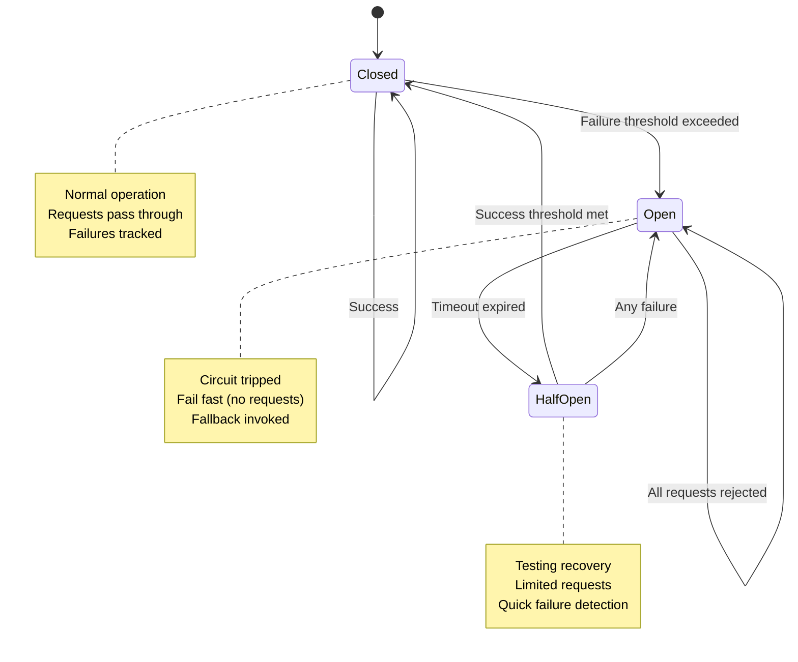

# Circuit Breaker Pattern

**Version**: 1.0
**Last Updated**: October 2025
**Owner**: Architecture Team
**Status**: Approved for Implementation

---

## Table of Contents

1. [Overview](#overview)
2. [Circuit Breaker States](#circuit-breaker-states)
3. [Configuration](#configuration)
4. [Implementation Strategy](#implementation-strategy)
5. [Fallback Mechanisms](#fallback-mechanisms)
6. [Monitoring & Health Checks](#monitoring--health-checks)
7. [Use Cases](#use-cases)
8. [Testing Strategy](#testing-strategy)

---

## Overview

### Purpose
Prevent cascading failures when external services (payment gateways, third-party APIs) become unavailable or slow, by failing fast and providing graceful degradation.

### Problem Statement
Without circuit breakers:
```
Payment Gateway Down
→ All payment requests timeout (30s each)
→ Thread pool exhausted
→ Entire service becomes unresponsive
→ Cascade failure to other services
```

### Solution
```
Payment Gateway Down
→ Circuit breaker detects failures
→ Opens circuit (fails fast)
→ Returns fallback response immediately (<1ms)
→ Service remains responsive
→ Periodic health checks attempt recovery
```

---

## Circuit Breaker States

### State Machine



### State Descriptions

#### CLOSED (Normal Operation)
```yaml
state: CLOSED
behavior:
  - all_requests: pass_through
  - track: failure_count, success_count
  - monitor: failure_rate, latency

transition_to_open_when:
  - failure_rate: >50% in sliding window
  - OR consecutive_failures: >5
  - OR slow_calls: >60% exceed timeout

metrics:
  - requests_total
  - requests_failed
  - latency_p50, latency_p95, latency_p99
```

**Example**:
```
Requests: [✓ ✓ ✓ ✗ ✓ ✓ ✗ ✗ ✗ ✗ ✗]
          └─ 5 consecutive failures ─┘
→ Transition to OPEN
```

---

#### OPEN (Circuit Tripped)
```yaml
state: OPEN
behavior:
  - all_requests: reject_immediately
  - response_time: <1ms (no actual call)
  - fallback: invoke_fallback_logic
  - health_check: none (wait for timeout)

transition_to_halfopen_when:
  - wait_duration: 30 seconds elapsed

metrics:
  - circuit_breaker_open_duration
  - rejected_requests_count
  - fallback_invocations
```

**Example**:
```
State: OPEN
Request arrives → Immediately return fallback response
Time in OPEN: 28s → Still OPEN
Time in OPEN: 30s → Transition to HALF_OPEN
```

---

#### HALF_OPEN (Testing Recovery)
```yaml
state: HALF_OPEN
behavior:
  - permitted_calls: 3 (configurable)
  - other_requests: queued or rejected
  - success_threshold: 100% (all 3 must succeed)
  - failure_threshold: 1 failure → back to OPEN

transition_to_closed_when:
  - all_permitted_calls: succeed

transition_to_open_when:
  - any_permitted_call: fails

metrics:
  - half_open_test_attempts
  - half_open_successes
  - half_open_failures
```

**Example**:
```
State: HALF_OPEN
Permit 3 test requests:
  Request 1: ✓ Success
  Request 2: ✓ Success
  Request 3: ✓ Success
→ Transition to CLOSED

Alternative:
  Request 1: ✓ Success
  Request 2: ✗ Failure
→ Transition to OPEN (wait another 30s)
```

---

## Configuration

### Per-Service Configuration

#### Payment Gateway Circuit Breaker
```yaml
circuit_breaker:
  name: payment_gateway
  service: Stripe/PayPal/etc

  failure_threshold:
    failure_rate: 50%  # 50% of requests failing
    minimum_requests: 10  # need at least 10 requests in window
    sliding_window_size: 100  # last 100 requests
    sliding_window_type: COUNT_BASED

  timeout:
    call_timeout: 10s  # max time for single call
    slow_call_threshold: 5s  # calls >5s considered slow
    slow_call_rate_threshold: 60%  # 60% slow calls → open

  open_state:
    wait_duration: 30s  # stay open for 30s before half-open

  half_open_state:
    permitted_calls: 3
    success_threshold: 100%

  fallback:
    strategy: PENDING_GATEWAY_CONFIRMATION
    log: true
    notify_user: true
```

#### KYC Provider Circuit Breaker
```yaml
circuit_breaker:
  name: kyc_provider
  service: Jumio/Onfido/etc

  failure_threshold:
    failure_rate: 30%
    minimum_requests: 5
    sliding_window_size: 50
    sliding_window_type: TIME_BASED  # 50-second window

  timeout:
    call_timeout: 15s
    slow_call_threshold: 10s
    slow_call_rate_threshold: 50%

  open_state:
    wait_duration: 60s  # longer wait for KYC

  half_open_state:
    permitted_calls: 2

  fallback:
    strategy: MANUAL_REVIEW_QUEUE
    priority: HIGH
```

#### Database Circuit Breaker
```yaml
circuit_breaker:
  name: database_primary
  service: Oracle

  failure_threshold:
    failure_rate: 20%  # database more critical, lower threshold
    minimum_requests: 20
    sliding_window_size: 200
    sliding_window_type: COUNT_BASED

  timeout:
    call_timeout: 5s
    slow_call_threshold: 2s
    slow_call_rate_threshold: 70%

  open_state:
    wait_duration: 10s  # quick recovery attempts

  half_open_state:
    permitted_calls: 5

  fallback:
    strategy: READ_REPLICA  # failover to read replica
    if_replica_fails: ERROR_RESPONSE
```

---

## Implementation Strategy

### Spring Cloud Circuit Breaker (Resilience4j)

**Dependencies**:
```xml
<dependency>
    <groupId>org.springframework.cloud</groupId>
    <artifactId>spring-cloud-starter-circuitbreaker-resilience4j</artifactId>
</dependency>
```

**Configuration**:
```yaml
# application.yml
resilience4j.circuitbreaker:
  instances:
    paymentGateway:
      registerHealthIndicator: true
      slidingWindowSize: 100
      minimumNumberOfCalls: 10
      permittedNumberOfCallsInHalfOpenState: 3
      automaticTransitionFromOpenToHalfOpenEnabled: true
      waitDurationInOpenState: 30s
      failureRateThreshold: 50
      eventConsumerBufferSize: 10
      slowCallRateThreshold: 60
      slowCallDurationThreshold: 5s

resilience4j.timelimiter:
  instances:
    paymentGateway:
      timeoutDuration: 10s
```

**Service Annotation Approach**:
```java
@Service
public class PaymentGatewayService {

    @CircuitBreaker(name = "paymentGateway", fallbackMethod = "paymentGatewayFallback")
    @TimeLimiter(name = "paymentGateway")
    public CompletableFuture<PaymentResult> processPayment(PaymentRequest request) {
        return CompletableFuture.supplyAsync(() -> {
            // Call external payment gateway
            return gatewayClient.processPayment(request);
        });
    }

    // Fallback method (same signature + Throwable parameter)
    private CompletableFuture<PaymentResult> paymentGatewayFallback(
            PaymentRequest request,
            Throwable throwable) {

        log.error("Payment gateway circuit breaker activated", throwable);

        // Create pending transaction
        Transaction transaction = transactionService.createPending(
            request,
            status = "PENDING_GATEWAY_CONFIRMATION"
        );

        // Notify user
        notificationService.send(request.getUserId(),
            "Your payment is being processed. We'll confirm shortly.");

        // Return optimistic response
        return CompletableFuture.completedFuture(
            PaymentResult.builder()
                .transactionId(transaction.getId())
                .status("PENDING")
                .message("Payment submitted successfully")
                .build()
        );
    }
}
```

**Programmatic Approach**:
```java
@Service
public class PaymentService {

    private final CircuitBreakerRegistry circuitBreakerRegistry;
    private final PaymentGatewayClient gatewayClient;

    public PaymentResult processPayment(PaymentRequest request) {
        CircuitBreaker circuitBreaker = circuitBreakerRegistry
            .circuitBreaker("paymentGateway");

        // Decorate the supplier
        Supplier<PaymentResult> decoratedSupplier = CircuitBreaker
            .decorateSupplier(circuitBreaker, () -> gatewayClient.process(request));

        Try<PaymentResult> result = Try.ofSupplier(decoratedSupplier)
            .recover(throwable -> fallbackPayment(request, throwable));

        return result.get();
    }

    private PaymentResult fallbackPayment(PaymentRequest request, Throwable throwable) {
        // Fallback logic
    }
}
```

---

## Fallback Mechanisms

### Strategy 1: Pending Confirmation (Optimistic)

**Use Case**: Payment gateway down

```java
private PaymentResult pendingConfirmationFallback(PaymentRequest request) {
    // 1. Create transaction in PENDING_GATEWAY state
    Transaction tx = Transaction.builder()
        .userId(request.getUserId())
        .amount(request.getAmount())
        .status("PENDING_GATEWAY_CONFIRMATION")
        .gatewayStatus("CIRCUIT_BREAKER_OPEN")
        .metadata(Map.of(
            "fallback_reason", "payment_gateway_unavailable",
            "retry_scheduled", ZonedDateTime.now().plusMinutes(5)
        ))
        .build();

    transactionRepository.save(tx);

    // 2. Schedule retry job
    retryScheduler.scheduleRetry(tx.getId(), delayMinutes = 5);

    // 3. Return optimistic response
    return PaymentResult.builder()
        .transactionId(tx.getId())
        .status("PENDING")
        .message("Payment submitted. Confirmation pending.")
        .estimatedConfirmation(ZonedDateTime.now().plusMinutes(10))
        .build();
}
```

**Retry Logic**:
```java
@Scheduled(fixedDelay = 60000) // every 1 minute
public void retryPendingGatewayTransactions() {
    List<Transaction> pending = transactionRepository
        .findByStatus("PENDING_GATEWAY_CONFIRMATION")
        .where(retry_scheduled <= now());

    for (Transaction tx : pending) {
        // Check circuit breaker state
        if (circuitBreaker.getState() == CLOSED) {
            try {
                // Retry gateway call
                PaymentResult result = gatewayClient.processPayment(tx);
                tx.setStatus(result.getStatus());
                tx.setGatewayTransactionId(result.getGatewayId());
            } catch (Exception e) {
                // Increment retry count, reschedule
                tx.incrementRetryCount();
                if (tx.getRetryCount() > 10) {
                    tx.setStatus("FAILED");
                    refundService.processRefund(tx);
                }
            }
        }
    }
}
```

---

### Strategy 2: Cached Response (Stale Data)

**Use Case**: KYC provider down, return cached KYC status

```java
private KYCResult cachedKYCFallback(String userId) {
    // 1. Retrieve cached KYC result
    Optional<KYCResult> cached = kycCacheRepository.findByUserId(userId);

    if (cached.isPresent() && cached.get().getAge() < Duration.ofHours(24)) {
        log.warn("Returning cached KYC result due to circuit breaker");
        return cached.get().withWarning("Data may be stale");
    }

    // 2. If no cache, return conservative result
    return KYCResult.builder()
        .userId(userId)
        .status("PENDING_VERIFICATION")
        .message("KYC service temporarily unavailable. Please try again later.")
        .build();
}
```

---

### Strategy 3: Manual Review Queue

**Use Case**: Fraud detection service down

```java
private FraudCheckResult manualReviewFallback(Transaction transaction) {
    // 1. Add to manual review queue
    ManualReview review = ManualReview.builder()
        .transactionId(transaction.getId())
        .reason("FRAUD_SERVICE_UNAVAILABLE")
        .priority("HIGH")
        .assignedTo(null)  // auto-assign
        .createdAt(ZonedDateTime.now())
        .sla(Duration.ofMinutes(30))
        .build();

    manualReviewRepository.save(review);

    // 2. Apply conservative limits
    if (transaction.getAmount() > 5000) {
        return FraudCheckResult.reject("High-value transaction requires manual review");
    }

    // 3. Allow with restrictions
    return FraudCheckResult.builder()
        .status("APPROVED_WITH_CONDITIONS")
        .conditions(List.of(
            "manual_review_queued",
            "hold_period_24h"
        ))
        .build();
}
```

---

### Strategy 4: Failover to Backup Service

**Use Case**: Primary database down, failover to read replica

```java
@CircuitBreaker(name = "databasePrimary", fallbackMethod = "readReplicaFallback")
public UserBalance getBalance(String walletId) {
    return primaryDb.query("SELECT balance FROM wallets WHERE id = ?", walletId);
}

private UserBalance readReplicaFallback(String walletId, Throwable throwable) {
    log.warn("Primary DB circuit breaker open, using read replica");

    try {
        UserBalance balance = readReplicaDb.query(
            "SELECT balance FROM wallets WHERE id = ?",
            walletId
        );

        // Add warning that data might be slightly stale
        balance.setWarning("Balance data may be up to 5 seconds old");
        return balance;

    } catch (Exception e) {
        // If replica also fails, return cached balance
        return cacheService.getBalance(walletId)
            .orElseThrow(() -> new ServiceUnavailableException("Database unavailable"));
    }
}
```

---

## Monitoring & Health Checks

### Metrics to Collect

```yaml
circuit_breaker_metrics:
  state:
    metric: circuit_breaker_state
    values: [CLOSED=0, OPEN=1, HALF_OPEN=2]
    dimensions: [circuit_breaker_name]

  calls:
    successful: circuit_breaker_calls_total{state="successful"}
    failed: circuit_breaker_calls_total{state="failed"}
    not_permitted: circuit_breaker_calls_total{state="not_permitted"}

  latency:
    metric: circuit_breaker_call_duration_seconds
    percentiles: [p50, p95, p99]

  failure_rate:
    metric: circuit_breaker_failure_rate_percent
    calculation: (failed / total) * 100

  slow_call_rate:
    metric: circuit_breaker_slow_call_rate_percent
    calculation: (slow_calls / total) * 100

  state_transition:
    metric: circuit_breaker_state_transitions_total
    dimensions: [from_state, to_state]
```

### Prometheus Queries

**Circuit Breaker Open Alert**:
```promql
# Alert if circuit breaker open for >5 minutes
circuit_breaker_state{name="paymentGateway"} == 1
  and
  time() - circuit_breaker_state_transition_timestamp{name="paymentGateway",to_state="OPEN"} > 300
```

**High Failure Rate**:
```promql
# Alert if failure rate >30% for 5 minutes
rate(circuit_breaker_calls_total{state="failed"}[5m])
  /
  rate(circuit_breaker_calls_total[5m])
  > 0.3
```

**Frequent State Changes**:
```promql
# Alert if circuit breaker flapping (opening/closing rapidly)
rate(circuit_breaker_state_transitions_total{name="paymentGateway"}[10m]) > 5
```

### Grafana Dashboard

```yaml
dashboard:
  name: "Circuit Breaker Health"

  panels:
    - title: "Circuit Breaker States"
      type: stat
      query: circuit_breaker_state
      color:
        CLOSED: green
        OPEN: red
        HALF_OPEN: yellow

    - title: "Failure Rate"
      type: graph
      queries:
        - circuit_breaker_failure_rate_percent
      thresholds:
        - value: 30, color: yellow
        - value: 50, color: red

    - title: "Calls Per Second"
      type: graph
      queries:
        - rate(circuit_breaker_calls_total{state="successful"}[1m])
        - rate(circuit_breaker_calls_total{state="failed"}[1m])
        - rate(circuit_breaker_calls_total{state="not_permitted"}[1m])

    - title: "State Transitions"
      type: table
      query: circuit_breaker_state_transitions_total
      columns: [circuit_breaker, from_state, to_state, count]

    - title: "Fallback Invocations"
      type: graph
      query: rate(circuit_breaker_fallback_calls_total[5m])
```

---

## Use Cases

### Use Case 1: Payment Gateway Timeout

**Scenario**:
```
12:00:00 - Payment gateway responding normally (latency: 200ms)
12:05:00 - Gateway becomes slow (latency: 15s)
12:05:30 - 60% of requests exceed 5s threshold
12:05:31 - Circuit breaker opens
12:05:32 - Request arrives → Immediately returns fallback (<1ms)
12:06:01 - Circuit breaker transitions to HALF_OPEN
12:06:02 - 3 test requests sent → All succeed in <2s
12:06:03 - Circuit breaker closes
12:06:04 - Normal operation resumes
```

### Use Case 2: Database Failover

**Scenario**:
```
Primary DB fails → Circuit breaker opens
↓
All read requests → Failover to read replica (fallback)
↓
All write requests → Queue for retry
↓
Primary DB recovers after 2 minutes
↓
Circuit breaker half-open → Test requests succeed
↓
Circuit breaker closes → Resume normal operation
↓
Queued writes → Process from queue
```

### Use Case 3: Third-Party API Rate Limiting

**Scenario**:
```
KYC API returns 429 Too Many Requests
↓
Multiple failures → Circuit breaker opens
↓
Subsequent KYC requests → Cached results (fallback)
↓
Wait 60 seconds (configured wait duration)
↓
Half-open state → Test request succeeds
↓
Resume normal KYC checks
```

---

## Testing Strategy

### Unit Tests

```java
@Test
public void testCircuitBreakerOpensAfterThreshold() {
    // Simulate 10 failures
    for (int i = 0; i < 10; i++) {
        try {
            paymentService.processPayment(request);
        } catch (Exception e) {
            // Expected
        }
    }

    // Assert circuit breaker is open
    CircuitBreaker.Metrics metrics = circuitBreaker.getMetrics();
    assertEquals(CircuitBreaker.State.OPEN, circuitBreaker.getState());
    assertEquals(10, metrics.getNumberOfFailedCalls());
}

@Test
public void testCircuitBreakerFallback() {
    // Open circuit breaker manually
    circuitBreaker.transitionToOpenState();

    // Make request
    PaymentResult result = paymentService.processPayment(request);

    // Assert fallback invoked
    assertEquals("PENDING", result.getStatus());
    verify(fallbackHandler, times(1)).handleFallback(any());
}

@Test
public void testCircuitBreakerHalfOpenTransition() throws InterruptedException {
    // Open circuit breaker
    circuitBreaker.transitionToOpenState();

    // Wait for configured duration
    Thread.sleep(30000);

    // Assert transition to half-open
    assertEquals(CircuitBreaker.State.HALF_OPEN, circuitBreaker.getState());
}
```

### Integration Tests

```java
@SpringBootTest
@TestConfiguration
public class CircuitBreakerIntegrationTest {

    @MockBean
    private PaymentGatewayClient gatewayClient;

    @Test
    public void testCircuitBreakerWithRealService() {
        // Mock gateway failure
        when(gatewayClient.processPayment(any()))
            .thenThrow(new GatewayTimeoutException());

        // Trigger circuit breaker
        for (int i = 0; i < 10; i++) {
            try {
                paymentService.processPayment(request);
            } catch (Exception e) {}
        }

        // Verify circuit breaker open
        CircuitBreaker cb = circuitBreakerRegistry.circuitBreaker("paymentGateway");
        assertEquals(CircuitBreaker.State.OPEN, cb.getState());

        // Verify metrics
        assertEquals(10, cb.getMetrics().getNumberOfFailedCalls());

        // Verify fallback invoked
        verify(notificationService, times(10)).sendPendingNotification(any());
    }
}
```

### Chaos Engineering Tests

```java
@Test
public void testCircuitBreakerUnderChaos() {
    // Introduce random failures
    ChaosMonkey chaos = ChaosMonkey.builder()
        .latencyRange(100, 20000)  // 100ms to 20s
        .failureRate(0.5)  // 50% failures
        .build();

    chaos.apply(paymentGatewayClient);

    // Send 1000 requests
    for (int i = 0; i < 1000; i++) {
        paymentService.processPayment(request);
    }

    // Assert system remained stable
    assertTrue(applicationContext.isRunning());

    // Assert circuit breaker activated
    CircuitBreaker cb = circuitBreakerRegistry.circuitBreaker("paymentGateway");
    assertTrue(cb.getMetrics().getNumberOfNotPermittedCalls() > 0);
}
```

---

## Best Practices

### DO ✅

1. **Set Realistic Thresholds**: Based on actual service behavior
   ```yaml
   # Good: Based on P99 latency
   slow_call_threshold: 5s  # P99 latency is 2s

   # Bad: Arbitrary number
   slow_call_threshold: 1s  # Too aggressive, false positives
   ```

2. **Implement Meaningful Fallbacks**:
   ```java
   // Good: Graceful degradation
   return fallbackCache.get(userId).orElse(ConservativeDefault.value());

   // Bad: Just throw exception
   throw new ServiceUnavailableException();
   ```

3. **Monitor Circuit Breaker State**:
   ```java
   // Log state transitions
   circuitBreaker.getEventPublisher()
       .onStateTransition(event ->
           log.warn("Circuit breaker {} transitioned from {} to {}",
               event.getCircuitBreakerName(),
               event.getStateTransition().getFromState(),
               event.getStateTransition().getToState())
       );
   ```

4. **Test Fallback Logic**:
   ```java
   // Ensure fallback is tested as rigorously as main path
   @Test
   public void testFallbackReturnsValidResponse() {
       circuitBreaker.transitionToOpenState();
       PaymentResult result = paymentService.processPayment(request);
       assertNotNull(result.getTransactionId());
   }
   ```

### DON'T ❌

1. **Don't Use Same Timeout Everywhere**:
   ```yaml
   # Bad: One size fits all
   timeout: 30s  # for all services

   # Good: Per-service tuning
   payment_gateway_timeout: 10s
   kyc_provider_timeout: 15s
   database_timeout: 5s
   ```

2. **Don't Ignore Circuit Breaker State**:
   ```java
   // Bad: Silent failure
   if (circuitBreaker.getState() == OPEN) {
       return null;  // User gets confusing null response
   }

   // Good: Communicate state
   if (circuitBreaker.getState() == OPEN) {
       throw new ServiceDegradedException(
           "Payment service temporarily unavailable. Please retry in 30 seconds."
       );
   }
   ```

3. **Don't Forget to Reset State**:
   ```java
   // Circuit breakers should auto-reset, but in emergencies:
   @PostMapping("/admin/circuit-breaker/{name}/reset")
   public void resetCircuitBreaker(@PathVariable String name) {
       CircuitBreaker cb = circuitBreakerRegistry.circuitBreaker(name);
       cb.reset();  // Transition to CLOSED
       log.info("Circuit breaker {} manually reset", name);
   }
   ```

---

## Related Documentation

- [Outbox Pattern](./outbox-pattern.md)
- [Saga Pattern](./saga-pattern.md)
- [Payment Gateway Integration](../07-integrations/payment-gateway-integration.md)
- [Monitoring Dashboards](../05-operations/monitoring-dashboards.md)

---

## Change History

| Version | Date | Changes | Author |
|---------|------|---------|--------|
| 1.0 | 2025-10-21 | Initial specification | Claude |

---

**Status**: Ready for Implementation
**Review Required**: Architecture Team, DevOps Team
**Approval**: Chief Architect
