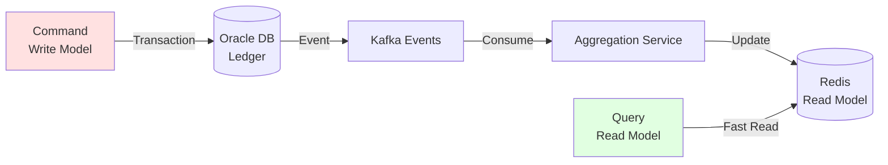

# CQRS & Event Sourcing

## Overview

Command Query Responsibility Segregation (CQRS) pattern for separating write and read models, with event-driven aggregation.

---

## Architecture



---

## Write Model (Command)

**Create Payment** (write to Oracle):
```java
@Service
public class PaymentCommandService {

    @Transactional
    public UUID createPayment(PaymentRequest request) {
        // Write to ledger (source of truth)
        Transaction tx = new Transaction();
        transactionRepo.save(tx);

        LedgerEntry debit = new LedgerEntry(/* ... */);
        LedgerEntry credit = new LedgerEntry(/* ... */);
        ledgerRepo.saveAll(List.of(debit, credit));

        // Publish event
        kafkaTemplate.send("wallet.transactions.v1",
            new TransactionCreatedEvent(tx.getId(), tx.getAmount()));

        return tx.getId();
    }
}
```

---

## Read Model (Query)

**Get Balance** (read from Redis cache):
```java
@Service
public class BalanceQueryService {

    public BigDecimal getUserBalance(UUID userId) {
        // Try cache first
        String cached = redisTemplate.opsForValue()
            .get("user:balance:" + userId);

        if (cached != null) {
            return new BigDecimal(cached);
        }

        // Cache miss - compute from ledger
        BigDecimal balance = computeBalanceFromLedger(userId);

        // Update cache
        redisTemplate.opsForValue().set(
            "user:balance:" + userId,
            balance.toString(),
            Duration.ofMinutes(5)
        );

        return balance;
    }

    private BigDecimal computeBalanceFromLedger(UUID userId) {
        return ledgerRepo.sumBalanceByUserId(userId);
    }
}
```

---

## Event Consumer (Aggregator)

```java
@Service
public class BalanceAggregatorService {

    @KafkaListener(topics = "wallet.transactions.v1")
    public void handleTransactionEvent(TransactionCreatedEvent event) {
        // Incremental update to cached balance
        String key = "user:balance:" + event.getUserId();

        redisTemplate.opsForValue().increment(key, event.getAmount());

        // Also update business aggregate
        String businessKey = "business:balance:" + event.getBusinessId();
        redisTemplate.opsForValue().increment(businessKey, event.getAmount());
    }
}
```

---

## Eventual Consistency

- **Write Model**: Strongly consistent (ACID in Oracle)
- **Read Model**: Eventually consistent (updated via Kafka events within seconds)
- **Fallback**: Compute from ledger if cache stale/missing

---

See [Data Flows](../01-architecture/data-flows.md#3-balance-aggregation-flow) for implementation details.
