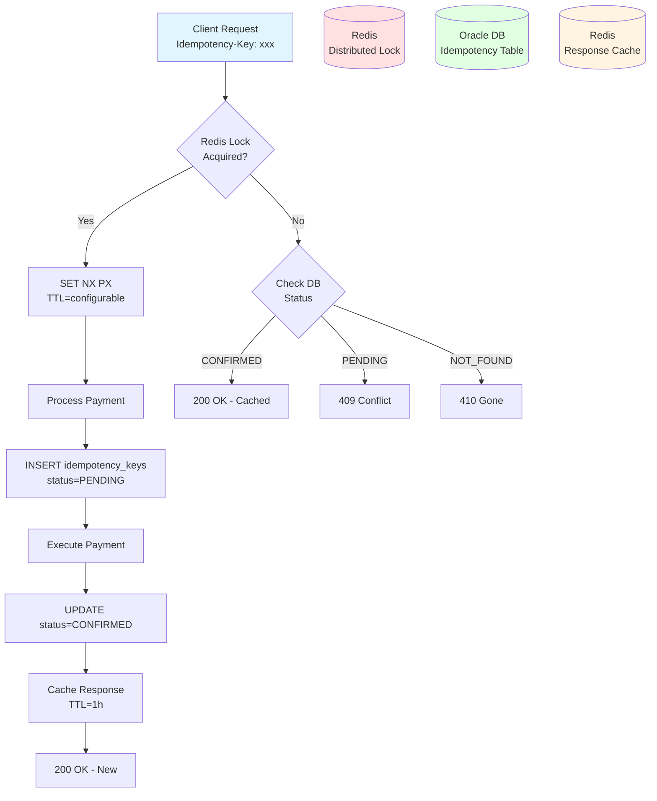

# Idempotency & Duplicate Detection

## Overview

The Wallet Service implements a **robust idempotency pattern** combining Redis distributed locks (fast duplicate detection) with PostgreSQL/Oracle unique constraints (durable guarantee) to ensure that duplicate payment requests produce identical results without side effects.

---

## Architecture



---

## Implementation

### 1. Idempotency Key Table Schema

```sql
CREATE TABLE idempotency_keys (
    id RAW(16) DEFAULT SYS_GUID() PRIMARY KEY,
    key VARCHAR2(255) NOT NULL,
    user_id RAW(16) NOT NULL,
    endpoint VARCHAR2(255) NOT NULL,
    status VARCHAR2(20) DEFAULT 'PENDING' CHECK (status IN ('PENDING', 'CONFIRMED', 'EXPIRED')),
    cached_response CLOB,
    created_at TIMESTAMP DEFAULT SYSTIMESTAMP NOT NULL,
    expires_at TIMESTAMP NOT NULL,
    ttl_minutes NUMBER(5) NOT NULL,
    CONSTRAINT fk_idempotency_user FOREIGN KEY (user_id) REFERENCES users(id)
);

-- Unique constraint: prevent duplicates across user and endpoint
CREATE UNIQUE INDEX idx_idempotency_unique
ON idempotency_keys(key, user_id, endpoint);

-- Index for cleanup of expired PENDING entries
CREATE INDEX idx_idempotency_expires
ON idempotency_keys(expires_at)
WHERE status = 'PENDING';
```

**Key Fields**:
- `key`: Client-provided UUID or hash (e.g., request hash)
- `user_id`: Binds key to specific user (prevents cross-user replay)
- `endpoint`: Binds key to specific API endpoint (prevents cross-endpoint replay)
- `status`: PENDING (in-progress), CONFIRMED (completed), EXPIRED (TTL passed)
- `cached_response`: Serialized JSON response for idempotent replay
- `ttl_minutes`: Configurable TTL (5-1440 minutes based on payment type)

---

### 2. Redis Distributed Lock

**Purpose**: Fast duplicate detection before database hit.

**Implementation**:
```java
@Service
public class IdempotencyService {

    private final StringRedisTemplate redisTemplate;
    private final IdempotencyKeyRepository repository;

    public boolean acquireLock(String idempotencyKey, UUID userId, int ttlMinutes) {
        String redisKey = buildRedisKey(idempotencyKey, userId);
        Duration ttl = Duration.ofMinutes(ttlMinutes);

        Boolean acquired = redisTemplate.opsForValue()
            .setIfAbsent(redisKey, "LOCKED", ttl);

        return Boolean.TRUE.equals(acquired);
    }

    public void releaseLock(String idempotencyKey, UUID userId) {
        String redisKey = buildRedisKey(idempotencyKey, userId);
        redisTemplate.delete(redisKey);
    }

    private String buildRedisKey(String key, UUID userId) {
        return String.format("idempotency:%s:%s", userId, key);
    }
}
```

**Redis Command**:
```
SET idempotency:user-123:abc-xyz-999 "LOCKED" NX PX 300000
```
- `NX`: Only set if not exists
- `PX`: Expiry in milliseconds (5 min = 300,000 ms)

---

### 3. Complete Idempotent Payment Flow

```java
@Service
@Transactional
public class PaymentService {

    private final IdempotencyService idempotencyService;
    private final IdempotencyKeyRepository idempotencyRepo;
    private final TransactionRepository transactionRepo;
    private final RedisTemplate<String, String> redisTemplate;

    public PaymentResponse processPayment(
        PaymentRequest request,
        String idempotencyKey,
        UUID userId,
        String endpoint
    ) {
        // Step 1: Try to acquire Redis lock
        int ttl = getTtlForPaymentType(request.getPaymentType());
        boolean lockAcquired = idempotencyService.acquireLock(
            idempotencyKey, userId, ttl
        );

        if (!lockAcquired) {
            // Lock failed - check database for existing record
            return handleDuplicateRequest(idempotencyKey, userId, endpoint);
        }

        try {
            // Step 2: Create idempotency record (PENDING)
            IdempotencyKey idempotency = new IdempotencyKey();
            idempotency.setKey(idempotencyKey);
            idempotency.setUserId(userId);
            idempotency.setEndpoint(endpoint);
            idempotency.setStatus(IdempotencyStatus.PENDING);
            idempotency.setTtlMinutes(ttl);
            idempotency.setExpiresAt(LocalDateTime.now().plusMinutes(ttl));
            idempotencyRepo.save(idempotency);

            // Step 3: Execute payment logic
            Transaction transaction = executePayment(request, userId);

            // Step 4: Update idempotency to CONFIRMED
            PaymentResponse response = buildResponse(transaction);
            idempotency.setStatus(IdempotencyStatus.CONFIRMED);
            idempotency.setCachedResponse(serializeResponse(response));
            idempotencyRepo.save(idempotency);

            // Step 5: Cache response in Redis
            cacheResponse(idempotencyKey, userId, response, Duration.ofHours(1));

            return response;

        } catch (Exception e) {
            // Release lock on failure
            idempotencyService.releaseLock(idempotencyKey, userId);
            throw e;
        }
    }

    private PaymentResponse handleDuplicateRequest(
        String key, UUID userId, String endpoint
    ) {
        Optional<IdempotencyKey> existing = idempotencyRepo
            .findByKeyAndUserIdAndEndpoint(key, userId, endpoint);

        if (existing.isEmpty()) {
            throw new IdempotencyKeyExpiredException(
                "Idempotency key expired or not found"
            );
        }

        IdempotencyKey idempotency = existing.get();

        switch (idempotency.getStatus()) {
            case CONFIRMED:
                // Return cached response (idempotent replay)
                String cached = getCachedResponse(key, userId);
                if (cached != null) {
                    return deserializeResponse(cached);
                } else {
                    return deserializeResponse(idempotency.getCachedResponse());
                }

            case PENDING:
                // Request in progress by another thread/instance
                throw new ConcurrentRequestException(
                    "Request is being processed", 409
                );

            case EXPIRED:
                throw new IdempotencyKeyExpiredException(
                    "Idempotency key has expired"
                );

            default:
                throw new IllegalStateException("Unknown status");
        }
    }

    private int getTtlForPaymentType(PaymentType type) {
        return switch (type) {
            case PREPAYMENT -> 5;       // 5 minutes
            case POSTPAYMENT -> 30;     // 30 minutes
            case VALUABLE -> 1440;      // 24 hours
            case CREDIT -> 1440;        // 24 hours
        };
    }

    private void cacheResponse(String key, UUID userId, PaymentResponse response, Duration ttl) {
        String redisKey = String.format("response:%s:%s", userId, key);
        String json = serializeResponse(response);
        redisTemplate.opsForValue().set(redisKey, json, ttl);
    }

    private String getCachedResponse(String key, UUID userId) {
        String redisKey = String.format("response:%s:%s", userId, key);
        return redisTemplate.opsForValue().get(key);
    }
}
```

---

### 4. TTL Configuration by Payment Type

```yaml
wallet:
  idempotency:
    ttl:
      prepayment: 5m      # Fast synchronous operations
      postpayment: 30m    # Invoice generation may take time
      valuable: 24h       # May require manual review
      credit: 24h         # Schedule creation is complex
    cleanup:
      enabled: true
      cron: "0 0 * * * *"  # Every hour
      expire-after-days: 30
```

---

### 5. Cleanup Job (Expire Old PENDING Entries)

```java
@Component
public class IdempotencyCleanupJob {

    @Scheduled(cron = "${wallet.idempotency.cleanup.cron}")
    @Transactional
    public void cleanupExpiredKeys() {
        log.info("Starting idempotency key cleanup");

        LocalDateTime now = LocalDateTime.now();

        // Find expired PENDING entries
        List<IdempotencyKey> expired = idempotencyRepo
            .findByStatusAndExpiresAtBefore(
                IdempotencyStatus.PENDING,
                now
            );

        for (IdempotencyKey key : expired) {
            // Update to EXPIRED
            key.setStatus(IdempotencyStatus.EXPIRED);
            idempotencyRepo.save(key);

            // Remove Redis lock
            String redisKey = String.format("idempotency:%s:%s",
                key.getUserId(), key.getKey());
            redisTemplate.delete(redisKey);

            log.info("Expired idempotency key: {}", key.getKey());
        }

        // Hard delete EXPIRED entries older than 30 days
        int deleted = idempotencyRepo.deleteByStatusAndCreatedAtBefore(
            IdempotencyStatus.EXPIRED,
            now.minusDays(30)
        );

        log.info("Cleaned up {} idempotency keys", expired.size());
        log.info("Deleted {} old EXPIRED keys", deleted);
    }
}
```

---

## Security Considerations

### 1. Key Binding to User and Endpoint

**Problem**: Attacker obtains valid idempotency key and replays it for different user or endpoint.

**Solution**: Bind key to `(key, user_id, endpoint)` triplet.

**Enforcement**:
```java
// Extract user from JWT token
UUID userId = getUserIdFromToken(authHeader);

// Extract endpoint from request
String endpoint = request.getRequestURI();

// Verify key is bound to this user and endpoint
if (!idempotencyService.isKeyValid(idempotencyKey, userId, endpoint)) {
    throw new SecurityException("Invalid idempotency key");
}
```

### 2. Signed Idempotency Keys (Advanced)

**Approach**: Client sends HMAC-signed key.

```java
public String generateIdempotencyKey(PaymentRequest request, String secret) {
    String payload = String.format("%s:%s:%d:%s",
        request.getUserId(),
        request.getWalletId(),
        request.getAmount(),
        request.getCurrency()
    );

    return HmacUtils.hmacSha256Hex(secret, payload);
}

public boolean verifyIdempotencyKey(String key, PaymentRequest request, String secret) {
    String expected = generateIdempotencyKey(request, secret);
    return MessageDigest.isEqual(expected.getBytes(), key.getBytes());
}
```

### 3. Rate Limiting on Idempotency Key Creation

Prevent abuse by limiting idempotency key creation rate:
```java
@RateLimiter(name = "idempotencyCreation", fallbackMethod = "rateLimitFallback")
public IdempotencyKey createIdempotencyKey(...) {
    // ...
}
```

---

## Testing Idempotency

### Unit Test (Duplicate Request)

```java
@Test
public void testIdempotentPayment() {
    PaymentRequest request = createPaymentRequest(100.00);
    String idempotencyKey = UUID.randomUUID().toString();

    // First request
    PaymentResponse response1 = paymentService.processPayment(
        request, idempotencyKey, userId, "/v1/payments"
    );
    assertThat(response1.getTransactionId()).isNotNull();

    // Duplicate request (same key)
    PaymentResponse response2 = paymentService.processPayment(
        request, idempotencyKey, userId, "/v1/payments"
    );

    // Should return identical response
    assertThat(response2.getTransactionId())
        .isEqualTo(response1.getTransactionId());

    // Verify only one transaction created
    long count = transactionRepo.countByIdempotencyKey(idempotencyKey);
    assertThat(count).isEqualTo(1);
}
```

### Integration Test (Concurrent Requests)

```java
@Test
public void testConcurrentDuplicateRequests() throws Exception {
    String idempotencyKey = UUID.randomUUID().toString();
    PaymentRequest request = createPaymentRequest(100.00);

    int threadCount = 10;
    ExecutorService executor = Executors.newFixedThreadPool(threadCount);
    CountDownLatch latch = new CountDownLatch(threadCount);

    List<Future<PaymentResponse>> futures = new ArrayList<>();

    // Submit 10 concurrent identical requests
    for (int i = 0; i < threadCount; i++) {
        futures.add(executor.submit(() -> {
            latch.countDown();
            latch.await(); // Wait for all threads to start
            return paymentService.processPayment(
                request, idempotencyKey, userId, "/v1/payments"
            );
        }));
    }

    // Collect results
    List<PaymentResponse> responses = new ArrayList<>();
    for (Future<PaymentResponse> future : futures) {
        try {
            responses.add(future.get());
        } catch (ExecutionException e) {
            // Some requests may throw ConcurrentRequestException
            assertThat(e.getCause())
                .isInstanceOf(ConcurrentRequestException.class);
        }
    }

    // At least one succeeded
    assertThat(responses).isNotEmpty();

    // All successful responses have same transaction ID
    String txId = responses.get(0).getTransactionId();
    for (PaymentResponse response : responses) {
        assertThat(response.getTransactionId()).isEqualTo(txId);
    }

    // Only one transaction created in DB
    long count = transactionRepo.countByIdempotencyKey(idempotencyKey);
    assertThat(count).isEqualTo(1);

    executor.shutdown();
}
```

---

## Client Guidelines

### 1. Generating Idempotency Keys

**Recommended**: Use UUID v4 for each unique payment request.

```javascript
// JavaScript/TypeScript
import { v4 as uuidv4 } from 'uuid';

const idempotencyKey = uuidv4();

fetch('https://api.wallet-service.com/v1/payments', {
  method: 'POST',
  headers: {
    'Authorization': `Bearer ${token}`,
    'Idempotency-Key': idempotencyKey,
    'Content-Type': 'application/json'
  },
  body: JSON.stringify(paymentRequest)
});
```

### 2. Handling Responses

| HTTP Status | Meaning | Action |
|-------------|---------|--------|
| `200 OK` | Payment processed (new or cached) | Success |
| `409 Conflict` | Request in progress | Retry after delay (exponential backoff) |
| `410 Gone` | Idempotency key expired | Generate new key and retry |
| `400 Bad Request` | Invalid idempotency key format | Fix key format |

### 3. Retry Logic

```javascript
async function createPaymentWithRetry(request, maxRetries = 3) {
  let idempotencyKey = uuidv4();

  for (let attempt = 0; attempt < maxRetries; attempt++) {
    try {
      const response = await fetch('/v1/payments', {
        method: 'POST',
        headers: { 'Idempotency-Key': idempotencyKey },
        body: JSON.stringify(request)
      });

      if (response.ok) {
        return await response.json();
      }

      if (response.status === 409) {
        // Conflict - wait and retry with same key
        await sleep(Math.pow(2, attempt) * 1000);
        continue;
      }

      if (response.status === 410) {
        // Expired - generate new key
        idempotencyKey = uuidv4();
        continue;
      }

      throw new Error(`Payment failed: ${response.status}`);

    } catch (error) {
      if (attempt === maxRetries - 1) throw error;
    }
  }
}
```

---

## Metrics & Monitoring

### Key Metrics

```java
@Component
public class IdempotencyMetrics {

    private final Counter idempotencyHits;
    private final Counter idempotencyMisses;
    private final Counter idempotencyConflicts;

    public IdempotencyMetrics(MeterRegistry registry) {
        this.idempotencyHits = Counter.builder("idempotency.hits")
            .description("Idempotent requests returning cached response")
            .register(registry);

        this.idempotencyMisses = Counter.builder("idempotency.misses")
            .description("New requests processed")
            .register(registry);

        this.idempotencyConflicts = Counter.builder("idempotency.conflicts")
            .description("Concurrent requests rejected with 409")
            .register(registry);
    }
}
```

### Alerts

- **High conflict rate**: `idempotency.conflicts / idempotency.total > 5%`
- **Redis failures**: Monitor Redis availability
- **DB unique constraint violations**: Indicates Redis-DB consistency issues

---

## Best Practices

1. **Always provide idempotency key** for write operations
2. **Use UUIDs** or cryptographic hashes for keys
3. **Bind keys to user and endpoint** for security
4. **Configure TTL** based on operation complexity
5. **Implement retry logic** with exponential backoff
6. **Monitor conflict rates** to detect issues
7. **Test concurrent scenarios** thoroughly
8. **Cache responses** for fast idempotent replay
9. **Clean up expired keys** regularly
10. **Document key format** for client SDK developers

---

## Next Steps

- Review [Concurrency Control](./concurrency-control.md) for optimistic locking
- See [Saga & Compensation](./saga-compensation.md) for rollback patterns
- Explore [Payment APIs](../03-api-specification/payment-apis.md) for endpoint examples
