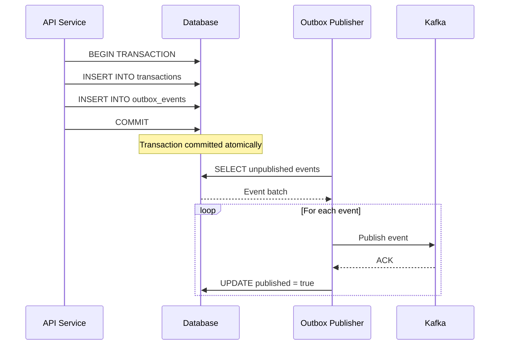
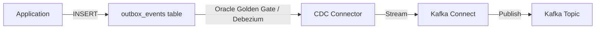

# Outbox Pattern

**Version**: 1.0
**Last Updated**: October 2025
**Owner**: Architecture Team
**Status**: Approved for Implementation

---

## Table of Contents

1. [Overview](#overview)
2. [Problem Statement](#problem-statement)
3. [Solution Architecture](#solution-architecture)
4. [Database Schema](#database-schema)
5. [Publishing Strategies](#publishing-strategies)
6. [Event Ordering Guarantees](#event-ordering-guarantees)
7. [Failure Handling](#failure-handling)
8. [Performance Considerations](#performance-considerations)
9. [Implementation Guide](#implementation-guide)
10. [Monitoring & Ops](#monitoring--ops)

---

## Overview

### Purpose
Ensure reliable event publishing to Kafka by storing events in the database as part of the business transaction, guaranteeing at-least-once delivery.

### Key Benefits
- **Atomicity**: Events published only if business transaction commits
- **Reliability**: No event loss even if Kafka is down
- **Ordering**: Maintain event ordering per aggregate
- **Audit Trail**: All events stored for debugging

### Use Cases in Wallet Service
1. Transaction completed → Publish to Kafka for cache invalidation
2. Wallet created → Publish for analytics
3. Payment rolled back → Publish for reconciliation
4. Fraud detected → Publish for alerting

---

## Problem Statement

### Without Outbox Pattern

```java
@Transactional
public Transaction createPayment(PaymentRequest request) {
    // 1. Save transaction to database
    Transaction tx = transactionRepository.save(
        Transaction.builder()
            .amount(request.getAmount())
            .status("CONFIRMED")
            .build()
    );

    // 2. Publish event to Kafka
    kafkaTemplate.send("transactions", tx.toEvent());  // ⚠️ PROBLEM!

    return tx;
}
```

**Problem Scenarios**:

**Scenario 1: Kafka Down**
```
1. Save transaction to DB → SUCCESS ✓
2. Publish to Kafka → FAILURE ✗ (Kafka unavailable)
3. Exception thrown
4. Spring transaction rollback → Transaction lost!
```

**Scenario 2: Crash After Commit**
```
1. Save transaction to DB → SUCCESS ✓
2. DB transaction commits ✓
3. Server crashes before Kafka publish
4. Event never published → Cache never invalidated!
```

**Scenario 3: Kafka Slow**
```
1. Save transaction to DB → SUCCESS ✓
2. Kafka publish blocks for 30s (network issue)
3. User request times out
4. User retries → Duplicate transaction
```

---

## Solution Architecture

### Outbox Pattern Flow



### Key Principles

1. **Single Transaction**: Business data + outbox event in same DB transaction
2. **Separate Publisher**: Background process publishes events
3. **Idempotency**: Events may be published multiple times (at-least-once)
4. **Eventually Consistent**: Events published after commit (small delay)

---

## Database Schema

### Outbox Events Table

```sql
CREATE TABLE outbox_events (
    id RAW(16) DEFAULT SYS_GUID() PRIMARY KEY,
    aggregate_type VARCHAR2(50) NOT NULL,  -- TRANSACTION, WALLET, USER
    aggregate_id RAW(16) NOT NULL,         -- ID of the entity
    event_type VARCHAR2(100) NOT NULL,     -- TRANSACTION_CREATED, WALLET_UPDATED, etc.
    event_data CLOB NOT NULL,              -- JSON payload
    published NUMBER(1) DEFAULT 0 NOT NULL CHECK (published IN (0, 1)),
    published_at TIMESTAMP,
    created_at TIMESTAMP DEFAULT SYSTIMESTAMP NOT NULL,
    version NUMBER DEFAULT 1,               -- For optimistic locking
    retry_count NUMBER DEFAULT 0,
    last_error VARCHAR2(1000),
    correlation_id VARCHAR2(100),          -- For distributed tracing
    CONSTRAINT check_published CHECK (
        (published = 0 AND published_at IS NULL) OR
        (published = 1 AND published_at IS NOT NULL)
    )
);

-- Indexes for efficient polling
CREATE INDEX idx_outbox_published ON outbox_events(published, created_at)
    WHERE published = 0;  -- Partial index for unpublished events

CREATE INDEX idx_outbox_aggregate ON outbox_events(aggregate_type, aggregate_id, created_at);

CREATE INDEX idx_outbox_correlation ON outbox_events(correlation_id);

-- Partition by month for easier archival
ALTER TABLE outbox_events
    PARTITION BY RANGE (created_at)
    INTERVAL (NUMTOYMINTERVAL(1, 'MONTH'))
    (PARTITION outbox_initial VALUES LESS THAN (TO_DATE('2025-01-01', 'YYYY-MM-DD')));
```

### Event Data Format

```json
{
  "eventId": "evt-001",
  "eventType": "TRANSACTION_CREATED",
  "aggregateType": "TRANSACTION",
  "aggregateId": "tx-123",
  "timestamp": "2025-10-21T10:30:00Z",
  "data": {
    "userId": "user-456",
    "amount": 10000,
    "currency": "USD",
    "status": "CONFIRMED",
    "sourceWalletId": "wallet-789",
    "destinationWalletId": "wallet-012"
  },
  "metadata": {
    "correlationId": "corr-abc",
    "causationId": "cmd-xyz",
    "userId": "user-456"
  }
}
```

---

## Publishing Strategies

### Strategy 1: Polling-Based Publisher (Simple)

**Architecture**:
```java
@Component
@Slf4j
public class OutboxEventPublisher {

    @Scheduled(fixedDelay = 1000)  // Poll every 1 second
    @Transactional
    public void publishEvents() {
        // 1. Fetch unpublished events (batch)
        List<OutboxEvent> events = outboxEventRepository
            .findByPublishedOrderByCreatedAtAsc(false, PageRequest.of(0, 100));

        if (events.isEmpty()) {
            return;
        }

        log.info("Publishing {} events to Kafka", events.size());

        // 2. Publish each event
        for (OutboxEvent event : events) {
            try {
                // Publish to Kafka
                kafkaTemplate.send(
                    event.getAggregateType().toLowerCase() + "s",  // topic
                    event.getAggregateId(),  // key (for partitioning)
                    event.getEventData()     // value
                ).get(5, TimeUnit.SECONDS);  // Wait for ACK

                // 3. Mark as published
                event.setPublished(true);
                event.setPublishedAt(ZonedDateTime.now());
                outboxEventRepository.save(event);

                log.debug("Published event: {}", event.getId());

            } catch (Exception e) {
                log.error("Failed to publish event: {}", event.getId(), e);

                // Update retry count and error
                event.setRetryCount(event.getRetryCount() + 1);
                event.setLastError(e.getMessage());
                outboxEventRepository.save(event);

                // If too many retries, alert
                if (event.getRetryCount() > 10) {
                    alertService.sendAlert("Outbox event stuck: " + event.getId());
                }
            }
        }
    }
}
```

**Pros**:
- Simple to implement
- Easy to understand and debug
- Works with any database

**Cons**:
- Polling delay (up to 1 second)
- Unnecessary DB queries when no events
- Not optimal for high throughput

---

### Strategy 2: Change Data Capture (CDC) (Advanced)

**Architecture**:


**Using Debezium**:
```yaml
# Debezium connector configuration
name: outbox-connector
connector.class: io.debezium.connector.oracle.OracleConnector
database.hostname: oracle-db
database.port: 1521
database.user: debezium
database.password: ${DEBEZIUM_PASSWORD}
database.dbname: walletdb

table.include.list: walletdb.outbox_events

transforms: outbox
transforms.outbox.type: io.debezium.transforms.outbox.EventRouter
transforms.outbox.table.field.event.id: id
transforms.outbox.table.field.event.key: aggregate_id
transforms.outbox.table.field.event.type: event_type
transforms.outbox.table.field.event.payload: event_data
transforms.outbox.route.topic.replacement: ${routedByValue}
```

**Pros**:
- Near real-time (millisecond latency)
- No polling overhead
- Scales to high throughput
- No application logic needed

**Cons**:
- Complex setup (CDC infrastructure)
- Requires database-specific tooling
- Operational overhead

---

### Strategy 3: Hybrid (Recommended)

**Approach**: Use polling for initial launch, migrate to CDC for scale

```java
@Component
public class HybridOutboxPublisher {

    @Value("${outbox.strategy}")
    private String strategy;  // "polling" or "cdc"

    @Scheduled(fixedDelay = 1000)
    @ConditionalOnProperty(name = "outbox.strategy", havingValue = "polling")
    public void pollingStrategy() {
        // Polling-based publishing
        publishEvents();
    }

    // CDC handles publishing automatically when enabled
    @ConditionalOnProperty(name = "outbox.strategy", havingValue = "cdc")
    public void cdcStrategy() {
        // Just clean up old published events
        cleanupPublishedEvents();
    }
}
```

---

## Event Ordering Guarantees

### Per-Aggregate Ordering

**Requirement**: Events for same aggregate (e.g., same transaction) must be published in order

**Solution**: Kafka partition by aggregate_id

```java
// Publish with key = aggregate_id
kafkaTemplate.send(
    topic,
    event.getAggregateId(),  // KEY → Same partition for same aggregate
    event.getEventData()
);
```

**Ordering Verification**:
```sql
-- Ensure events for same aggregate are ordered
SELECT
    aggregate_id,
    event_type,
    created_at,
    published_at,
    LAG(published_at) OVER (
        PARTITION BY aggregate_id
        ORDER BY created_at
    ) as previous_published_at
FROM outbox_events
WHERE aggregate_id = 'tx-123'
  AND published = 1
ORDER BY created_at;

-- If published_at < previous_published_at → OUT OF ORDER!
```

### Global Ordering (Optional)

For strict global ordering (rarely needed):
```yaml
kafka_topic:
  partitions: 1  # Single partition = global ordering
  # ⚠️ Warning: Limits throughput to single partition capacity
```

---

## Failure Handling

### Scenario 1: Kafka Temporarily Down

```
Time 10:00 - Kafka goes down
Time 10:00-10:05 - Events accumulate in outbox_events table
Time 10:05 - Kafka recovers
Time 10:05-10:10 - Outbox publisher publishes backlog (5 minutes of events)
```

**Backlog Handling**:
```java
@Scheduled(fixedDelay = 1000)
public void publishEvents() {
    int batchSize = 100;

    // If backlog detected, increase batch size
    long unpublishedCount = outboxEventRepository.countByPublished(false);
    if (unpublishedCount > 1000) {
        batchSize = 500;  // Larger batches to clear backlog
        log.warn("Outbox backlog detected: {} events", unpublishedCount);
    }

    List<OutboxEvent> events = outboxEventRepository
        .findByPublishedOrderByCreatedAtAsc(false, PageRequest.of(0, batchSize));

    // Publish batch...
}
```

---

### Scenario 2: Kafka Publish Fails

```java
try {
    kafkaTemplate.send(topic, key, value).get(5, TimeUnit.SECONDS);
} catch (ExecutionException | TimeoutException e) {
    // Retry with exponential backoff
    event.setRetryCount(event.getRetryCount() + 1);
    event.setLastError(e.getMessage());
    event.setNextRetryAt(calculateNextRetry(event.getRetryCount()));

    if (event.getRetryCount() > 10) {
        // Move to dead letter queue
        deadLetterQueueService.send(event);

        // Alert operations
        alertService.sendAlert(
            "Outbox event failed after 10 retries",
            Map.of("eventId", event.getId(), "error", e.getMessage())
        );
    }
}

private ZonedDateTime calculateNextRetry(int retryCount) {
    // Exponential backoff: 1s, 2s, 4s, 8s, 16s, ...
    long delaySeconds = (long) Math.pow(2, Math.min(retryCount, 10));
    return ZonedDateTime.now().plusSeconds(delaySeconds);
}
```

---

### Scenario 3: Duplicate Events (At-Least-Once)

**Problem**: Event published twice due to crash after Kafka ACK but before DB update

**Solution**: Consumers must be idempotent

```java
@KafkaListener(topics = "transactions")
public void handleTransactionEvent(TransactionEvent event) {
    // Use event ID for idempotency
    String idempotencyKey = event.getEventId();

    // Check if already processed
    if (processedEventRepository.existsById(idempotencyKey)) {
        log.debug("Event already processed: {}", idempotencyKey);
        return;  // Skip
    }

    // Process event
    cacheService.invalidate(event.getWalletId());

    // Mark as processed
    processedEventRepository.save(
        ProcessedEvent.builder()
            .id(idempotencyKey)
            .processedAt(ZonedDateTime.now())
            .build()
    );
}
```

---

## Performance Considerations

### Polling Optimization

**Efficient Query**:
```sql
-- Good: Uses partial index
SELECT *
FROM outbox_events
WHERE published = 0
ORDER BY created_at ASC
FETCH FIRST 100 ROWS ONLY;

-- Bad: Full table scan
SELECT *
FROM outbox_events
WHERE published = 0 OR published = 1
ORDER BY created_at ASC;
```

**Batch Publishing**:
```java
// Batch publish for better throughput
List<ProducerRecord<String, String>> records = events.stream()
    .map(event -> new ProducerRecord<>(topic, event.getKey(), event.getValue()))
    .collect(Collectors.toList());

// Send all in batch
List<Future<RecordMetadata>> futures = records.stream()
    .map(kafkaTemplate::send)
    .collect(Collectors.toList());

// Wait for all ACKs
for (Future<RecordMetadata> future : futures) {
    future.get(10, TimeUnit.SECONDS);
}
```

---

### Table Size Management

**Archive Strategy**:
```sql
-- Move old published events to archive table (monthly job)
INSERT INTO outbox_events_archive
SELECT *
FROM outbox_events
WHERE published = 1
  AND published_at < SYSDATE - 90;  -- Older than 90 days

-- Delete archived events
DELETE FROM outbox_events
WHERE published = 1
  AND published_at < SYSDATE - 90;
```

**Partition Maintenance**:
```sql
-- Drop old partitions (keeps storage manageable)
ALTER TABLE outbox_events DROP PARTITION outbox_2024_01;
```

---

### Throughput Benchmarks

| Scenario | Events/Second | Latency (P99) | Notes |
|----------|---------------|---------------|-------|
| Polling (1s interval) | 100 | 1.5s | Low throughput, simple |
| Polling (100ms interval) | 1,000 | 200ms | Medium throughput |
| CDC (Debezium) | 10,000+ | 50ms | High throughput, complex |
| Batch Polling (500/batch) | 5,000 | 500ms | Good balance |

---

## Implementation Guide

### Step 1: Create Outbox Table

```sql
-- Run migration script
CREATE TABLE outbox_events (...);
CREATE INDEX idx_outbox_published ON outbox_events(published, created_at);
```

### Step 2: Modify Business Logic

**Before (Direct Kafka)**:
```java
@Transactional
public Transaction createPayment(PaymentRequest request) {
    Transaction tx = transactionRepository.save(...);
    kafkaTemplate.send("transactions", tx.toEvent());  // ❌
    return tx;
}
```

**After (Outbox Pattern)**:
```java
@Transactional
public Transaction createPayment(PaymentRequest request) {
    // 1. Save transaction
    Transaction tx = transactionRepository.save(...);

    // 2. Save outbox event (same transaction)
    OutboxEvent event = OutboxEvent.builder()
        .aggregateType("TRANSACTION")
        .aggregateId(tx.getId())
        .eventType("TRANSACTION_CREATED")
        .eventData(objectMapper.writeValueAsString(tx.toEvent()))
        .correlationId(MDC.get("correlationId"))
        .build();

    outboxEventRepository.save(event);  // ✓

    return tx;
}
```

### Step 3: Implement Publisher

```java
@Component
@EnableScheduling
public class OutboxEventPublisher {

    @Autowired
    private OutboxEventRepository outboxEventRepository;

    @Autowired
    private KafkaTemplate<String, String> kafkaTemplate;

    @Scheduled(fixedDelay = 1000)
    @Transactional
    public void publishEvents() {
        List<OutboxEvent> events = outboxEventRepository
            .findByPublishedOrderByCreatedAtAsc(false, PageRequest.of(0, 100));

        for (OutboxEvent event : events) {
            try {
                kafkaTemplate.send(
                    event.getAggregateType().toLowerCase() + "s",
                    event.getAggregateId(),
                    event.getEventData()
                ).get(5, TimeUnit.SECONDS);

                event.setPublished(true);
                event.setPublishedAt(ZonedDateTime.now());
                outboxEventRepository.save(event);

            } catch (Exception e) {
                log.error("Failed to publish event: {}", event.getId(), e);
                event.setRetryCount(event.getRetryCount() + 1);
                event.setLastError(e.getMessage());
                outboxEventRepository.save(event);
            }
        }
    }
}
```

### Step 4: Configure Monitoring

```yaml
# application.yml
management:
  metrics:
    export:
      prometheus:
        enabled: true
  endpoints:
    web:
      exposure:
        include: health,metrics,prometheus

# Custom metrics
outbox:
  metrics:
    enabled: true
    tags:
      application: wallet-service
```

### Step 5: Deploy & Monitor

```bash
# Check outbox backlog
SELECT COUNT(*) FROM outbox_events WHERE published = 0;

# Check publish rate
SELECT COUNT(*) FROM outbox_events
WHERE published_at > SYSDATE - INTERVAL '1' MINUTE;

# Check failed events
SELECT * FROM outbox_events
WHERE published = 0 AND retry_count > 5;
```

---

## Monitoring & Ops

### Key Metrics

```yaml
metrics:
  outbox_events_total:
    description: Total events inserted
    type: counter
    labels: [aggregate_type, event_type]

  outbox_events_published_total:
    description: Total events published
    type: counter
    labels: [aggregate_type]

  outbox_events_failed_total:
    description: Total events failed to publish
    type: counter
    labels: [aggregate_type, error_type]

  outbox_backlog_size:
    description: Number of unpublished events
    type: gauge
    query: SELECT COUNT(*) FROM outbox_events WHERE published = 0

  outbox_publish_latency_seconds:
    description: Time from event creation to publication
    type: histogram
    percentiles: [p50, p95, p99]
    calculation: published_at - created_at

  outbox_retry_count:
    description: Events by retry count
    type: histogram
    buckets: [0, 1, 2, 5, 10, 20]
```

### Alerts

```yaml
alerts:
  - name: outbox_backlog_high
    condition: outbox_backlog_size > 10000
    severity: WARNING
    action: notify_engineering

  - name: outbox_backlog_critical
    condition: outbox_backlog_size > 50000
    severity: CRITICAL
    action: page_on_call

  - name: outbox_publish_failures
    condition: rate(outbox_events_failed_total[5m]) > 10
    severity: WARNING
    action: investigate_kafka

  - name: outbox_high_latency
    condition: outbox_publish_latency_seconds_p99 > 60
    severity: WARNING
    action: check_publisher_performance
```

### Operational Runbook

**Backlog Clearing**:
```bash
# 1. Check backlog size
psql -c "SELECT COUNT(*) FROM outbox_events WHERE published = 0;"

# 2. If large, temporarily increase publisher threads
kubectl scale deployment outbox-publisher --replicas=5

# 3. Monitor backlog decrease
watch -n 5 'psql -c "SELECT COUNT(*) FROM outbox_events WHERE published = 0;"'

# 4. Scale back down when cleared
kubectl scale deployment outbox-publisher --replicas=2
```

**Failed Event Investigation**:
```sql
-- Find stuck events
SELECT id, event_type, retry_count, last_error, created_at
FROM outbox_events
WHERE published = 0
  AND retry_count > 5
ORDER BY created_at DESC;

-- Manually republish if needed
UPDATE outbox_events
SET retry_count = 0, last_error = NULL
WHERE id = :event_id;
```

---

## Related Documentation

- [Circuit Breaker Pattern](./circuit-breaker.md)
- [Saga Pattern](./saga-pattern.md)
- [Kafka Integration](../07-integrations/kafka-integration.md)
- [Data Flows](../01-architecture/data-flows.md)

---

## Change History

| Version | Date | Changes | Author |
|---------|------|---------|--------|
| 1.0 | 2025-10-21 | Initial specification | Claude |

---

**Status**: Ready for Implementation
**Review Required**: Architecture Team, Data Engineering Team
**Approval**: Chief Architect
