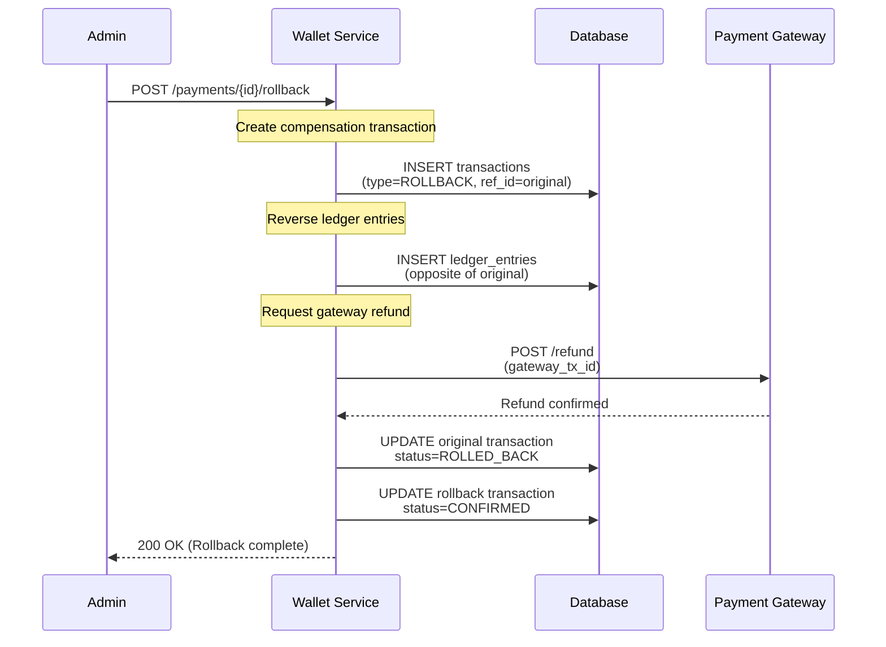

# Saga & Compensation Transactions

## Overview

Distributed transaction pattern using sagas for rollback and compensation in the Wallet Service.

---

## Saga Pattern

**Problem**: Rolling back across multiple services (payment gateway + wallet database)

**Solution**: Compensating transactions instead of traditional rollbacks

---

## Compensation Flow



---

## Compensation Implementation

```java
@Service
@Transactional
public class RollbackService {

    public RollbackResponse rollbackPayment(UUID transactionId) {
        // Step 1: Load original transaction
        Transaction original = transactionRepo.findById(transactionId)
            .orElseThrow();

        if (original.getStatus() != TransactionStatus.CONFIRMED) {
            throw new IllegalStateException("Cannot rollback non-confirmed transaction");
        }

        // Step 2: Create compensation transaction
        Transaction rollback = new Transaction();
        rollback.setPaymentType(PaymentType.ROLLBACK);
        rollback.setRefTransactionId(transactionId);
        rollback.setAmount(original.getAmount());
        rollback.setStatus(TransactionStatus.PENDING);
        transactionRepo.save(rollback);

        // Step 3: Create reverse ledger entries
        List<LedgerEntry> originalEntries = ledgerRepo.findByTransactionId(transactionId);
        for (LedgerEntry entry : originalEntries) {
            LedgerEntry reverse = new LedgerEntry();
            reverse.setTransactionId(rollback.getId());
            reverse.setWalletId(entry.getWalletId());
            // Reverse the entry type
            reverse.setEntryType(
                entry.getEntryType() == EntryType.DEBIT ? EntryType.CREDIT : EntryType.DEBIT
            );
            reverse.setAmount(entry.getAmount());
            ledgerRepo.save(reverse);
        }

        // Step 4: Request gateway refund
        if (original.getGatewayTransactionId() != null) {
            paymentGateway.refund(original.getGatewayTransactionId());
        }

        // Step 5: Update statuses
        original.setStatus(TransactionStatus.ROLLED_BACK);
        rollback.setStatus(TransactionStatus.CONFIRMED);

        transactionRepo.save(original);
        transactionRepo.save(rollback);

        return new RollbackResponse(rollback.getId());
    }
}
```

---

## Idempotent Rollback

Rollback itself must be idempotent (can be safely retried):

```java
@Transactional
public RollbackResponse rollbackPayment(UUID transactionId, String idempotencyKey) {
    // Check if already rolled back
    if (transactionRepo.existsByRefTransactionIdAndStatus(
        transactionId, TransactionStatus.CONFIRMED)) {
        // Return existing rollback
        return getRollbackResponse(transactionId);
    }

    // Proceed with rollback
    return executeRollback(transactionId);
}
```

---

See [Data Flows](../01-architecture/data-flows.md#2-payment-rollback-flow) for sequence diagrams.
