# Wallet Service - Product Design

## Document Overview

**Version**: 1.0.0
**Last Updated**: October 2025
**Status**: Production-Ready Design

This document provides comprehensive product design visualizations using Mermaid diagrams, covering architecture, user journeys, data models, and system interactions.

---

## Table of Contents

1. [C4 Architecture Model](#c4-architecture-model)
2. [Domain Model & Entity Relationships](#domain-model--entity-relationships)
3. [User Journey Maps](#user-journey-maps)
4. [Payment Processing Workflows](#payment-processing-workflows)
5. [Security Architecture](#security-architecture)
6. [Deployment Architecture](#deployment-architecture)
7. [State Machines](#state-machines)
8. [Integration Patterns](#integration-patterns)

---

## C4 Architecture Model

### Level 1: System Context Diagram

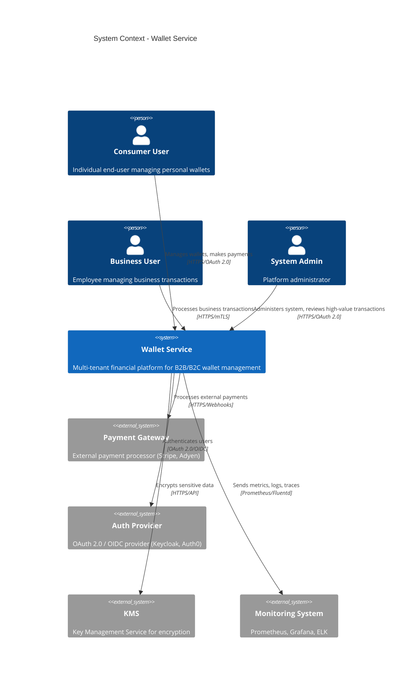
```mermaid
C4Context
    title System Context - Wallet Service

    Person(consumer, "Consumer User", "Individual end-user managing personal wallets")
    Person(business_user, "Business User", "Employee managing business transactions")
    Person(admin, "System Admin", "Platform administrator")

    System(wallet_service, "Wallet Service", "Multi-tenant financial platform for B2B/B2C wallet management")

    System_Ext(payment_gateway, "Payment Gateway", "External payment processor (Stripe, Adyen)")
    System_Ext(auth_provider, "Auth Provider", "OAuth 2.0 / OIDC provider (Keycloak, Auth0)")
    System_Ext(kms, "KMS", "Key Management Service for encryption")
    System_Ext(monitoring, "Monitoring System", "Prometheus, Grafana, ELK")

    Rel(consumer, wallet_service, "Manages wallets, makes payments", "HTTPS/OAuth 2.0")
    Rel(business_user, wallet_service, "Processes business transactions", "HTTPS/mTLS")
    Rel(admin, wallet_service, "Administers system, reviews high-value transactions", "HTTPS/OAuth 2.0")

    Rel(wallet_service, payment_gateway, "Processes external payments", "HTTPS/Webhooks")
    Rel(wallet_service, auth_provider, "Authenticates users", "OAuth 2.0/OIDC")
    Rel(wallet_service, kms, "Encrypts sensitive data", "HTTPS/API")
    Rel(wallet_service, monitoring, "Sends metrics, logs, traces", "Prometheus/Fluentd")
```

### Level 2: Container Diagram

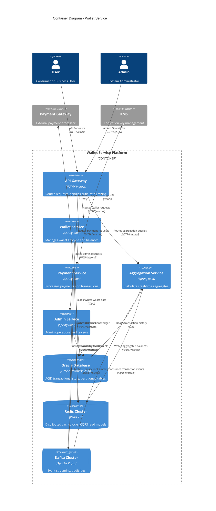
```mermaid
C4Container
    title Container Diagram - Wallet Service

    Person(user, "User", "Consumer or Business User")
    Person(admin, "Admin", "System Administrator")

    Container_Boundary(wallet_platform, "Wallet Service Platform") {
        Container(api_gateway, "API Gateway", "NGINX Ingress", "Routes requests, handles auth, rate limiting")

        Container(wallet_svc, "Wallet Service", "Spring Boot", "Manages wallet lifecycle and balances")
        Container(payment_svc, "Payment Service", "Spring Boot", "Processes payments and transactions")
        Container(aggregation_svc, "Aggregation Service", "Spring Boot", "Calculates real-time aggregates")
        Container(admin_svc, "Admin Service", "Spring Boot", "Admin operations and reviews")

        ContainerDb(oracle_db, "Oracle Database", "Oracle Database 26ai", "ACID transactional store, partitioned tables")
        ContainerDb(redis, "Redis Cluster", "Redis 7.x", "Distributed cache, locks, CQRS read models")
        ContainerQueue(kafka, "Kafka Cluster", "Apache Kafka", "Event streaming, audit logs")
    }

    System_Ext(payment_gateway, "Payment Gateway", "External payment processor")
    System_Ext(kms, "KMS", "Encryption key management")

    Rel(user, api_gateway, "API Requests", "HTTPS/JSON")
    Rel(admin, api_gateway, "Admin Operations", "HTTPS/JSON")

    Rel(api_gateway, wallet_svc, "Routes wallet requests", "HTTP/Internal")
    Rel(api_gateway, payment_svc, "Routes payment requests", "HTTP/Internal")
    Rel(api_gateway, aggregation_svc, "Routes aggregation queries", "HTTP/Internal")
    Rel(api_gateway, admin_svc, "Routes admin requests", "HTTP/Internal")

    Rel(wallet_svc, oracle_db, "Reads/Writes wallet data", "JDBC")
    Rel(wallet_svc, redis, "Caches balances", "Redis Protocol")
    Rel(wallet_svc, kafka, "Publishes WalletCreated events", "Kafka Protocol")

    Rel(payment_svc, oracle_db, "Writes transactions/ledger", "JDBC")
    Rel(payment_svc, redis, "Idempotency locks", "Redis Protocol")
    Rel(payment_svc, kafka, "Publishes TransactionCompleted", "Kafka Protocol")
    Rel(payment_svc, payment_gateway, "Processes external payments", "HTTPS")
    Rel(payment_svc, kms, "Encrypts PII", "HTTPS")

    Rel(aggregation_svc, oracle_db, "Reads transaction history", "JDBC")
    Rel(aggregation_svc, redis, "Writes aggregated balances", "Redis Protocol")
    Rel(kafka, aggregation_svc, "Consumes transaction events", "Kafka Protocol")

    Rel(admin_svc, oracle_db, "Reviews transactions", "JDBC")
```

### Level 3: Component Diagram - Payment Service

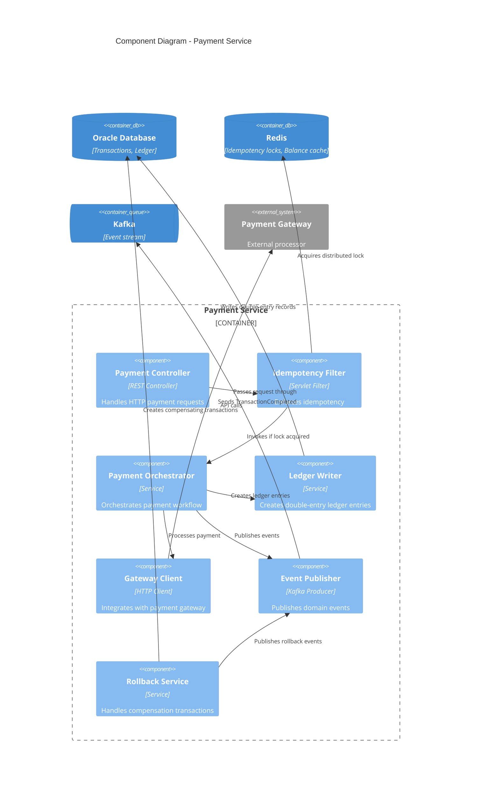
```mermaid
C4Component
    title Component Diagram - Payment Service

    Container_Boundary(payment_service, "Payment Service") {
        Component(payment_controller, "Payment Controller", "REST Controller", "Handles HTTP payment requests")
        Component(idempotency_filter, "Idempotency Filter", "Servlet Filter", "Enforces idempotency")
        Component(payment_orchestrator, "Payment Orchestrator", "Service", "Orchestrates payment workflow")
        Component(ledger_writer, "Ledger Writer", "Service", "Creates double-entry ledger entries")
        Component(gateway_client, "Gateway Client", "HTTP Client", "Integrates with payment gateway")
        Component(event_publisher, "Event Publisher", "Kafka Producer", "Publishes domain events")
        Component(rollback_service, "Rollback Service", "Service", "Handles compensation transactions")
    }

    ContainerDb(oracle_db, "Oracle Database", "Transactions, Ledger")
    ContainerDb(redis, "Redis", "Idempotency locks, Balance cache")
    ContainerQueue(kafka, "Kafka", "Event stream")
    System_Ext(payment_gateway, "Payment Gateway", "External processor")

    Rel(payment_controller, idempotency_filter, "Passes request through")
    Rel(idempotency_filter, redis, "Acquires distributed lock")
    Rel(idempotency_filter, payment_orchestrator, "Invokes if lock acquired")

    Rel(payment_orchestrator, ledger_writer, "Creates ledger entries")
    Rel(ledger_writer, oracle_db, "Writes double-entry records")

    Rel(payment_orchestrator, gateway_client, "Processes payment")
    Rel(gateway_client, payment_gateway, "API calls")

    Rel(payment_orchestrator, event_publisher, "Publishes events")
    Rel(event_publisher, kafka, "Sends TransactionCompleted")

    Rel(rollback_service, oracle_db, "Creates compensating transactions")
    Rel(rollback_service, event_publisher, "Publishes rollback events")
```

---

## Domain Model & Entity Relationships

### Complete Entity Relationship Diagram

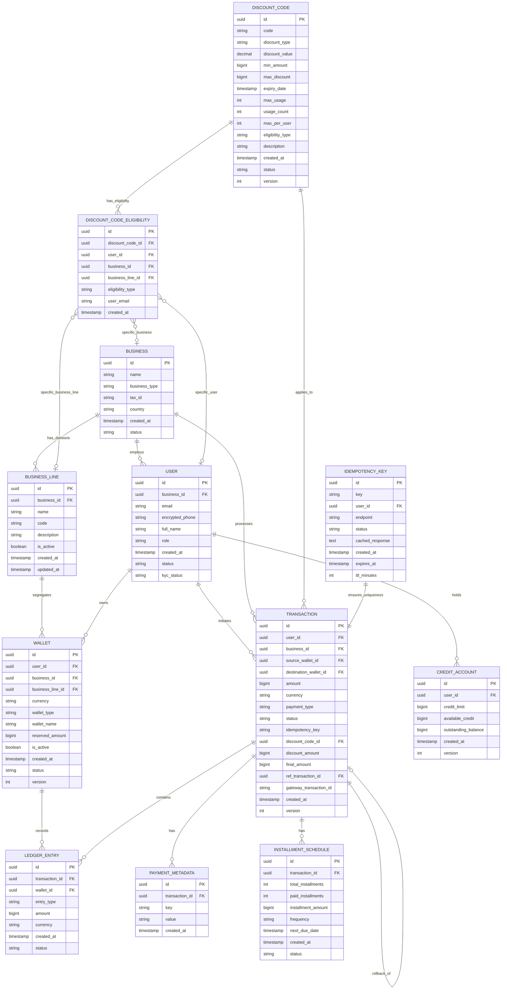
```mermaid
erDiagram
    BUSINESS ||--o{ USER : "employs"
    BUSINESS ||--o{ BUSINESS_LINE : "has_divisions"
    BUSINESS_LINE ||--o{ WALLET : "segregates"
    USER ||--o{ WALLET : "owns"
    WALLET ||--o{ LEDGER_ENTRY : "records"
    TRANSACTION ||--o{ LEDGER_ENTRY : "contains"
    USER ||--o{ TRANSACTION : "initiates"
    BUSINESS ||--o{ TRANSACTION : "processes"
    DISCOUNT_CODE ||--o{ TRANSACTION : "applies_to"
    DISCOUNT_CODE ||--o{ DISCOUNT_CODE_ELIGIBILITY : "has_eligibility"
    DISCOUNT_CODE_ELIGIBILITY }o--o| USER : "specific_user"
    DISCOUNT_CODE_ELIGIBILITY }o--o| BUSINESS : "specific_business"
    DISCOUNT_CODE_ELIGIBILITY }o--o| BUSINESS_LINE : "specific_business_line"
    TRANSACTION ||--o| TRANSACTION : "rollback_of"
    TRANSACTION ||--o{ PAYMENT_METADATA : "has"
    USER ||--o{ CREDIT_ACCOUNT : "holds"
    TRANSACTION ||--o{ INSTALLMENT_SCHEDULE : "has"
    IDEMPOTENCY_KEY ||--|| TRANSACTION : "ensures_uniqueness"

    BUSINESS {
        uuid id PK
        string name
        string business_type
        string tax_id
        string country
        timestamp created_at
        string status
    }

    BUSINESS_LINE {
        uuid id PK
        uuid business_id FK
        string name
        string code
        string description
        boolean is_active
        timestamp created_at
        timestamp updated_at
    }

    USER {
        uuid id PK
        uuid business_id FK
        string email
        string encrypted_phone
        string full_name
        string role
        timestamp created_at
        string status
        string kyc_status
    }

    WALLET {
        uuid id PK
        uuid user_id FK
        uuid business_id FK
        uuid business_line_id FK
        string currency
        string wallet_type
        string wallet_name
        bigint reserved_amount
        boolean is_active
        timestamp created_at
        string status
        int version
    }

    TRANSACTION {
        uuid id PK
        uuid user_id FK
        uuid business_id FK
        uuid source_wallet_id FK
        uuid destination_wallet_id FK
        bigint amount
        string currency
        string payment_type
        string status
        string idempotency_key
        uuid discount_code_id FK
        bigint discount_amount
        bigint final_amount
        uuid ref_transaction_id FK
        string gateway_transaction_id
        timestamp created_at
        int version
    }

    LEDGER_ENTRY {
        uuid id PK
        uuid transaction_id FK
        uuid wallet_id FK
        string entry_type
        bigint amount
        string currency
        timestamp created_at
        string status
    }

    DISCOUNT_CODE {
        uuid id PK
        string code
        string discount_type
        decimal discount_value
        bigint min_amount
        bigint max_discount
        timestamp expiry_date
        int max_usage
        int usage_count
        int max_per_user
        string eligibility_type
        string description
        timestamp created_at
        string status
        int version
    }

    DISCOUNT_CODE_ELIGIBILITY {
        uuid id PK
        uuid discount_code_id FK
        uuid user_id FK
        uuid business_id FK
        uuid business_line_id FK
        string eligibility_type
        string user_email
        timestamp created_at
    }

    PAYMENT_METADATA {
        uuid id PK
        uuid transaction_id FK
        string key
        string value
        timestamp created_at
    }

    CREDIT_ACCOUNT {
        uuid id PK
        uuid user_id FK
        bigint credit_limit
        bigint available_credit
        bigint outstanding_balance
        timestamp created_at
        int version
    }

    INSTALLMENT_SCHEDULE {
        uuid id PK
        uuid transaction_id FK
        int total_installments
        int paid_installments
        bigint installment_amount
        string frequency
        timestamp next_due_date
        timestamp created_at
        string status
    }

    IDEMPOTENCY_KEY {
        uuid id PK
        string key
        uuid user_id FK
        string endpoint
        string status
        text cached_response
        timestamp created_at
        timestamp expires_at
        int ttl_minutes
    }
```

### Hierarchical Data Model (ENHANCED - Multi-Business Wallet Support)

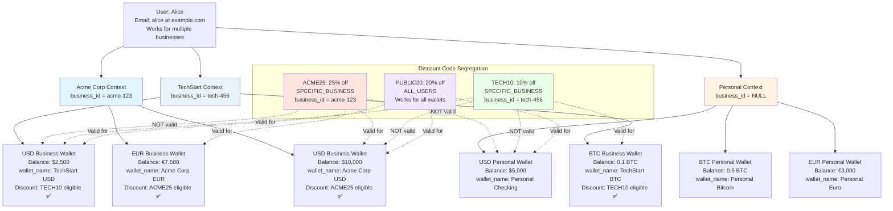
```mermaid
graph TB
    USER["User: Alice<br/>Email: alice at example.com<br/>Works for multiple businesses"]

    PERSONAL[Personal Context<br/>business_id = NULL]
    ACME[Acme Corp Context<br/>business_id = acme-123]
    TECH[TechStart Context<br/>business_id = tech-456]

    USER --> PERSONAL
    USER --> ACME
    USER --> TECH

    PERSONAL --> P1[USD Personal Wallet<br/>Balance: $5,000<br/>wallet_name: Personal Checking]
    PERSONAL --> P2[EUR Personal Wallet<br/>Balance: €3,000<br/>wallet_name: Personal Euro]
    PERSONAL --> P3[BTC Personal Wallet<br/>Balance: 0.5 BTC<br/>wallet_name: Personal Bitcoin]

    ACME --> A1[USD Business Wallet<br/>Balance: $10,000<br/>wallet_name: Acme Corp USD<br/>Discount: ACME25 eligible ✅]
    ACME --> A2[EUR Business Wallet<br/>Balance: €7,500<br/>wallet_name: Acme Corp EUR<br/>Discount: ACME25 eligible ✅]

    TECH --> T1[USD Business Wallet<br/>Balance: $2,500<br/>wallet_name: TechStart USD<br/>Discount: TECH10 eligible ✅]
    TECH --> T2[BTC Business Wallet<br/>Balance: 0.1 BTC<br/>wallet_name: TechStart BTC<br/>Discount: TECH10 eligible ✅]

    subgraph "Discount Code Segregation"
        DISC1[ACME25: 25% off<br/>SPECIFIC_BUSINESS<br/>business_id = acme-123]
        DISC2[TECH10: 10% off<br/>SPECIFIC_BUSINESS<br/>business_id = tech-456]
        DISC3[PUBLIC20: 20% off<br/>ALL_USERS<br/>Works for all wallets]
    end

    DISC1 -.Valid for.-> A1
    DISC1 -.Valid for.-> A2
    DISC1 -.NOT valid.-> P1
    DISC1 -.NOT valid.-> T1

    DISC2 -.Valid for.-> T1
    DISC2 -.Valid for.-> T2
    DISC2 -.NOT valid.-> A1
    DISC2 -.NOT valid.-> P1

    DISC3 -.Valid for.-> P1
    DISC3 -.Valid for.-> A1
    DISC3 -.Valid for.-> T1

    style PERSONAL fill:#fff4e1
    style ACME fill:#e1f5ff
    style TECH fill:#e8f4f8
    style DISC1 fill:#ffe4e1
    style DISC2 fill:#e8ffe8
    style DISC3 fill:#f0e8ff
```

### Key Features of Multi-Business Wallets

**✅ Complete Segregation**
- Alice has 7 independent wallets across 3 business contexts
- Each wallet has separate balance, transactions, and history
- Personal wallets (business_id = NULL) are independent from business wallets

**✅ Business-Specific Discounts**
- "ACME25" only works for Acme Corp wallets (A1, A2)
- "TECH10" only works for TechStart wallets (T1, T2)
- "PUBLIC20" works for all wallets

**✅ Unique Constraint**
- `(user_id, business_id, currency, wallet_type)` must be unique
- Alice can have USD wallet for Personal, Acme, and TechStart contexts
- Each is completely independent

**✅ Operations**
- **Deposit**: Credit specific business wallet
- **Withdraw**: Debit specific business wallet
- **Transfer**: Within same business context only (by default)
- **Cross-Business Transfer**: Requires admin approval (prevents fund mixing)

### Traditional Hierarchy (For Comparison)

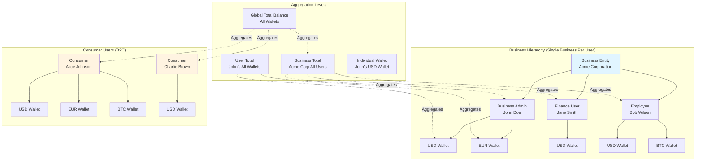
```mermaid
graph TB
    subgraph "Business Hierarchy (Single Business Per User)"
        BUSINESS[Business Entity<br/>Acme Corporation]

        BUSINESS --> USER1[Business Admin<br/>John Doe]
        BUSINESS --> USER2[Finance User<br/>Jane Smith]
        BUSINESS --> USER3[Employee<br/>Bob Wilson]

        USER1 --> W1A[USD Wallet]
        USER1 --> W1B[EUR Wallet]

        USER2 --> W2A[USD Wallet]

        USER3 --> W3A[USD Wallet]
        USER3 --> W3B[BTC Wallet]
    end

    subgraph "Consumer Users (B2C)"
        CONSUMER1[Consumer<br/>Alice Johnson]
        CONSUMER2[Consumer<br/>Charlie Brown]

        CONSUMER1 --> W4A[USD Wallet]
        CONSUMER1 --> W4B[EUR Wallet]
        CONSUMER1 --> W4C[BTC Wallet]

        CONSUMER2 --> W5A[USD Wallet]
    end

    subgraph "Aggregation Levels"
        AGG_GLOBAL[Global Total Balance<br/>All Wallets]
        AGG_BUSINESS[Business Total<br/>Acme Corp All Users]
        AGG_USER[User Total<br/>John's All Wallets]
        AGG_WALLET[Individual Wallet<br/>John's USD Wallet]
    end

    AGG_GLOBAL -.Aggregates.-> AGG_BUSINESS
    AGG_GLOBAL -.Aggregates.-> CONSUMER1
    AGG_GLOBAL -.Aggregates.-> CONSUMER2

    AGG_BUSINESS -.Aggregates.-> USER1
    AGG_BUSINESS -.Aggregates.-> USER2
    AGG_BUSINESS -.Aggregates.-> USER3

    AGG_USER -.Aggregates.-> W1A
    AGG_USER -.Aggregates.-> W1B

    style BUSINESS fill:#e1f5ff
    style CONSUMER1 fill:#fff4e1
    style CONSUMER2 fill:#fff4e1
```

---

## User Journey Maps

### Journey 1: Consumer Payment Flow

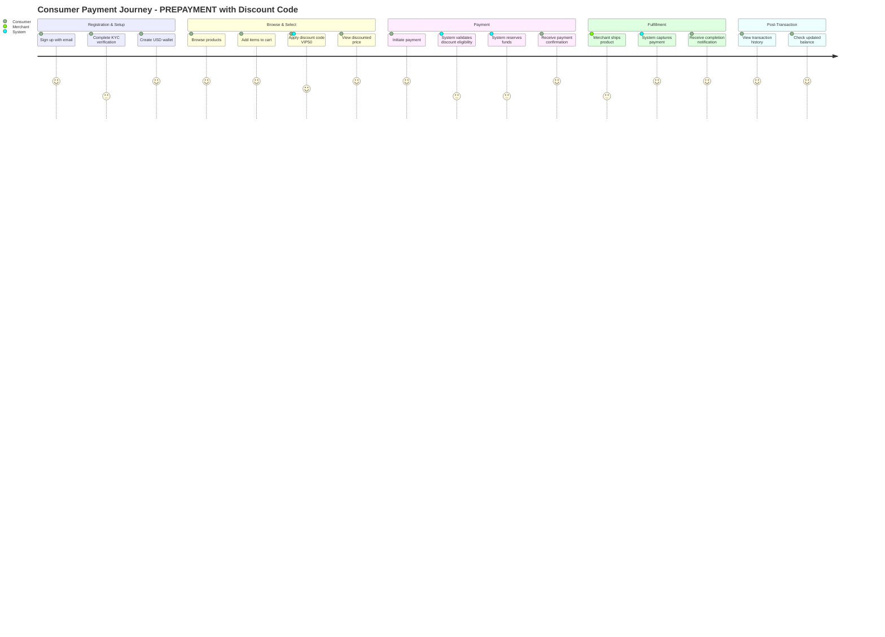
```mermaid
journey
    title Consumer Payment Journey - PREPAYMENT with Discount Code

    section Registration & Setup
        Sign up with email: 5: Consumer
        Complete KYC verification: 3: Consumer
        Create USD wallet: 5: Consumer

    section Browse & Select
        Browse products: 5: Consumer
        Add items to cart: 5: Consumer
        Apply discount code VIP50: 4: Consumer, System
        View discounted price: 5: Consumer

    section Payment
        Initiate payment: 5: Consumer
        System validates discount eligibility: 3: System
        System reserves funds: 3: System
        Receive payment confirmation: 5: Consumer

    section Fulfillment
        Merchant ships product: 3: Merchant
        System captures payment: 5: System
        Receive completion notification: 5: Consumer

    section Post-Transaction
        View transaction history: 5: Consumer
        Check updated balance: 5: Consumer
```

### Journey 2: Business Employee Expense Payment

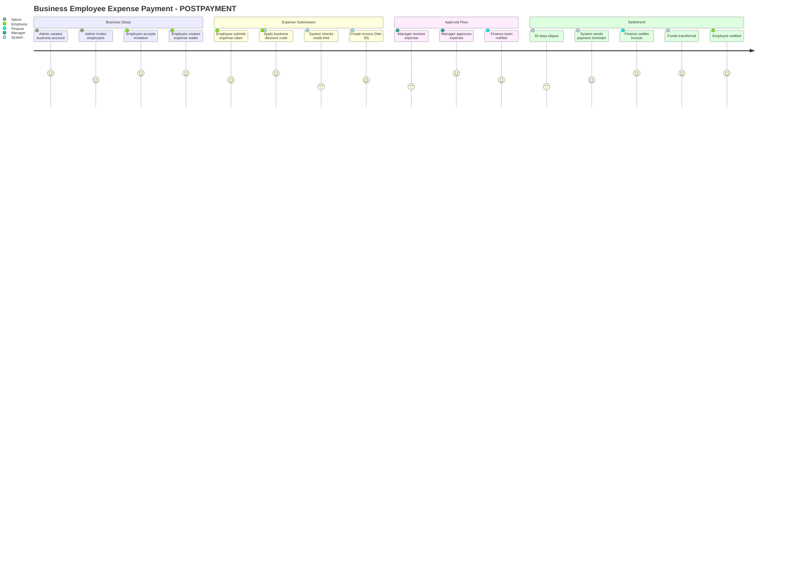
```mermaid
journey
    title Business Employee Expense Payment - POSTPAYMENT

    section Business Setup
        Admin creates business account: 5: Admin
        Admin invites employees: 4: Admin
        Employee accepts invitation: 5: Employee
        Employee creates expense wallet: 5: Employee

    section Expense Submission
        Employee submits expense claim: 4: Employee
        Apply business discount code: 5: Employee, System
        System checks credit limit: 3: System
        Create invoice (Net-30): 4: System

    section Approval Flow
        Manager reviews expense: 3: Manager
        Manager approves expense: 5: Manager
        Finance team notified: 4: Finance

    section Settlement
        30 days elapse: 3: System
        System sends payment reminder: 4: System
        Finance settles invoice: 5: Finance
        Funds transferred: 5: System
        Employee notified: 5: Employee
```

### Journey 3: High-Value Transaction (VALUABLE)

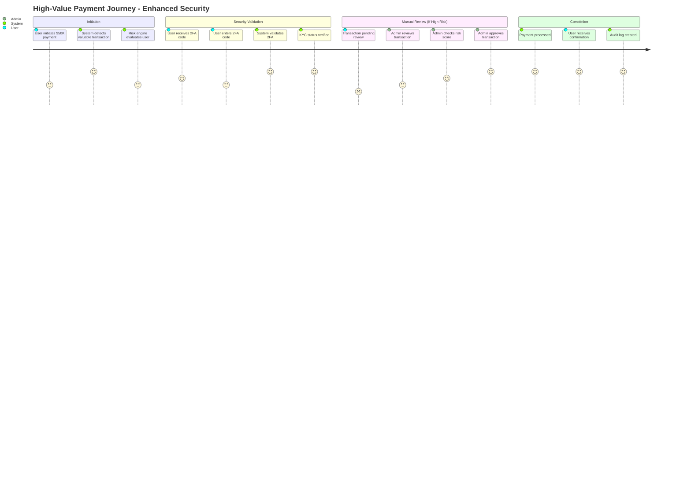
```mermaid
journey
    title High-Value Payment Journey - Enhanced Security

    section Initiation
        User initiates $50K payment: 3: User
        System detects valuable transaction: 5: System
        Risk engine evaluates user: 3: System

    section Security Validation
        User receives 2FA code: 4: User
        User enters 2FA code: 3: User
        System validates 2FA: 5: System
        KYC status verified: 5: System

    section Manual Review (If High Risk)
        Transaction pending review: 2: User
        Admin reviews transaction: 3: Admin
        Admin checks risk score: 4: Admin
        Admin approves transaction: 5: Admin

    section Completion
        Payment processed: 5: System
        User receives confirmation: 5: User
        Audit log created: 5: System
```

---

## Payment Processing Workflows

### Workflow 1: Standard Payment with Discount (Simplified)

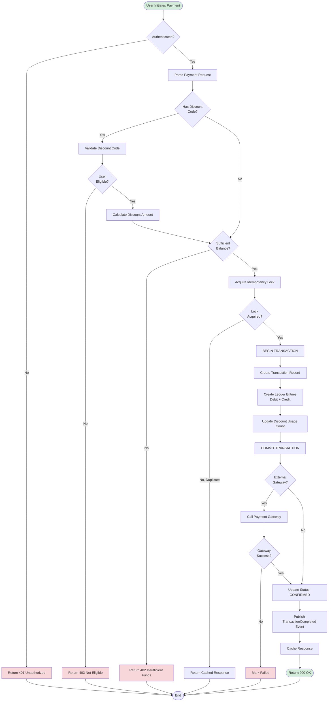
```mermaid
flowchart TD
    START([User Initiates Payment]) --> CHECK_AUTH{Authenticated?}
    CHECK_AUTH -->|No| AUTH_FAIL[Return 401 Unauthorized]
    CHECK_AUTH -->|Yes| PARSE_REQUEST[Parse Payment Request]

    PARSE_REQUEST --> HAS_DISCOUNT{Has Discount<br/>Code?}

    HAS_DISCOUNT -->|Yes| VALIDATE_DISCOUNT[Validate Discount Code]
    VALIDATE_DISCOUNT --> CHECK_ELIGIBILITY{User<br/>Eligible?}
    CHECK_ELIGIBILITY -->|No| DISCOUNT_FAIL[Return 403 Not Eligible]
    CHECK_ELIGIBILITY -->|Yes| CALC_DISCOUNT[Calculate Discount Amount]
    CALC_DISCOUNT --> CHECK_BALANCE

    HAS_DISCOUNT -->|No| CHECK_BALANCE{Sufficient<br/>Balance?}

    CHECK_BALANCE -->|No| BALANCE_FAIL[Return 402 Insufficient Funds]
    CHECK_BALANCE -->|Yes| ACQUIRE_LOCK[Acquire Idempotency Lock]

    ACQUIRE_LOCK --> LOCK_STATUS{Lock<br/>Acquired?}
    LOCK_STATUS -->|No, Duplicate| RETURN_CACHED[Return Cached Response]
    LOCK_STATUS -->|Yes| BEGIN_TX[BEGIN TRANSACTION]

    BEGIN_TX --> CREATE_TX[Create Transaction Record]
    CREATE_TX --> CREATE_LEDGER[Create Ledger Entries<br/>Debit + Credit]
    CREATE_LEDGER --> UPDATE_DISCOUNT[Update Discount Usage Count]
    UPDATE_DISCOUNT --> COMMIT_TX[COMMIT TRANSACTION]

    COMMIT_TX --> CALL_GATEWAY{External<br/>Gateway?}
    CALL_GATEWAY -->|Yes| GATEWAY_CALL[Call Payment Gateway]
    GATEWAY_CALL --> GATEWAY_STATUS{Gateway<br/>Success?}
    GATEWAY_STATUS -->|No| GATEWAY_FAIL[Mark Failed]
    GATEWAY_STATUS -->|Yes| UPDATE_CONFIRMED

    CALL_GATEWAY -->|No| UPDATE_CONFIRMED[Update Status: CONFIRMED]

    UPDATE_CONFIRMED --> PUBLISH_EVENT[Publish TransactionCompleted Event]
    PUBLISH_EVENT --> CACHE_RESPONSE[Cache Response]
    CACHE_RESPONSE --> SUCCESS([Return 200 OK])

    AUTH_FAIL --> END([End])
    DISCOUNT_FAIL --> END
    BALANCE_FAIL --> END
    RETURN_CACHED --> END
    GATEWAY_FAIL --> END
    SUCCESS --> END

    style START fill:#d4edda
    style SUCCESS fill:#d4edda
    style AUTH_FAIL fill:#f8d7da
    style DISCOUNT_FAIL fill:#f8d7da
    style BALANCE_FAIL fill:#f8d7da
    style GATEWAY_FAIL fill:#f8d7da
```

### Workflow 2: Payment Type Decision Tree

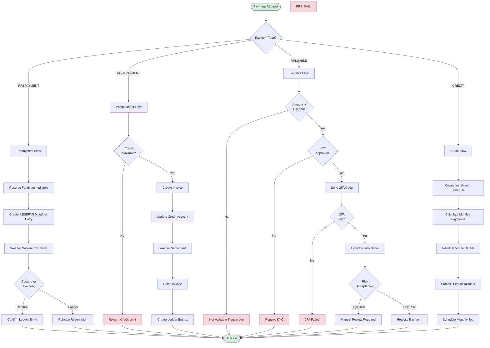
```mermaid
flowchart TD
    START([Payment Request]) --> CHECK_TYPE{Payment Type?}

    CHECK_TYPE -->|PREPAYMENT| PRE_START[Prepayment Flow]
    CHECK_TYPE -->|POSTPAYMENT| POST_START[Postpayment Flow]
    CHECK_TYPE -->|VALUABLE| VAL_START[Valuable Flow]
    CHECK_TYPE -->|CREDIT| CREDIT_START[Credit Flow]

    PRE_START --> PRE_RESERVE[Reserve Funds Immediately]
    PRE_RESERVE --> PRE_LEDGER[Create RESERVED Ledger Entry]
    PRE_LEDGER --> PRE_WAIT[Wait for Capture or Cancel]
    PRE_WAIT --> PRE_DECISION{Capture or<br/>Cancel?}
    PRE_DECISION -->|Capture| PRE_CONFIRM[Confirm Ledger Entry]
    PRE_DECISION -->|Cancel| PRE_CANCEL[Release Reservation]
    PRE_CONFIRM --> END([Success])
    PRE_CANCEL --> END

    POST_START --> POST_CHECK_CREDIT{Credit<br/>Available?}
    POST_CHECK_CREDIT -->|No| POST_FAIL[Reject - Credit Limit]
    POST_CHECK_CREDIT -->|Yes| POST_INVOICE[Create Invoice]
    POST_INVOICE --> POST_UPDATE[Update Credit Account]
    POST_UPDATE --> POST_WAIT[Wait for Settlement]
    POST_WAIT --> POST_SETTLE[Settle Invoice]
    POST_SETTLE --> POST_LEDGER[Create Ledger Entries]
    POST_LEDGER --> END
    POST_FAIL --> END

    VAL_START --> VAL_THRESHOLD{Amount ><br/>$10,000?}
    VAL_THRESHOLD -->|No| VAL_FAIL[Not Valuable Transaction]
    VAL_THRESHOLD -->|Yes| VAL_KYC{KYC<br/>Approved?}
    VAL_KYC -->|No| VAL_KYC_FAIL[Require KYC]
    VAL_KYC -->|Yes| VAL_2FA[Send 2FA Code]
    VAL_2FA --> VAL_VERIFY{2FA<br/>Valid?}
    VAL_VERIFY -->|No| VAL_2FA_FAIL[2FA Failed]
    VAL_VERIFY -->|Yes| VAL_RISK[Evaluate Risk Score]
    VAL_RISK --> VAL_RISK_CHECK{Risk<br/>Acceptable?}
    VAL_RISK_CHECK -->|High Risk| VAL_REVIEW[Manual Review Required]
    VAL_RISK_CHECK -->|Low Risk| VAL_PROCESS[Process Payment]
    VAL_PROCESS --> END
    VAL_REVIEW --> END
    VAL_FAIL --> END
    VAL_KYC_FAIL --> END
    VAL_2FA_FAIL --> END

    CREDIT_START --> CREDIT_PLAN[Create Installment Schedule]
    CREDIT_PLAN --> CREDIT_CALC[Calculate Monthly Payments]
    CREDIT_CALC --> CREDIT_SCHEDULE[Insert Schedule Details]
    CREDIT_SCHEDULE --> CREDIT_FIRST[Process First Installment]
    CREDIT_FIRST --> CREDIT_CRON[Schedule Monthly Job]
    CREDIT_CRON --> END

    style START fill:#d4edda
    style END fill:#d4edda
    style PRE_FAIL fill:#f8d7da
    style POST_FAIL fill:#f8d7da
    style VAL_FAIL fill:#f8d7da
    style VAL_KYC_FAIL fill:#f8d7da
    style VAL_2FA_FAIL fill:#f8d7da
```

### Workflow 3: Discount Code Eligibility Validation

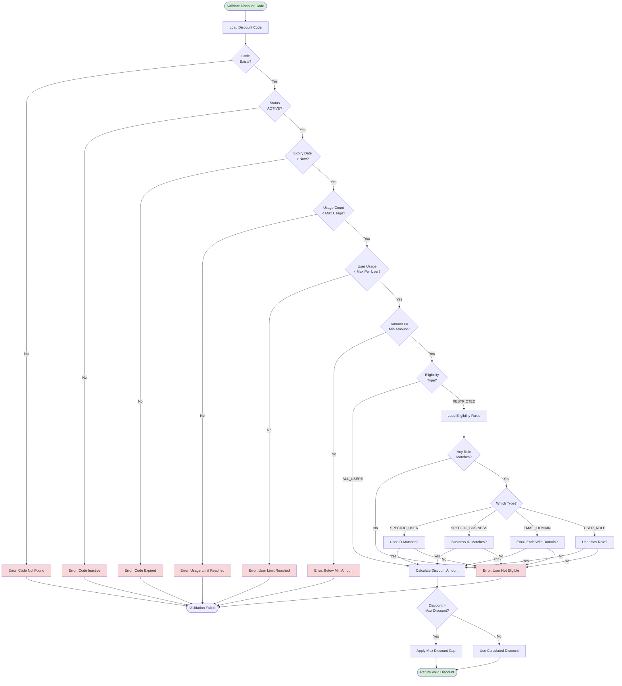
```mermaid
flowchart TD
    START([Validate Discount Code]) --> LOAD_CODE[Load Discount Code]
    LOAD_CODE --> EXISTS{Code<br/>Exists?}
    EXISTS -->|No| NOT_FOUND[Error: Code Not Found]
    EXISTS -->|Yes| CHECK_STATUS{Status<br/>ACTIVE?}

    CHECK_STATUS -->|No| INACTIVE[Error: Code Inactive]
    CHECK_STATUS -->|Yes| CHECK_EXPIRY{Expiry Date<br/>> Now?}

    CHECK_EXPIRY -->|No| EXPIRED[Error: Code Expired]
    CHECK_EXPIRY -->|Yes| CHECK_USAGE{Usage Count<br/>< Max Usage?}

    CHECK_USAGE -->|No| USAGE_LIMIT[Error: Usage Limit Reached]
    CHECK_USAGE -->|Yes| CHECK_USER_USAGE{User Usage<br/>< Max Per User?}

    CHECK_USER_USAGE -->|No| USER_LIMIT[Error: User Limit Reached]
    CHECK_USER_USAGE -->|Yes| CHECK_MIN_AMOUNT{Amount >=<br/>Min Amount?}

    CHECK_MIN_AMOUNT -->|No| MIN_AMOUNT[Error: Below Min Amount]
    CHECK_MIN_AMOUNT -->|Yes| CHECK_ELIG_TYPE{Eligibility<br/>Type?}

    CHECK_ELIG_TYPE -->|ALL_USERS| CALC_DISCOUNT[Calculate Discount Amount]
    CHECK_ELIG_TYPE -->|RESTRICTED| LOAD_ELIGIBILITY[Load Eligibility Rules]

    LOAD_ELIGIBILITY --> CHECK_RULES{Any Rule<br/>Matches?}
    CHECK_RULES -->|No| NOT_ELIGIBLE[Error: User Not Eligible]
    CHECK_RULES -->|Yes| MATCH_TYPE{Which Type?}

    MATCH_TYPE -->|SPECIFIC_USER| CHECK_USER[User ID Matches?]
    MATCH_TYPE -->|SPECIFIC_BUSINESS| CHECK_BUSINESS[Business ID Matches?]
    MATCH_TYPE -->|EMAIL_DOMAIN| CHECK_EMAIL[Email Ends With Domain?]
    MATCH_TYPE -->|USER_ROLE| CHECK_ROLE[User Has Role?]

    CHECK_USER -->|Yes| CALC_DISCOUNT
    CHECK_BUSINESS -->|Yes| CALC_DISCOUNT
    CHECK_EMAIL -->|Yes| CALC_DISCOUNT
    CHECK_ROLE -->|Yes| CALC_DISCOUNT

    CHECK_USER -->|No| NOT_ELIGIBLE
    CHECK_BUSINESS -->|No| NOT_ELIGIBLE
    CHECK_EMAIL -->|No| NOT_ELIGIBLE
    CHECK_ROLE -->|No| NOT_ELIGIBLE

    CALC_DISCOUNT --> APPLY_CAP{Discount ><br/>Max Discount?}
    APPLY_CAP -->|Yes| CAP_DISCOUNT[Apply Max Discount Cap]
    APPLY_CAP -->|No| USE_CALCULATED[Use Calculated Discount]

    CAP_DISCOUNT --> SUCCESS([Return Valid Discount])
    USE_CALCULATED --> SUCCESS

    NOT_FOUND --> END([Validation Failed])
    INACTIVE --> END
    EXPIRED --> END
    USAGE_LIMIT --> END
    USER_LIMIT --> END
    MIN_AMOUNT --> END
    NOT_ELIGIBLE --> END

    style START fill:#d4edda
    style SUCCESS fill:#d4edda
    style NOT_FOUND fill:#f8d7da
    style INACTIVE fill:#f8d7da
    style EXPIRED fill:#f8d7da
    style USAGE_LIMIT fill:#f8d7da
    style USER_LIMIT fill:#f8d7da
    style MIN_AMOUNT fill:#f8d7da
    style NOT_ELIGIBLE fill:#f8d7da
```

---

## Security Architecture

### Authentication & Authorization Flow

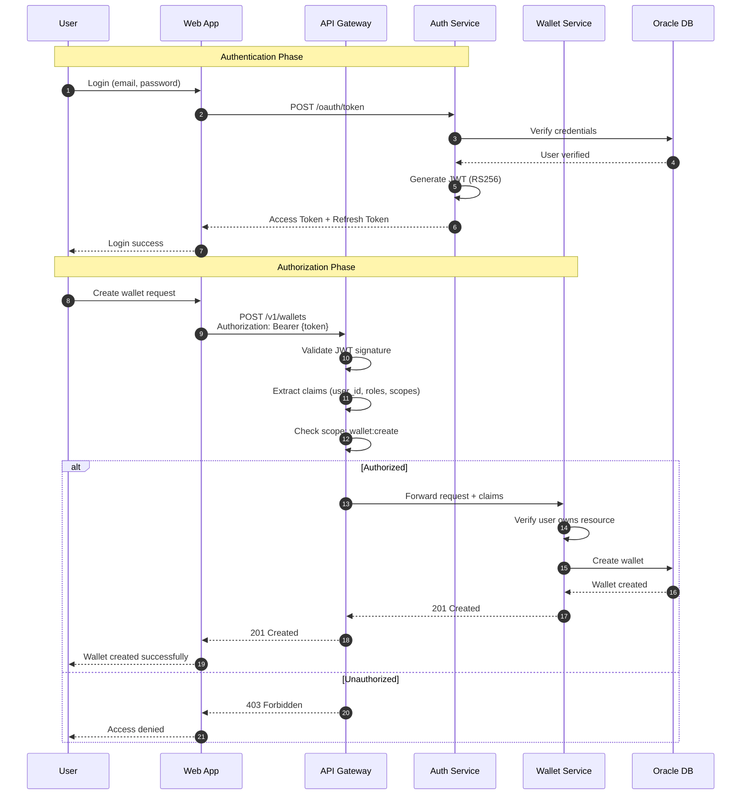
```mermaid
sequenceDiagram
    autonumber

    participant User
    participant Web App
    participant API Gateway
    participant Auth Service
    participant Wallet Service
    participant Oracle DB

    Note over User,Auth Service: Authentication Phase
    User->>Web App: Login (email, password)
    Web App->>Auth Service: POST /oauth/token
    Auth Service->>Oracle DB: Verify credentials
    Oracle DB-->>Auth Service: User verified
    Auth Service->>Auth Service: Generate JWT (RS256)
    Auth Service-->>Web App: Access Token + Refresh Token
    Web App-->>User: Login success

    Note over User,Wallet Service: Authorization Phase
    User->>Web App: Create wallet request
    Web App->>API Gateway: POST /v1/wallets<br/>Authorization: Bearer {token}
    API Gateway->>API Gateway: Validate JWT signature
    API Gateway->>API Gateway: Extract claims (user_id, roles, scopes)
    API Gateway->>API Gateway: Check scope: wallet:create

    alt Authorized
        API Gateway->>Wallet Service: Forward request + claims
        Wallet Service->>Wallet Service: Verify user owns resource
        Wallet Service->>Oracle DB: Create wallet
        Oracle DB-->>Wallet Service: Wallet created
        Wallet Service-->>API Gateway: 201 Created
        API Gateway-->>Web App: 201 Created
        Web App-->>User: Wallet created successfully
    else Unauthorized
        API Gateway-->>Web App: 403 Forbidden
        Web App-->>User: Access denied
    end
```

### Encryption Architecture

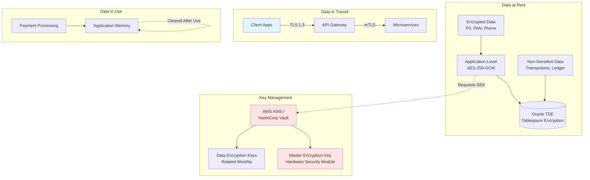
```mermaid
graph TB
    subgraph "Data at Rest"
        DB_PLAIN[Non-Sensitive Data<br/>Transactions, Ledger]
        DB_ENC[Encrypted Data<br/>PII, PAN, Phone]

        DB_PLAIN --> ORACLE[(Oracle TDE<br/>Tablespace Encryption)]
        DB_ENC --> APP_ENCRYPT[Application-Level<br/>AES-256-GCM]
        APP_ENCRYPT --> ORACLE
    end

    subgraph "Key Management"
        KMS[AWS KMS /<br/>HashiCorp Vault]

        KMS --> DEK[Data Encryption Keys<br/>Rotated Monthly]
        KMS --> MEK[Master Encryption Key<br/>Hardware Security Module]

        APP_ENCRYPT -.Requests DEK.-> KMS
    end

    subgraph "Data in Transit"
        CLIENT[Client Apps]
        API_GW[API Gateway]
        SERVICES[Microservices]

        CLIENT -->|TLS 1.3| API_GW
        API_GW -->|mTLS| SERVICES
    end

    subgraph "Data in Use"
        MEMORY[Application Memory]
        PROCESS[Payment Processing]

        PROCESS --> MEMORY
        MEMORY -.Cleared After Use.-> MEMORY
    end

    style KMS fill:#ffe4e1
    style MEK fill:#ffe4e1
    style CLIENT fill:#e1f5ff
```

### PCI-DSS Compliance Zones

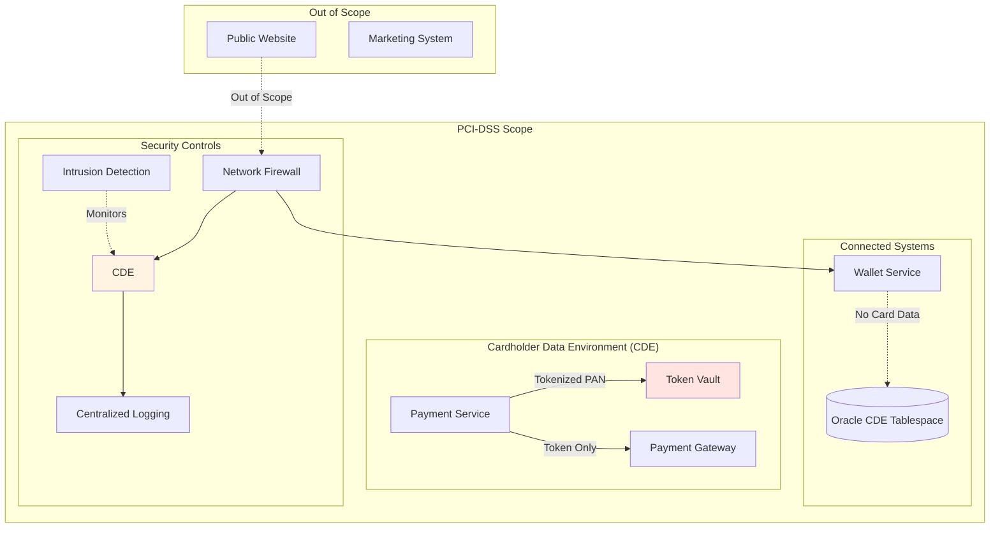
```mermaid
graph TB
    subgraph "Out of Scope"
        PUBLIC[Public Website]
        MARKETING[Marketing System]
    end

    subgraph "PCI-DSS Scope"
        subgraph "Cardholder Data Environment (CDE)"
            PAYMENT_SVC[Payment Service]
            TOKEN_VAULT[Token Vault]
            GATEWAY[Payment Gateway]

            PAYMENT_SVC -->|Tokenized PAN| TOKEN_VAULT
            PAYMENT_SVC -->|Token Only| GATEWAY
        end

        subgraph "Connected Systems"
            WALLET_SVC[Wallet Service]
            DB_CDE[(Oracle CDE Tablespace)]

            WALLET_SVC -.No Card Data.-> DB_CDE
        end

        subgraph "Security Controls"
            FIREWALL[Network Firewall]
            IDS[Intrusion Detection]
            LOG[Centralized Logging]

            FIREWALL --> CDE
            IDS -.Monitors.-> CDE
            CDE --> LOG
        end
    end

    PUBLIC -.Out of Scope.-> FIREWALL
    FIREWALL --> WALLET_SVC

    style CDE fill:#fff4e1
    style TOKEN_VAULT fill:#ffe4e1
```

---

## Deployment Architecture

### Kubernetes Cluster Topology

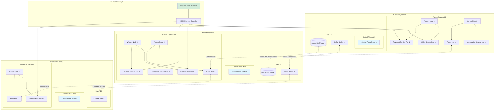
```mermaid
graph TB
    subgraph "Availability Zone 1"
        subgraph "Control Plane AZ1"
            CP1[Control Plane Node 1]
        end

        subgraph "Worker Nodes AZ1"
            W1[Worker Node 1]
            W2[Worker Node 2]

            W1 --> POD1A[Wallet Service Pod 1]
            W1 --> POD1B[Payment Service Pod 1]
            W2 --> POD1C[Aggregation Service Pod 1]
            W2 --> POD1D[Redis Pod 1]
        end

        subgraph "Data AZ1"
            DB1[(Oracle RAC Node 1)]
            KAFKA1[Kafka Broker 1]
        end
    end

    subgraph "Availability Zone 2"
        subgraph "Control Plane AZ2"
            CP2[Control Plane Node 2]
        end

        subgraph "Worker Nodes AZ2"
            W3[Worker Node 3]
            W4[Worker Node 4]

            W3 --> POD2A[Wallet Service Pod 2]
            W3 --> POD2B[Payment Service Pod 2]
            W4 --> POD2C[Aggregation Service Pod 2]
            W4 --> POD2D[Redis Pod 2]
        end

        subgraph "Data AZ2"
            DB2[(Oracle RAC Node 2)]
            KAFKA2[Kafka Broker 2]
        end
    end

    subgraph "Availability Zone 3"
        subgraph "Control Plane AZ3"
            CP3[Control Plane Node 3]
        end

        subgraph "Worker Nodes AZ3"
            W5[Worker Node 5]

            W5 --> POD3A[Wallet Service Pod 3]
            W5 --> POD3B[Redis Pod 3]
        end

        subgraph "Data AZ3"
            KAFKA3[Kafka Broker 3]
        end
    end

    subgraph "Load Balancer Layer"
        LB[External Load Balancer]
        INGRESS[NGINX Ingress Controller]
    end

    LB --> INGRESS
    INGRESS --> POD1A
    INGRESS --> POD1B
    INGRESS --> POD2A
    INGRESS --> POD2B
    INGRESS --> POD3A

    DB1 <-.Oracle RAC Interconnect.-> DB2
    KAFKA1 <-.Kafka Replication.-> KAFKA2
    KAFKA2 <-.Kafka Replication.-> KAFKA3
    POD1D <-.Redis Cluster.-> POD2D
    POD2D <-.Redis Cluster.-> POD3B

    style LB fill:#d4edda
    style CP1 fill:#e1f5ff
    style CP2 fill:#e1f5ff
    style CP3 fill:#e1f5ff
```

### Horizontal Pod Autoscaling

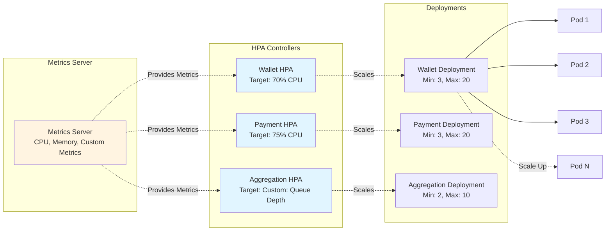
```mermaid
graph LR
    subgraph "Metrics Server"
        METRICS[Metrics Server<br/>CPU, Memory, Custom Metrics]
    end

    subgraph "HPA Controllers"
        HPA_WALLET[Wallet HPA<br/>Target: 70% CPU]
        HPA_PAYMENT[Payment HPA<br/>Target: 75% CPU]
        HPA_AGG[Aggregation HPA<br/>Target: Custom: Queue Depth]
    end

    subgraph "Deployments"
        WALLET_DEPLOY[Wallet Deployment<br/>Min: 3, Max: 20]
        PAYMENT_DEPLOY[Payment Deployment<br/>Min: 3, Max: 20]
        AGG_DEPLOY[Aggregation Deployment<br/>Min: 2, Max: 10]
    end

    METRICS -.Provides Metrics.-> HPA_WALLET
    METRICS -.Provides Metrics.-> HPA_PAYMENT
    METRICS -.Provides Metrics.-> HPA_AGG

    HPA_WALLET -.Scales.-> WALLET_DEPLOY
    HPA_PAYMENT -.Scales.-> PAYMENT_DEPLOY
    HPA_AGG -.Scales.-> AGG_DEPLOY

    WALLET_DEPLOY --> POD1[Pod 1]
    WALLET_DEPLOY --> POD2[Pod 2]
    WALLET_DEPLOY --> POD3[Pod 3]
    WALLET_DEPLOY -.Scale Up.-> PODN[Pod N]

    style METRICS fill:#fff4e1
    style HPA_WALLET fill:#e1f5ff
    style HPA_PAYMENT fill:#e1f5ff
    style HPA_AGG fill:#e1f5ff
```

---

## State Machines

### Transaction Lifecycle State Machine

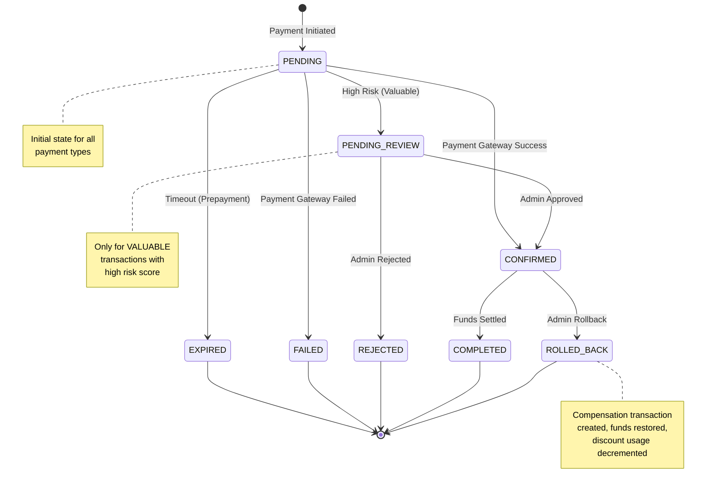
```mermaid
stateDiagram-v2
    [*] --> PENDING: Payment Initiated

    PENDING --> CONFIRMED: Payment Gateway Success
    PENDING --> FAILED: Payment Gateway Failed
    PENDING --> EXPIRED: Timeout (Prepayment)
    PENDING --> PENDING_REVIEW: High Risk (Valuable)

    PENDING_REVIEW --> CONFIRMED: Admin Approved
    PENDING_REVIEW --> REJECTED: Admin Rejected

    CONFIRMED --> COMPLETED: Funds Settled
    CONFIRMED --> ROLLED_BACK: Admin Rollback

    EXPIRED --> [*]
    FAILED --> [*]
    REJECTED --> [*]
    COMPLETED --> [*]
    ROLLED_BACK --> [*]

    note right of PENDING
        Initial state for all
        payment types
    end note

    note right of PENDING_REVIEW
        Only for VALUABLE
        transactions with
        high risk score
    end note

    note right of ROLLED_BACK
        Compensation transaction
        created, funds restored,
        discount usage decremented
    end note
```

### Discount Code Lifecycle State Machine

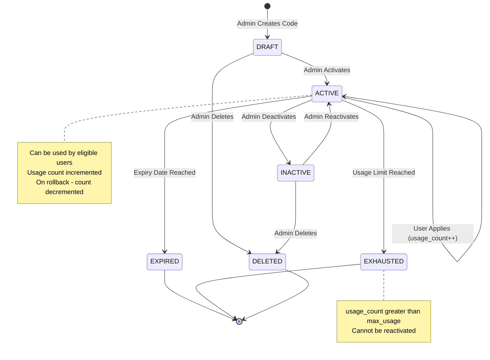
```mermaid
stateDiagram-v2
    [*] --> DRAFT: Admin Creates Code

    DRAFT --> ACTIVE: Admin Activates
    DRAFT --> DELETED: Admin Deletes

    ACTIVE --> ACTIVE: User Applies (usage_count++)
    ACTIVE --> EXPIRED: Expiry Date Reached
    ACTIVE --> EXHAUSTED: Usage Limit Reached
    ACTIVE --> INACTIVE: Admin Deactivates

    INACTIVE --> ACTIVE: Admin Reactivates
    INACTIVE --> DELETED: Admin Deletes

    EXPIRED --> [*]
    EXHAUSTED --> [*]
    DELETED --> [*]

    note right of ACTIVE
        Can be used by eligible users
        Usage count incremented
        On rollback - count decremented
    end note

    note right of EXHAUSTED
        usage_count greater than max_usage
        Cannot be reactivated
    end note
```

### Wallet Status State Machine

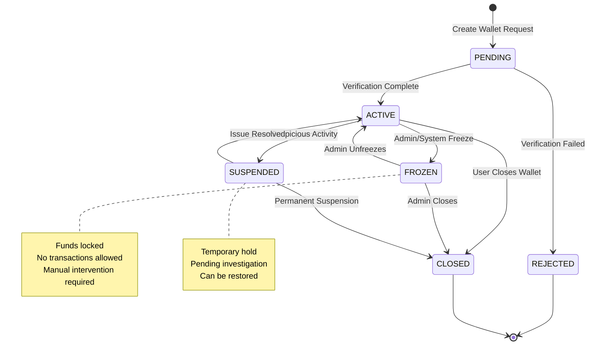
```mermaid
stateDiagram-v2
    [*] --> PENDING: Create Wallet Request

    PENDING --> ACTIVE: Verification Complete
    PENDING --> REJECTED: Verification Failed

    ACTIVE --> FROZEN: Admin/System Freeze
    ACTIVE --> SUSPENDED: Suspicious Activity
    ACTIVE --> CLOSED: User Closes Wallet

    FROZEN --> ACTIVE: Admin Unfreezes
    FROZEN --> CLOSED: Admin Closes

    SUSPENDED --> ACTIVE: Issue Resolved
    SUSPENDED --> CLOSED: Permanent Suspension

    REJECTED --> [*]
    CLOSED --> [*]

    note right of FROZEN
        Funds locked
        No transactions allowed
        Manual intervention required
    end note

    note right of SUSPENDED
        Temporary hold
        Pending investigation
        Can be restored
    end note
```

---

## Integration Patterns

### Event-Driven Integration (Kafka)

```mermaid
sequenceDiagram
    autonumber

    participant Payment Service
    participant Outbox Table
    participant Outbox Processor
    participant Kafka
    participant Aggregation Service
    participant Audit Service
    participant Notification Service

    Note over Payment Service,Outbox Table: Outbox Pattern (Atomic Commit)
    Payment Service->>Outbox Table: BEGIN TRANSACTION
    Payment Service->>Outbox Table: INSERT transaction
    Payment Service->>Outbox Table: INSERT ledger_entries
    Payment Service->>Outbox Table: INSERT outbox_events<br/>(TransactionCompleted)
    Payment Service->>Outbox Table: COMMIT

    Note over Outbox Processor,Kafka: Event Publishing
    Outbox Processor->>Outbox Table: SELECT unpublished events
    Outbox Processor->>Kafka: Publish to transactions topic
    Kafka-->>Outbox Processor: Ack
    Outbox Processor->>Outbox Table: UPDATE published_at

    Note over Kafka,Notification Service: Event Consumption
    Kafka->>Aggregation Service: TransactionCompleted event
    Aggregation Service->>Aggregation Service: Update cached balances
    Aggregation Service->>Kafka: Ack

    Kafka->>Audit Service: TransactionCompleted event
    Audit Service->>Audit Service: Store immutable audit log
    Audit Service->>Kafka: Ack

    Kafka->>Notification Service: TransactionCompleted event
    Notification Service->>Notification Service: Send email/SMS to user
    Notification Service->>Kafka: Ack
```

### Payment Gateway Integration (Circuit Breaker)

```mermaid
sequenceDiagram
    autonumber

    participant Payment Service
    participant Circuit Breaker
    participant Payment Gateway
    participant Fallback Handler

    Note over Payment Service,Circuit Breaker: Healthy State (CLOSED)
    Payment Service->>Circuit Breaker: Process payment
    Circuit Breaker->>Payment Gateway: POST /charge
    Payment Gateway-->>Circuit Breaker: 200 OK
    Circuit Breaker-->>Payment Service: Success

    Note over Payment Service,Circuit Breaker: Degraded State (OPEN)
    Payment Service->>Circuit Breaker: Process payment
    Circuit Breaker->>Payment Gateway: POST /charge
    Payment Gateway--xCircuit Breaker: Timeout (5s)
    Circuit Breaker->>Circuit Breaker: Failure count++
    Circuit Breaker->>Circuit Breaker: If failures > 50%, OPEN
    Circuit Breaker->>Fallback Handler: Trigger fallback
    Fallback Handler->>Fallback Handler: Queue for manual review
    Fallback Handler-->>Payment Service: 202 Accepted (Manual Review)

    Note over Payment Service,Circuit Breaker: Recovery State (HALF_OPEN)
    Circuit Breaker->>Circuit Breaker: Wait 60 seconds
    Circuit Breaker->>Circuit Breaker: Transition to HALF_OPEN
    Payment Service->>Circuit Breaker: Process payment
    Circuit Breaker->>Payment Gateway: POST /charge (Test)
    Payment Gateway-->>Circuit Breaker: 200 OK
    Circuit Breaker->>Circuit Breaker: Success, CLOSE circuit
```

### CQRS Read/Write Segregation

```mermaid
graph TB
    subgraph CMD["Command Side (Write Model)"]
        API_WRITE[POST /v1/payments]
        PAYMENT_CMD[Payment Command Handler]
        ORACLE[(Oracle DB<br/>Source of Truth)]
        KAFKA_WRITE[Kafka: TransactionCompleted]

        API_WRITE --> PAYMENT_CMD
        PAYMENT_CMD --> ORACLE
        PAYMENT_CMD --> KAFKA_WRITE
    end

    subgraph QRY["Query Side (Read Model)"]
        API_READ[GET /v1/wallets/id/balance]
        BALANCE_QUERY[Balance Query Handler]
        REDIS[(Redis Cache<br/>Materialized View)]

        API_READ --> BALANCE_QUERY
        BALANCE_QUERY --> REDIS
        BALANCE_QUERY -.Cache Miss.-> ORACLE
    end

    subgraph EVT["Event Processing"]
        AGGREGATION_CONSUMER[Aggregation Consumer]
        KAFKA_WRITE --> AGGREGATION_CONSUMER
        AGGREGATION_CONSUMER --> REDIS
    end

    style ORACLE fill:#fff4e1
    style REDIS fill:#e1f5ff
    style KAFKA_WRITE fill:#e8f4f8
```

### Idempotency Pattern (Distributed Locking)

```mermaid
sequenceDiagram
    autonumber

    participant Client 1
    participant Client 2
    participant API Gateway
    participant Redis
    participant Oracle DB

    Note over Client 1,Client 2: Same Idempotency Key (Concurrent)

    Client 1->>API Gateway: POST /payments<br/>Idempotency-Key: abc-123
    Client 2->>API Gateway: POST /payments<br/>Idempotency-Key: abc-123

    par Concurrent Requests
        API Gateway->>Redis: SET NX PX idempotency:abc-123 TTL=5m
        and
        API Gateway->>Redis: SET NX PX idempotency:abc-123 TTL=5m
    end

    Redis-->>API Gateway: OK (Client 1 acquired lock)
    Redis-->>API Gateway: NIL (Client 2 lock failed)

    Note over API Gateway,Oracle DB: Client 1 Processes Payment
    API Gateway->>Oracle DB: INSERT idempotency_keys (status=PENDING)
    API Gateway->>Oracle DB: INSERT transactions
    API Gateway->>Oracle DB: COMMIT
    API Gateway->>Oracle DB: UPDATE idempotency_keys (status=CONFIRMED)
    API Gateway->>Redis: SET response:abc-123 = {result}
    API Gateway-->>Client 1: 200 OK {transaction_id}

    Note over API Gateway,Oracle DB: Client 2 Gets Cached Response
    API Gateway->>Oracle DB: SELECT FROM idempotency_keys<br/>WHERE key='abc-123' AND status='CONFIRMED'
    Oracle DB-->>API Gateway: {status: CONFIRMED}
    API Gateway->>Redis: GET response:abc-123
    Redis-->>API Gateway: {cached result}
    API Gateway-->>Client 2: 200 OK {transaction_id} (Cached)
```

---

## Performance & Scalability

### Caching Strategy

```mermaid
graph TB
    subgraph "Cache Layers"
        L1[L1: Application<br/>In-Memory Cache<br/>Caffeine]
        L2[L2: Redis Cluster<br/>Distributed Cache]
        L3[L3: Oracle DB<br/>Source of Truth]
    end

    subgraph "Cached Data Types"
        BALANCE[Wallet Balances<br/>TTL: 5 min]
        DISCOUNT[Discount Codes<br/>TTL: 1 hour]
        ELIGIBILITY[Discount Eligibility<br/>TTL: 1 hour]
        USER[User Profile<br/>TTL: 30 min]
    end

    subgraph "Cache Patterns"
        CACHE_ASIDE[Cache-Aside<br/>Lazy Loading]
        WRITE_THROUGH[Write-Through<br/>Sync Update]
        EVENT_INVALIDATE[Event Invalidation<br/>Kafka Trigger]
    end

    BALANCE --> L1
    L1 -.Miss.-> L2
    L2 -.Miss.-> L3

    DISCOUNT --> L2
    ELIGIBILITY --> L2
    USER --> L2

    L3 --> WRITE_THROUGH
    WRITE_THROUGH --> L2

    EVENT_INVALIDATE -.Invalidates.-> L1
    EVENT_INVALIDATE -.Invalidates.-> L2

    style L1 fill:#d4edda
    style L2 fill:#e1f5ff
    style L3 fill:#fff4e1
```

### Database Sharding Strategy (Future)

```mermaid
graph TB
    subgraph "Application Layer"
        APP[Payment Service]
        ROUTER[Sharding Router]
    end

    subgraph "Shard Determination"
        HASH[Hash(user_id) % shard_count]
    end

    subgraph "Database Shards"
        SHARD1[(Shard 1<br/>Users 0-999)]
        SHARD2[(Shard 2<br/>Users 1000-1999)]
        SHARD3[(Shard 3<br/>Users 2000-2999)]
        SHARDN[(Shard N<br/>Users N...)]
    end

    subgraph "Global Data"
        GLOBAL[(Global Shard<br/>Businesses, Discounts)]
    end

    APP --> ROUTER
    ROUTER --> HASH

    HASH -.user_id=123.-> SHARD1
    HASH -.user_id=1500.-> SHARD2
    HASH -.user_id=2700.-> SHARD3

    ROUTER -.Business/Discount Queries.-> GLOBAL

    style SHARD1 fill:#e1f5ff
    style SHARD2 fill:#e1f5ff
    style SHARD3 fill:#e1f5ff
    style SHARDN fill:#e1f5ff
    style GLOBAL fill:#fff4e1
```

---

## Monitoring & Observability

### Observability Stack

```mermaid
graph TB
    subgraph "Application Layer"
        WALLET[Wallet Service]
        PAYMENT[Payment Service]
        AGGREGATE[Aggregation Service]
    end

    subgraph "Metrics Collection"
        PROMETHEUS[Prometheus Server<br/>Scrapes /metrics]
        GRAFANA[Grafana Dashboards]

        WALLET -.Exposes Metrics.-> PROMETHEUS
        PAYMENT -.Exposes Metrics.-> PROMETHEUS
        AGGREGATE -.Exposes Metrics.-> PROMETHEUS

        PROMETHEUS --> GRAFANA
    end

    subgraph "Logging Collection"
        FLUENTD[Fluentd<br/>Log Aggregator]
        ELASTICSEARCH[(Elasticsearch<br/>Log Storage)]
        KIBANA[Kibana<br/>Log Visualization]

        WALLET -.JSON Logs.-> FLUENTD
        PAYMENT -.JSON Logs.-> FLUENTD
        AGGREGATE -.JSON Logs.-> FLUENTD

        FLUENTD --> ELASTICSEARCH
        ELASTICSEARCH --> KIBANA
    end

    subgraph "Distributed Tracing"
        OTEL[OpenTelemetry Collector]
        JAEGER[Jaeger<br/>Trace Backend]

        WALLET -.Traces.-> OTEL
        PAYMENT -.Traces.-> OTEL
        AGGREGATE -.Traces.-> OTEL

        OTEL --> JAEGER
    end

    subgraph "Alerting"
        ALERTMANAGER[Prometheus AlertManager]
        PAGERDUTY[PagerDuty]
        SLACK[Slack]

        PROMETHEUS --> ALERTMANAGER
        ALERTMANAGER --> PAGERDUTY
        ALERTMANAGER --> SLACK
    end

    style PROMETHEUS fill:#fff4e1
    style ELASTICSEARCH fill:#e1f5ff
    style JAEGER fill:#e8f4f8
```

### Key Metrics Dashboard

```mermaid
graph TB
    subgraph "Golden Signals"
        LATENCY[Latency<br/>p50, p95, p99]
        TRAFFIC[Traffic<br/>Requests/sec]
        ERRORS[Errors<br/>Error Rate %]
        SATURATION[Saturation<br/>CPU, Memory, DB Conn]
    end

    subgraph "Business Metrics"
        TPS[Transactions/sec<br/>Target: >10,000]
        SUCCESS_RATE[Success Rate<br/>Target: >99.9%]
        DISCOUNT_USAGE[Discount Usage<br/>Applied/Total]
        REVENUE[GMV<br/>Gross Merchandise Value]
    end

    subgraph "Infrastructure Metrics"
        POD_COUNT[Pod Count<br/>Min/Current/Max]
        DB_CONN[DB Connections<br/>Active/Idle]
        CACHE_HIT[Cache Hit Ratio<br/>Target: >85%]
        KAFKA_LAG[Kafka Consumer Lag<br/>Target: <100ms]
    end

    subgraph "Alerts"
        CRITICAL[🔴 Critical<br/>P95 Latency >100ms<br/>Error Rate >0.1%]
        WARNING[🟡 Warning<br/>Cache Hit <85%<br/>DB Conn >80%]
        INFO[🔵 Info<br/>HPA Scaled<br/>Deployment Updated]
    end

    LATENCY -.Threshold Breach.-> CRITICAL
    ERRORS -.Threshold Breach.-> CRITICAL
    CACHE_HIT -.Threshold Breach.-> WARNING
    POD_COUNT -.Scaling Event.-> INFO

    style CRITICAL fill:#f8d7da
    style WARNING fill:#fff4e1
    style INFO fill:#d4edda
```

---

## Summary

This product design document provides comprehensive visualizations of the Wallet Service architecture using Mermaid diagrams, covering:

✅ **C4 Architecture Model** - Context, Container, and Component diagrams
✅ **Domain Model** - Complete entity relationships and hierarchical structure
✅ **User Journeys** - Consumer, business, and high-value transaction flows
✅ **Payment Workflows** - Decision trees and process flows for all payment types
✅ **Security Architecture** - Authentication, encryption, and PCI-DSS compliance
✅ **Deployment Architecture** - Kubernetes topology and autoscaling
✅ **State Machines** - Transaction, discount, and wallet lifecycle states
✅ **Integration Patterns** - Event-driven, circuit breaker, CQRS, and idempotency
✅ **Performance** - Caching strategies and sharding (future)
✅ **Observability** - Metrics, logging, tracing, and alerting

---

**For Implementation Details**: Refer to the complete documentation suite in `/docs/`

**Status**: Production-Ready Design
**Next Steps**: Review, approve, and begin implementation
